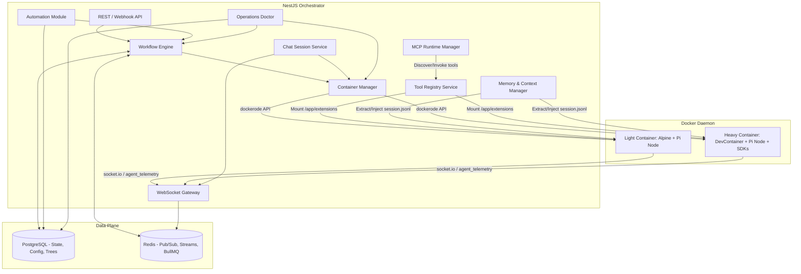
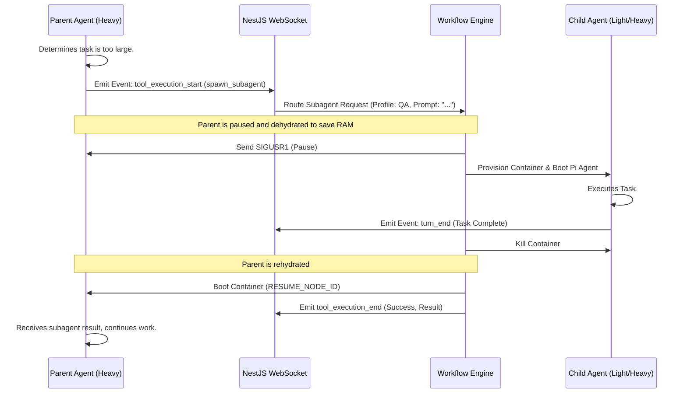

# Solution Design Document: Nexus Core Engine (v1.1)

## 1. Executive Summary

The Nexus Core Engine is a headless, event-driven AI orchestration platform. It merges structured workflow topologies (Directed Acyclic Graphs and Cyclical State Machines) with autonomous AI execution powered by Pi Agent (`pi-mono`). The Core manages container lifecycles (Light/Heavy tiers), handles real-time WebSocket telemetry multiplexing, manages persistent memory and tool injection, and seamlessly dehydrates/rehydrates AI session states to optimize host compute.

## 1.1 Current Capability Addendum (2026-04-06)

The platform has evolved significantly beyond the original v1 baseline. Current architecture and product behavior now include:

1. Pre-flight refinement lifecycle before implementation (todo -> refinement -> in-progress) with status-triggered workflows.
2. Peer agent communication mesh with mention/thread lifecycle events and UI visibility.
3. Dependency-aware dispatch ranking with critical-path metadata in project state.
4. Capacity-aware dispatch polling and per-agent dispatch capacity controls.
5. Agent skills lifecycle (CRUD, profile assignment, runtime mount into containers).
6. Restart-aware orchestration context injection (isRestart + stateSummary) for CEO workflows.
7. First-class project goals and goal worklogs with dedicated API and workspace UI.
8. Workflow graph read-model endpoints and status-unified graph visualization.
9. Decoupled chat sessions with multi-participant collaboration and ad-hoc agent conversations.
10. Automation and scheduling: scheduled jobs (cron/interval/one-time), automation hooks (event-driven actions), heartbeat profiles (periodic health-checks), and standing orders (priority-ordered agent instructions).
11. MCP (Model Context Protocol) client runtime for external tool server integration with HTTP and stdio transports.
12. Operations Doctor diagnostics framework with integrity checks and safe repair execution.
13. War Room collaborative decision-making sessions with consensus flow and blackboard model.
14. Work item subtasks with canonical source synchronization and workflow run todo tracking.
15. Tool candidate lifecycle with sandbox validation and publication pipeline.

Canonical references for these additions:

- docs/architecture/README.md
- docs/architecture/ARCH-kanban-workflow.md
- docs/architecture/rest-api.md
- docs/architecture/workflow-engine.md
- docs/architecture/database-schema.md
- docs/architecture/project-goals.md
- docs/architecture/agent-skills.md
- docs/architecture/workflow-graph-read-model.md
- docs/architecture/chat-sessions.md
- docs/architecture/automation.md
- docs/architecture/mcp-integration.md
- docs/architecture/operations-doctor.md
- docs/operations/dispatch-polling-runbook.md
- docs/operations/ceo-restart-continuity-runbook.md

## 1.2 Orchestration Stall Prevention Addendum (2026-04-22)

EPIC-136 adds defense-in-depth protections for orchestration stalls caused by delegation feedback gaps and spec hydration misses.

Implemented mechanisms:

1. Stale-heartbeat cycle trigger in dispatch polling.
2. Mandatory `kanban.publish_specs` post-step in delegation workflow when spec publication is expected.
3. Delegation-completion cycle request emission.

Behavior details:

1. Dispatch polling now treats idle orchestrations older than a configurable threshold as stale and requests a CEO cycle even when there are zero `todo` items.
2. Delegation workflow `orchestration_invoke_agent_default` now runs a required post-step that calls `kanban.publish_specs` and completes successfully even when no specs are found.
3. Completed delegation workflows emit `project.orchestration.cycle.requested` with source `delegation_completion` so parent orchestration receives an immediate feedback loop.

Configuration and telemetry:

1. Setting key: `orchestration_stale_threshold_minutes` (default `20`).
2. Environment override: `ORCHESTRATION_STALE_THRESHOLD_MINUTES`.
3. Event ledger telemetry:

- `orchestration_stale_cycle_triggered`
- `delegation_completion_cycle_requested`

Design intent:

1. Keep existing dispatch and lifecycle policies intact.
2. Additive recovery behavior only when orchestration is idle and stale.
3. Best-effort event emission with non-fatal failures and structured telemetry.

### Detailed Research & Specifications

- [Pi Agent SDK Research](docs/research/pi-agent-sdk.md) - Core agent runtime and SDK details.
- [Subagent Orchestration](docs/architecture/subagent-orchestration.md) - Current implementation, capability matrix, and limitations.
- [Event Communication & Webhooks](docs/research/event-communication-webhooks.md) - External triggers and internal telemetry systems.
- [Tool Registry Mechanics](docs/research/tool-registry-mechanics.md) - Dynamic tool injection and container mounting.
- [Chat Sessions & Collaboration](docs/architecture/chat-sessions.md) - Decoupled chat sessions, multi-participant model, ad-hoc sessions.
- [Automation & Scheduling](docs/architecture/automation.md) - Scheduled jobs, hooks, heartbeats, standing orders.
- [MCP Integration](docs/architecture/mcp-integration.md) - Model Context Protocol client runtime and server management.
- [Operations Doctor](docs/architecture/operations-doctor.md) - Diagnostics framework, integrity checks, safe repair execution.

## 2. High-Level Architecture

The system operates on a dual-plane model: the **Control Plane** (NestJS) manages state and routing, while the **Execution Plane** (Docker) runs isolated Pi Agent instances.

**Technology Stack:**

- Node.js 24+ / TypeScript (strict mode) — per `package.json` and AGENTS.md requirements
- NestJS for both `apps/api` (orchestration engine) and `apps/kanban` (domain service)
- PostgreSQL 18-alpine for persistence (64 entities, 58 repositories, 26+ migrations)
- Redis 7-alpine for pub/sub, streams, and BullMQ queues
- Playwright for web automation
- Docker for agent container execution (light/heavy tiers)



## 3. The Workflow Engine: DAGs & Cycles

The heart of Nexus Core is its Workflow Engine. It parses YAML files that define both DAGs (for parallel fan-out tasks) and Cyclical State Machines (for iterative review loops).

### 3.1. Complex YAML Workflow Example

Below is an example of a workflow that triggers via webhook, spans multiple agents, utilizes both Light and Heavy containers, and includes a cyclical review loop.

```yaml
workflow_id: "wf_feature_delivery_01"
name: "Autonomous Feature Implementation & Review"
description: "Writes code, runs tests, and reviews iteratively until passed."

trigger:
  type: "event"
  event: "kanban.work_item.status_changed.v1"
  condition: "{{#if (eq trigger.status 'in-progress')}}true{{else}}false{{/if}}"
  schema:
    event: string
    scopeId: string
    contextId: string
    workItemId: string
    status: string
    previousStatus: string | null
    actor: string
    resource: object

global_env:
  PROJECT_ID: "{{trigger.scopeId}}"

steps:
  # STEP 1: Heavy Execution (Coding)
  - id: "write_implementation"
    type: "pi_agent_session"
    agent_profile: "senior_backend_dev"
    tier: "heavy"
    workspace:
      project_id: "{{trigger.scopeId}}"
    inputs:
      system_prompt: "Implement the requirements for work item {{trigger.contextId}}."
    tools: ["git_commit", "read", "write", "bash"]

  # STEP 2: Heavy Execution (Testing) - Depends on Step 1
  - id: "run_unit_tests"
    type: "pi_agent_session"
    agent_profile: "qa_automation"
    tier: "heavy"
    depends_on: ["write_implementation"]
    workspace:
      reuse_from: "write_implementation" # Mounts the same Git volume
    inputs:
      system_prompt: "Run npm test. If errors exist, fix the tests or the code."
    tools: ["bash", "edit"]

  # STEP 3: Light Execution (Review) - The Cycle Gate
  - id: "architectural_review"
    type: "pi_agent_session"
    agent_profile: "staff_engineer_reviewer"
    tier: "light"
    depends_on: ["run_unit_tests"]
    inputs:
      system_prompt: "Review the git diff. Does it meet the PRD? Output JSON { passed: boolean, feedback: string }"
    tools: ["read_github_diff", "parse_prd"]

    # CYCLICAL ROUTING LOGIC
    transitions:
      - condition: "output.passed == false"
        next: "write_implementation"
        inject_context: "Review failed. Feedback: {{output.feedback}}. Please fix."
      - condition: "output.passed == true"
        next: "merge_to_main"

  # STEP 4: Light Execution (Finalize)
  - id: "merge_to_main"
    type: "pi_agent_session"
    agent_profile: "devops_agent"
    tier: "light"
    inputs:
      system_prompt: "Merge the working branch to main and tag the release."
    tools: ["github_merge_pr"]
```

### 3.2. Special Step Types (Non-Agent Automation)

In addition to agent-executed jobs, the workflow engine supports **special step types** that run automatically without provisioning a container. These are dispatched by `StepSpecialStepExecutorService` via the pluggable `ISpecialStepHandler` interface. Core handlers are registered statically by the application, and trusted in-process plugin handlers can be loaded additively at startup from `NEXUS_SPECIAL_STEP_PLUGIN_DIR`.

| Type                             | Handler                                       | Description                                                                                                                                                                      |
| -------------------------------- | --------------------------------------------- | -------------------------------------------------------------------------------------------------------------------------------------------------------------------------------- |
| `run_command`                    | `StepRunCommandSpecialStepHandler`            | Executes an arbitrary shell command (`sh -c`) in a configurable working directory. Outputs `{ ok, exit_code, stdout, stderr, stdout_lines, timed_out }`.                         |
| `web_automation`                 | `StepWebAutomationSpecialStepHandler`         | Runs deterministic browser automation actions via Playwright with selector fallback, retry/backoff, and failure artifacts. WebAutomationModule owns the runtime execution stack. |
| `register_tool`                  | `StepRegisterToolSpecialStepHandler`          | Registers a dynamically generated tool into the tool registry.                                                                                                                   |
| `invoke_workflow`                | `StepInvokeWorkflowSpecialStepHandler`        | Spawns a child workflow and optionally waits for its completion.                                                                                                                 |
| `emit_event`                     | `StepEmitEventSpecialStepHandler`             | Emits a NestJS `EventEmitter2` event from within a workflow. Requires `inputs.event_name` and optional `inputs.payload`.                                                         |
| `http_webhook`                   | `StepHttpWebhookSpecialStepHandler`           | Executes HTTP webhook calls (GET/POST/etc) with configurable URL, headers, and body from workflow inputs. Supports status code capture and timeout control.                      |
| `mcp_tool_call`                  | `StepMcpToolCallSpecialStepHandler`           | Invokes an MCP server tool within a workflow step. Provides server ID, tool name, and arguments from workflow inputs.                                                            |
| `git_operation`                  | `StepGitOperationSpecialStepHandler`          | Performs git operations (commit, push, branch) on workflow-owned repositories with configurable auth and remote settings.                                                        |
| `manage_tool_candidate`          | `StepManageToolCandidateSpecialStepHandler`   | Manages tool candidate lifecycle actions (create, validate, approve, reject) during workflow execution.                                                                          |
| `for_each`                       | Built-in loop handler                         | Iterates over arrays of inputs, executing nested step sequences. Supports parallel/concurrent iteration modes.                                                                   |
| Plugin-defined types             | Plugin-exported `ISpecialStepHandler` adapter | Loaded from trusted plugin packages at startup. Plugin execution results include `source: 'plugin'` and plugin outputs are stored like core special-step outputs.                |
| Deprecated/reserved legacy types | N/A                                           | Removed API-owned orchestration, status, merge, worktree, and hydrate-from-specs handlers remain reserved for validation compatibility but are not active core handlers.         |

Special steps execute synchronously within the BullMQ consumer, complete immediately, and their outputs are stored in `state_variables.jobs.{jobId}.output` for downstream transition evaluation.

For agent-executed jobs, `output_tool` can be configured to capture the first
matching tool call arguments into `jobs.<jobId>.output`. This enables
workflow-level branching and metadata recording without tool-side API callbacks.

**Adding new special step types:** Core handlers implement the `ISpecialStepHandler` interface (`type` + `execute()`) and are registered as providers in `WorkflowModule`. External extensions should use a trusted in-process special-step plugin package; see `docs/guides/writing-workflow-plugins.md`.

## 4. Execution & Subagent Orchestration

Nexus uses a master-worker orchestration model. The "Subagent" functionality is natively handled by injecting a system tool into the Pi Agent's extension folder via the `NexusBridge`.

### 4.1. Subagent Invocation Sequence



## 5. State, Memory, & Rehydration

To prevent host DoS (Denial of Service) from inactive DevContainers, Nexus implements aggressive state hydration based on Pi Agent's native JSONL tree structures.

### 5.1. Session Trees (Dehydration/Rehydration)

- **Dehydrate:** When a session waits for human input or a subagent, NestJS sends a WebSocket command to `pi-runner.ts` to execute `agent.pause()`. NestJS extracts `/app/.pi/agent/session.jsonl` using Docker archive APIs, compresses it, saves it to `PiSessionTrees` in Postgres, and kills the container.
- **Rehydrate & Branch:** NestJS provisions a new container, injects the `.jsonl` file, and sets `RESUME_NODE_ID`. If a human wants to "rewind" an agent's mistake, NestJS passes an older `nodeId`, natively branching the Pi execution tree.

### 5.2. Memory & Context

To support persistent entities (like the Assistant Chatbot), Nexus implements **Memory Segments**.

- **Global/Shared:** Read-only context (e.g., Project SDD).
- **Persistent User Memory:** Stored in Postgres. If an agent calls `query_memory("user preferences")`, the NestJS bridge fetches it.
- **Token Distillation:** When a JSONL tree exceeds 80% of the model's token limit, NestJS triggers a background BullMQ job using a cheaper model (e.g., `gpt-4o-mini`) to recursively summarize older tree nodes, updating the JSONL file before the next rehydration.

## 6. NestJS Services Breakdown

The NestJS codebase is organized into the following modules (registered in `AppModule`):

### 6.1 Core Platform Modules

| Module                     | Key Services                                                                                                                                                                                                                                                                            | Description                                                                                                |
| -------------------------- | --------------------------------------------------------------------------------------------------------------------------------------------------------------------------------------------------------------------------------------------------------------------------------------- | ---------------------------------------------------------------------------------------------------------- |
| `WorkflowModule`           | `WorkflowEngineService`, `WorkflowParserService`, `WorkflowValidationService`, `DAGResolverService`, `StateMachineService`, `StateManagerService`, `StepExecutionOrchestratorService`, `StepSpecialStepExecutorService`, `WorkflowEventTriggerService`, `WorkflowGraphReadModelService` | Workflow YAML parsing, DAG/cycle execution, special step dispatch, event-driven triggers, graph read model |
| `SessionModule` (Global)   | `SessionHydrationService`, `SessionCleanupService`, `ChatExecutionService`, `ChatParticipantTurnService`, `ChatSessionCollaborationService`, `JSONLValidationService`                                                                                                                   | Session dehydration/rehydration, chat session lifecycle, multi-participant collaboration                   |
| `DockerModule` (Global)    | `ContainerOrchestratorService`, `ContainerHttpClientService`, `ContainerCleanupService`                                                                                                                                                                                                 | Docker container lifecycle, resource limits, cleanup                                                       |
| `TelemetryModule` (Global) | `TelemetryGateway`                                                                                                                                                                                                                                                                      | Socket.io hub for agent telemetry, UI broadcasts, command routing                                          |
| `RedisModule`              | `RedisPubSubService`, `RedisStreamService`, `AgentResponseStoreService`, `RunnerConfigStoreService`, `ToolCallTrackerService`                                                                                                                                                           | Pub/sub, streams, ephemeral stores                                                                         |
| `DatabaseModule`           | TypeORM connection, 64 entities, 58 repositories, 26 migrations                                                                                                                                                                                                                         | PostgreSQL persistence layer                                                                               |

### 6.2 Domain Modules

| Module                               | Key Services                                                                                                                                                                                     | Description                                                                     |
| ------------------------------------ | ------------------------------------------------------------------------------------------------------------------------------------------------------------------------------------------------ | ------------------------------------------------------------------------------- |
| `ProjectModule`                      | `ProjectService`, `ProjectOrchestrationService`, `WorkItemService`, `WorkItemDispatchPollingService`, `WorkItemDispatchReconcileService`, `ProjectWarRoomService`, `ProjectRetrospectiveService` | Project CRUD, orchestration lifecycle, work items, dispatch, war rooms          |
| `ProjectGoalsModule`                 | `ProjectGoalsService`                                                                                                                                                                            | Project goal CRUD, worklogs, MoSCoW prioritization                              |
| `AiConfigModule`                     | `AiConfigurationService`, `AiConfigAdminService`, `SecretVaultService`, `AgentSkillsService`, `AgentSkillLibraryService`                                                                         | LLM providers, models, agent profiles, secrets, skills                          |
| `ToolModule`                         | `ToolRegistryService`, `ToolSandboxService`, `ToolRuntimeExecutionService`, `ToolCandidateService`, `SkillMountingService`, `CapabilityPreflightService`, `CapabilityContractValidatorService`   | Tool lifecycle, sandbox validation, candidate publishing, skill mounting        |
| `CapabilityInfraModule`              | `CapabilityRegistryService`, `CapabilityRegistrarService`, `CapabilityManifestToToolRegistryMapper`, `RuntimeCapabilitySchemaAdapter`                                                            | Capability discovery via `@Capability` decorator, tool registry projection      |
| `CapabilityGovernanceModule`         | `PolicyEngineService`, `ToolApprovalRuleService`, `ToolPolicyDecisionService`, `ToolCallApprovalRequestService`                                                                                  | Multi-phase governance evaluation, dynamic approval rules, approval workflow    |
| `AutomationModule`                   | `ScheduledJobsService`, `ScheduledJobsRunnerService`, `ScheduledJobsPollingService`, `HeartbeatService`, `AutomationHooksService`, `StandingOrdersService`                                       | Scheduled jobs, hooks, heartbeats, standing orders                              |
| `McpModule`                          | `McpService`, `McpRuntimeManagerService`, `McpTransportFactory`, `McpReconciliationLoop`                                                                                                         | MCP server management, HTTP/stdio transport, tool discovery, runtime invocation |
| `OperationsModule`                   | `DoctorReportService`, `DoctorCheckRegistryService`, `DoctorRepairExecutorService`, `DoctorHistoryService`, `WorkflowRecoveryCandidatesService`                                                  | Diagnostics, integrity checks, safe repair execution                            |
| `MemoryModule` (Global)              | `MemoryManagerService`, `TokenCounterService`, `LLMService`, `HonchoMemoryBackendService`, `HonchoFallbackMemoryBackendService`                                                                  | Persistent memory, token distillation, Honcho integration                       |
| `ObservabilityModule` (Global)       | `MetricsService`, `CostTrackingService`, `EventLedgerService`                                                                                                                                    | Prometheus metrics, cost tracking, event ledger                                 |
| `SecurityModule` (Global)            | `IAMPolicyService`, `AuditLogService`, `SecretScannerService`, `SecretManagerService`, `YAMLValidationService`                                                                                   | IAM, audit logging, secret scanning, YAML validation                            |
| `WarRoomModule`                      | `WarRoomService`, `WarRoomConsensusService`, `WarRoomBlackboardService`, `WarRoomEventLogService`                                                                                                | Multi-agent collaboration, consensus flow, blackboard, signoffs                 |
| `WebAutomationModule`                | `WebAutomationActionRunnerService`, `WebAutomationPlaywrightDriverService`, `WebAutomationArtifactQueryService`, `WebAutomationSessionStoreService`                                              | Browser automation, Playwright execution, failure artifacts                     |
| `NotificationsModule`                | `NotificationProducerService`, `NotificationGateway`, `UserQuestionsNotificationListener`                                                                                                        | Real-time notifications, user question alerts, WebSocket push                   |
| `AcpModule`                          | `AcpService`, `AcpRuntimeManagerService`, `AcpHttpClient`, `AcpSchemaUtils`                                                                                                                      | Agent Connection Protocol, external agent discovery and invocation              |
| `ChatModule` / `ChatExecutionModule` | `ChatSessionsService`, `ChatMessagesService`, `ChatParticipantService`, `ChatMemoryService`, `ChannelAdapterService` (Telegram)                                                                  | Chat session lifecycle, multi-participant collaboration, channel adapters       |
| `UsersModule`                        | `UserService`                                                                                                                                                                                    | User management, authentication                                                 |
| `ChatSessionsModule` (within Chat)   | `ChatSessionCollaborationService`, `SessionChatMessagingService`, `SteeringContextProvider`                                                                                                      | Chat session collaboration, question answering, steering context                |

### 6.3 Infrastructure Modules

| Module                  | Key Services                                                                         | Description                                                     |
| ----------------------- | ------------------------------------------------------------------------------------ | --------------------------------------------------------------- |
| `AuthModule`            | `AuthService`, `TokenService`, `RefreshTokenService`                                 | JWT authentication, role-based access                           |
| `HealthModule`          | `HealthController`, `RedisHealth`, `DockerHealth`                                    | Terminus health probes                                          |
| `SetupModule`           | `SetupService`                                                                       | First-run platform initialization                               |
| `SystemSettingsModule`  | `SystemSettingsService`, `SystemSettingsRepository`                                  | Platform-wide configuration                                     |
| `WebhooksModule`        | `WebhookController`                                                                  | External webhook entry points                                   |
| `GitWorktreeModule`     | `GitWorktreeService`, `GitMergeService`, `GitPathService`, `BranchOperationsService` | Git worktree lifecycle, merge operations                        |
| `ConfigModule` (Global) | NestJS Config                                                                        | Environment variable validation and loading                     |
| `ToolRegistryModule`    | `ToolRegistryService`, `ToolSandboxService`, `ToolCandidateService`                  | Tool registry and sandbox management (sub-module of ToolModule) |
| `ToolRuntimeModule`     | `ToolRuntimeExecutionService`, `CapabilityPreflightService`                          | Tool execution runtime (sub-module of ToolModule)               |

## 7. Data Design (PostgreSQL & Redis)

### 7.1. PostgreSQL (Relational & JSONB)

- **`Workflows`:** `id`, `name`, `yaml_definition` (TEXT), `is_active` (BOOL).
- **`WorkflowRuns`:** `id`, `workflow_id`, `status` (Running, Hibernated, Failed), `current_step_id`, `state_variables` (JSONB).
- **`ToolRegistry`:** `id`, `name`, `schema` (JSONB), `typescript_code` (TEXT), `tier_restriction` (Enum).
- **`PiSessionTrees`:** `id`, `workflow_run_id`, `container_tier`, `jsonl_data` (JSONB), `last_leaf_node_id`.
- **`MemorySegments`**: `id`, `entity_type` (User/Project), `entity_id`, `summary` (TEXT).

### 7.2. Redis (High-Throughput)

- **`bull:workflow_steps`:** Manages the async execution queue of individual YAML steps.
- **`stream:telemetry:{session_id}`:** Redis Stream acting as a durable buffer for all `pi-runner` WebSocket events. Enables instant UI hydration upon browser refresh via `XRANGE`.

### 7.3. Additional Current Data Domains

The current system also persists additional domains not covered in the original v1 table summary:

1. Project goals domain:

- `project_goals`
- `project_goal_worklogs`

2. Skills domain:

- `agent_skills`
- `agent_profile_skills`

3. Dispatch capacity domain:

- `project_agent_capacities`

4. Communication mesh domain:

- `agent_communication_threads`
- `agent_communication_messages`

5. Chat sessions domain:

- `chat_sessions`
- `chat_session_participants`
- `chat_messages`
- `chat_channel_routes`

6. War room domain:

- `agent_war_room_sessions`
- `agent_war_room_participants`
- `agent_war_room_messages`
- `agent_war_room_blackboards`
- `agent_war_room_signoffs`

7. Automation domain:

- `scheduled_jobs`
- `scheduled_job_runs`
- `automation_hooks`
- `heartbeat_profiles`
- `heartbeat_runs`
- `standing_orders`

8. MCP domain:

- `mcp_servers`

9. Operations domain:

- `doctor_repair_history`

10. Workflow extensions:

- `workflow_run_todos`
- `work_item_subtasks`
- `workflow_launch_presets`
- `tool_artifacts`
- `tool_validation_runs`
- `project_orchestration_action_requests`

11. Security and audit domain:

- `audit_logs`
- `cost_tracking`
- `event_ledger`

For table-level details, see docs/architecture/database-schema.md.

## 8. Security & Compliance (IAM)

- **Cascading IAM Policies:** Tool access is controlled at the Orchestrator level. If the YAML step assigns a `QA_Agent` profile, the `ToolRegistryService` simply _does not mount_ the `github_merge_pr` tool into the container. The AI cannot execute what isn't physically there.
- **Secret Management:** API keys are never written to the Git volume or the Pi JSONL state. NestJS injects them purely as ephemeral environment variables during the `docker run` command.
- **Network Isolation:** Heavy DevContainers can be launched with `--network none` for offline compilation/testing, opening the network only when specific API tools are explicitly required.

## 9. Agent-User Question Flow

Agents can solicit structured input from users during execution. This feature spans the Control Plane, Execution Plane, and Web UI layers. It is supported in both workflow run sessions and decoupled chat sessions.

### Architecture

```text
┌──────────────┐    user_questions_posed    ┌──────────────┐    WebSocket event     ┌──────────────┐
│  Pi-Runner    │ ────────────────────────► │  Telemetry   │ ──────────────────────► │  Web UI      │
│  (Container)  │                           │  Gateway     │                         │  (Browser)   │
│               │ ◄──────────────────────── │              │ ◄────────────────────── │              │
│  Tool blocks  │    question_response cmd  │              │    POST /question-ans   │  QuestionCard│
└──────────────┘                            └──────────────┘                         └──────────────┘
```

### Components

| Component                        | Location                                                   | Responsibility                                                |
| -------------------------------- | ---------------------------------------------------------- | ------------------------------------------------------------- |
| `ask_user_questions` bridge tool | `packages/pi-runner/src/nexus-bridge-tools.ts`             | Emits questions via WS, blocks until answers arrive           |
| TelemetryGateway handler         | `apps/api/src/telemetry/telemetry.gateway.ts`              | Broadcasts event, starts idle tracker, flags work item        |
| QuestionIdleTrackerService       | `apps/api/src/workflow/question-idle-tracker.service.ts`   | Two-tier idle timeout: stop container, then remove            |
| WorkflowRunSteeringService       | `apps/api/src/workflow/workflow-run-steering.service.ts`   | `submitQuestionAnswers()` — persists event, forwards to agent |
| WorkItemQuestionFlagListener     | `apps/api/src/project/work-item-question-flag.listener.ts` | Sets/clears `waitingForInput` flag on work items              |
| SessionChatMessagingService      | `apps/api/src/session/session-chat-messaging.service.ts`   | Handles question answers for chat sessions                    |
| QuestionCard                     | `apps/web/src/components/workflow/QuestionCard.tsx`        | Interactive UI with option buttons + free text                |
| SystemSettingsService            | `apps/api/src/settings/system-settings.service.ts`         | Platform-wide configuration (idle timeouts)                   |

### Question Answer Endpoints

| Context      | Endpoint                                       | Description                               |
| ------------ | ---------------------------------------------- | ----------------------------------------- |
| Workflow run | `POST /workflows/runs/:runId/question-answers` | Submit answers for workflow run questions |
| Chat session | `POST /sessions/chat/:chatId/question-answers` | Submit answers for chat session questions |

### Sequence

1. Agent calls `ask_user_questions` tool with structured questions (max 3 options per question)
2. Pi-Runner emits `user_questions_posed` WebSocket event and blocks
3. TelemetryGateway broadcasts to frontend, starts idle timer, flags work item
4. Frontend displays interactive QuestionCard in ActiveSessionWorkspace
5. User selects options and/or types free-text answers, submits via `POST /workflows/runs/:runId/question-answers`
6. WorkflowRunSteeringService persists a `user_question_answers` event and forwards command to agent
7. Pi-Runner unblocks and returns formatted answers to the agent

### Idle Lifecycle

If the user does not respond:

- After `question_idle_stop_seconds` (default: 300s), the container is dehydrated (stopped but preserved)
- After `question_idle_remove_seconds` (default: 3600s), the container is removed entirely
- If a user responds after stop, answers are persisted to the event stream for rehydration pickup
- No error is raised at any point — the system gracefully handles delayed responses

### System Settings

| Key                            | Default | Description                                           |
| ------------------------------ | ------- | ----------------------------------------------------- |
| `question_idle_stop_seconds`   | 300     | Seconds before dehydrating an idle question container |
| `question_idle_remove_seconds` | 3600    | Seconds before removing an idle question container    |

## 10. Architectural Gap Analysis (2026-05-07)

This section documents discrepancies identified between documented architecture and actual implementation during SDD reconciliation.

### 10.1 Module Registry Updates Required

The following modules were discovered in `apps/api/src/` but were missing or incomplete in the SDD module table:

| Module                       | Discovery Path                        | Status                            |
| ---------------------------- | ------------------------------------- | --------------------------------- |
| `CapabilityInfraModule`      | `apps/api/src/capability-infra/`      | Added to SDD Domain Modules table |
| `CapabilityGovernanceModule` | `apps/api/src/capability-governance/` | Added to SDD Domain Modules table |
| `WebAutomationModule`        | `apps/api/src/web-automation/`        | Added to SDD Domain Modules table |
| `NotificationsModule`        | `apps/api/src/notifications/`         | Added to SDD Domain Modules table |
| `AcpModule`                  | `apps/api/src/acp/`                   | Added to SDD Domain Modules table |
| `ChatExecutionModule`        | `apps/api/src/chat-execution/`        | Added to SDD Domain Modules table |
| `UsersModule`                | `apps/api/src/users/`                 | Added to SDD Domain Modules table |

### 10.2 Workflow Sub-Module Decomposition

Per `AGENTS.md` and `docs/project-context/ARCHITECTURE.md`, the workflow directory is decomposed into focused sub-modules:

| Sub-Module                    | Responsibility                                                                            |
| ----------------------------- | ----------------------------------------------------------------------------------------- |
| `WorkflowModule` (root)       | Core engine: parsing, validation, persistence, state, DAG resolution, event log, triggers |
| `WorkflowLaunchModule`        | Launch API, contracts, orchestration helpers                                              |
| `WorkflowRunOperationsModule` | Run-facing API, steering, todo/workspace, reconciliation                                  |
| `WorkflowSpecialStepsModule`  | Special step registry, executor, built-in handlers, plugin loading                        |
| `WorkflowSubagentsModule`     | Subagent provisioning, lifecycle, communication mesh, delegation                          |
| `WorkflowStepExecutionModule` | Queue consumer, orchestration, container execution, retry policy                          |
| `WorkflowHostMountModule`     | Host mount resolution, audit, diagnostics                                                 |
| `WorkflowPublishSpecsModule`  | Publish-specs parser and helper utilities                                                 |
| `WorkflowRuntimeModule`       | Agent-facing runtime capabilities, orchestration actions, browser actions                 |
| `WorkflowRepairModule`        | Failure classification, repair policy, repair delegation                                  |
| `WorkflowInternalToolsModule` | Internal tool adapters consumed by `InternalToolRegistryService`                          |

This decomposition was not documented in the original SDD and has been incorporated.

### 10.3 Special Step Type Additions

The `war_room` special step type was discovered in implementation but missing from the SDD special steps table. It has been added.

The `web_automation` handler description has been updated to reference Playwright and the `WebAutomationModule`.

### 10.4 Tool Registry Module Naming

The SDD module table references `ToolModule` for tool registry services. In `AppModule`, this is registered as `ToolModule` but internally coordinates with `CapabilityInfraModule` for capability discovery and `CapabilityGovernanceModule` for permission evaluation. The `ToolModule` name is preserved for backward compatibility in documentation; the underlying services handle the full capability lifecycle.

### 10.5 Kanban Service Domain Architecture

The `apps/kanban/` service is a separate NestJS domain service (not part of the API monolith). Its module decomposition:

| Module                  | Responsibility                                       |
| ----------------------- | ---------------------------------------------------- |
| `CoreIntegrationModule` | Integration with Core API via contracts              |
| `ProjectModule`         | Project CRUD and management                          |
| `ProjectGoalsModule`    | Project goal lifecycle                               |
| `WorkItemModule`        | Work item management, status, dependencies           |
| `DispatchModule`        | Dispatch polling, capacity, queue management         |
| `OrchestrationModule`   | Orchestration state, CEO workflows, cycle management |
| `ReviewModule`          | QA and review workflows                              |
| `KanbanMcpModule`       | Kanban MCP server for external tooling               |

### 10.5 Data Domain Additions

The following tables were documented in `docs/architecture/database-schema.md` but missing from SDD section 7.3:

- `chat_messages` — Individual chat messages within sessions
- `chat_channel_routes` — Channel adapter routing state for Telegram and other ingress
- `workflow_launch_presets` — Reusable launch configuration templates

### 10.6 Host Mount Governance (EPIC-100)

Host mount governance is documented in `docs/architecture/host-mount-governance.md` but not referenced in the SDD's main body. Key points to document:

- Alias-only contract for all host mount requests
- Layered policy intersection (global catalog → project → workflow → profile → job)
- Read-write approval gates and event ledger audit lifecycle
- Diagnostics API: `GET /api/workflows/runs/:runId/host-mounts/diagnostics`

### 10.7 Capability Governance Engine

The capability governance engine is documented in `docs/architecture/capability-governance-engine.md` and referenced in the SDD module table. Key phases:

1. Registration check
2. Publication check
3. Profile deny/allow (preflight snapshot)
4. Workflow deny/allow (legacy, bypassed)
5. Dynamic rule evaluation (argument-aware)
6. Mode gate
7. Approval override
8. Default allow

### 10.8 Deployment Model Verification

Docker Compose deployment model documented in SDD is accurate:

| Service                    | Port                 | Description                                      |
| -------------------------- | -------------------- | ------------------------------------------------ |
| `api`                      | 3010:3000, 3011:3001 | NestJS orchestration engine                      |
| `kanban`                   | 3012:3012            | Kanban domain service                            |
| `web`                      | 3120:80              | Vite SPA via nginx                               |
| `postgres`                 | 5433:5432            | PostgreSQL 18-alpine                             |
| `redis`                    | 6380:6379            | Redis 7-alpine                                   |
| `honcho-api` / `honcho-db` | 8030:8000, 5443:5432 | Optional Honcho memory backend (profile: honcho) |

### 10.9 Technology Stack Verification

| Component  | Documented  | Actual              | Status                                                                                        |
| ---------- | ----------- | ------------------- | --------------------------------------------------------------------------------------------- |
| Node.js    | 20+         | 24+ (per AGENTS.md) | **Corrected** - Documented as 20+, actual is 24+ per package.json engines field and AGENTS.md |
| TypeScript | Strict mode | Strict mode         | ✓                                                                                             |
| NestJS     | Current     | Current             | ✓                                                                                             |
| PostgreSQL | 15+         | 18-alpine (compose) | ✓                                                                                             |
| Redis      | 7+          | 7-alpine            | ✓                                                                                             |

### 10.10 Packages Verification

| Package                     | Documented             | Actual                                    | Status |
| --------------------------- | ---------------------- | ----------------------------------------- | ------ |
| `packages/core`             | Shared interfaces      | ✓ Exists                                  |
| `packages/pi-runner`        | Agent runtime SDK      | ✓ Exists                                  |
| `packages/agent-local`      | Local MCP tooling      | ✓ Exists                                  |
| `packages/e2e-tests`        | Playwright E2E         | ✓ Exists                                  |
| `packages/kanban-contracts` | API contracts          | ✓ Exists                                  |
| `packages/plugin-sdk`       | Plugin system          | ✓ Exists                                  |
| `packages/chat`             | Chat module interfaces | ✓ Exists (referenced in api package.json) |

## 11. Architectural Patterns Discovered

### 11.1 `@Capability` Decorator Pattern

Capabilities are declared via `@Capability` decorator on provider methods. `CapabilityRegistryService` discovers all decorated providers at startup and builds the capability manifest. `CapabilityRegistrarService` projects canonical capabilities into the tool registry.

### 11.2 Steering Context for Chat Sessions

Chat sessions support a `session_type` column with values `general` (default) and `steering`. Steering sessions load project context via `SteeringContextProvider`, enabling the CEO agent to understand and modify project state conversationally.

### 11.3 Telegram Channel Adapter

The Telegram adapter supports multiple ingress modes: `webhook` (default), `polling`, and `hybrid`. Security includes webhook secret validation and optional user ID allowlist. Slash commands `/help`, `/new`, `/resume`, `/agent` are supported.

### 11.4 Tool Governance Flow

1. `CapabilityPreflightService` builds snapshot of callable/denied/approval-required tools
2. Runner wraps tools and calls `POST /api/workflow-runtime/check-permission` before execution
3. `ToolApprovalRuleService` evaluates argument-aware rules for approval-required tools
4. Human approval workflow blocks execution via `tool_call_approval_requests` table

### 11.5 Special Step Core Types (Actual Implementation)

The actual `CORE_SPECIAL_STEP_TYPES` from `step-special-step.types.ts`:

```typescript
const CORE_SPECIAL_STEP_TYPES = [
  "register_tool",
  "invoke_workflow",
  "run_command",
  "web_automation",
  "emit_event",
  "http_webhook", // Not previously documented
  "mcp_tool_call", // Not previously documented
  "git_operation", // Not previously documented
  "manage_tool_candidate",
] as const;
```

**Correction:** The SDD previously documented `war_room` and `amend_entity` as special step types. These are actually:

- `war_room` — Not implemented as a special step handler; war room invocation is done via `open_war_room` runtime action/tool
- `amend_entity` — Reserved but not implemented; entity amendment is handled via steering services and automation hooks

### 11.6 Workflow Sub-Module Decomposition Verification

Verified against actual directory structure (`apps/api/src/workflow/`):

| Sub-Module                    | Exists | Responsibility                                                                           |
| ----------------------------- | ------ | ---------------------------------------------------------------------------------------- |
| `WorkflowModule` (root)       | ✓      | Core engine, parser, validation, persistence, state, DAG resolution, event log, triggers |
| `WorkflowKernelModule`        | ✓      | Kernel interfaces and ports                                                              |
| `WorkflowLaunchModule`        | ✓      | Launch API, contracts, orchestration helpers                                             |
| `WorkflowRunOperationsModule` | ✓      | Run-facing API, steering, todo/workspace, reconciliation                                 |
| `WorkflowSpecialStepsModule`  | ✓      | Special step registry, executor, built-in handlers, plugin loading                       |
| `WorkflowSubagentsModule`     | ✓      | Subagent provisioning, lifecycle, communication mesh, delegation                         |
| `WorkflowStepExecutionModule` | ✓      | Queue consumer, orchestration, container execution, retry policy                         |
| `WorkflowHostMountModule`     | ✓      | Host mount resolution, audit, diagnostics                                                |
| `WorkflowPublishSpecsModule`  | ✓      | Publish-specs parser and helper utilities                                                |
| `WorkflowRuntimeModule`       | ✓      | Agent-facing runtime capabilities, orchestration actions, browser actions                |
| `WorkflowRepairModule`        | ✓      | Failure classification, repair policy, repair delegation                                 |
| `WorkflowInternalToolsModule` | ✓      | Internal tool adapters consumed by `InternalToolRegistryService`                         |
| `workflow-validation/`        | ✓      | Job rules, step validators, workflow validators (flat directory)                         |

### 11.7 Docker Compose Deployment Verification

Verified against `docker-compose.yaml` at repo root:

| Service          | Port Mapping         | Health Check     | Notes                   |
| ---------------- | -------------------- | ---------------- | ----------------------- |
| `postgres`       | 5433:5432            | pg_isready       | 18-alpine               |
| `redis`          | 6380:6379            | redis-cli ping   | 7-alpine                |
| `api`            | 3010:3000, 3011:3001 | HTTP /api/health | Watch mode enabled      |
| `kanban`         | 3012:3012            | HTTP /api/health | Dependency: api healthy |
| `web`            | 3120:80              | wget             | nginx base image        |
| `honcho-db`      | 5443:5432            | pg_isready       | Profile: honcho only    |
| `honcho-api`     | 8030:8000            | N/A              | Profile: honcho only    |
| `honcho-deriver` | N/A                  | N/A              | Profile: honcho only    |

## 12. Additional Reconciliation Findings (2026-05-07 - Second Pass)

This section documents additional discrepancies identified during the second reconciliation pass on 2026-05-07.

### 12.1 Module Registry Discrepancies

**ToolModule Decomposition:** The `ToolModule` in `AppModule` is a composite that coordinates multiple sub-modules:

| Sub-Module               | Path                                                 | Verified               |
| ------------------------ | ---------------------------------------------------- | ---------------------- |
| `ToolModule` (composite) | `apps/api/src/tool/`                                 | ✓                      |
| `ToolRegistryModule`     | `apps/api/src/tool-registry/tool-registry.module.ts` | ✓ (independent module) |
| `ToolRuntimeModule`      | `apps/api/src/tool-runtime/tool-runtime.module.ts`   | ✓ (independent module) |

**Action Required:** The SDD Section 6.2 should be updated to clarify that `ToolModule` is a composite coordinating `ToolRegistryModule` and `ToolRuntimeModule` alongside `CapabilityInfraModule` and `CapabilityGovernanceModule`.

**SharedKernelModule Removed:** `SharedKernelModule` formerly registered the `TELEMETRY_GATEWAY` and `SESSION_HYDRATION_SERVICE` DI tokens as `useValue: null` placeholders. Because the real providers are supplied by the `@Global()` `TelemetryModule` and `SessionModule`, the placeholders were unnecessary and the null values broke `moduleRef.get(strict:false)` resolution. The module has been deleted; the tokens are resolved directly from their `@Global()` providers (see `shared/interfaces/telemetry-gateway.interface.ts` and `shared/interfaces/session-hydration.interface.ts`).

**LlmModule Not a NestJS Module:** The `llm/` directory contains helper utilities but does not have a `*.module.ts` file. It is not registered as a separate module in `AppModule`.

### 12.2 Workflow Sub-Module Extended List

Section 11.6 documented 13 sub-modules. The full directory listing reveals additional infrastructure sub-modules:

| Sub-Module                 | Verified | Notes                         |
| -------------------------- | -------- | ----------------------------- |
| `WorkflowModule` (root)    | ✓        | Core engine                   |
| `kernel/`                  | ✓        | Kernel interfaces and ports   |
| `listeners/`               | ✓        | Lifecycle event listeners     |
| `providers/`               | ✓        | Core service providers        |
| `dto/`                     | ✓        | Data transfer objects         |
| `testing/`                 | ✓        | Test utilities                |
| `validation/`              | ✓        | Job/step/workflow validators  |
| `domain-ports/`            | ✓        | Domain port interfaces        |
| `workflow-host-mount/`     | ✓        | Host mount resolution         |
| `workflow-internal-tools/` | ✓        | Internal tool adapters        |
| `workflow-launch/`         | ✓        | Launch API                    |
| `workflow-publish-specs/`  | ✓        | Publish-specs parser          |
| `workflow-repair/`         | ✓        | Failure classification/repair |
| `workflow-run-operations/` | ✓        | Run steering                  |
| `workflow-runtime/`        | ✓        | Agent-facing runtime          |
| `workflow-special-steps/`  | ✓        | Special step executor         |
| `workflow-step-execution/` | ✓        | Queue consumer                |
| `workflow-subagents/`      | ✓        | Subagent provisioning         |

**Total:** 17 sub-modules + infrastructure directories (validation, dto, providers, etc.).

### 12.3 Packages - Missing `agent-local` in Previous Version

The package `packages/agent-local` was present in the monorepo but missing from SDD documentation. Verified:

- Listed in root `package.json` workspaces
- Has `package.json`, `src/`, `tsconfig.json`, `vitest.config.ts`
- Purpose: Local MCP tooling (inferred from name and README)

### 12.4 Technology Stack - PostgreSQL Version Inconsistency

| Source                | Version        | Notes                  |
| --------------------- | -------------- | ---------------------- |
| `docker-compose.yaml` | 18-alpine      | Primary source         |
| `AGENTS.md`           | PostgreSQL 15+ | Outdated specification |

**Action Required:** Update `AGENTS.md` to specify `PostgreSQL 18+` to match docker-compose.

### 12.5 RESERVED_SPECIAL_STEP_TYPES Verification

Verified against `step-special-step.types.ts`:

```typescript
export const RESERVED_SPECIAL_STEP_TYPES = [
  "execution",
  "record_metadata",
  "manage_execution",
  "check_orchestration_status",
  "<removed hydrate-from-specs handler>",
  "transition_status",
  "attempt_merge",
  "manage_worktree",
] as const;
```

**Status:** ✓ Matches SDD documentation. `war_room` and `amend_entity` are correctly absent.

### 12.6 Entity Count Verification

| Metric                | Count             | Notes                       |
| --------------------- | ----------------- | --------------------------- |
| `*.entity.ts` files   | 66                | Full scan                   |
| `*.module.ts` files   | 33                | NestJS modules              |
| Database module count | 64 entities (SDD) | Matches prior documentation |

**Note:** The entity count is verified at 66 `.entity.ts` files. The SDD states 64 entities and 58 repositories - this may be a rounding/reference difference.

### 12.7 AppModule Import Count

Verified 33 NestJS module files. `AppModule` imports 35 modules (including the AppModule itself). The discrepancy from SDD Section 6 (which lists ~34 modules) is due to:

- `ToolModule` composite clarification needed
- `ToolRegistryModule` and `ToolRuntimeModule` as separate modules
- `SharedKernelModule` now documented

---

_SDD reconciliation completed: 2026-05-07 (second pass)_
_Reconciliation summary:_

- Documented 2 additional packages (`agent-local`)
- Updated ToolModule to reflect composite nature
- Added `SharedKernelModule` to infrastructure modules
- Extended workflow sub-module list to 17 entries
- Verified all CORE_SPECIAL_STEP_TYPES (9 types)
- Verified RESERVED_SPECIAL_STEP_TYPES (8 types)
- Confirmed docker-compose deployment model accuracy
- Flagged AGENTS.md PostgreSQL version inconsistency (15+ vs 18+)
- Documented 66 entity files in codebase

_Changes made in this pass:_

- Version bump: v1.0 → v1.1
- Added Section 12: Additional Reconciliation Findings
- Updated Section 6 module table with ToolModule decomposition
- Added SharedKernelModule to infrastructure modules
- Updated packages verification table
- Updated workflow sub-module count

_Next review recommended after EPIC deliveries affecting module structure, workflow engine, or database schema._

---

## 13. Phase 1 Architecture: Frontend UX & End-to-End Automation

This section documents Phase 1 features focused on frontend UX and end-to-end automation. Phase 1 implements two primary epics: **SUB-001 (Nexus Build Inception Workspace)** and **SUB-002 (Spec Parser Service Implementation)**.

### 13.1 Phase 1 Overview

| Epic    | Status | Description                                                                |
| ------- | ------ | -------------------------------------------------------------------------- |
| SUB-001 | Draft  | Nexus Build Inception Workspace - dual-pane UI with chat + markdown editor |
| SUB-002 | Draft  | Spec Parser Service - parse SDD/PRD documents and generate work items      |

**Technical Context:**

- Backend infrastructure complete (19/19 scopes verified)
- Monorepo: `apps/` for deployables, `packages/` for shared
- TypeScript strict mode enforced
- Focus: frontend UX and end-to-end automation

### 13.2 SUB-001: Nexus Build Inception Workspace

**Detailed Specification:** `docs/specs/SDD-nexus-build-inception-workspace.md`

#### 13.2.1 Overview

The Nexus Build Inception Workspace is the primary UX shell for autonomous development. It provides a dual-pane interface combining real-time agent chat collaboration with an integrated markdown editor.

#### 13.2.2 UI Component Architecture

New React components in `apps/web/src/`:

| Component                  | Location                              | Responsibility                   |
| -------------------------- | ------------------------------------- | -------------------------------- |
| `InceptionWorkspace`       | `pages/inception/`                    | Root workspace container         |
| `InceptionWorkspaceLayout` | `components/inception/Layout`         | Dual-pane resizable layout       |
| `InceptionChatPanel`       | `components/inception/ChatPanel`      | Chat with collaboration features |
| `InceptionMarkdownEditor`  | `components/inception/MarkdownEditor` | Monaco-based editor with preview |
| `EditorTabBar`             | `components/inception/EditorTabBar`   | Tab management for multiple docs |
| `WorkspaceContextPanel`    | `components/inception/ContextPanel`   | Navigation and shortcuts         |

#### 13.2.3 Dual-Pane Layout Specification

- **Default Split:** 40% chat (left) / 60% editor (right)
- **Minimum Pane Width:** 300px each
- **Resize Handle:** 8px draggable divider
- **Technology:** `react-resizable-panels` (already installed)

#### 13.2.4 State Management

Zustand stores:

| Store                            | Responsibility                          |
| -------------------------------- | --------------------------------------- |
| `useInceptionWorkspaceStore`     | Primary workspace state                 |
| `useInceptionEditorStore`        | Editor-specific state (tabs, documents) |
| `useInceptionCollaborationStore` | War room, participants, invitations     |

#### 13.2.5 Architect Agent Integration Points

| Integration         | Module                  | Points                                         |
| ------------------- | ----------------------- | ---------------------------------------------- |
| War Room invitation | `WarRoomModule`         | `open_war_room`, `invite_war_room_participant` |
| Chat sessions       | `ChatSessionsModule`    | `ChatSessionCollaborationService`              |
| Runtime tools       | `WorkflowRuntimeModule` | Spec publishing, agent tools                   |

#### 13.2.6 Existing Components to Reuse

- `AgentChatPanel` (`components/chat/AgentChatPanel.tsx`) - chat UI
- `MarkdownContent` (`components/chat/MarkdownContent.tsx`) - markdown rendering
- `ChatCollaborationSection` (`pages/active-session/`) - participant management
- `ActiveSessionWorkspace` patterns - view model structure

#### 13.2.7 Routing

Add to `App.tsx`:

```tsx
<Route path="/inception" element={<InceptionWorkspace />} />
<Route path="/inception/:sessionId" element={<InceptionWorkspace />} />
```

---

### 13.3 SUB-002: Spec Parser Service Implementation

**Detailed Specification:** `docs/specs/SDD-spec-parser-service.md`

#### 13.3.1 Overview

The Spec Parser Service parses SDD/PRD documents and generates canonical markdown work-item definitions in `docs/work-items/`, enabling spec-driven work-item hydration.

#### 13.3.2 Service Architecture

**Location:** `apps/api/src/workflow/workflow-publish-specs/` (extends existing module)

New services:

| Service               | Responsibility                                | File                       |
| --------------------- | --------------------------------------------- | -------------------------- |
| `SpecParserService`   | Orchestrates parse → generate → write flow    | `spec-parser.service.ts`   |
| `WorkItemGenerator`   | Transforms `ParsedSpec` → canonical work-item | `work-item-generator.ts`   |
| `SpecDocumentScanner` | Discovers specs in docs/ directory            | `spec-document-scanner.ts` |
| `WorkItemFileWriter`  | Writes work-item files                        | `work-item-file-writer.ts` |

#### 13.3.3 Source Document Formats

Parser handles existing SDD/PRD formats:

```markdown
---
item_id: sdd-example
title: Example SDD
priority: p1
scope: large
---

## Content body...
```

#### 13.3.4 Work-Item Canonical Format

```typescript
interface WorkItemDocument {
  item_id: string; // Unique identifier
  title: string; // Human-readable title
  priority: "p0" | "p1" | "p2" | "p3";
  scope: "standard" | "large";
  depends_on_item_ids?: string[];
  status?: string;
  body: string; // Markdown content
  source_spec?: string; // Original spec file path
  source_hash?: string; // SHA-256 of original spec
}
```

Output to `docs/work-items/*.md`.

#### 13.3.5 Integration with WorkflowPublishSpecsModule

The existing module (`workflow-publish-specs.module.ts`) is currently empty. Phase 1 implements:

| Service                   | Status       | Notes                              |
| ------------------------- | ------------ | ---------------------------------- |
| `publish-specs-parser.ts` | ✓ Existing   | Parses SDD frontmatter             |
| Kanban-owned publish tool | Existing     | Agent-facing spec publishing       |
| `SpecParserService`       | To implement | New: orchestrates parse → generate |

#### 13.3.6 Kanban Integration

| Direction        | Path                                                                          |
| ---------------- | ----------------------------------------------------------------------------- |
| Spec → Work Item | `SpecParserService` → `docs/work-items/` → `KanbanService.hydrateFromSpecs()` |
| Work Item → Spec | Future phase                                                                  |

#### 13.3.7 File System Paths

| Directory          | Content                   |
| ------------------ | ------------------------- |
| `docs/specs/`      | Source SDD documents      |
| `docs/epics/`      | Epic definitions          |
| `docs/work-items/` | Generated work-item files |

---

### 13.4 Component Boundaries Summary

#### Frontend (apps/web/src/)

```
components/inception/
├── Layout.tsx              # Resizable dual-pane layout
├── ChatPanel.tsx           # Chat with collaboration
├── MarkdownEditor.tsx      # Monaco editor with preview
├── EditorTabBar.tsx        # Tab management
└── ContextPanel.tsx        # Navigation panel

pages/inception/
├── InceptionWorkspace.tsx  # Root workspace
└── InceptionWorkspace.ViewModel.ts  # State management

hooks/
└── useInceptionWorkspace.ts  # View model hook

stores/
├── inception-workspace.store.ts
├── inception-editor.store.ts
└── inception-collaboration.store.ts

lib/
└── inception.api.ts        # API client functions
```

#### Backend (apps/api/src/workflow/workflow-publish-specs/)

```
workflow-publish-specs/
├── SPEC-PARSER-NEW/
│   ├── spec-parser.service.ts       # Main orchestrator
│   ├── spec-parser.service.spec.ts   # Tests
│   ├── work-item-generator.ts        # Transform spec → work-item
│   ├── work-item-generator.types.ts  # WorkItemDocument interface
│   ├── spec-document-scanner.ts      # File discovery
│   ├── spec-document-scanner.types.ts
│   ├── work-item-file-writer.ts      # Write to docs/work-items/
│   └── work-item-template.ts         # Markdown template
├── workflow-publish-specs.integration.ts  # Module integration
└── workflow-publish-specs.module.ts  # Register services
```

---

### 13.5 Integration Points with Existing Architecture

#### SUB-001 Integration

| Existing Module         | Integration Points                            |
| ----------------------- | --------------------------------------------- |
| `WarRoomModule`         | War room session management, agent invitation |
| `ChatSessionsModule`    | Multi-participant chat, steering context      |
| `WorkflowRuntimeModule` | Agent-facing tools, spec publishing           |
| `TelemetryModule`       | Real-time WebSocket events                    |

#### SUB-002 Integration

| Existing Module              | Integration Points                   |
| ---------------------------- | ------------------------------------ |
| `WorkflowPublishSpecsModule` | Parser foundation, service container |
| Kanban MCP runtime           | Kanban-owned publish tool            |
| `KanbanService`              | Work-item hydration                  |
| Database                     | `work_items` table                   |

---

### 13.6 Technical Decisions

#### SUB-001 Decisions

| Decision                 | Rationale                                        |
| ------------------------ | ------------------------------------------------ |
| Monaco Editor            | Already installed; professional editing features |
| Zustand for state        | Already installed; simple, effective             |
| WebSocket sync deferred  | Real-time collaboration Phase 2                  |
| Single-agent editing MVP | Simplifies conflict resolution                   |

#### SUB-002 Decisions

| Decision                            | Rationale                         |
| ----------------------------------- | --------------------------------- |
| Extend `WorkflowPublishSpecsModule` | Parser already exists there       |
| File-based output                   | Git-tracked; auditable; versioned |
| `js-yaml` for parsing               | Already used; no new dependencies |
| Synchronous processing              | Fast enough for MVP               |

---

### 13.7 Phase 1 Risk Assessment

| Risk                                      | Severity | Mitigation                              |
| ----------------------------------------- | -------- | --------------------------------------- |
| Monaco editor performance with large docs | Medium   | Lazy loading; virtualized rendering     |
| Spec parser edge cases                    | Medium   | Comprehensive test fixtures             |
| Concurrent editor conflicts               | Low      | Single-editor MVP                       |
| Work-item format drift                    | Low      | Strict validation; template enforcement |

---

### 13.8 Verification Plan

#### SUB-001 Verification

| Step | Verification                             |
| ---- | ---------------------------------------- |
| 1    | Route renders without errors             |
| 2    | Resizable split persists to localStorage |
| 3    | Chat messages load and display           |
| 4    | Monaco editor loads and accepts input    |
| 5    | Tab switching works correctly            |
| 6    | War room invitation succeeds             |
| 7    | E2E test passes                          |

#### SUB-002 Verification

| Step | Verification                               |
| ---- | ------------------------------------------ |
| 1    | Parser handles valid SDD frontmatter       |
| 2    | Parser warns on missing fields             |
| 3    | Work-item files match canonical format     |
| 4    | Module compiles without errors             |
| 5    | API endpoints respond correctly            |
| 6    | Integration test: parse → generate → write |

---

_Phase 1 SDD sections added: 2026-05-07_
_Detailed specifications: `docs/specs/SDD-nexus-build-inception-workspace.md`, `docs/specs/SDD-spec-parser-service.md`_
_Implementation sequencing documented in individual SDD documents._
