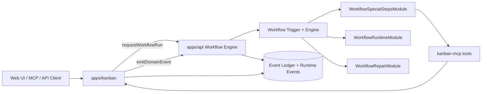
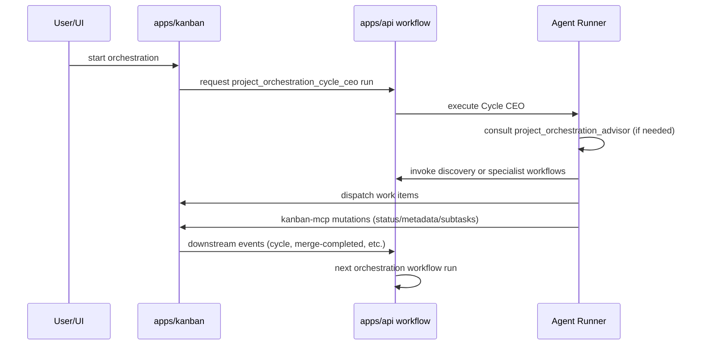
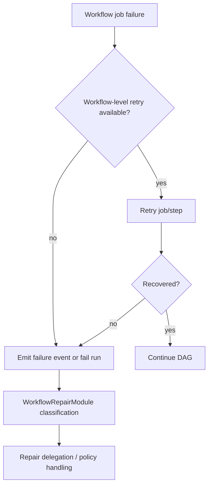

# Kanban Workflow Architecture

Status: Current

Last updated: 2026-05-11

## 1. Scope and Intent

This document is the canonical reference for the workflow-driven kanban orchestration lifecycle.

It covers:

- Service boundaries between `apps/kanban` and `apps/api`
- Status and event trigger contracts
- Every seeded kanban/orchestration workflow and what each job does
- Linkage between work items, workflow runs, and orchestration cycles
- Permissions and approval behavior that impacts orchestration decisions
- Failure, retry, and cleanup paths

For policy ownership (invariants vs process choices), see `docs/architecture/workflow-driven-kanban-policy-boundary.md`.

## 2. Runtime Topology

Kanban orchestration is a two-service system:

1. `apps/kanban` owns project/work-item state, dispatch candidate selection, orchestration lifecycle state, and initiation of the core orchestration cycle.
2. `apps/api` owns workflow trigger registration, workflow execution, special-step mutation execution, capability governance, and repair policy.

## 3. State Model and Status Automation

Supported statuses:

- `backlog`
- `todo`
- `refinement`
- `in-progress`
- `in-review`
- `ready-to-merge`
- `blocked`
- `done`

Status updates validate that the requested target is one of the supported status values. Any known status may move to any other known status; process-specific routing belongs to workflows.

Actual status changes emit `kanban.work_item.status_changed.v1`. Seeded status workflows subscribe to that canonical event and use workflow-owned status conditions for routing. Kanban no longer owns source-to-target routing policy.

Same-status updates are no-ops and do not emit lifecycle events.

## 4. End-to-End Lifecycle

### 4.1 High-level sequence

### 4.2 Work-item lifecycle path

1. Orchestration is started, launching `project_orchestration_cycle_ceo`.
2. Cycle CEO invokes `project_discovery_ceo` if no specs/items exist.
3. Work items are published to `todo`.
4. Cycle CEO dispatches items to `refinement` or `in-progress`.
5. `work_item_refinement_default` (and optional `work_item_split_default`) performs preflight planning.
6. `work_item_in_progress_default` implements and commits.
7. `work_item_in_review_default` produces QA decision.
8. `work_item_ready_to_merge_default` merges and sets `done` with `suppressAutomation: true`.
9. `WorkItemMergeCompletedEvent` triggers `work_item_post_merge_spec_hydration`.
10. Dispatch/orchestration cycle event triggers `project_orchestration_cycle_ceo`.

## 5. Trigger Catalog

### 5.1 Status Workflow Triggers

| Current binding                                                        | Workflow ID                        | Purpose                                                   |
| ---------------------------------------------------------------------- | ---------------------------------- | --------------------------------------------------------- |
| `kanban.work_item.status_changed.v1` (`status == "refinement"`)         | `work_item_refinement_default`     | PM/architect preflight, subtask blueprint, readiness gate |
| `kanban.work_item.status_changed.v1` (`status == "refinement"`, large)  | `work_item_split_default`          | Large-item decomposition to child items                   |
| `kanban.work_item.status_changed.v1` (`status == "in-progress"`)        | `work_item_in_progress_default`    | Implementation and clean-commit loop                      |
| `kanban.work_item.status_changed.v1` (`status == "in-review"`)          | `work_item_in_review_default`      | QA decision and reroute                                   |
| `kanban.work_item.status_changed.v1` (`status == "ready-to-merge"`)     | `work_item_ready_to_merge_default` | Merge, conflict handling, completion                      |

### 5.2 Event triggers (orchestration/lifecycle)

| Event name                                     | Workflow ID                            | Typical emitter                |
| ---------------------------------------------- | -------------------------------------- | ------------------------------ |
| `ProjectOrchestrationStartedEvent`             | `project_orchestration_cycle_ceo`      | Orchestration start path       |
| `ProjectOrchestrationApprovalGrantedEvent`     | `project_work_item_generation_ceo`     | Approval flow                  |
| `ProjectOrchestrationRevisionRequestedEvent`   | `project_spec_revision_ceo`            | Revision request path          |
| `ProjectOrchestrationRefinementRequestedEvent` | `project_orchestration_refinement_ceo` | Mid-flight strategy refinement |
| `ProjectOrchestrationCycleRequestedEvent`      | `project_orchestration_cycle_ceo`      | Dispatch/cycle reconciler      |
| `WorkItemDispatchSelectEvent`                  | `work_item_todo_dispatch_default`      | Dispatch selection workflow    |
| `WorkItemMergeCompletedEvent`                  | `work_item_post_merge_spec_hydration`  | Post-merge spec reconciliation |

Event bindings are registered at startup by `WorkflowEventTriggerService.onModuleInit()` using `WorkflowTriggerRegistryService.resolveEventBindings()`.

## 6. Workflow-by-Workflow Contracts

### 6.1 `project_orchestration_cycle_ceo`

Trigger: `ProjectOrchestrationStartedEvent` or `ProjectOrchestrationCycleRequestedEvent`.

Main jobs:

1. `ceo_orchestration_decision`: heavy-tier job where the CEO decides the next step.
2. Consults `project_orchestration_advisor` via `invoke_agent_workflow` when state is ambiguous.
3. Coordinates Kanban-owned dispatch/lifecycle flows to move ready work items from `todo`.
4. Calls `kanban.publish_specs` to reconcile markdown files.
5. Invokes `project_discovery_ceo` or other bootstrap workflows as needed.

### 6.2 `project_orchestration_advisor`

Trigger: Manual (invoked by Cycle CEO).

Main jobs:

1. `advise`: read-only job that gathers evidence (state, timeline, skills, workflows).
2. Returns Markdown advice to the caller.

### 6.3 `project_discovery_ceo`

Trigger: Manual or `ProjectOrchestrationStartedEvent` (legacy).

Main jobs:

1. `kickoff_clarification` (conditional): resolve goal ambiguity with user.
2. `investigate_imported_repo` (conditional): deep dive into existing codebase.
3. `reconcile_import_specs` (conditional): update PRD/SDD against codebase state.
4. `synthesize_and_hydrate_import` (conditional): create work items from findings.
5. `discovery_and_specs`: core discovery assessment and specialist recommendation.
6. Emits `ProjectOrchestrationSpecsReadyEvent`.

`project_work_item_generation_ceo` (`ProjectOrchestrationApprovalGrantedEvent`):

1. Generates markdown work-item specs.
2. Publishes specs via `kanban.publish_specs`.
3. Emits bootstrap-completed event.
4. Emits cycle request event.

`project_spec_revision_ceo` (`ProjectOrchestrationRevisionRequestedEvent`):

1. Delegates targeted revision workflow activity.
2. Optional war-room alignment.
3. Emits specs-ready and cycle-request when unblocked.

`project_orchestration_refinement_ceo` (`ProjectOrchestrationRefinementRequestedEvent`):

1. Mid-flight strategy/spec refinement.
2. Emits refinement-completed event.

`project_orchestration_cycle_ceo` (`ProjectOrchestrationCycleRequestedEvent`):

1. CEO decides cycle actions (`dispatch`, `pause`, `complete`, etc.) with optional restart context inputs.

## 7. Linkage and Correlation Contracts

### 7.1 Work item -> workflow run

The kanban work-item record stores `linked_run_id`.

When dispatch/review/merge run requests are launched, `WorkItemService` updates `linked_run_id` from accepted run ID.

Dispatch idempotency key format:

- `kanban:dispatch:<project_id>:<work_item_id>`

### 7.2 Workflow run request payloads

`WorkItemService.buildWorkflowRunRequest()` includes:

- `input.scopeId = project_id`
- `input.contextId = work_item_id`
- `input.action = dispatch|review|merge`
- metadata with correlation, causation, and idempotency keys

### 7.3 Trigger payload usage inside workflows

Seed workflows consume:

- `trigger.scopeId` (project)
- `trigger.contextId` (work item or orchestration context)
- `trigger.resource.*` (work-item fields for webhook triggers)
- `trigger.isRestart` and `trigger.stateSummary` (restart continuity)

## 8. Permissions and Approval Surfaces

### 8.1 Workflow/job static permissions

Workflow YAML and per-job permissions define `allow_tools` and `deny_tools` tool-name policies.

Typical kanban workflow permissions include:

- Mutation flows: `kanban.*` lifecycle, dispatch, and publish tools
- QA flows: `set_job_output`, `read`, `query_memory`
- Merge flows: `git_operation` + metadata patch tools

### 8.2 Runtime governance and dynamic rules

Tool call governance layers:

1. Static profile/workflow/job allow/deny snapshots.
2. Dynamic approval rule evaluation (`allow`, `deny`, `require_approval`) by scope.

See `docs/architecture/tool-permissions-and-approvals.md` for full rule semantics.

### 8.3 Orchestration human decision policy

`HumanDecisionResolutionPolicyService` resolves behavior by orchestration mode:

- `autonomous` -> decide without approval
- `supervised` -> ask when uncertain
- `notifications_only` -> decide without approval and notify

This policy governs human-decision findings in orchestration flows; tool-level approvals remain enforced by capability governance.

## 9. Failure, Retry, and Recovery

Failure and retry behavior includes:

- Per-job retries in workflow definitions (`max_retries`, `retry_prompt`, step-loop bounds).
- Merge bounded retry path with explicit failed terminal event.
- Dispatch reconciliation of terminal runs clears stale `linked_run_id` values.
- Workflow-repair module ownership for failure classification and repair delegation.

## 10. Module Boundary Ownership Map

| Concern                                                   | Owning module                           |
| --------------------------------------------------------- | --------------------------------------- |
| Work-item transitions, persistence, dependency checks     | `apps/kanban` work-item/domain services |
| Dispatch candidate ordering, capacity checks, run linkage | `apps/kanban` dispatch services         |
| Orchestration lifecycle state and startup route selection | `apps/kanban` orchestration services    |
| Trigger registry and listener registration                | `apps/api` workflow trigger services    |
| Workflow execution DAG engine                             | `apps/api` workflow engine              |
| Domain mutation special steps                             | `apps/api` `WorkflowSpecialStepsModule` |
| Runtime bridge actions and capability execution           | `apps/api` `WorkflowRuntimeModule`      |
| Failure classification and repair delegation              | `apps/api` `WorkflowRepairModule`       |

This ownership model is normative with the accepted policy boundary decision.

## 11. Source of Truth References

- `apps/kanban/src/work-item/work-item.service.ts`
- `apps/kanban/src/work-item/work-item.service.helpers.ts`
- `apps/kanban/src/dispatch/dispatch.service.ts`
- `apps/kanban/src/orchestration/orchestration.service.ts`
- `apps/kanban/src/orchestration/human-decision-resolution-policy.service.ts`
- `apps/api/src/workflow/workflow-trigger-registry.service.ts`
- `apps/api/src/workflow/workflow-event-trigger.service.ts`
- `seed/workflows/*.workflow.yaml` (all workflows listed above)
- `docs/architecture/workflow-driven-kanban-policy-boundary.md`
- `docs/architecture/tool-permissions-and-approvals.md`
