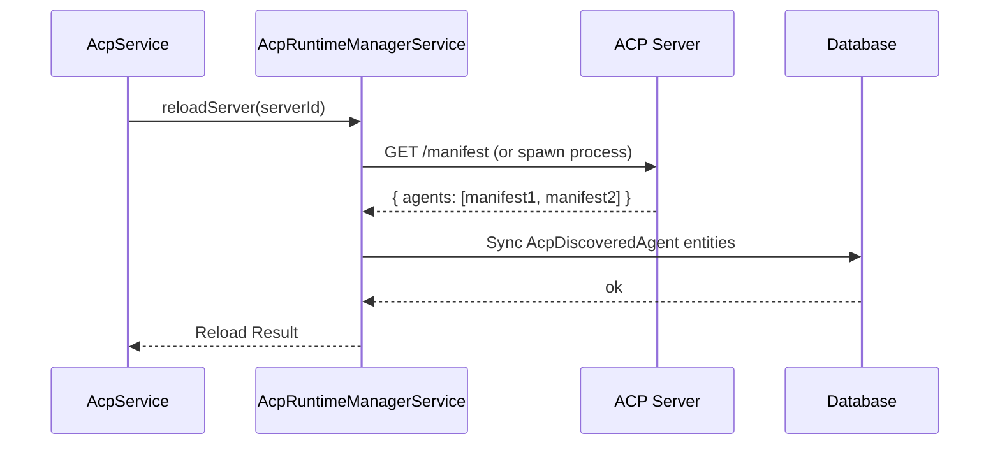

# Agent Connection Protocol (ACP) Architecture

**Status:** Current
**Domain:** Agent Infrastructure

---

## 1. Overview

The Agent Connection Protocol (ACP) is the standardized communication layer that allows the Nexus API to discover, manage, and invoke external agents. It abstracts away the physical location and implementation details of an agent (e.g., local process, remote HTTP server, or MCP-bridged agent).

ACP allows for a dynamic agent registry where specialized models or services can "plug in" to the orchestrator as first-class participants.

## 2. Core Components

### 2.1 ACP Servers
An `AcpServer` is a provider of one or more agents.
- **Local Server**: A command-line process or script that the API spawns.
- **Remote Server**: An HTTP endpoint that implements the ACP spec.
- **MCP Bridge**: A server that translates between MCP (Model Context Protocol) and ACP.

### 2.2 Discovered Agents
When a server is registered or reloaded, the `AcpRuntimeManagerService` performs a "discovery" handshake to list all available agents and their capabilities (the `AgentManifest`).

### 2.3 `AcpRuntimeManagerService`
Located in `apps/api/src/acp/acp-runtime-manager.service.ts`.
- Manages the lifecycle of server connections.
- Orchestrates the discovery loop.
- Routes `invokeAgent` requests to the correct server.

## 3. Communication Lifecycle

### 3.1 Discovery and Synchronization

### 3.2 Agent Invocation

When a workflow step requires an ACP agent, the `AcpRuntimeManagerService` handles the request:
1. **Selection**: Finding the `AcpServer` that owns the requested agent ID.
2. **Payload Preparation**: Sending the prompt, context, and allowed tools to the server.
3. **Response Handling**: Capturing the agent's text response and tool calls.

## 4. Manifest Contract

An agent manifest includes:
- **Agent ID**: Unique identifier within the server.
- **Profile**: Name, description, and suggested model.
- **Capabilities**: A list of tools the agent knows how to use.
- **Context Windows**: Information about the expected input/output sizes.

---

## 5. Related Files

- `apps/api/src/acp/acp.service.ts`
- `apps/api/src/acp/acp-runtime-manager.service.ts`
- `apps/api/src/database/entities/acp-server.entity.ts`
- `apps/api/src/database/entities/acp-discovered-agent.entity.ts`
