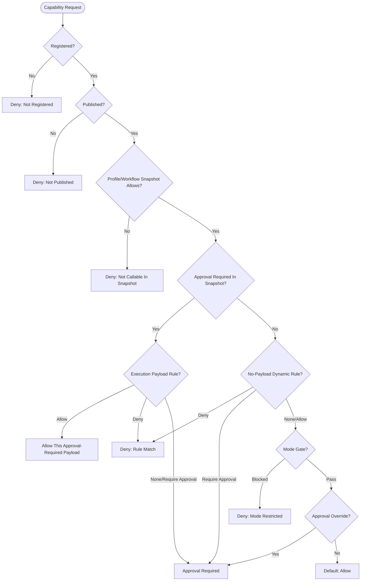

# Capability Governance Engine Architecture

**Status:** Current
**Domain:** Agent Capabilities / Governance

---

## 1. Overview

The Capability Governance Engine is the centralized authority for deciding whether an agent is allowed to use a specific capability or tool in a given context. It applies a multi-phase evaluation strategy that combines static registration checks, agent profile permissions, workflow/job permissions, project mode gates, and dynamic rule matching.

## 2. Governance Decision Tree

The engine (`PolicyEngineService`) executes a series of phases. Denials and approval requirements are definitive. A dynamic `allow` rule is treated as a pass-through by the generic policy engine and is primarily used at execution time to bypass approval for an otherwise approval-required tool call.

## 3. The 10 Phases of Governance

| Phase | Name | Logic |
| :--- | :--- | :--- |
| 1 | `registration_check` | Is the tool registered in the `ToolRegistry`? |
| 2 | `publication_check` | Is the tool status `Published`? (Draft tools are blocked). |
| 3 | `profile_deny` | Has the preflight snapshot marked the tool denied by profile/workflow policy? |
| 4 | `profile_allow` | Has the preflight snapshot failed to mark the tool callable? |
| 5 | `workflow_deny` | Legacy phase. Usually bypassed because workflow/job permissions are folded into the snapshot before the engine is called. |
| 6 | `workflow_allow` | Legacy phase. Usually bypassed because workflow/job permissions are folded into the snapshot before the engine is called. |
| 7 | `dynamic_rule` | Does a no-payload dynamic rule require approval or deny the tool at preflight, or does an execution-time dynamic rule allow or deny an approval-required payload? |
| 8 | `mode_gate` | Does the current `ExecutionMode` (e.g., `Strict`) permit this tool? |
| 9 | `approval_override` | Is the tool approval-required by profile or snapshot policy? |
| 10 | `default_allow` | Fallback if no specific denial was found. |

## 4. Policy Decision Object

The engine returns a `PolicyDecision` object which includes:
- **Status**: `allow`, `deny`, or `approval_required`.
- **Explanation**: A trace of all phases executed and the `decidedBy` phase.
- **Denied Reason**: A user-friendly message explaining the denial.

## 5. Dynamic Rules and Scopes

`ToolApprovalRuleService` allows for fine-grained control based on tool arguments when the payload is available. For example:
- Allow an approval-required `bash` call when `command == ls`.
- Deny an approval-required `bash` call when `command` matches a destructive regex.

Rules can be scoped to `global`, `project`, `agent_profile`, `workflow_run`, or `chat_session`.

See `docs/architecture/tool-permissions-and-approvals.md` for the full configuration and enforcement model, including runner-native tool behavior and current frontend gaps.

---

## 6. Related Files

- `apps/api/src/capability-governance/policy-engine.service.ts`
- `apps/api/src/capability-governance/tool-approval-rule.service.ts`
- `apps/api/src/tool/capability-preflight.service.ts`
