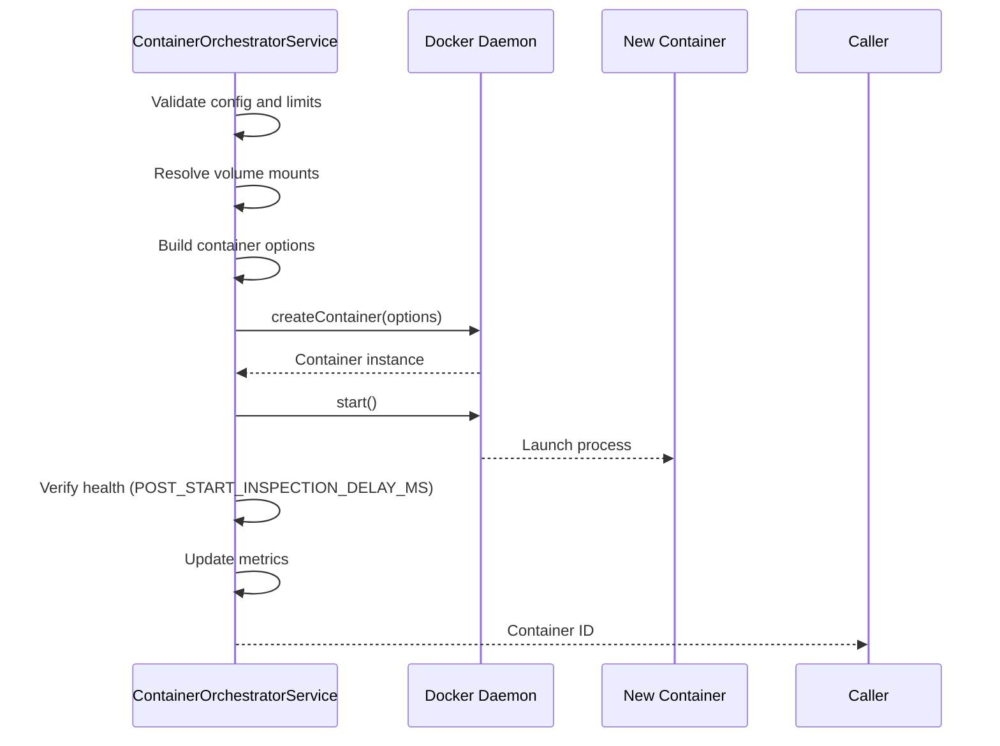

# Container Orchestration

The `ContainerOrchestratorService` manages the lifecycle of Docker containers used for running Pi Agents. It provides a clean abstraction over the Docker API (via `dockerode`) and enforces resource constraints and security boundaries.

## Core Features

- **Lifecycle Management**: Methods for creating, starting, pausing, resuming, killing, and removing containers.
- **Resource Limits**: Enforces CPU and Memory limits based on container tiers (LIGHT vs HEAVY).
- **Volume Mounting**: Supports dynamic mounting of host directories (tools, git repos, session state) with RO/RW permissions.
- **Governed Host Shares**: Supports alias-resolved host-share bind forwarding under `/workspace/host-shares/*` with nested Docker host-path remap support.
- **Monitoring**: Streams logs and provides real-time CPU/Memory stats.
- **Health Checks**: Integrated with NestJS Terminus for Docker daemon availability monitoring.
- **Metrics**: Exports Prometheus metrics for container provisioning, active counts, and failures.

## Resource Profiles

- **LIGHT**: `1e9` NanoCpus (1 core), `512 MB` memory
- **HEAVY**: `4e9` NanoCpus (4 cores), `4 GB` memory

## Container Lifecycle

### Provisioning Flow

### Key Methods

- `provisionContainer(config, start, enableNetwork, worktreePath)` - Create and optionally start a container
- `getContainerStatus(containerId)` - Inspect container state
- `getContainerWorkspacePath(containerId)` - Retrieve workspace mount path
- `getContainerHostMountBindings(containerId)` - List host-share bindings
- `resumeContainer(containerId)` - Unpause or start stopped container
- `killContainer(containerId)` - Force stop container
- `removeContainer(containerId, force)` - Remove container
- `getContainerLogs(containerId)` - Stream container logs
- `getContainerStats(containerId)` - CPU and memory usage

## Volume Mount Resolution

The orchestrator resolves volume mounts with special handling for:

### Workspace Mounts

- Host workspace path is auto-discovered from container mounts or configured via `NEXUS_HOST_WORKSPACE_PATH`
- Worktree paths are mounted at `/workspace` with parent `.git` directory accessible
- Supports nested Docker scenarios (Docker-in-Docker)

### Tool Mounts

- Tools from `NEXUS_TOOL_MOUNT_BASE_PATH` (default: `/tmp/nexus-tools`)
- Host tool path configurable via `NEXUS_HOST_TOOL_MOUNT_PATH`

### Host Shares

- Host share aliases resolved via `NEXUS_HOST_SHARE_MOUNT_PATH` and `NEXUS_API_HOST_SHARE_BASE_PATH`
- Mounted at `/workspace/host-shares/{alias}` in containers
- Supports read-only and read-write modes

## Configuration

| Environment Variable             | Default                   | Description                              |
| -------------------------------- | ------------------------- | ---------------------------------------- |
| `DOCKER_SOCKET_PATH`             | `//./pipe/docker_engine`  | Path to Unix socket or Windows pipe      |
| `DOCKER_HOST`                    | (empty)                   | Remote Docker TCP host (if used)         |
| `NEXUS_DOCKER_NETWORK`           | `bridge`                  | Docker network for managed containers    |
| `NEXUS_WORKSPACE_BASE_PATH`      | `/tmp/nexus-workspaces`   | Container-visible workspace root         |
| `NEXUS_HOST_WORKSPACE_PATH`      | (auto-discover)           | Host workspace root override             |
| `NEXUS_HOST_TOOL_MOUNT_PATH`     | (empty)                   | Host tool mount root override            |
| `NEXUS_TOOL_MOUNT_BASE_PATH`     | `/tmp/nexus-tools`        | Container-side tool mount base           |
| `NEXUS_HOST_SHARE_MOUNT_PATH`    | `./data/host-shares`      | Host root path for host shares           |
| `NEXUS_API_HOST_SHARE_BASE_PATH` | `/data/nexus-host-shares` | API-container host share base            |
| `NEXUS_HOST_SHARE_CATALOG_JSON`  | (empty)                   | JSON catalog override for alias-to-path  |
| `NEXUS_WORKTREE_CONTAINER_USER`  | (empty)                   | Optional `UID:GID` for container process |
| `MAX_TOTAL_CONTAINERS`           | `10`                      | Maximum concurrent containers            |

## Cleanup System

The `ContainerCleanupService` runs an hourly BullMQ job to:

1. **Remove orphaned containers** (no associated `WorkflowRun` record)
2. **Remove stale containers** (running for more than 24 hours)
3. **Prune unused Docker volumes** to save disk space

### Cleanup Criteria

- Containers must have `nexus.managed=true` label
- Orphaned: No `nexus.workflow_run_id` label or workflow run not found
- Stale: `Created` timestamp > 24 hours ago

## Metrics

Prometheus metrics exported:

- `nexus_containers_provisioned_total` - Total containers provisioned
- `nexus_active_containers` - Currently active container count
- `nexus_container_orchestrator_failures_total` - Total provisioning failures

## Security Considerations

### Container Isolation

- Containers run with user namespace isolation when configured
- Resource limits prevent DoS attacks
- Network isolation via Docker networks
- Read-only root filesystem recommended for production

### Volume Security

- Host path mounts restricted to configured directories
- Worktree mounts validated to prevent escape
- Host share mounts use alias resolution to prevent path traversal

### Best Practices

1. **Run as non-root**: Use `NEXUS_WORKTREE_CONTAINER_USER` to specify UID:GID
2. **Resource limits**: Always set appropriate CPU/memory limits
3. **Network policies**: Use Docker networks to isolate container communication
4. **Image scanning**: Scan container images for vulnerabilities
5. **Secrets management**: Never pass secrets via environment variables in container config

## Integration with Workflow Runtime

Containers are provisioned by the workflow runtime for:

- Agent execution environments
- Tool sandboxing
- Browser automation sessions
- Isolated compute tasks

Container lifecycle is tied to workflow run lifecycle through labels:

- `nexus.managed=true`
- `nexus.workflow_run_id={runId}`
- `nexus.step_id={stepId}`
- `nexus.container_tier={light|heavy}`

## Troubleshooting

### Common Issues

**Container fails to start**

- Check Docker daemon is running
- Verify image exists locally or is pullable
- Review resource limits (may be hitting system limits)
- Check volume mount paths exist and are accessible

**Permission denied on mounts**

- Verify host path permissions
- Check `NEXUS_WORKTREE_CONTAINER_USER` settings
- Ensure Docker has access to host directories

**Container exits immediately**

- Review container logs: `docker logs {containerId}`
- Check entrypoint/cmd in container image
- Verify environment variables are correct

**Resource exhaustion**

- Check `MAX_TOTAL_CONTAINERS` limit
- Review active container count
- Monitor system resources (CPU, memory, disk)

## Related Components

- `ContainerOrchestratorService` - Main orchestration service
- `ContainerCleanupService` - Cleanup and maintenance
- `ContainerHttpClientService` - HTTP client for container APIs
- `WorkflowStepExecutionModule` - Uses containers for agent execution
- `WebAutomationModule` - Browser automation containers

## Extending

To add custom container provisioning logic:

1. Extend `IContainerConfig` for custom configuration
2. Add custom volume resolution in `resolveConfiguredVolumes`
3. Override `buildContainerCreateOptions` for custom options
4. Add custom metrics as needed

See `container-orchestrator.helpers.ts` for helper functions.
