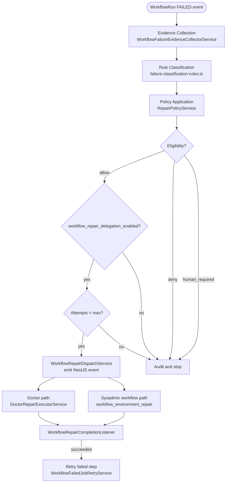

# Failure Classification and Repair Architecture

**Status:** Current — last updated 2026-06-12
**Domain:** Workflow / Reliability

> **Canonical reference:** The detailed, up-to-date description of the repair pipeline lives in
> [`docs/guide/10-workflow-repair.md`](../guide/10-workflow-repair.md).  
> This document provides an architectural overview and cross-cutting context.

---

## 1. Overview

The Failure Classification and Repair system provides an automated self-healing loop for the Nexus Orchestrator. When a `WorkflowRun` fails, the system analyzes evidence, classifies the root cause into one of nine policy classes, and — when the feature flag is enabled — dispatches a repair action. On success the failed step is retried; on failure the run stays in `FAILED` state.

Three independent layers handle different scopes:

| Layer                          | Location                           | Trigger                     | Repair Scope                                                          |
| ------------------------------ | ---------------------------------- | --------------------------- | --------------------------------------------------------------------- |
| **Auto-retry**                 | `WorkflowRunJobExecutionService`   | BullMQ job failure          | Transient retries (HTTP 429, overload) — fast loop, no classification |
| **In-process repair pipeline** | `WorkflowRepairModule`             | `WORKFLOW_RUN_FAILED_EVENT` | Runtime state: stale artifacts, missing deps/config, stuck runs       |
| **Improvement pipeline**       | `code_change` proposal → work item | Diagnosed code problem      | Source code: governed improvement-proposal → work-item pipeline       |

---

## 2. The Failure Classes

The rule classifier (`failure-classification-rules.ts`) maps evidence text to one of:

| Class                       | Confidence                    | Eligibility               | Executor            |
| --------------------------- | ----------------------------- | ------------------------- | ------------------- |
| `credential_missing`        | 0.95                          | `deny` (no automated fix) | —                   |
| `tool_contract_mismatch`    | 0.85                          | `human_required`          | —                   |
| `runtime_artifact_stale`    | 0.80                          | `allow`                   | `doctor`            |
| `runtime_stall_recoverable` | 0.80                          | `allow`                   | `doctor`            |
| `provider_transient`        | 0.80                          | `allow`                   | `doctor`            |
| `context_window_exceeded`   | 0.90                          | `human_required`          | —                   |
| `dependency_missing`        | 0.82                          | `allow`                   | `sysadmin_workflow` |
| `config_missing_local`      | 0.75                          | `allow`                   | `sysadmin_workflow` |
| `quality_gate_failed`       | 0.80                          | `human_required`          | —                   |
| `merge_dirty_worktree`      | 0.90                          | `allow`                   | `doctor`            |
| `ambiguous_failure`         | 0.30 (0.90 if destructive op) | `human_required`          | —                   |

`merge_dirty_worktree` is raised when a context merge aborts because uncommitted or untracked changes in the work-item worktree would be overwritten (`git` prints "local changes ... would be overwritten by merge"). The merge step already self-heals by resetting and cleaning the worktree before merging the base (the deliverable is committed before a work item is ready to merge, so any working-tree residue is scratch); this class is the backstop that routes any residual occurrence to the `doctor.git.clean_worktrees` repair action instead of a generic `human_required` dead-end.

`runtime_stall_recoverable` is raised when a run is left with no live step job after a container loss, a boot health-check timeout, or a stale-run watchdog reap (evidence text matches "no active or queued step job", "stale-run watchdog", "Execution container exited or was lost", or "Container health check timed out"). It is checked **before** `runtime_artifact_stale` because the watchdog attaches/removes host mounts as it reaps, so a watchdog-reaped run carries host-mount runtime diagnostics that would otherwise spuriously match the stale-artifact rule and route to a no-op `refresh_stale_artifacts` repair. This class routes the run to the `doctor.workflow_run.requeue_recoverable` repair action instead.

`provider_transient` is raised for transient LLM provider or transport faults — provider 5xx (`502`/`503`/`504`/`529`), "server cluster under high load"/"overloaded", `429`/rate-limit, and dropped connections ("socket hang up", `ECONNRESET`, "Connection error", "Stream ended without a finish_reason"). These are recoverable, so the run routes to `doctor.workflow_run.requeue_recoverable`. The terminal provider failures (insufficient balance, usage exhausted, auth failures) are deliberately **excluded** from this rule so they are not requeued into a loop.

`context_window_exceeded` is raised when the provider rejects a request because the prompt is larger than the model's context window ("context window exceeds limit", "maximum context length is N tokens"). It is checked **before** `provider_transient` so a `400` context error is not mistaken for a retryable provider blip. Because it is deterministic — a blind requeue would loop — it routes to `human_required`: the real fix is a larger-context model or a smaller prompt, applied deliberately. (On Nexus this commonly surfaces when a small-context model runs the CEO orchestration cycle against a large board state.)

A safety override assigns `ambiguous_failure` at confidence 0.90 and tags `destructive_operation` if the evidence contains patterns like `git reset --hard`, `rm -rf`, or `docker system prune` — these are always denied.

---

## 3. Repair Loop

---

## 4. Observability

- Classification decisions → `workflow.failure.classification.decided` event in the `event_ledger`
- Dispatch decisions → `workflow.repair.delegation.dispatched` event
- Completion → `workflow.repair.delegation.completed` event
- All events include `eligibility`, `class`, `confidence`, `policyActionId`, and `reason`

---

## 5. Operational Notes

- **Repair delegation is off by default.** The `workflow_repair_delegation_enabled` system setting defaults to `false`. It must be explicitly enabled in `system_settings` before any automated repair fires.
- **Max attempts defaults to 1.** `workflow_repair_delegation_max_attempts` limits how many repair attempts are made per run per policy action.
- **`credential_missing` is denied, not `human_required`.** The policy has no `allowedRepairActionIds` and `humanRequired: false`, so it resolves to `deny` and the run is marked `FAILED` without escalation. This is a known design gap.
- **Dispatch uses NestJS EventEmitter2, not BullMQ.** Repair events are in-process and non-durable. A process crash between dispatch and execution silently drops the attempt (but it counts against the attempt cap).

---

## 6. Related Files

- `apps/api/src/workflow/workflow-repair/` — all repair module source
- `apps/api/src/operations/` — doctor checks and `DoctorRepairDelegationListener`
- `apps/api/src/settings/repair-delegation-settings.constants.ts` — system setting keys
- `apps/api/src/workflow/workflow-repair/repair-policy.config.ts` — static policy registry
- `apps/api/src/workflow/workflow-repair/workflow-repair-dispatch.service.ts` — dispatch logic
- `data/seed/workflows/workflow-environment-repair.workflow.yaml` — sysadmin repair workflow
- `data/seed/workflows/workflow-failure-doctor.workflow.yaml` — AI failure doctor workflow

---

## 7. See Also

- [`docs/guide/10-workflow-repair.md`](../guide/10-workflow-repair.md) — detailed pipeline reference
- [`docs/guide/20-operations.md`](../guide/20-operations.md) — Doctor framework and checks
- [`docs/guide/43-repair-diagnostics-operator-guide.md`](../guide/43-repair-diagnostics-operator-guide.md) — operator diagnostic runbook
- [`docs/analysis/ANALYSIS-self-healing-repair-2026.md`](../analysis/ANALYSIS-self-healing-repair-2026.md) — root cause analysis of inert repair system
