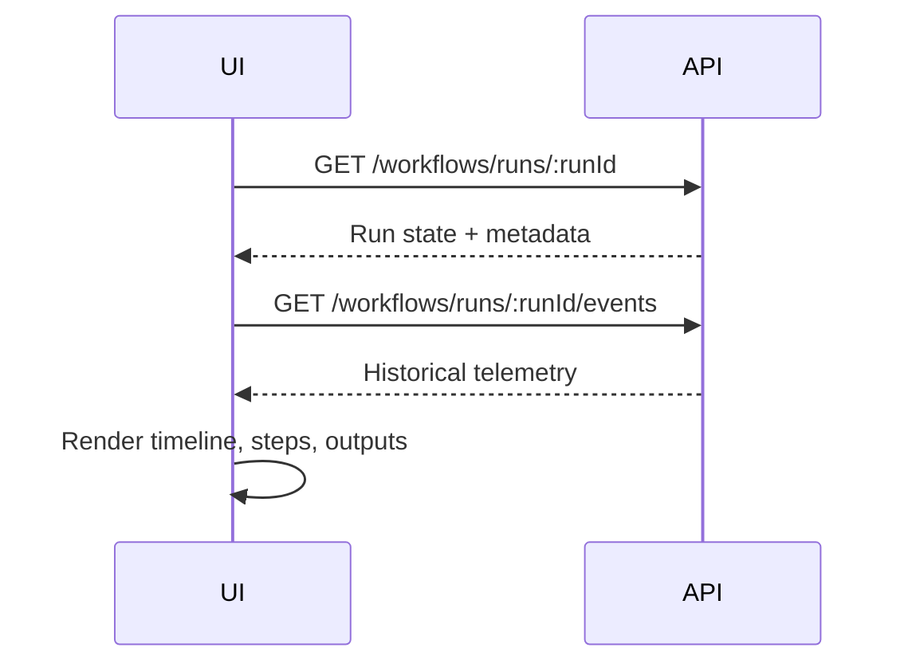
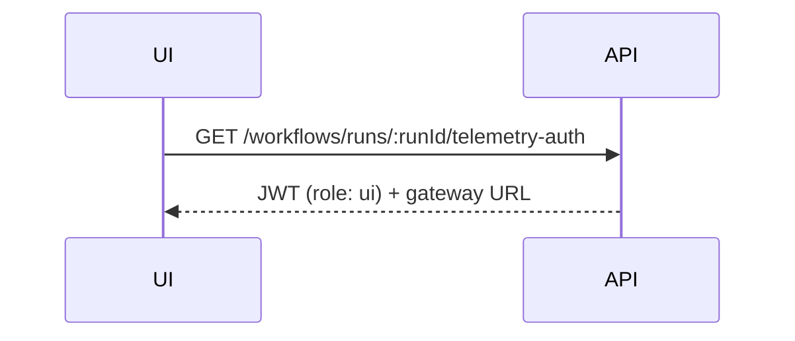
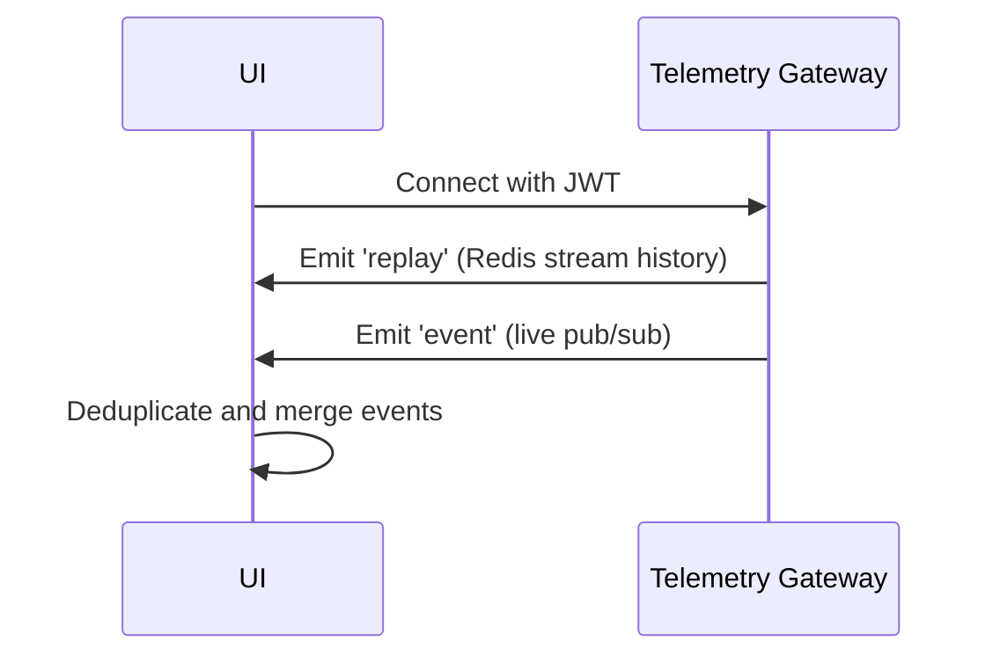

# Observability, Monitoring & Alerting

The Observability system provides deep visibility into the Nexus platform's health, performance, and costs, enabling proactive operations and data-driven decision making.

## Architecture

### 1. Metrics Collection (Prometheus)

**`MetricsService`** exposes application-level metrics via the `/api/metrics` endpoint.

**Workflow Metrics:**
- Execution duration (histogram)
- Success/failure counts (counter)
- Active runs (gauge)
- Step execution times
- Workflow completion rates

**Container Metrics:**
- Provisioning latency
- Active container counts
- Failure reasons
- Resource utilization (CPU, memory)
- Container lifecycle events

**API Metrics:**
- Request latency by endpoint
- Error rates (4xx, 5xx)
- Request volume
- Authentication failures

**Tool Execution Metrics:**
- Tool call counts by type
- Tool execution duration
- Approval request counts
- Tool failure rates
- Sandbox execution times

**MCP Server Metrics:**
- Connection status
- Tool discovery counts
- Invocation latency
- Error rates

### 2. Distributed Tracing (OpenTelemetry)

**Auto-instrumentation** captures traces for:
- HTTP requests (incoming/outgoing)
- PostgreSQL/TypeORM database queries
- Redis operations
- Docker API calls
- Internal service calls

**Trace Correlation:**
- `trace_id` injected into all logs
- `span_id` for operation tracking
- `parent_span_id` for call hierarchy
- Workflow run ID propagated across services

**Exporter Configuration:**
- OTLP-compatible backend (e.g., Jaeger, Zipkin)
- HTTP exporter with configurable endpoint
- Batch span processor for efficiency
- Sampling strategies (trace ID ratio-based)

**Custom Spans:**
- Workflow execution spans
- Tool execution spans
- Container lifecycle spans
- Database transaction spans
- External API call spans

### 3. Cost Tracking & FinOps

**`CostTrackingService`** records financial impact of resource consumption.

**LLM Costs:**
- Token usage tracking (prompt + completion)
- Model-specific pricing
- Per-workflow run costs
- Per-agent costs
- Cost attribution to projects

**Compute Costs:**
- Container runtime hours by tier (Light/Heavy)
- GPU usage (if applicable)
- Memory allocation costs
- Network egress charges

**Reporting:**
- Monthly platform spend summaries
- Cost per project/workflow
- Cost per agent profile
- Cost trends over time
- Budget alerts

**Data Sources:**
- Cloud provider billing APIs
- Internal resource tracking
- Token usage logs
- Container runtime metrics

### 4. Health Monitoring

**Terminus Integration** provides comprehensive health checks:

**Liveness Probe:**
- Application process health
- Memory usage thresholds
- Event loop lag (Node.js)
- Garbage collection metrics

**Readiness Probe:**
- Database connectivity
- Redis connectivity
- Docker daemon availability
- External service dependencies
- Configuration validation

**Health Endpoints:**
- `GET /api/health` - Overall health status
- `GET /api/health/live` - Liveness check
- `GET /api/health/ready` - Readiness check

**Health Check Components:**
- Database (PostgreSQL)
- Cache (Redis)
- Docker daemon
- External APIs (LLM providers)
- File system access
- Network connectivity

### 5. Log Aggregation

**Structured Logging:**
- JSON format for machine parsing
- Consistent field naming
- Correlation IDs across services
- Log levels: DEBUG, INFO, WARN, ERROR

**Log Context:**
- `trace_id` - Distributed trace identifier
- `workflow_run_id` - Workflow execution
- `job_id` - Current job/task
- `user_id` - Acting user
- `agent_profile` - Agent identity
- `container_id` - Runtime container
- `tool_name` - Tool being executed

**Log Destinations:**
- Console (structured JSON)
- File (rotated daily)
- External log aggregation (ELK, Datadog, etc.)
- Error tracking (Sentry, etc.)

### 6. Event Ledger

**`EventLedgerService`** provides audit trail for all significant actions:

**Event Types:**
- Workflow lifecycle events
- Tool execution events
- User actions
- System errors
- Approval requests
- Container lifecycle
- MCP operations
- War room activities

**Event Schema:**
```typescript
{
  domain: string;           // e.g., 'workflow', 'tool', 'mcp'
  eventName: string;        // e.g., 'workflow.run.started'
  outcome: 'success' | 'failure' | 'denied' | 'in_progress';
  actorType: 'user' | 'agent' | 'system';
  actorId?: string;
  workflowRunId?: string;
  jobId?: string;
  toolName?: string;
  payload?: Record<string, unknown>;
  errorCode?: string;
  errorMessage?: string;
  timestamp: Date;
}
```

**Query Capabilities:**
- Filter by domain, event type, time range
- Search by actor, workflow, tool
- Aggregate outcomes
- Export for analysis

## Dashboards (Grafana)

JSON exports available in `infra/grafana/dashboards/`:

### 1. System Health Dashboard

**Overview:**
- Infrastructure resource utilization
- Service availability status
- Error rate trends
- Response time percentiles

**Panels:**
- CPU/Memory/Disk usage
- Active containers count
- API request rate
- Error rate by service
- Database connection pool
- Redis memory usage
- Docker daemon health

### 2. Workflow Performance Dashboard

**Overview:**
- Execution success and latency
- Bottleneck identification
- Workflow type comparison

**Panels:**
- Workflow completion rate
- Average execution time
- Step-level duration breakdown
- Failure reasons distribution
- Active workflow runs
- Queue depth (BullMQ)
- Retry counts

### 3. Agent Activity Dashboard

**Overview:**
- Container lifecycle monitoring
- Tool usage patterns
- Agent performance metrics

**Panels:**
- Container provisioning rate
- Active containers by tier
- Tool call frequency
- Tool execution duration
- Approval request volume
- MCP tool usage
- Agent profile activity

### 4. FinOps Dashboard

**Overview:**
- Platform operational costs
- Cost attribution
- Budget tracking

**Panels:**
- Monthly spend trends
- Cost by project
- Cost by agent profile
- LLM token usage
- Container compute costs
- Cost per workflow type
- Budget vs actual

### 5. War Room Dashboard

**Overview:**
- Collaboration metrics
- Decision tracking
- Session outcomes

**Panels:**
- Active war room sessions
- Session duration
- Consensus achievement rate
- Participant engagement
- Decision outcomes
- Escalation frequency

## Live Workflow Execution Data Flow (UI)

The execution detail screen (`/workflows/:id/runs/:runId`) uses a two-phase data flow:

### 1. REST Bootstrap (Deterministic Page Hydration)



- UI fetches run state from `GET /workflows/runs/:runId`
- UI fetches persisted telemetry history from `GET /workflows/runs/:runId/events`
- Ensures timeline, step outputs, and historical agent/tool events render immediately
- Works even after page refresh

### 2. WebSocket Auth Bootstrap



- UI requests `GET /workflows/runs/:runId/telemetry-auth`
- API returns short-lived JWT (`role: ui`) bound to `workflowRunId`
- Includes telemetry gateway URL

### 3. Socket.io Replay + Live Stream



- UI connects to telemetry gateway with JWT
- Gateway emits `replay` (Redis stream history)
- Gateway emits `event` (live pub/sub)
- UI deduplicates replay/live payloads by timestamp+event+payload
- Maintains time-ordered timeline

### 4. Durability Model

- Agent and workflow worker telemetry persisted to Redis stream: `stream:telemetry:{workflowRunId}`
- Live broadcast uses Redis pub/sub channel: `telemetry:{workflowRunId}`
- Replay guarantees eventual UI consistency after transient disconnects
- Events persisted for audit and replay capability

## Alerting

Critical alerts managed via Prometheus Alertmanager:

### High Failure Rate
- **Condition:** > 5 workflow failures in 10 minutes
- **Severity:** critical
- **Action:** Page on-call engineer
- **Channel:** PagerDuty, Slack

### Queue Backlog
- **Condition:** BullMQ queue depth > 100 jobs
- **Severity:** warning
- **Action:** Auto-scale workers, notify team
- **Channel:** Slack, Email

### Resource Limits
- **Condition:** Container OOM or disk space < 10%
- **Severity:** critical
- **Action:** Kill container, free space, alert
- **Channel:** PagerDuty

### High Latency
- **Condition:** API p95 latency > 2s
- **Severity:** warning
- **Action:** Investigate, scale services
- **Channel:** Slack

### MCP Server Down
- **Condition:** MCP server disconnected > 5 minutes
- **Severity:** warning
- **Action:** Auto-reconnect, notify
- **Channel:** Slack

### War Room Deadlock
- **Condition:** War room session > 4 hours without consensus
- **Severity:** info
- **Action:** Escalate to moderator
- **Channel:** Email

## Required-Tools Audit Trail

Workflow required-tool compliance explicitly persisted for each run.

### 1. Job Queued Events

`job.queued` events include:
- `requiredToolCalls` - Expected tool calls
- `outputTool` - Required output tool
- `workflowToolPolicy` - Tool policy context
- `jobToolPolicy` - Job-specific tool permissions

### 2. Enforcement Events

Structured workflow events:
- `job.required_tools.satisfied` - All required tools used
- `job.required_tools.missing` - Required tools not used
- `job.required_tools.retry_enqueued` - Retry scheduled
- `job.required_tools.exhausted` - Max retries reached

### 3. Run-Level Summary

`workflow_run_required_tools_audit_v1` table:
- Run ID
- Required tools list
- Used tools list
- Missing tools list
- Compliance status
- Timestamps

### 4. API Summary Endpoint

`GET /api/workflow-runs/:runId/audit-summary`

Returns:
- Required tools compliance
- Tool usage timeline
- Missing tool analysis
- Recommendations

## Telemetry Gateway

**`TelemetryGateway`** manages real-time event distribution:

**Features:**
- WebSocket connection management
- Redis stream replay
- Pub/sub broadcasting
- JWT authentication
- Per-run channel isolation
- Connection pooling

**Event Types:**
- `workflow.run.*` - Workflow lifecycle
- `workflow.step.*` - Step execution
- `workflow.tool.*` - Tool execution
- `workflow.agent.*` - Agent actions
- `workflow.error.*` - Error events
- `war_room.*` - War room activities

**Message Format:**
```json
{
  "event_type": "workflow.step.completed",
  "timestamp": "2024-01-01T00:00:00.000Z",
  "workflow_run_id": "run-123",
  "job_id": "job-456",
  "step_id": "step-789",
  "payload": { ... }
}
```

## Performance Monitoring

### Key Performance Indicators (KPIs)

- **Workflow Success Rate:** > 95%
- **Average Execution Time:** < 5 minutes
- **API p95 Latency:** < 2 seconds
- **Container Provisioning Time:** < 30 seconds
- **Tool Execution Success Rate:** > 98%
- **System Availability:** > 99.9%

### Synthetic Monitoring

- Periodic workflow execution tests
- API endpoint health checks
- End-to-end scenario testing
- Performance regression detection

## Log Levels

| Level | Description | Production |
|-------|-------------|------------|
| DEBUG | Detailed debug info | Disabled |
| INFO | Normal operations | Enabled |
| WARN | Potential issues | Enabled |
| ERROR | Errors requiring attention | Enabled |

## Related Documentation

- `docs/architecture/telemetry-gateway.md` - Real-time event distribution
- `infra/grafana/dashboards/` - Grafana dashboard JSON exports
- `apps/api/src/observability/` - Observability implementation
- `apps/api/src/event-ledger/` - Event ledger service
- `apps/api/src/telemetry/` - Telemetry gateway implementation