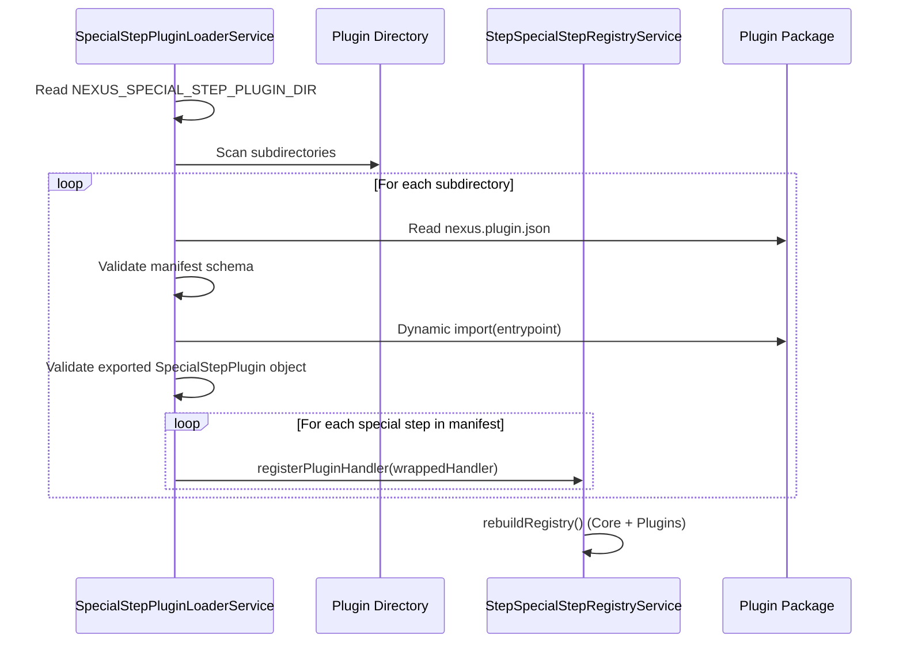

# Plugin System Architecture

**Status:** Current
**Domain:** Workflow / Extensibility

---

## 1. Overview

The Nexus Plugin System provides a structured way to extend the orchestrator's core capabilities without modifying the main codebase. It allows for the dynamic registration of "Special Step Handlers" that execute synchronously within the API process.

This is particularly useful for integrating with proprietary systems, internal webhooks, or specialized data processing tasks that require full repo access or high-performance synchronous execution.

Plugins are **trusted in-process** extensions. They run in the same Node.js process as the API and have access to the same environment variables, file system, and network. See [Security and Trust](#5-security-and-trust) for important considerations.

## 2. Plugin Architecture

The system relies on a "trusted in-process" model. Plugins are discovered at startup, validated against a schema, and their handlers are injected into the core `StepSpecialStepRegistryService`.

### 2.1 Plugin Loading Sequence



## 3. Core Components

### 3.1 `packages/plugin-sdk`

The SDK provides the TypeScript types, Zod schemas, and the `defineSpecialStepPlugin` helper used by plugin authors. This ensures type safety and contract compliance between the plugin and the API.

**Key exports:**
- `SpecialStepPluginManifest` - Plugin metadata schema
- `SpecialStepPluginHandler` - Handler interface
- `SpecialStepPluginExecutionContext` - Execution context provided to handlers
- `defineSpecialStepPlugin()` - Helper to create type-safe plugins

### 3.2 `SpecialStepPluginLoaderService`

Located in `apps/api/src/workflow/workflow-special-steps/plugin/special-step-plugin-loader.service.ts`.

- **Discovery**: Scans the configured directory (`NEXUS_SPECIAL_STEP_PLUGIN_DIR`) for plugin packages
- **Handshake**: Validates that the manifest matches the exported code
- **Wrapping**: Converts a `SpecialStepPluginHandler` into an `ISpecialStepHandler` that the core engine understands
- **Validation**: Ensures handler results conform to expected format

### 3.3 `StepSpecialStepRegistryService`

The central registry for all special steps. Located in `apps/api/src/workflow/workflow-special-steps/step-special-step-registry.service.ts`.

- Prevents plugins from overriding "Reserved" core step types
- Enforces domain isolation (plugins always have `owningDomain: 'plugin'`)
- Validates plugin handler descriptors
- Manages handler lookup by step type

## 4. Manifest and Contract

Every plugin must include a `nexus.plugin.json` which defines:

```json
{
  "id": "com.acme.git-ops",
  "name": "Git Operations Plugin",
  "version": "1.0.0",
  "entrypoint": "dist/index.js",
  "specialSteps": [
    {
      "type": "git_clone",
      "displayName": "Git Clone",
      "description": "Clone a git repository",
      "inputContract": "{ \"type\": \"object\", \"properties\": { \"url\": { \"type\": \"string\" } } }"
    }
  ],
  "permissions": [
    { "kind": "filesystem", "access": "read", "paths": ["/workspace"] }
  ]
}
```

### Fields

- `id` (string, required): Stable, unique identifier (e.g., `com.acme.git-ops`)
- `name` (string, required): Human-readable plugin name
- `version` (string, required): Semantic version
- `entrypoint` (string, required): Path to compiled JavaScript file (relative to plugin directory)
- `specialSteps` (array, required): Metadata for the handlers provided
  - `type` (string): Unique step type identifier
  - `displayName` (string): Human-readable name
  - `description` (string, optional): Detailed description
  - `inputContract` (string, required): JSON Schema string defining valid inputs
- `permissions` (array, optional): **Documentation only** - Describes required permissions (not enforced at runtime)

## 5. Security and Trust

### 5.1 Trusted Execution Model

Plugins run in the same Node.js process as the API. This means:

- **Full system access**: Plugins can read/write files, make network requests, and access environment variables
- **No sandbox**: Unlike tool sandboxing, there is no isolation between plugins and the core system
- **Performance**: Synchronous execution with direct access to internal services

### 5.2 Validation Layers

The system performs several validation checks:

1. **Manifest validation**: `nexus.plugin.json` must match `specialStepPluginManifestSchema`
2. **Export validation**: Plugin must export a `SpecialStepPlugin` object via default export
3. **Handler validation**: Each handler must have a valid type and execute function
4. **Result validation**: Handler results must conform to `SpecialStepHandlerResult` format

### 5.3 Runtime Contract Enforcement

Plugin handlers must return results in this format:

```typescript
{
  result: {
    status: 'completed',
    source: 'plugin',
    mode: '<handler-type>',  // Must match handler type
    [key: string]: unknown   // Additional result data
  },
  output: Record<string, unknown>  // Structured output for workflow
}
```

The system validates:
- `result.status` must be `'completed'`
- `result.source` must be `'plugin'`
- `result.mode` must match the handler type
- `output` must be a record object

### 5.4 Important Security Notes

**The `permissions` field in the manifest is for documentation and audit purposes only.** The system does NOT enforce a sandbox or restrict plugin capabilities based on this field.

**Best practices for plugin security:**

1. **Code review**: Carefully review all plugin code before deployment
2. **Source control**: Only load plugins from trusted sources
3. **Environment isolation**: Consider running plugins in separate processes or containers for sensitive operations
4. **Input validation**: Validate all inputs within plugin handlers
5. **Error handling**: Implement robust error handling to prevent crashes
6. **Least privilege**: Run the API process with minimal required permissions

### 5.5 Future Enhancements

Planned improvements for plugin security:
- Optional external process execution for untrusted plugins
- Capability-based permission system
- Resource limits (CPU, memory)
- Network access controls

## 6. Plugin Development

### 6.1 Creating a Plugin

1. **Set up project structure**:
```
my-plugin/
  package.json
  tsconfig.json
  src/
    index.ts
  nexus.plugin.json
```

2. **Define the plugin** (`src/index.ts`):
```typescript
import { defineSpecialStepPlugin, SpecialStepPluginHandler } from '@nexus/plugin-sdk';

const myHandler: SpecialStepPluginHandler = {
  type: 'my_custom_step',
  async execute(context) {
    // Access workflow context
    const { workflowRunId, stepId, step, resolvedStepInputs } = context;
    
    // Perform work
    const result = await doSomething(resolvedStepInputs);
    
    return {
      result: {
        status: 'completed',
        source: 'plugin',
        mode: 'my_custom_step',
        data: result
      },
      output: { result }
    };
  }
};

export default defineSpecialStepPlugin({
  manifest: {
    id: 'com.example.my-plugin',
    name: 'My Custom Plugin',
    version: '1.0.0',
    entrypoint: 'dist/index.js',
    specialSteps: [
      {
        type: 'my_custom_step',
        displayName: 'My Custom Step',
        description: 'Performs custom operations',
        inputContract: JSON.stringify({
          type: 'object',
          properties: {
            param1: { type: 'string' }
          }
        })
      }
    ]
  },
  handlers: [myHandler]
});
```

3. **Create manifest** (`nexus.plugin.json`):
```json
{
  "id": "com.example.my-plugin",
  "name": "My Custom Plugin",
  "version": "1.0.0",
  "entrypoint": "dist/index.js",
  "specialSteps": [
    {
      "type": "my_custom_step",
      "displayName": "My Custom Step",
      "description": "Performs custom operations",
      "inputContract": "{ \"type\": \"object\", \"properties\": { \"param1\": { \"type\": \"string\" } } }"
    }
  ]
}
```

4. **Build and deploy**:
```bash
npm run build
# Copy to plugin directory
cp -r my-plugin /path/to/nexus/plugins/
```

### 6.2 Accessing Internal Services

Plugins can import and use internal Nexus services if needed:

```typescript
import { WorkflowEngineService } from '../../workflow/workflow-engine.service';

// Note: This creates tight coupling and should be used carefully
```

### 6.3 Testing Plugins

Test plugins like any other TypeScript code:

```typescript
import { myHandler } from './index';

describe('My Custom Handler', () => {
  it('should execute successfully', async () => {
    const context = {
      workflowRunId: 'test-run',
      stepId: 'test-step',
      step: { /* mock step */ },
      resolvedStepInputs: { param1: 'value' }
    };
    
    const result = await myHandler.execute(context);
    expect(result.result.status).toBe('completed');
  });
});
```

## 7. Configuration

### 7.1 Enabling Plugins

Set the plugin directory environment variable:

```bash
NEXUS_SPECIAL_STEP_PLUGIN_DIR=/path/to/plugins
```

If not set, no plugins will be loaded.

### 7.2 Plugin Directory Structure

The loader scans the plugin directory for subdirectories, each containing a `nexus.plugin.json` file:

```
plugins/
  my-plugin/
    nexus.plugin.json
    dist/
      index.js
  another-plugin/
    nexus.plugin.json
    dist/
      index.js
```

## 8. Debugging

### 8.1 Common Issues

**Plugin not loading:**
- Check `NEXUS_SPECIAL_STEP_PLUGIN_DIR` is set correctly
- Verify directory exists and is readable
- Check API logs for validation errors

**Handler not found:**
- Ensure handler type in code matches manifest
- Verify export is default export
- Check for TypeScript compilation errors

**Validation errors:**
- Validate JSON Schema in `inputContract`
- Ensure result format matches expectations
- Check handler type is not reserved

### 8.2 Logging

The loader service logs at each step:
- Plugin discovery
- Manifest validation
- Handler registration
- Validation errors

Check API logs for detailed error messages.

## 9. Related Files

- `apps/api/src/workflow/workflow-special-steps/plugin/special-step-plugin-loader.service.ts` - Plugin loader implementation
- `apps/api/src/workflow/workflow-special-steps/step-special-step-registry.service.ts` - Registry service
- `packages/plugin-sdk/src/special-step-plugin.types.ts` - Type definitions
- `packages/plugin-sdk/src/special-step-plugin.schema.ts` - Zod schemas
- `apps/api/src/workflow/workflow-special-steps/step-special-step.types.ts` - Core step types

## 10. Examples

See the [Writing Workflow Plugins](../guides/writing-workflow-plugins.md) guide for detailed examples and best practices.