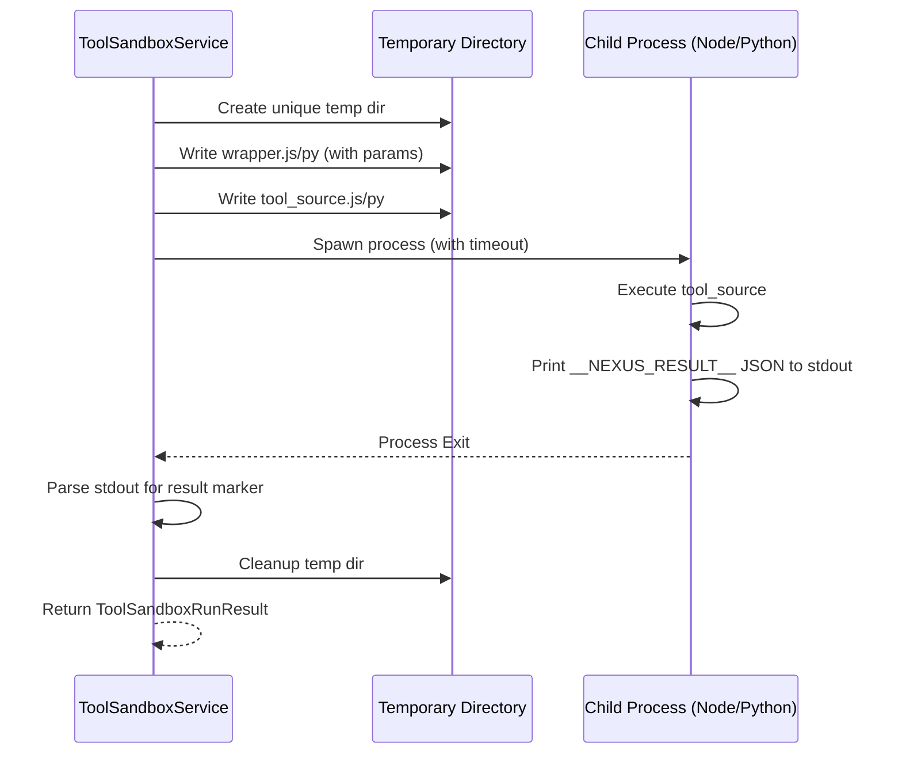

# Tool Sandbox Architecture

**Status:** Current
**Domain:** Agent Capabilities / Security

---

## 1. Overview

The Tool Sandbox provides an isolated execution environment for dynamic tools (artifacts). These are tools whose source code is generated at runtime (e.g., by an LLM) or loaded from an external source. The sandbox ensures that these tools can be validated and executed without compromising the host API process.

Dynamic tools are created through the Tool Candidate workflow:
1. Developer creates a tool candidate draft with source code, schema, and optional tests
2. Candidate is validated in the sandbox (`validateCandidate`)
3. After passing validation, candidate can be published to the registry
4. Published tools execute via `executeCandidate` in the sandbox

## 2. The "Runner Wrapper" Pattern

The sandbox does not execute the raw source code directly. Instead, it wraps the code in a "runner" template that handles parameter injection and result capture.

### 2.1 Execution Sequence



## 3. Supported Languages

### 3.1 Node.js
- **Runtime**: `node` (child process)
- **Isolation**: File system restricted to the temporary directory via relative pathing (best-effort)
- **Communication**: Shared memory is not used; stdout is the primary channel
- **Entry Point**: Must export `execute`, `run`, or `default` function

### 3.2 Python
- **Runtime**: `python3` (child process)
- **Isolation**: Standard Python subprocess constraints
- **Communication**: Similar to Node.js, uses a result marker in stdout
- **Entry Point**: Must define `execute`, `run`, or `main` function (async supported)

## 4. Security Policy and Denials

The `ToolSandboxService` includes a `getPolicyDenials` method that performs static analysis on the source code before execution. It blocks:

### Node.js Denials:
- **Network access**: `require('child_process')`, `require('fs')`
- **System manipulation**: `process.exit`, `eval`, `Function` constructor
- **Secret access**: `process.env` references

### Python Denials:
- **Network access**: `import os`, `import subprocess`, `import urllib`, `import requests`
- **System manipulation**: `os.system`, `subprocess`, `eval`, `exec`
- **Secret access**: References to sensitive modules

**Note:** This is a best-effort static analysis. Determined attackers may bypass these checks. Always run sandbox tools in isolated container environments with restricted capabilities.

## 5. Result Marker Pattern

To distinguish the tool's return value from its general logging (stdout), the runner wraps the final output in a unique marker:

```
// Example stdout
Some log message...
__NEXUS_RESULT__ {"ok": true, "data": 42}
```

The `ToolSandboxService` parses this JSON to populate the `output` field of the `ToolSandboxRunResult`. If no marker is found, `output` is `undefined`.

## 6. Tool Candidate Lifecycle

### 6.1 Creating a Draft

```typescript
POST /api/tools/candidates
{
  "tool_name": "my_custom_tool",
  "language": "node",
  "source_code": "export const execute = (params) => ({...})",
  "schema": {"type": "object", "properties": {...}}
}
```

This creates an `IToolArtifact` with status `draft`.

### 6.2 Validation

```typescript
POST /api/tools/candidates/:id/validate
```

Runs the candidate through `ToolSandboxService.validateCandidate()`:
- Static policy denials checked
- Code executed in sandbox with empty params `{}`
- Exit code and output captured
- Validation run recorded in `tool_validation_runs` table
- Artifact status updated: `validated` (passed) or `failed`

### 6.3 Publishing

```typescript
POST /api/tools/candidates/:id/publish
```

Requirements:
- Latest validation run must have status `passed`
- Deactivates any previously active tool with same name
- Creates/updates `tool_registry` entry
- Generates API callback metadata
- Sets artifact status to `published`, `is_active: true`

### 6.4 Execution

Published tools execute via standard tool registry path:

```typescript
POST /api/tools/runtime/:toolName/execute
```

This routes through `ToolRuntimeExecutionService.executePublishedTool()` → `ToolSandboxService.executeCandidate()`.

## 7. Timeout Configuration

- **Validation timeout**: 5000ms (configurable via `timeout_ms` in request)
- **Execution timeout**: 10000ms (configurable via `timeout_ms` in request)

Timeouts trigger `SIGKILL` and result in status `timeout`.

## 8. Related Files

- `apps/api/src/tool-runtime/tool-sandbox.service.ts` - Core sandbox implementation
- `apps/api/src/tool-runtime/tool-candidate.service.ts` - Candidate lifecycle
- `apps/api/src/tool/tool-validation.service.ts` - TypeScript validation
- `apps/api/src/tool-runtime/tool-sandbox.types.ts` - Type definitions
- `apps/api/src/tool/tool-registry.service.ts` - Registry management

## 9. Security Considerations

1. **Container Isolation**: Sandbox code should execute within Docker containers with:
   - No privileged access
   - Resource limits (CPU, memory)
   - Read-only root filesystem where possible
   - Network policies

2. **Secret Management**: Never pass secrets to sandbox code. Use environment variables or secure parameter stores for production tools.

3. **Input Validation**: All tool inputs should be validated against the JSON schema before execution.

4. **Audit Logging**: All sandbox executions are logged via `EventLedgerService` for audit trails.

5. **Time/Resource Limits**: Enforce strict timeouts and monitor for infinite loops or resource exhaustion.

6. **File System Access**: While the sandbox restricts access to its temp directory, container-level mount restrictions provide additional defense.

## 10. Extending the Sandbox

To add support for additional languages:

1. Add language detection in `ToolSandboxCandidateInput`
2. Implement `run{Language}Candidate` method
3. Create appropriate runner template with result marker
4. Update `resolveSandboxImage()` to return correct container image
5. Add static analysis patterns for the new language
6. Update validation logic in `getPolicyDenials()`