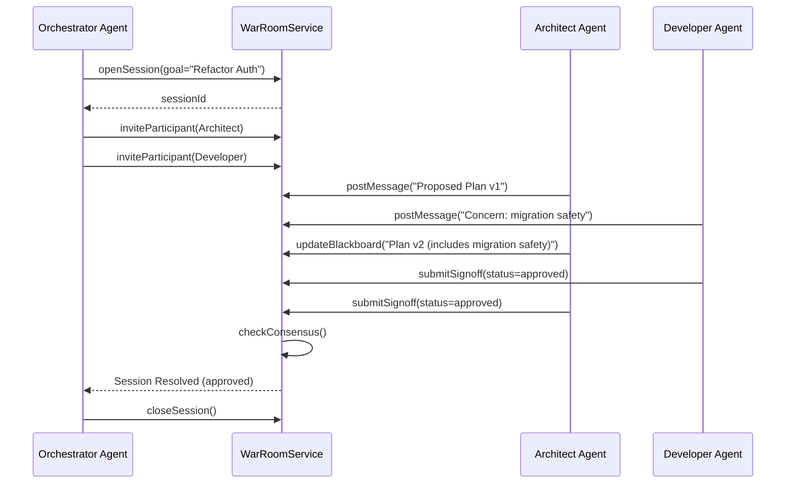
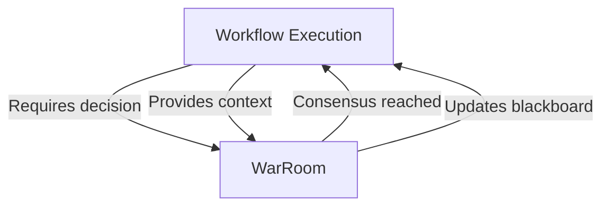

# War Room Collaboration Architecture

**Status:** Current
**Domain:** Workflow / Collaboration

---

## 1. Overview

The War Room is a multi-agent collaboration framework designed to handle high-uncertainty or high-impact decisions where a single agent's reasoning might be insufficient. It provides a structured environment for agents to debate, share evidence, and reach a consensus through a formal sign-off process.

Common use cases:
- **Implementation Planning**: Aligning an architect and a senior developer on a complex refactor
- **Merge Conflict Resolution**: Orchestrating multiple agents to resolve cross-module conflicts
- **Failure Analysis**: Investigating a systemic crash with specialized diagnostic agents
- **Architecture Review**: Multi-stakeholder evaluation of proposed system changes

## 2. Core Concepts

### 2.1 The Session

A `WarRoomSession` is the unit of collaboration. It is typically anchored to a `WorkflowRun` and has a specific objective (e.g., "Align on Database Schema").

**Session States:**
- `open` - Active collaboration in progress
- `closed` - Session completed or terminated

**Consensus States:**
- `collecting_input` - Initial state, gathering participant input
- `draft_ready` - Draft proposal available for review
- `partial_signoff` - Some participants have signed off
- `consensus_reached` - All required participants approved
- `deadlocked` - Unable to reach consensus
- `ceo_tie_break_applied` - CEO agent made final decision

### 2.2 Participants

Agents are invited to a session as participants. Each participant has:
- **Role**: `moderator`, `expert`, `observer`, or `contributor`
- **Profile**: Associated agent profile
- **Permissions**: Based on role and session configuration

Participants can:
- Post messages to the session thread
- Update the shared blackboard
- Submit sign-offs (approve/reject/abstain)
- View session history and artifacts

### 2.3 The Blackboard

The Blackboard is a shared state object where the current "best version" of a proposal or plan is stored. It's implemented as a versioned JSON document that participants can update.

**Blackboard Features:**
- Version history tracking
- Structured data storage
- Concurrent update handling
- Change notifications

### 2.4 Sign-offs

Consensus is achieved when all required participants have submitted a `signoff`. A sign-off can be:
- `approved` - Participant agrees with the proposal
- `rejected` - Participant disagrees (with feedback)
- `abstain` - Participant chooses not to vote

**Sign-off Requirements:**
- Configurable per session (e.g., unanimous, majority, quorum)
- Can require specific roles to sign off
- Supports escalation paths for deadlocks

## 3. Collaboration Flow



## 4. Key Services

### 4.1 `WarRoomService`

The primary facade for managing collaboration lifecycle. Located in `apps/api/src/war-room/war-room.service.ts`.

**Core Methods:**
- `openSession(params)` - Create a new war room session
- `inviteParticipant(params)` - Add agent to session
- `postMessage(params)` - Add message to session thread
- `updateBlackboard(params)` - Update shared state
- `submitSignoff(params)` - Submit approval/rejection
- `getState(params)` - Retrieve session state
- `closeSession(params)` - End session
- `listSessionsByRun(params)` - List sessions for workflow run

### 4.2 `WarRoomConsensusService`

Evaluates sign-offs against a project-defined consensus policy.

**Consensus Policies:**
- `unanimous` - All participants must approve
- `majority` - Majority of participants approve
- `quorum` - Minimum number of approvals required
- `moderator_approval` - Moderator can approve unilaterally
- `ceo_tie_break` - CEO agent can break deadlocks

### 4.3 `WarRoomBlackboardService`

Manages the versioned history of the shared blackboard.

**Features:**
- Version control for blackboard state
- Change tracking and diffing
- Concurrent update resolution
- Rollback capabilities

### 4.4 `WarRoomEventLogService`

Integrates with workflow event logging to maintain audit trail.

## 5. Data Model

### 5.1 `agent_war_room_sessions`

| Column | Type | Description |
|--------|------|-------------|
| `id` | uuid PK | Auto-generated |
| `session_id` | string (unique) | Human-readable session ID |
| `project_id` | varchar | Associated project (nullable) |
| `workflow_run_id` | string | Parent workflow run |
| `work_item_id` | varchar | Associated work item (nullable) |
| `status` | enum | `open`, `closed` |
| `consensus_state` | enum | Current consensus state |
| `created_by_execution_id` | varchar | Agent that created session |
| `moderator_profile` | string | Default: `ceo-agent` |
| `resolution_type` | enum | How session was resolved |
| `resolution_note` | text | Explanation of resolution |
| `metadata` | jsonb | Additional session data |
| `opened_at`, `closed_at` | timestamptz | Timestamps |

### 5.2 `agent_war_room_participants`

| Column | Type | Description |
|--------|------|-------------|
| `id` | uuid PK | Auto-generated |
| `session_id` | uuid FK | Parent session |
| `agent_profile` | string | Agent profile name |
| `role` | string | `moderator`, `expert`, `observer`, `contributor` |
| `participation_status` | enum | `invited`, `active`, `declined`, `left`, `removed` |
| `invited_by` | varchar | Who invited them |
| `joined_at`, `left_at` | timestamptz | Timestamps |

### 5.3 `agent_war_room_messages`

| Column | Type | Description |
|--------|------|-------------|
| `id` | uuid PK | Auto-generated |
| `session_id` | uuid FK | Parent session |
| `sender` | string | Agent profile name |
| `content` | text | Message content |
| `type` | enum | `message`, `system`, `action` |
| `metadata` | jsonb | Additional data |
| `created_at` | timestamptz | Timestamp |

### 5.4 `agent_war_room_blackboards`

| Column | Type | Description |
|--------|------|-------------|
| `id` | uuid PK | Auto-generated |
| `session_id` | uuid FK | Parent session |
| `version` | integer | Version number |
| `state` | jsonb | Blackboard state |
| `updated_by` | string | Agent who updated |
| `created_at` | timestamptz | Timestamp |

### 5.5 `agent_war_room_signoffs`

| Column | Type | Description |
|--------|------|-------------|
| `id` | uuid PK | Auto-generated |
| `session_id` | uuid FK | Parent session |
| `participant_id` | uuid FK | Participant who signed |
| `status` | enum | `approved`, `rejected`, `abstain` |
| `reason` | text | Explanation |
| `metadata` | jsonb | Additional data |
| `created_at` | timestamptz | Timestamp |

## 6. API Endpoints

All war room endpoints are under `/api/war-room/` (internal service).

### 6.1 Session Management

```http
POST /api/war-room/sessions
{
  "workflowRunId": "run-123",
  "goal": "Refactor authentication module",
  "participants": ["architect-agent", "senior-dev-agent"],
  "consensusPolicy": "unanimous"
}
```

```http
POST /api/war-room/sessions/:id/participants
{
  "agentProfile": "qa-agent",
  "role": "expert"
}
```

### 6.2 Collaboration

```http
POST /api/war-room/sessions/:id/messages
{
  "sender": "architect-agent",
  "content": "Proposed new auth flow...",
  "type": "message"
}
```

```http
PATCH /api/war-room/sessions/:id/blackboard
{
  "state": {
    "proposalVersion": 2,
    "includesMigrationPlan": true,
    "riskLevel": "medium"
  }
}
```

```http
POST /api/war-room/sessions/:id/signoffs
{
  "participantId": "dev-123",
  "status": "approved",
  "reason": "Migration plan addresses my concerns"
}
```

### 6.3 Query

```http
GET /api/war-room/sessions/:id
GET /api/war-room/sessions/:id/messages
GET /api/war-room/sessions/:id/blackboard
GET /api/war-room/sessions/:id/signoffs
GET /api/war-room/workflow-runs/:runId/sessions
```

## 7. Metadata and Observability

Every War Room event is recorded in the `event_ledger` and linked to the parent `WorkflowRun`. This provides:

- **Complete audit trail**: Who said what, when, and why
- **Decision history**: How consensus was reached
- **Accountability**: Clear record of participant involvement
- **Replay capability**: Reconstruct session state at any point

**Event Types:**
- `war_room.session.opened`
- `war_room.session.closed`
- `war_room.message.posted`
- `war_room.blackboard.updated`
- `war_room.signoff.submitted`
- `war_room.consensus.reached`
- `war_room.participant.invited`

## 8. Integration with Workflows

### 8.1 Triggering War Rooms

War rooms can be triggered automatically:

- **Workflow step**: `war_room` special step type
- **Manual trigger**: From workflow run UI
- **Automatic**: Based on failure conditions or complexity thresholds

### 8.2 Workflow Integration Points



### 8.3 Special Step: `war_room`

Workflows can invoke war rooms as a special step:

```yaml
steps:
  - type: war_room
    goal: "Resolve architecture decision"
    participants:
      - architect-agent
      - senior-dev-agent
    consensusPolicy: unanimous
    timeout: 3600  # 1 hour
```

## 9. Consensus Algorithms

### 9.1 Unanimous

All active participants must approve. Any rejection or abstention blocks consensus.

**Use case**: Critical architectural decisions

### 9.2 Majority

More than 50% of participants must approve. Abstentions count as non-votes.

**Use case**: General implementation decisions

### 9.3 Quorum

Minimum number of approvals required (configurable). Can be combined with role requirements.

**Use case**: Decisions requiring specific expertise

### 9.4 Moderator Approval

Session moderator can approve unilaterally (with or without participant input).

**Use case**: Time-sensitive decisions, tie-breaking

### 9.5 CEO Tie-Break

CEO agent can break deadlocks when consensus cannot be reached.

**Use case**: Impasse resolution

## 10. Conflict Resolution

### 10.1 Deadlock Detection

System detects deadlock conditions:
- No progress after timeout period
- Repeated rejections without compromise
- Participants leaving without resolution

### 10.2 Escalation Paths

1. **Time-based escalation**: After timeout, escalate to higher authority
2. **Role-based escalation**: Require additional participant roles
3. **CEO intervention**: CEO agent makes final decision
4. **Workflow rollback**: Return to previous state and try alternative

### 10.3 Compromise Mechanisms

- **Blackboard iteration**: Refine proposal based on feedback
- **Alternative proposals**: Multiple options can be tracked
- **Partial consensus**: Agree on subset of issues
- **Delegation**: Assign decision to smaller group

## 11. Security and Access Control

### 11.1 Authentication

All war room API endpoints require authentication via JWT tokens.

### 11.2 Authorization

- **Session creation**: Requires `war_room.create` permission
- **Participant management**: Moderator or creator only
- **Message posting**: Active participants only
- **Blackboard updates**: Configurable by role
- **Sign-off submission**: Invited participants only

### 11.3 Data Isolation

- Sessions isolated by project/workflow
- Participants can only access sessions they're invited to
- Audit logs capture all access attempts

## 12. Best Practices

### 12.1 Session Design

- **Clear objectives**: Define specific, measurable goals
- **Right participants**: Include necessary expertise and stakeholders
- **Time limits**: Set reasonable timeouts to prevent indefinite sessions
- **Consensus policy**: Choose appropriate policy for decision type

### 12.2 Facilitation

- **Active moderation**: Guide discussion toward resolution
- **Documentation**: Keep blackboard updated with key decisions
- **Communication**: Encourage open, respectful dialogue
- **Follow-up**: Ensure decisions are implemented

### 12.3 Integration

- **Workflow alignment**: Ensure war room outputs integrate with workflow
- **Context preservation**: Provide complete context to participants
- **Result propagation**: Automatically apply decisions to workflow state
- **Feedback loops**: Learn from war room outcomes

## 13. Performance Considerations

- **Message volume**: Implement pagination for large message threads
- **Blackboard size**: Limit blackboard state complexity
- **Participant count**: Optimal 3-7 participants per session
- **Session duration**: Typical sessions 15-60 minutes

## 14. Future Enhancements

- **Real-time collaboration**: Live editing of blackboard
- **Voting mechanisms**: Formal voting systems
- **AI facilitation**: AI-assisted moderation and summarization
- **Integration with external tools**: Slack, Jira, etc.
- **Advanced analytics**: Session outcome prediction and optimization

## 15. Related Files

- `apps/api/src/war-room/war-room.service.ts` - Main service
- `apps/api/src/war-room/war-room.service.consensus.ts` - Consensus logic
- `apps/api/src/war-room/war-room.service.state.ts` - State management
- `apps/api/src/database/entities/agent-war-room-*.entity.ts` - Database entities
- `apps/api/src/workflow/workflow-special-steps/` - War room special step integration

## 16. Example: Architecture Review War Room

```typescript
// Create war room for architecture decision
const session = await warRoomService.openSession({
  workflowRunId: 'run-123',
  goal: 'Choose authentication architecture for v2',
  participants: [
    { agentProfile: 'architect', role: 'moderator' },
    { agentProfile: 'senior-dev', role: 'expert' },
    { agentProfile: 'security-expert', role: 'expert' }
  ],
  consensusPolicy: 'majority',
  timeout: 7200  // 2 hours
});

// Participants discuss and update blackboard
await warRoomService.postMessage({
  sessionId: session.id,
  sender: 'architect',
  content: 'Proposing JWT-based auth with refresh tokens...'
});

await warRoomService.updateBlackboard({
  sessionId: session.id,
  state: {
    proposal: 'JWT with refresh tokens',
    pros: ['stateless', 'scalable'],
    cons: ['token revocation complexity'],
    risk: 'medium'
  }
});

// Submit sign-offs
await warRoomService.submitSignoff({
  sessionId: session.id,
  participantId: 'senior-dev',
  status: 'approved',
  reason: 'Addresses scalability concerns'
});

// Check consensus
const state = await warRoomService.getState(session.id);
if (state.consensusState === 'consensus_reached') {
  // Apply decision to workflow
  console.log('Decision:', state.blackboard.proposal);
}
```