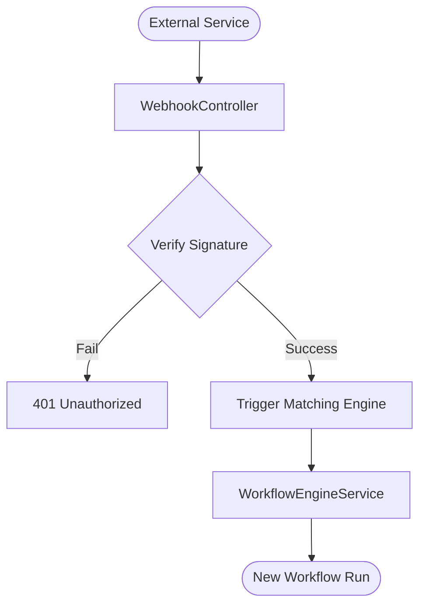

# Webhook Architecture

**Status:** Current
**Domain:** Ingress / Automation

---

## 1. Overview

The Webhook system provides a mechanism for external services (e.g., GitHub, Kanban boards, CI/CD pipelines) to trigger workflows in the Nexus Orchestrator. It acts as an ingress gateway that authenticates incoming requests and maps them to the internal `WorkflowStatus.EVENT` trigger system.

## 2. Webhook-to-Workflow Flow

## 3. Endpoints

### 3.1 `POST /api/webhooks/kanban`
Dedicated endpoint for Kanban status changes and ticket updates.
- **Event Mapping**: Uses `payload.event` or defaults to `kanban.event`.

### 3.2 `POST /api/webhooks/github`
Dedicated endpoint for GitHub events (push, pull_request, etc.).
- **Event Mapping**: Uses `payload.event` or defaults to `github.event`.

### 3.3 `POST /api/webhooks/:workflow_id`
Generic endpoint to trigger a specific workflow by its ID.

## 4. Security and Authentication

The system uses HMAC-SHA256 signature verification.
- **Header**: `x-nexus-signature` or `x-hub-signature-256`.
- **Secret**: Configured via the `WEBHOOK_SECRET` environment variable.

Any request with a missing or invalid signature is rejected with a `401 Unauthorized` status.

## 5. Trigger Matching Logic

When a webhook is received, the `WebhookController` calls `triggerMatchingWorkflows`:
1.  **Event Normalization**: The incoming `event` string is used to scan the `Workflow` database for triggers of type `webhook`.
2.  **Condition Evaluation**: (Future) Optional payload-based conditions can be evaluated to further filter which workflows are triggered.
3.  **Payload Injection**: The entire webhook body is injected into the workflow's state variables as `trigger.*`.

---

## 6. Related Files

- `apps/api/src/webhooks/webhook.controller.ts`
- `apps/api/src/workflow/workflow-event-trigger.service.ts`
- `apps/api/src/workflow/workflow-engine.service.ts`
