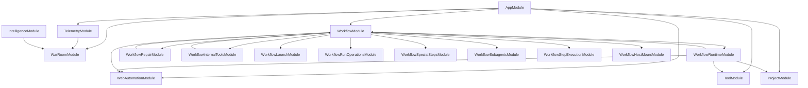

# Workflow Module Decomposition

## Summary

The workflow area is decomposed into a slimmed core `WorkflowModule`, focused workflow submodules, and top-level modules for domains that no longer need to live under `workflow/`.

This split is a structural refactor. HTTP contracts, workflow event names, database entities, runtime tool names, capability names, and existing behavior are preserved.

## Target Module Shape



## Module Responsibilities

| Module | Location | Responsibility |
|---|---|---|
| `WorkflowModule` | `apps/api/src/workflow/` | Core workflow engine, parser, validation, persistence, state, DAG resolution, core workflow controllers, event log, triggers, lifecycle listeners, and shared domain ports. |
| `WorkflowLaunchModule` | `apps/api/src/workflow/workflow-launch/` | Workflow launch API, launch request contract, and launch orchestration helpers. |
| `WorkflowRunOperationsModule` | `apps/api/src/workflow/workflow-run-operations/` | Run-facing API, run steering, run todo management, run workspace/read-model views, question idle tracking, browser cleanup, reconciliation, and run request contracts. |
| `WorkflowSpecialStepsModule` | `apps/api/src/workflow/workflow-special-steps/` | Special step registry, special step executor, built-in special step handlers, and special step plugin loading. |
| `WorkflowSubagentsModule` | `apps/api/src/workflow/workflow-subagents/` | Subagent provisioning, coordination, lifecycle events, execution reaping, agent communication mesh, and mesh delegation. |
| `WorkflowStepExecutionModule` | `apps/api/src/workflow/workflow-step-execution/` | Workflow step queue consumer, step execution orchestration, agent container execution, step support helpers, retry policy, and step event publishing. |
| `WorkflowHostMountModule` | `apps/api/src/workflow/workflow-host-mount/` | Host mount resolution, audit, startup validation, preflight helpers, and runtime diagnostics. |
| `WorkflowRuntimeModule` | `apps/api/src/workflow/workflow-runtime/` | Agent-facing runtime capability discovery/execution, runtime controllers, browser runtime actions, orchestration runtime actions, publish-specs runtime actions, and runtime tool formatting/contracts. |
| `WorkflowRepairModule` | `apps/api/src/workflow/workflow-repair/` | Failure evidence collection, failure classification, repair policy, repair delegation dispatch, and repair completion listeners. |
| `WorkflowInternalToolsModule` | `apps/api/src/workflow/workflow-internal-tools/` | Internal tool adapter classes, grouped tool handlers, and the `INTERNAL_TOOL_HANDLER` factory provider. |
| `WebAutomationModule` | `apps/api/src/web-automation/` | Browser automation execution, Playwright driver, session store, selector resolution, retry policy, and failure artifact persistence/querying. |
| `WarRoomModule` | `apps/api/src/war-room/` | War-room session lifecycle, participants, messages, blackboard, signoff/consensus, and a local event-log port. |

## Boundary Rules

1. `WebAutomationModule` must not import `WorkflowModule`; workflow consumes its exported executor/session/artifact services.
2. `WarRoomModule` must not import `WorkflowModule`; it uses a local `WAR_ROOM_EVENT_LOG_PORT` implementation for workflow event logging behavior.
3. Workflow submodules may import `WorkflowModule` with `forwardRef` only when they still need core engine services. Prefer importing the narrow owning submodule instead.
4. Generic tool infrastructure lives in `apps/api/src/tool/`; workflow-specific tool adapters live in `WorkflowInternalToolsModule`.
5. New workflow-adjacent providers should not be added directly to `WorkflowModule` unless they are core engine infrastructure or cannot fit an existing submodule.

## Known Follow-Up Opportunities

The root `WorkflowModule` now keeps the core engine seam. Remaining candidates for later extraction are smaller and should be planned separately:

1. Core lifecycle/eventing listeners and internal domain/core-run controllers.
2. Trigger registry/event trigger infrastructure.
3. Work item planning artifact helpers and projections.
4. Core engine internals such as parser, validation, state, DAG resolution, and persistence, only if a later core-engine split is explicitly planned.

These remain in the root workflow module to avoid changing behavior or broadening circular dependencies during the structural decomposition.

## Cross-Module Dependencies

### Tool and Capability Flow

```mermaid
flowchart LR
    Provider[Capability Provider] -->|@Capability decorator| Registry[CapabilityRegistryService]
    Registry -->|builds| Manifest[Capability Manifest]
    Manifest -->|registers| ToolReg[ToolRegistryService]
    ToolReg -->|creates| Tool[Tool Registry Entry]
    Tool -->|exposed via| Runtime[WorkflowRuntimeCapabilityExecutorService]
    Runtime -->|governed by| Policy[ToolPolicyEvaluatorService]
    Policy -->|checks| Rules[ToolApprovalRuleService]
    Runner[Pi Runner] -->|wraps tools| Governance[/check-permission/]
    Governance -->|evaluates| Runtime
```

### Special Steps vs. Capabilities

- **Capabilities**: Declared via `@Capability`, registered at startup, available for workflow execution
- **Special Steps**: Core or plugin handlers, registered in `StepSpecialStepRegistryService`, invoked during workflow execution
- **Steering Tools**: Implemented as special steps (`amend_entity`), workflow services (`steer_project`), or explicit Kanban-owned MCP tools (`kanban.project_state`)

## Module Communication

Modules communicate through:

1. **NestJS Dependency Injection**: Services inject each other via constructor
2. **Event Emitter**: `EventEmitter2` for cross-domain events
3. **Event Ledger**: `EventLedgerService` for audit trails
4. **Database**: Shared entities and repositories
5. **Internal APIs**: Controller-to-controller calls within the API app

## Testing Boundaries

Each module has its own test suite:

- Unit tests for individual services
- Integration tests for module boundaries
- E2E tests for workflow execution
- Contract tests for API endpoints

See individual module README files for testing guidelines.
