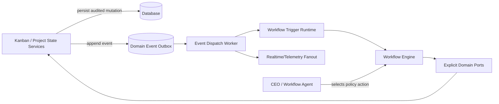

# EPIC-172: Workflow Boundary, Eventing, and Orchestration Authority Refactor

Status: Proposed
Priority: P1
Created: 2026-05-14
Last Updated: 2026-05-14
Owner: Workflow Platform + Kanban Platform
Depends On: EPIC-088, EPIC-090, EPIC-123, EPIC-124, EPIC-147, EPIC-148, EPIC-170, EPIC-171
Related Analysis:
- `docs/analysis/ANALYSIS-codebase-review-2026-04-25.md`
- `docs/analysis/ANALYSIS-kanban-hardcoded-vs-workflow.md`
- `docs/analysis/2026-05-13-project-3427e5e9-epic-170-orchestration-failure.md`
- Refactor scan performed 2026-05-14

---

## 1. Summary

This epic removes fragile architecture seams that currently hide coupling between workflow, project, kanban, and eventing concerns. It focuses on three related issues:

1. `WorkflowKernelModule` uses dynamic proxy service-locator behavior instead of explicit ports.
2. Workflow and Project modules remain coupled through circular dependencies and broad service reach-through.
3. Correctness-critical domain events rely on in-process `EventEmitter2`, which is unsafe for multi-replica deployments and restart recovery.

The desired architecture is explicit: Kanban/project services persist state and emit facts; workflow services orchestrate durable process execution; agents/workflows own policy decisions; API services enforce authorization, safety, persistence, and audit invariants.

---

## 2. Problem Statement

The codebase has made significant progress toward workflow-driven orchestration, but key boundaries are still porous. Some modules appear decoupled because dependency lookup is hidden behind global proxies or `forwardRef`, not because ownership is clean. In addition, event-driven behavior is built on local process memory, making it unreliable when the app runs more than one API instance or restarts between event emission and handling.

These issues block reliable scale-out and make future refactors risky:

- Missing providers can become `undefined` at runtime instead of failing fast.
- Module import cycles make tests difficult and encourage broad service injection.
- Hardcoded lifecycle/status policy still leaks into API/web/telemetry code.
- Event consumers can miss correctness-critical events outside a single process.

---

## 3. Evidence and Affected Files

### 3.1 Dynamic proxy service locator in workflow kernel

File:

- `apps/api/src/workflow/kernel/workflow-kernel.module.ts`

Current behavior:

- Marked `@Global()`.
- Uses `ModuleRef.get(..., { strict: false })`.
- Returns dynamic `Proxy` instances.
- Uses `(service as any)[prop]` to forward calls.
- Catches resolution errors and returns `undefined`.

Affected tokens/classes:

- `WORKFLOW_ENGINE_SERVICE`
- `WORKFLOW_PARSER_SERVICE`
- `STATE_MACHINE_SERVICE`
- `WORKFLOW_PERSISTENCE_SERVICE`
- `WorkflowEngineService`
- `WorkflowParserService`
- `StateMachineService`
- `WorkflowPersistenceService`

Why this is a problem:

- Hides real dependency graph.
- Bypasses TypeScript checks.
- Converts composition errors into runtime `undefined` behavior.
- Makes module boundary tests less meaningful.

### 3.2 Workflow and Project circular dependency

Prior analysis identified `WorkflowModule ↔ ProjectModule` coupling, commonly mediated by `forwardRef()`. This indicates that orchestration, mutation, and persistence responsibilities are not cleanly separated.

Likely affected areas include:

- `apps/api/src/workflow/**`
- `apps/api/src/project/**`
- `apps/api/src/workflow/domain-ports/**`
- `apps/api/src/project/work-items/**`
- `apps/api/src/project/amend-entity.service.helpers.ts`
- `apps/api/src/workflow/workflow-special-steps/step-amend-entity-special-step.handler.ts`

### 3.3 In-process EventEmitter2 usage

Search found `EventEmitter2` in many correctness-sensitive services, including:

- `apps/api/src/automation/automation-hooks.service.ts`
- `apps/api/src/capability-governance/tool-call-approval-request.service.ts`
- `apps/api/src/operations/doctor-repair-delegation.listener.ts`
- `apps/api/src/telemetry/telemetry.gateway.ts`
- `apps/api/src/workflow/workflow-engine.service.ts`
- `apps/api/src/workflow/workflow-event-trigger.service.ts`
- `apps/api/src/workflow/workflow-internal-core-runs.service.ts`
- `apps/api/src/workflow/workflow-internal-domain-events.service.ts`
- `apps/api/src/workflow/workflow-repair/sysadmin-repair-completion.listener.ts`

Problem:

`EventEmitter2` is process-local. A domain event emitted by one replica is invisible to another. If the emitting process crashes before all handlers run, the event can be lost.

### 3.4 Remaining hardcoded process/status policy

Even after EPIC-148 and EPIC-170 direction, scan found local hardcoded policy/status groupings:

- `apps/api/src/telemetry/telemetry-gateway-compat.helpers.ts`
  - `DISPATCH_ACTIVE_STATUSES = ['active', 'paused', 'on-hold', 'queued']`
- `apps/web/src/pages/project-workspace/SessionsTab.tsx`
  - Local `ACTIVE_STATUSES` set used to badge/filter active work.
- `apps/api/src/workflow/workflow-subagents/mesh-delegation.service.types.ts`
  - `MESH_DELEGATION_ACTIVE_STATUSES`
- `apps/api/src/workflow/workflow-subagents/mesh-delegation-dispatch.service.ts`
  - Uses mesh active statuses directly during dispatch selection.

These may be valid defaults, but should be surfaced as canonical lifecycle policy metadata rather than repeated local status arrays.

### 3.5 Kanban/API boundary correction and current Core communication

Follow-up inspection clarified an important boundary point: the current Kanban app is not simply proxying work-item CRUD to the API in the inspected paths. Kanban owns Kanban project/work-item persistence and mutation logic through its own repositories and services, for example:

- `apps/kanban/src/project/project.service.ts`
- `apps/kanban/src/work-item/work-item.service.ts`
- `apps/kanban/src/database/repositories/kanban-work-item.repository.ts`
- `apps/kanban/src/database/repositories/kanban-project.repository.ts`

The cross-service communication that does exist is mostly appropriate in kind, but too broad in shape. `apps/kanban/src/core/core-workflow-client.service.ts` is the main bridge to Core/API. It currently handles multiple concerns:

| Concern | Current method/path | Boundary assessment |
| --- | --- | --- |
| Workflow launch | `requestWorkflowRun()` | Correct for Kanban to call workflow runtime, but should be behind a narrow workflow-run client port. |
| Workflow status/control | `getWorkflowRunStatus()`, `controlWorkflowRun()`, `cancelWorkflowRunsByScope()` | Correct cross-service dependency, but should not live in a god client. |
| Secret retrieval | `retrieveSecret()` calling `/internal/secrets/retrieve` | Potentially valid platform dependency, but should be a separate secret client with explicit authorization scope. |
| Event ledger | `emitEventLedger()` calling `/events/internal` | Valid observability integration, but should be separated from workflow operations. |
| Domain events | `emitDomainEvent()` calling `/internal/kanban/events` | Correct direction for Kanban facts to wake workflow/Core, but should be durable and explicit. |
| Internal auth | `resolveCoreJwtToken()` signs service JWTs directly | Should move to an internal service auth token provider and share EPIC-171 config hardening. |

The architectural problem is therefore not "Kanban talks to API". Kanban should communicate with API/Core for workflow execution, event ingestion, secrets, and platform observability. The problem is that one broad client mixes transport, JWT construction, workflow operations, secret retrieval, event ledger writes, and domain event publishing. That makes ownership harder to reason about and can cause partial failure modes, e.g. Kanban persists a status change but best-effort HTTP domain event emission fails.

The desired boundary is:

1. Kanban owns Kanban domain logic, persistence, status mutation safety, project/work-item/goals state, and Kanban MCP tools.
2. API/Core owns workflow runtime execution, workflow run status/control, secret vault access, event ingestion, and platform event ledger storage.
3. Kanban communicates with API/Core through narrow ports with explicit names and retry/durability semantics.
4. Kanban domain events that wake workflows must not be silent best-effort side effects when they are correctness-critical.

---

## 4. Goals

1. Replace workflow kernel dynamic proxies with explicit provider bindings and typed ports.
2. Remove or sharply reduce WorkflowModule ↔ ProjectModule circular dependency usage.
3. Introduce a durable domain event bus abstraction for correctness-critical events.
4. Keep `EventEmitter2` only as optional local fanout for non-critical telemetry/UI notifications.
5. Move remaining status/policy groupings into canonical policy metadata consumed by API and web.
6. Ensure workflow/agent orchestration remains the policy authority while services enforce safety and persistence.
7. Split Kanban-to-Core communication into narrow ports so Kanban keeps Kanban ownership while Core/API dependencies are explicit.

---

## 5. Non-Goals

1. Do not rewrite the workflow engine from scratch.
2. Do not remove all EventEmitter2 usage in one pass if local telemetry use remains appropriate.
3. Do not move safety invariants into prompts or agents.
4. Do not reintroduce scheduler-owned dispatch authority superseded by EPIC-170.
5. Do not create a broad generic policy engine before explicit event/boundary seams are stable.

---

## 6. Target Architecture



Boundary rules:

1. Kanban/project services are state stores and mutation guards.
2. Workflow services own durable execution.
3. Agents/workflows select orchestration strategy.
4. Domain events are durable before they are delivered.
5. UI consumes projections and canonical policy metadata, not copied process rules.
6. Kanban-to-Core calls are named capabilities, not a single broad god client.

---

## 7. Implementation Tasks

### Task 1: Replace WorkflowKernelModule proxy bindings

- Define explicit TypeScript interfaces for workflow kernel ports.
- Bind concrete services with normal Nest providers.
- Remove `Proxy`, `ModuleRef.get(... strict: false)`, and `(service as any)[prop]` from `WorkflowKernelModule`.
- Add composition tests proving providers fail fast if a required binding is missing.

Affected file:

- `apps/api/src/workflow/kernel/workflow-kernel.module.ts`

Likely related files:

- `apps/api/src/workflow/kernel/interfaces/workflow-kernel.ports.ts`
- `apps/api/src/workflow/workflow-engine.service.ts`
- `apps/api/src/workflow/workflow-parser.service.ts`
- `apps/api/src/workflow/state-machine.service.ts`
- `apps/api/src/workflow/workflow-persistence.service.ts`

### Task 2: Continue domain-port extraction between Workflow and Project

- Inventory all `forwardRef` usage between project/workflow modules.
- Create narrow ports for project operations workflow needs.
- Bind adapters in a composition module rather than importing full modules both ways.
- Ensure `amend_entity` and status mutation paths call stable domain operations rather than reaching into implementation services.

Candidate ports:

- `WorkItemMutationPort`
- `ProjectStateQueryPort`
- `WorkItemExecutionLinkPort`
- `ProjectEventPublisherPort`

### Task 3: Introduce durable domain event bus abstraction

Create a port such as:

```ts
export interface DomainEventBus {
  publish(event: DomainEventEnvelope): Promise<void>;
  publishAll(events: DomainEventEnvelope[]): Promise<void>;
}
```

Implement initial adapters:

1. `InProcessDomainEventBus` for tests/local non-critical use.
2. `OutboxDomainEventBus` for correctness-critical events.

### Task 3A: Split Kanban Core client into explicit ports

Refactor `apps/kanban/src/core/core-workflow-client.service.ts` into narrow interfaces/adapters. Suggested ports:

- `WorkflowRunClient`
- `WorkflowRunControlClient`
- `CoreSecretClient`
- `CoreEventLedgerClient`
- `KanbanDomainEventPublisher`
- `InternalServiceAuthTokenProvider`

Update current consumers so each receives only the capability it needs:

- `apps/kanban/src/work-item/work-item.service.ts` should depend on workflow launch/status ports and domain event publisher, not a broad Core client.
- `apps/kanban/src/dispatch/dispatch.service.ts` should depend on workflow run and orchestration/domain event ports.
- `apps/kanban/src/work-item/kanban-lifecycle-event-publisher.ts` should depend on `KanbanDomainEventPublisher`.
- `apps/kanban/src/project/managed-project-clone.service.ts` should depend on `CoreSecretClient` if it needs secret retrieval.

This task should preserve the correct product boundary: Kanban owns Kanban state and logic; API/Core owns workflow runtime, secrets, event ingestion, and event ledger persistence.

The outbox should record:

- event id
- event type
- aggregate id/type
- payload
- correlation id
- causation id
- occurred at
- delivery status
- attempt count
- last error

### Task 4: Migrate correctness-critical event publishers

Prioritize publishers that drive workflow state or orchestration:

- `workflow-engine.service.ts`
- `workflow-event-trigger.service.ts`
- `workflow-internal-core-runs.service.ts`
- `workflow-internal-domain-events.service.ts`
- work item status/event publishing paths under `apps/api/src/project/**`
- orchestration wakeup/request paths related to EPIC-170

### Task 5: Keep local fanout as adapter behavior

Where WebSocket updates or local telemetry are useful, subscribe to durable events or have the durable bus invoke local fanout after persistence. Do not let local fanout be the only copy of a correctness-critical event.

### Task 6: Canonicalize lifecycle/status policy metadata

Move or expose canonical status grouping metadata for:

- dispatch-active statuses
- mesh delegation active statuses
- UI active session statuses
- terminal statuses
- blocked/paused statuses

Candidate locations:

- `packages/core/src/schemas/**`
- `packages/core/src/interfaces/**`
- workflow policy definitions already introduced by EPIC-148/EPIC-170

Update consumers:

- `apps/api/src/telemetry/telemetry-gateway-compat.helpers.ts`
- `apps/web/src/pages/project-workspace/SessionsTab.tsx`
- `apps/api/src/workflow/workflow-subagents/mesh-delegation.service.types.ts`
- `apps/api/src/workflow/workflow-subagents/mesh-delegation-dispatch.service.ts`

---

## 8. Testing Strategy

1. Unit tests for explicit workflow kernel bindings.
2. Import-boundary tests preventing workflow/project implementation imports where ports should be used.
3. Event bus contract tests shared by in-process and outbox adapters.
4. Crash/retry tests for outbox delivery worker.
5. Multi-instance simulation test: event published by one logical app instance is consumed by another.
6. Regression tests proving UI/API status groupings come from canonical metadata, not local hardcoded arrays.

---

## 9. Dependencies and Sequencing

1. EPIC-171 should land first so runtime secrets/config are reliable.
2. Replace `WorkflowKernelModule` proxy behavior before adding more ports.
3. Introduce event bus port before migrating all publishers.
4. Migrate highest-risk events first: workflow run status, work item status, orchestration wakeup.
5. Only remove legacy local event behavior after parity tests pass.

---

## 10. Acceptance Criteria

1. `WorkflowKernelModule` no longer uses dynamic `Proxy`, `ModuleRef.get(... strict: false)`, or `(service as any)[prop]` forwarding.
2. Required workflow kernel providers fail fast during module compilation when absent.
3. Workflow-to-project dependencies use explicit ports for at least the status mutation and amend-entity paths.
4. Correctness-critical workflow/work-item/orchestration events are persisted before fanout.
5. Event delivery has retry/attempt tracking and observable failure state.
6. At least one integration test proves workflow triggers can consume an event through the durable bus path.
7. Local hardcoded active-status arrays are removed or replaced by canonical policy metadata.
8. Documentation explains which events may remain in-process-only and why.

---

## 11. Definition of Done

- Architecture boundary tests pass.
- Durable event bus and outbox worker have unit/integration coverage.
- Workflow/project circular dependencies are reduced and documented with remaining exceptions.
- EPIC-170 orchestration wakeup path is compatible with the durable event path.
- No correctness-critical event relies solely on process-local `EventEmitter2`.
- API and web consumers use shared lifecycle metadata where applicable.
