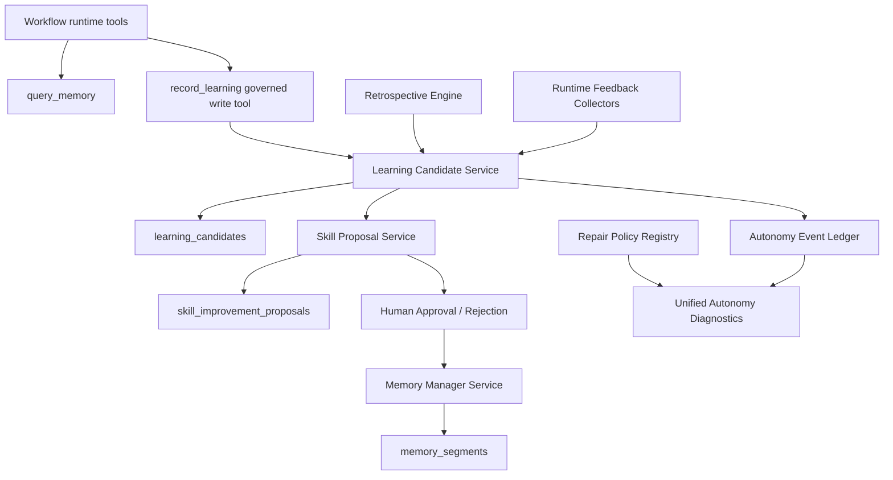

# EPIC-175: Core API Self-Improvement Roadmap

**Status:** Proposed  
**Priority:** P1  
**Created:** 2026-05-16  
**Updated:** 2026-05-16  
**Owner:** Core API / Autonomy  
**Supersedes / clarifies:** EPIC-067, EPIC-084, EPIC-117, EPIC-142, EPIC-144, EPIC-146  
**Child epics:** EPIC-176, EPIC-177, EPIC-178, EPIC-179, EPIC-180

## Summary

This epic is the umbrella roadmap for restoring and deepening Nexus Orchestrator's core API self-improvement loop. The current codebase has strong repair and operations-doctor foundations, but the learning loop is incomplete: learning candidate persistence exists, web clients expect learning/proposal routes, event names exist for learning/proposal activity, and retrospective workflow seeds exist, but the API/runtime seams that make those capabilities real are missing or placeholder-only.

The goal is to make self-improvement a governed, observable core API capability rather than scattered persistence scaffolding, placeholder workflows, and disconnected UI assumptions.

## Why This Epic Exists

Recent work has focused heavily on kanban orchestration. Stepping back to the core API shows that autonomy is currently strongest around failure classification, repair dispatch, and operations diagnostics. The self-improvement side is less complete:

- `query_memory` exists as a runtime tool, but there is no governed runtime writeback tool such as `record_learning`.
- `LearningCandidate` and `SkillImprovementProposal` entities/repositories exist, but the learning/proposal API routes expected by the web client were not found.
- `LearningCandidate` persistence is inconsistent: the entity maps neutral scope data, while the legacy migration created a project-specific column that must be migrated to `scope_type` / `scope_id`.
- `project_retrospective_autorun` is seeded, but only emits an echo checkpoint rather than producing learning candidates or memory updates.
- Observability event names include learning/proposal lifecycle events, but run diagnostics focus primarily on repair classification/delegation.
- Repair policy has useful behavior, but the policy seam is hardcoded and shallow.

This roadmap groups the remaining work into focused implementation epics so future agents can execute without rediscovering the same mismatch.

## Current-State Evidence

### Existing Scaffolding

- `apps/api/src/database/entities/learning-candidate.entity.ts`
- `apps/api/src/database/entities/skill-improvement-proposal.entity.ts`
- `apps/api/src/database/repositories/learning-candidate.repository.ts`
- `apps/api/src/database/repositories/skill-improvement-proposal.repository.ts`
- `apps/api/src/database/migrations/20260413010000-create-learning-candidates-and-skill-improvement-proposals.ts`
- `apps/api/src/database/migrations/20260428100000-add-proposal-diagnostics-json.ts`
- `apps/api/src/database/registered-migrations.ts`
- `apps/api/src/database/database.module.ts`
- `apps/api/src/observability/autonomy-observability.types.ts`
- `seed/workflows/project-retrospective-autorun.workflow.yaml`

### Runtime / API Gaps

- Web client expects `GET /memory/learning/status`, `POST /memory/learning/run`, `GET /memory/learning/candidates`, `GET /skills/proposals`, `GET /skills/proposals/:id/preview`, `POST /skills/proposals/:id/approve`, and `POST /skills/proposals/:id/reject`.
- No matching API controllers/services were found during review.
- `apps/api/src/workflow/workflow-internal-tools/handlers/memory-tools.handler.ts` supports memory query access only.
- `apps/api/src/workflow/workflow-internal-tools/tools/memory/query-memory.tool.ts` exposes the read side of memory, not the governed write side.
- `docs/specs/SDD-autonomous-kanban-product-orchestration.md` still defers `record_learning` / `write_memory` until a governed seam exists.

### Related Historical Epics

- `EPIC-067-memory-driven-learning-and-automated-retrospectives.md` describes intended retrospective learning, but references older project/API shapes and remains proposed.
- `EPIC-084-autonomous-memory-dreaming-and-skill-self-improvement.md` is marked implemented and claims learning/proposal endpoints exist, but current API exploration did not find those routes.
- `EPIC-117-retrospective-checkpoints-and-continuous-learning-cadence.md` describes checkpoint retrospectives, cooldowns, replay, and diagnostics, but current implementation appears limited to a placeholder seed workflow.
- `EPIC-142-skill-proposal-quality-and-governance.md` remains relevant to proposal quality once the missing proposal API and lifecycle are restored.
- `EPIC-144-failure-classification-and-repair-policy.md` is substantially implemented and should now be deepened rather than rebuilt.
- `EPIC-146-autonomy-audit-and-observability.md` provides the observability direction that learning/proposal diagnostics should join.

## Desired Outcomes

- Learning/proposal API contracts exist, are tested, and match the web client.
- Learning candidate persistence has a single canonical scope model.
- Runtime learning writeback is governed, permissioned, auditable, and promotion-gated.
- Retrospective workflows produce structured candidates instead of placeholder echo output.
- Runtime feedback signals become candidates/proposals when they show repeated, actionable patterns.
- Repair policy becomes a deeper seam with a small interface and replaceable policy/adapter implementation.
- Autonomy diagnostics show a unified timeline across learning, proposal, repair, and retrospective events.

## Non-Goals

- Do not bypass human approval for skill changes or high-impact memory promotion.
- Do not let arbitrary workflow steps write directly to long-term memory.
- Do not rewrite the entire memory subsystem before restoring the missing API/runtime seam.
- Do not reintroduce kanban-domain logic into core API modules except through existing contracts/adapters.
- Do not renumber or overwrite older epics; this set supersedes by reference.

## Target Architecture

## Child Epic Breakdown

### EPIC-176: Reality Alignment and Learning API Restoration

Restores the missing user-facing API seam and resolves persistence mismatch. This is the first implementation dependency for most later self-improvement work.

### EPIC-177: Governed Learning Writeback and Runtime Memory Tooling

Adds the runtime writeback seam that lets workflows propose lessons safely without directly polluting memory.

### EPIC-178: Retrospective Engine and Checkpoint Cadence

Replaces the placeholder retrospective workflow with a service-backed engine that can run on completion, checkpoints, and manual replay.

### EPIC-179: Runtime Feedback to Learning Candidates

Turns repeated tool-contract repairs, failure classifications, repair outcomes, QA/review findings, and runtime anomalies into candidates for learning.

### EPIC-180: Repair Policy Deepening and Diagnostics Unification

Deepens the repair policy seam and consolidates repair/learning/proposal/retrospective diagnostics into a coherent run/scope view.

## Sequencing

1. EPIC-176 first: restore schema/API contract and tests.
2. EPIC-177 second: add governed writeback and promotion.
3. EPIC-178 third: make retrospectives produce candidates through the new seam.
4. EPIC-179 fourth: expand candidate sources from runtime signals.
5. EPIC-180 can start after EPIC-176, but diagnostics are most complete after EPIC-177 and EPIC-178 emit real events.

## Cross-Epic Data Contracts

The child epics should converge on these concepts:

- **Learning candidate:** A proposed lesson or improvement signal with scope, source, confidence, evidence, status, and provenance.
- **Skill improvement proposal:** A governed change proposal derived from one or more candidates, with preview, approval, rejection, diagnostics, and audit events.
- **Promotion:** The act of converting an approved candidate/proposal into durable memory or a skill change.
- **Retrospective run:** A replayable and observable analysis pass that produces candidates but does not directly mutate long-term memory without governance.
- **Runtime feedback signal:** A structured anomaly or repeated correction observed during workflow execution, repair, tool validation, review, or QA.

## Acceptance Criteria

- Each child epic has a clear implementation seam, affected files, workstreams, and tests.
- Existing contradictory epics are referenced as historical context without being overwritten.
- The first child epic can be picked up by an implementation agent without needing to re-audit the codebase.
- The roadmap preserves safety: all durable learning writes are governed and auditable.
- The roadmap preserves locality: self-improvement behavior moves into explicit services/modules instead of leaking across workflow, memory, observability, and web clients.

## Open Questions

- Should learning/proposal routes remain global with neutral scope filters, or should scoped routes be added alongside the existing web contract?
- What migration strategy should convert the legacy project-specific column into the canonical `scope_type` / `scope_id` representation?
- Should retrospective run history use a new table immediately, or can it initially be projected from event ledger records?
