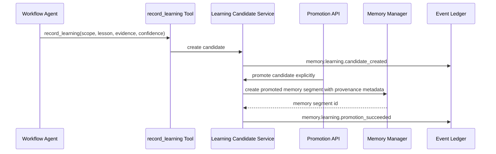

# EPIC-177: Governed Learning Writeback and Runtime Memory Tooling

**Status:** Implemented  
**Priority:** P1  
**Created:** 2026-05-16  
**Updated:** 2026-05-16  
**Owner:** Core API / Workflow Runtime  
**Parent:** EPIC-175  
**Depends on:** EPIC-176  
**Related:** EPIC-067, EPIC-084, EPIC-107, EPIC-146, EPIC-167

## Summary

Introduce a governed learning writeback seam for workflow runtime. Agents and workflows can propose lessons through `record_learning`, but the tool creates learning candidates only. Durable memory writes happen through an explicit promotion trigger with policy checks, provenance metadata, and lifecycle events.

## Problem Statement

The runtime currently has a read-side memory seam through `query_memory`, but no equivalent governed write-side seam. `MemoryManagerService` can create/update/delete/search memory segments internally, yet workflow runtime tools do not expose a safe way to submit lessons. The specs also explicitly defer `record_learning` / `write_memory` until a governed seam exists.

Without this epic, retrospectives and feedback loops have two bad options: do nothing, or write directly to durable memory without policy, provenance, and approval.

## Evidence and Affected Files

- `apps/api/src/workflow/workflow-internal-tools/tools/memory/query-memory.tool.ts`
- `apps/api/src/workflow/workflow-internal-tools/handlers/memory-tools.handler.ts`
- `apps/api/src/memory/memory-manager.service.ts`
- `apps/api/src/workflow/workflow-runtime/workflow-runtime-tools.service.ts`
- `apps/api/src/tool/internal-tool-registry.service.ts`
- `apps/api/src/observability/autonomy-observability.types.ts`
- `docs/specs/SDD-autonomous-kanban-product-orchestration.md`
- `EPIC-167-autonomous-kanban-orchestration-reliability-and-product-management-completeness.md`, WS-8

## Goals

- Add a small runtime-facing `record_learning` tool contract.
- Convert runtime learning submissions into learning candidates, not immediate memory writes.
- Add permission checks so only workflows/profiles with explicit capability can submit learning candidates.
- Capture evidence, confidence, neutral scope identity, source run, source step, and proposed memory content.
- Promote approved learning into durable memory segments through an explicit `POST /memory/learning/promote` trigger.
- Emit lifecycle events for candidate creation, promotion success, and promotion failure.
- Ensure `query_memory` can retrieve approved promoted lessons with citations/provenance.

## Non-Goals

- Do not let untrusted tool calls mutate durable memory directly.
- Do not implement full skill-file patching in this epic; skill proposals are governed through proposal lifecycle and may be expanded separately.
- Do not make low-confidence lessons visible to runtime memory retrieval by default.
- Do not bypass EPIC-176 route/service restoration.

## Target Flow



## Expected Runtime Tool Contract

Initial `record_learning` input should be intentionally narrow:

```json
{
  "scope_type": "workflow_run",
  "scope_id": "workflow-run-or-scope-id",
  "lesson": "Short durable lesson learned from the run.",
  "evidence": [
    {
      "kind": "workflow_run",
      "id": "workflow-run-id",
      "summary": "What happened that supports this lesson."
    }
  ],
  "confidence": 0.82,
  "tags": ["retrospective", "repair", "tooling"]
}
```

The tool returns the candidate ID and status, never a memory segment ID. Duplicate submissions reuse the existing candidate fingerprint. Promotion is a separate explicit operation.

## Implemented Runtime And Promotion APIs

- `POST /api/workflow-runtime/record-learning` validates the runtime body, requires workflow/job context from body or agent token, and dispatches the `record_learning` internal tool through runtime capability governance.
- `record_learning` requires explicit allow-list capability permission. Denied calls return the existing runtime governance denial and do not execute the internal tool.
- Valid calls create or reuse a pending `LearningCandidate`. They do not write durable memory and are not visible through `query_memory`.
- `POST /api/memory/learning/promote` validates `candidate_id` and triggers `LearningPromotionService.promoteCandidate(candidate_id)`.
- Promotion uses `LearningPromotionPolicyService`. The initial policy supports auto-approval semantics for claimable candidates, but it is isolated so thresholds or human gates can replace it later.
- Promotion writes a `fact` memory segment through `MemoryManagerService` and stores provenance in `memory_segments.metadata_json`.

Promotion metadata includes the learning candidate ID, neutral scope, workflow/job/agent provenance, confidence, evidence, tags, and policy decision. A unique partial index prevents duplicate promoted memory segments for the same learning candidate.

## Workstreams

### WS-1: Tool Contract and Registry

- Add `record_learning` internal tool definition.
- Register the tool in the internal tool registry.
- Add capability/allow-list checks consistent with runtime tool policy.
- Add schema validation for confidence, scope, evidence, tags, and lesson length.

### WS-2: Candidate Creation Path

- Implement handler logic that creates learning candidates.
- Deduplicate candidates by stable fingerprint where possible.
- Store provenance from workflow run, step, agent profile, and tool call.
- Emit candidate-created event.

### WS-3: Promotion Path

- Add service method to promote claimable candidates to memory segments.
- Guard promotion by status, scope, confidence, policy, and claim ownership.
- Emit promotion success/failure events.
- Ensure promoted memory includes enough metadata for later citation.

### WS-4: Query Influence

- Ensure promoted lessons can be found by `query_memory`.
- Add tests proving unapproved candidates do not appear in runtime memory retrieval.
- Add prompt/context integration only if an existing context assembly seam already exists.

## Testing Plan

- Tool schema tests reject malformed scope, empty lesson, invalid confidence, invalid evidence, and unknown `project_id` leakage.
- Runtime governance tests prove denied workflows cannot execute `record_learning` and allowed calls go through the capability executor before internal dispatch.
- Handler/service tests prove valid tool calls create or reuse candidates and emit candidate-created events without durable memory writes.
- Promotion tests prove claim ownership, stale-claim recovery, duplicate prevention, sanitized failure events, and provenance metadata.
- Query visibility tests prove pending candidates are not discoverable through `query_memory`, while explicitly promoted lessons are discoverable.

## Acceptance Criteria

- `record_learning` exists as a registered runtime/internal tool with validation and permission checks.
- Tool calls create learning candidates instead of direct durable memory writes.
- Claimable candidates can be explicitly promoted into memory segments with provenance.
- Promotion events are emitted and visible through event ledger/diagnostics.
- Tests prove denied, malformed, duplicate, pending, approved, and failed-promotion paths.

## Dependencies

- Requires EPIC-176's canonical candidate model and service seam.
- Enables EPIC-178 retrospective writeback.
- Enables EPIC-179 runtime feedback ingestion.

## Resolved Decisions

- `record_learning` is available to any workflow/profile with explicit tool allow-list permission.
- Confidence and promotion behavior live behind `LearningPromotionPolicyService` from the start.
- Promotion is explicitly triggered. The initial policy can approve claimable candidates automatically, but runtime `record_learning` never promotes or writes memory directly.
