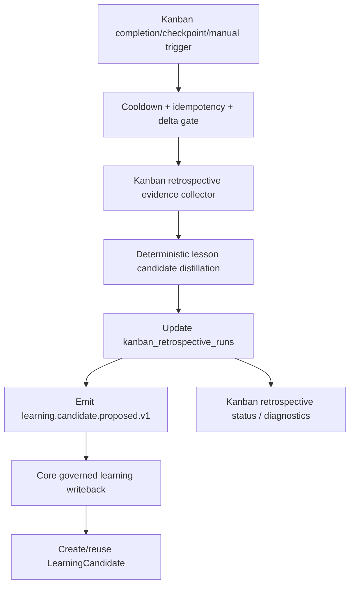

# EPIC-178: Retrospective Engine and Checkpoint Cadence

**Status:** Implemented
**Priority:** P1
**Created:** 2026-05-16
**Updated:** 2026-05-17
**Owner:** Kanban / Core Learning
**Parent:** EPIC-175
**Depends on:** EPIC-176, EPIC-177
**Related:** EPIC-067, EPIC-084, EPIC-117, EPIC-167

## Summary

Replace the placeholder `project_retrospective_autorun` behavior with a Kanban-owned retrospective engine that runs against Kanban orchestration cycles, captures replayable run history, proposes governed learning candidates to Core API, and exposes operations diagnostics.

## Boundary Decision

Project retrospectives are Kanban domain behavior because the subject is a project-management cycle: project goals, work items, orchestration decisions, dispatches, reviews, failures, and repairs. Core API must not model Kanban retrospective runs as first-class persistence.

Kanban owns:

- Retrospective cadence.
- Evidence collection.
- Cooldown, idempotency, and delta gates.
- `kanban_retrospective_runs` persistence.
- Manual replay and diagnostics.

Core API owns:

- The neutral governed learning writeback seam.
- `LearningCandidate` creation/reuse.
- Learning governance and later promotion.

Kanban proposes learning through the neutral retrospective learning candidate proposal event, `learning.candidate.proposed.v1`, sent via the existing `/internal/kanban/events` bridge. Core consumes only that event for retrospective writeback and uses EPIC-177's governed writeback service. Kanban must not call workflow-runtime `record_learning` directly and must not mutate memory or skills directly.

## Problem Statement

At planning time, the repository had strong documentation for automated retrospectives, but the implemented behavior was shallow. The seeded `project_retrospective_autorun` workflow triggered on `ProjectOrchestrationCompletedEvent`, used concurrency scoped to `trigger.scopeId`, and allowed useful tools, but its only job was an echo command: `echo retrospective_event_received_for_{{ trigger.scopeId }}`.

No TypeScript emitter for `ProjectOrchestrationCompletedEvent` was found in Core API during planning. That placeholder acknowledged a retrospective checkpoint without producing lessons, candidates, diagnostics, or replayable history, and it did so at the wrong bounded-context boundary. It has since been retired/deleted, with stale active seeded rows explicitly deactivated by Core seed startup.

## Evidence and Affected Files

- `seed/workflows/project-retrospective-autorun.workflow.yaml`
- `apps/kanban/src/orchestration/orchestration.service.ts`
- `apps/kanban/src/database/entities/kanban-orchestration.entity.ts`
- `apps/kanban/src/database/repositories/kanban-orchestration.repository.ts`
- `apps/kanban/src/core/kanban-domain-event-publisher.service.ts`
- `apps/kanban/src/database/database.module.ts`
- `apps/api/src/workflow/workflow-internal-domain-events.service.ts`
- `apps/api/src/memory/learning/record-learning.service.ts`
- `apps/api/src/memory/learning/learning.module.ts`
- `apps/api/src/database/seeds/workflows.seed.contract.spec.ts`
- `apps/api/src/workflow/testing/seed-workflows.dry-run.spec.ts`
- `EPIC-067-memory-driven-learning-and-automated-retrospectives.md`
- `EPIC-117-retrospective-checkpoints-and-continuous-learning-cadence.md`

## Goals

- Define a Kanban retrospective run model and service seam.
- Persist run history in Kanban as `kanban_retrospective_runs`.
- Trigger initial retrospectives from Kanban orchestration completion and manual replay.
- Gather Kanban evidence: project goals, work items, orchestration decisions, action requests, reviews, failures, repairs, and linked workflow run metadata where available.
- Produce structured learning candidate proposal events through `learning.candidate.proposed.v1`.
- Have Core API consume proposal events through EPIC-177's governed writeback path.
- Support manual replay and diagnostics for operations/debugging.
- Add cooldown, idempotency, and delta gates so retrospectives do not spam candidates.
- Keep direct memory mutation out of retrospective execution; retrospectives propose candidates only.
- Retire or repoint the stale Core seed echo workflow so it no longer pretends to perform retrospectives.

## Non-Goals

- Do not make retrospectives directly edit skills or memory without approval.
- Do not require every orchestration completion to run an expensive LLM retrospective immediately.
- Do not rebuild Kanban state ownership inside Core API.
- Do not add a Core API `retrospective_runs` table.
- Do not add a Core `run_retrospective` workflow special step for Kanban project retrospectives.

## Retrospective Cadence

Current initial cadence supports:

- **Completion event:** A Kanban orchestration cycle reaches an effective `complete` decision.
- **Manual replay:** Operator requests retrospective for a specific Kanban project/orchestration/window.

Later cadence may add checkpoint triggers from EPIC-117:

- `specs_ready`
- `bootstrap_completed`
- `nearing_completion`
- `completion_event`
- `manual_replay`
- `failure_threshold`

## Target Flow

## Expected Changes

### Kanban Retrospective Service

Add `apps/kanban/src/retrospectives/` with services/controllers that own:

- Trigger normalization.
- Project/orchestration validation.
- Evidence collection.
- Idempotency fingerprinting.
- Cooldown and delta gates.
- Candidate proposal event emission.
- Run status reporting.
- Manual replay.

### Kanban Persistence

Add `kanban_retrospective_runs` to the Kanban database with:

- `id`
- `project_id`
- `orchestration_id`
- `trigger_type`
- `trigger_revision_marker`
- `idempotency_key`
- `status`
- `skip_reason`
- `failure_reason`
- `candidate_count`
- `learning_candidate_ids`
- `delta_snapshot_json`
- `diagnostics_json`
- `started_at`
- `completed_at`
- timestamps

### Core Learning Proposal Consumer

Add a Core API listener for `learning.candidate.proposed.v1`. The listener validates neutral learning fields, preserves Kanban provenance, and delegates candidate creation/reuse to `RecordLearningService`.

### Seed Workflow

`project-retrospective-autorun.workflow.yaml` is retired/deleted. Core seed startup explicitly deactivates stale active seeded rows with `workflow_id: project_retrospective_autorun` so the old Core workflow no longer represents retrospective ownership.

### Diagnostics

Expose retrospective run state through Kanban `/retrospectives/*` diagnostics and replay endpoints:

- last run timestamp
- trigger type
- project ID
- orchestration ID
- status
- candidate count
- skipped reason
- failure reason
- idempotency key

## Workstreams

### WS-1: Kanban Retrospective Run Contract

- Define run statuses.
- Persist runs in `kanban_retrospective_runs`.
- Define skipped reasons: no delta, cooldown active, duplicate trigger, missing project, missing orchestration, insufficient evidence.

### WS-2: Evidence Collection

- Collect Kanban project state.
- Collect work item status counts and notable blockers.
- Collect orchestration decision log and action requests.
- Collect linked Core workflow run/projection metadata where available.
- Collect review/approval outcomes where available.

### WS-3: Candidate Proposal

- Convert evidence into one or more neutral candidate proposal payloads.
- Apply confidence scoring and deduplication inputs.
- Emit `learning.candidate.proposed.v1` through `/internal/kanban/events`.
- Avoid direct memory writes.

### WS-4: Core Governed Writeback Consumer

- Validate neutral learning proposal payloads.
- Preserve provenance.
- Delegate to EPIC-177 `RecordLearningService`.
- Reuse existing fingerprint dedupe.

### WS-5: Placeholder Replacement

- Remove or repoint the Core seed echo workflow.
- Preserve seed validation guarantees.
- Avoid adding Core project-retrospective ownership.

### WS-6: Manual Replay and Diagnostics

- Add explicit Kanban retrospective replay/status routes.
- Add run list/status fields needed by web/API clients.
- Ensure skipped retrospectives are observable.

## Testing Plan

- Kanban repository test: retrospective run creation/listing/completion/skip/failure.
- Kanban migration test: `kanban_retrospective_runs` SQL shape and rollback.
- Kanban evidence test: project/orchestration/work-item evidence and insufficient evidence.
- Kanban service test: completion trigger creates run and emits candidate proposal when evidence changed.
- Kanban service test: duplicate trigger is skipped by idempotency key.
- Kanban service test: cooldown prevents repeated candidate spam.
- Kanban service test: insufficient evidence records skipped status without failure.
- Core listener test: `learning.candidate.proposed.v1` creates/reuses candidates through governed writeback.
- Seed contract test: `project_retrospective_autorun` no longer echoes only.
- Diagnostics test: run status includes trigger, project, candidate count, skipped reason, and errors.
- Replay test: manual replay can rerun with explicit override while preserving audit trail.

## Acceptance Criteria

- Retrospective execution is owned by Kanban, not Core workflow runtime.
- No Core API `retrospective_runs` table is added.
- `project_retrospective_autorun` no longer only echoes a checkpoint.
- Kanban retrospective execution proposes learning candidates through `learning.candidate.proposed.v1`.
- Core creates/reuses `LearningCandidate` records through the governed EPIC-177 seam.
- Retrospective runs are observable, replayable, and idempotent.
- Skipped retrospectives are explicit and diagnostic, not silent.
- Tests cover trigger, skip, duplicate, failure, and candidate-generation paths.

## Dependencies

- Requires EPIC-176 for candidate/listing/status API contract.
- Requires EPIC-177 for governed learning writeback.
- Feeds EPIC-179 by producing retrospective-derived feedback candidates.

## Resolved Questions

- Retrospective run history is a dedicated Kanban table from the start: `kanban_retrospective_runs`.
- Manual replay lives under an explicit Kanban `/retrospectives/run` route; run listing and status stay under Kanban `/retrospectives/*`.
- Retrospectives start deterministic; LLM summarization can be added later behind checkpoint/cost controls.
- Candidate writeback uses only the event-driven neutral retrospective learning candidate proposal event, `learning.candidate.proposed.v1`, from Kanban to Core.
