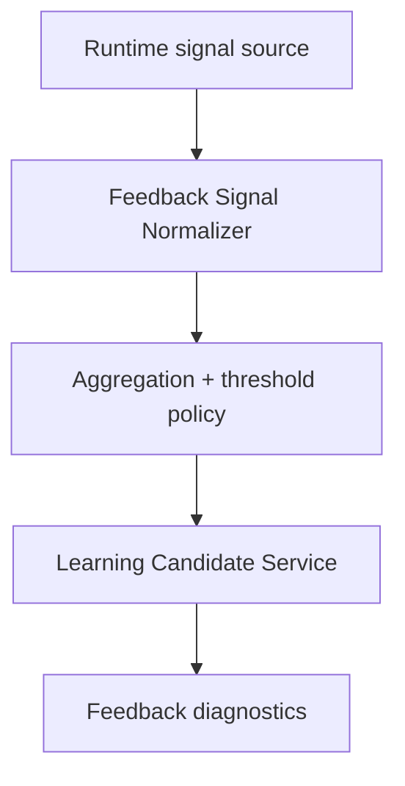

# EPIC-179: Runtime Feedback to Learning Candidates

**Status:** Implemented  
**Priority:** P2  
**Created:** 2026-05-16  
**Updated:** 2026-05-17  
**Owner:** Core API / Autonomy Feedback  
**Parent:** EPIC-175  
**Depends on:** EPIC-176, EPIC-177  
**Related:** EPIC-142, EPIC-144, EPIC-146, EPIC-167

## Summary

Convert repeated runtime feedback signals into governed learning candidates. Implemented sources include tool-contract repair thresholds, repeated failure classifications, repair outcomes, and output-contract exhaustion workflow anomalies; QA/review feedback, memory misses, and direct skill-improvement proposals remain deferred.

## Problem Statement

Before this epic, the platform already observed useful self-improvement signals, but most remained operational telemetry. For example, `ToolContractRepairAdapter` could repair malformed tool payloads and emit threshold-exceeded telemetry, and workflow repair services classified failures and dispatched repair flows. Those signals identified patterns the system should learn from, but they did not feed a governed learning-candidate pipeline.

Without this epic, self-improvement remains manual: humans or future agents must notice repeated telemetry, infer a durable lesson, and create work by hand.

## Evidence and Affected Files

- Tool contract repair adapter and related tests, including events such as:
  - `tool.contract_repair.applied`
  - `tool.contract_repair.failed`
  - `tool.contract_repair.threshold_exceeded`
- `apps/api/src/workflow/workflow-repair/workflow-failure-classification.service.ts`
- `apps/api/src/workflow/workflow-repair/failure-classification-rules.ts`
- `apps/api/src/workflow/workflow-repair/repair-policy.service.ts`
- `apps/api/src/workflow/workflow-repair/workflow-repair-dispatch.service.ts`
- `apps/api/src/workflow/workflow-repair/workflow-repair-completion.listener.ts`
- `apps/api/src/observability/autonomy-observability.types.ts`
- `apps/api/src/observability/autonomy-summary.projection.ts`

## Goals

- Define a normalized runtime feedback signal contract.
- Convert high-confidence repeated signals into learning candidates.
- Group related signals into one candidate instead of creating noisy duplicates.
- Include evidence, frequency, examples, affected tool/workflow/profile, and confidence.
- Keep skill/prompt/tool-contract proposal generation as deferred future work.
- Preserve human approval before durable memory or skill changes.
- Add diagnostics so operators can see which signals were ignored, grouped, or candidate-created.

## Non-Goals

- Do not create candidates for every single transient failure.
- Do not auto-edit skills/prompts from runtime telemetry.
- Do not couple each signal source directly to persistence; use a feedback ingestion seam.
- Do not replace existing repair behavior; this epic learns from it.

## Feedback Signal Types

Initial signal categories:

- **Tool contract repair:** malformed payloads repeatedly repaired for the same tool/schema/profile.
- **Failure classification:** repeated `dependency_missing`, `config_missing_local`, `runtime_artifact_stale`, or unknown failure clusters.
- **Repair outcome:** repair succeeds/fails repeatedly for the same root cause.
- **Workflow anomaly:** retry loops, stalled runs, repeated missing outputs, contract validation failures.
- **Review/QA finding:** contract-supported but unwired; deferred path for human or automated review to identify repeatable gaps that should become memory/skill guidance.
- **Memory miss:** contract-supported but unwired; deferred path for cases where an agent repeatedly asks for or reconstructs context that should have been available from memory.

## Target Flow

## Expected Changes

### Feedback Ingestion Seam

Add a small service that accepts normalized feedback signals:

- signal type
- source module
- scope
- actor/profile
- affected tool/workflow
- evidence IDs
- example payload summaries with redaction
- confidence
- severity
- deduplication fingerprint

Signal sources should call this seam instead of writing candidates directly.

### Aggregation Policy

Add thresholds for candidate creation:

- minimum frequency in time window
- minimum confidence
- severity override for high-impact issues
- deduplication by fingerprint
- cooldown after candidate creation

Initial thresholds can be conservative constants. EPIC-180 may later move these into a policy registry.

### Candidate Creation

- Create learning candidates for durable operational lessons.
- Defer skill-improvement proposals when evidence suggests prompt/tool/schema/skill changes.
- Link candidates back to source telemetry events.
- Include redacted examples only.

## Workstreams

### WS-1: Signal Contract

- Define normalized feedback signal type.
- Add redaction expectations.
- Add fingerprinting strategy.
- Add validation tests.

### WS-2: Tool Contract Repair Integration

- Feed threshold-exceeded events into feedback ingestion.
- Group by tool name, schema path, profile/workflow, and repair type.
- Create candidate when threshold is crossed.

### WS-3: Repair/Failure Integration

- Feed repeated classification patterns into feedback ingestion.
- Include repair success/failure outcomes.
- Create candidates for repeated missing dependency/config/runtime artifact classes.

### WS-4: Review and QA Integration (Deferred)

- Define a future manual/API path for QA/review feedback to create candidates.
- Attach review evidence and source context when this path is wired.
- Avoid direct proposal approval from review feedback.

### WS-5: Diagnostics

- Expose signal counts, grouped candidates, ignored signals, and skipped reasons.
- Add projection into autonomy summary where useful.

## Testing Plan

- Unit test: feedback signal validation rejects missing source/scope/evidence.
- Unit test: fingerprinting groups repeated equivalent tool repair signals.
- Unit test: thresholds create exactly one candidate per window.
- Integration test: tool-contract threshold event produces learning candidate.
- Integration test: repeated failure classification produces candidate with linked evidence.
- Redaction test: raw prompt/secrets/tool payloads are not persisted in candidate details.
- Diagnostics test: ignored signals show skipped reason and count.

## Acceptance Criteria

- At least tool-contract repair threshold telemetry can create learning candidates.
- Repeated repair/failure classifications can create learning candidates.
- Candidates include source evidence and deduplication metadata.
- Signal ingestion is behind a seam, not scattered direct repository writes.
- Tests prove aggregation, deduplication, redaction, and skipped-signal behavior.

## Implemented Runtime Feedback APIs

Runtime feedback is implemented behind a normalized ingestion seam. Producers submit `RuntimeFeedbackSignal` payloads to `RuntimeFeedbackIngestionService`, which validates the shared `@nexus/core` schema, redacts unsafe evidence/examples, applies conservative aggregation policy, and emits autonomy event-ledger telemetry for ingested, skipped, and candidate-created outcomes.

Aggregated feedback is persisted in the `runtime_feedback_signal_groups` table. Each group stores the deduplication fingerprint, signal type, source module, scope, affected metadata, redacted evidence/examples, lifetime occurrence count, seven-day window occurrence count, window start time, max confidence/severity, candidate linkage, cooldown state, skipped reason, and diagnostics metadata. Learning candidates are created only when policy thresholds are met inside the current aggregation window, unless high/critical severity triggers the conservative severity override; repeated equivalent signals update the existing group instead of creating noisy duplicates.

Automatic producers wired in this implementation:

- Tool contract repair threshold feedback from `ToolContractRepairAdapter` when repaired payload rates exceed the runtime threshold.
- Durable workflow failure classifications from `WorkflowFailureClassificationService`.
- Repair completion outcomes from `WorkflowRepairCompletionListener`, covering both successful and failed repair outcomes.
- Output-contract exhaustion anomalies from `StepRequiredToolRetryService` after required-tool retry attempts are exhausted.

Diagnostics are exposed at `GET /runtime-feedback/diagnostics`. The route supports `signalType`, `candidateCreated`, `limit`, and `offset` filters and returns aggregate signal counts, candidate counts, skipped-reason counts, total matching groups, and a sparse recent-group list that includes lifetime and current-window occurrence metadata. The diagnostics response intentionally omits raw evidence, raw examples, and persisted diagnostics payloads.

Autonomy summary projection now includes runtime feedback event-ledger records as sanitized learning items. Candidate-created signals are projected as needs-review items, skipped signals as denied policy outcomes, and normal ingested signals as successful learning telemetry, with references to workflow runs, jobs, event-ledger records, candidates, and runtime diagnostic groups when present.

## Deferred

- Review/QA feedback producers remain unwired.
- Memory-miss producers remain unwired.
- Runtime feedback does not auto-promote learning candidates.
- Runtime feedback does not auto-edit skills, prompts, memory, or tool contracts.

## Dependencies

- Requires EPIC-176's candidate API/service restoration.
- Requires EPIC-177 if feedback candidates use the same governed writeback/promotion path.
- Complements EPIC-180 policy registry work.

## Resolved Implementation Decisions

- Signal aggregation is persisted in `runtime_feedback_signal_groups`; event-ledger records provide telemetry and source references, not the source of truth for policy state.
- First-release automatic producers are limited to tool-contract repair thresholds, durable workflow failure classifications, repair outcomes, and output-contract exhaustion workflow anomalies.
- Feedback candidates use the scope provided by each producer. Workflow-derived producers use workflow or workflow-run scope; tool-contract repair can use workflow scope when available or global scope for global tool-contract patterns.
