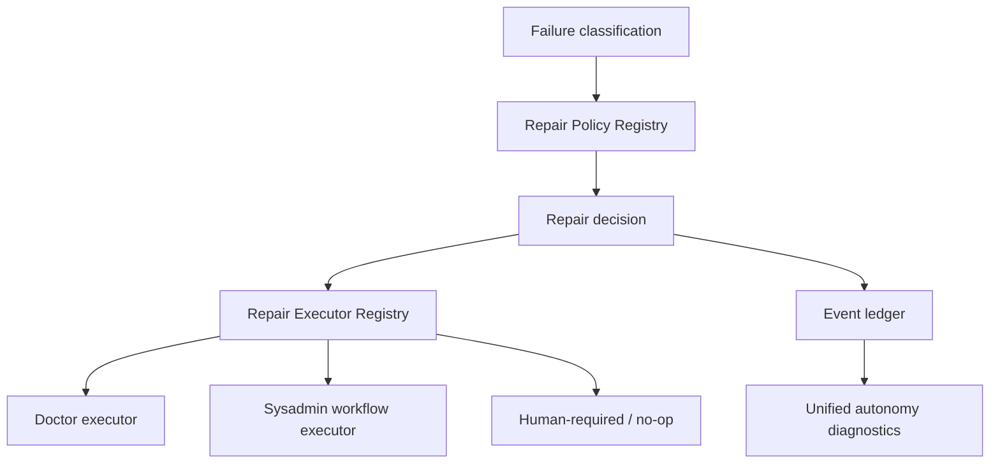

# EPIC-180: Repair Policy Deepening and Autonomy Diagnostics Unification

**Status:** Implemented  
**Priority:** P2  
**Created:** 2026-05-16  
**Updated:** 2026-05-17  
**Owner:** Core API / Repair and Observability  
**Parent:** EPIC-175  
**Related:** EPIC-082, EPIC-144, EPIC-145, EPIC-146, EPIC-167

## Summary

Deepen the repair policy seam and unify autonomy diagnostics across repair, learning, and proposal events, with retrospective-derived source evidence where available. The current repair subsystem is one of the strongest parts of the self-improvement foundation, but its policy/action mapping is hardcoded and diagnostics are not yet a complete self-improvement timeline.

## Problem Statement

Failure classification, repair dispatch, repair completion, sysadmin repair, and operations doctor flows are implemented and well-tested compared with the learning loop. The next improvement is not to rebuild repair; it is to make its policy seam deeper and connect repair outcomes to the broader learning/diagnostics story.

Current friction:

- `RepairPolicyService` hardcodes allowed actions, confidence threshold, and human-required classes.
- `resolveRepairExecutionPlan` hardcodes action-to-executor mapping.
- Run autonomy diagnostics focus on failure classification and repair delegation, while learning/proposal event names exist but are not shown as a unified lifecycle.
- Operations doctor is functional, but doctor/repair outcomes could feed the same policy and diagnostics language as workflow repair.

## Evidence and Affected Files

- `apps/api/src/workflow/workflow-repair/repair-policy.service.ts`
- `apps/api/src/workflow/workflow-repair/repair-delegation.types.ts`
- `apps/api/src/workflow/workflow-repair/workflow-failure-classification.service.ts`
- `apps/api/src/workflow/workflow-repair/workflow-repair-dispatch.service.ts`
- `apps/api/src/workflow/workflow-repair/workflow-repair-completion.listener.ts`
- `apps/api/src/workflow/workflow-repair/workflow-failure-doctor-completion.listener.ts`
- `apps/api/src/workflow/workflow-repair/sysadmin-repair-completion.listener.ts`
- `apps/api/src/operations/operations-doctor.controller.ts`
- `apps/api/src/operations/doctor-report.service.ts`
- `apps/api/src/operations/doctor-repair-delegation.listener.ts`
- `apps/api/src/workflow/workflow-run-operations/workflow-run-autonomy-diagnostics.service.ts`
- `apps/api/src/observability/autonomy-observability.types.ts`
- `apps/api/src/observability/autonomy-summary.projection.ts`

## Goals

- Convert hardcoded repair policy into a registry/configured seam with a small interface.
- Keep existing behavior stable while making policy easier to extend and test.
- Allow multiple repair executors/adapters without editing a central switch for every action.
- Include repair, learning, and proposal events plus retrospective-derived source evidence where available in autonomy diagnostics; standalone retrospective event projection remains deferred.
- Connect repair outcomes to learning candidates where EPIC-179 provides the ingestion seam.
- Preserve existing repair safety constraints and human-required classes.

## Non-Goals

- Do not reduce repair safeguards to make automation easier.
- Do not migrate all repair behavior into workflow YAML.
- Do not replace existing doctor endpoints.
- Do not require EPIC-179 to complete before improving policy locality; only the feedback integration depends on it.

## Target Policy Architecture

## Expected Changes

### Repair Policy Registry

Introduce a registry/config model for:

- failure class
- minimum confidence
- allowed actions
- human-required flag
- default executor
- retry policy
- evidence requirements
- diagnostic labels

The first version can be static TypeScript configuration, but it should be separated from policy evaluation logic.

### Repair Executor Registry

Replace hardcoded execution-plan branching with an adapter registry:

- doctor repair adapter
- sysadmin workflow repair adapter
- no-op/human-required adapter
- future adapters can be added without editing policy evaluation.

### Diagnostics Unification

Extend run/scope autonomy diagnostics to include:

- failure classification events
- repair policy decisions
- repair dispatch/completion events
- doctor repair requests/completions
- learning candidate events
- skill proposal events
- retrospective-derived source evidence where available; standalone retrospective event projection remains deferred
- skipped/blocked/approval-required reasons

Diagnostics should present a timeline and summarized state rather than independent unrelated lists.

## Workstreams

### WS-1: Extract Static Repair Policy Config

- Move hardcoded allowed actions and thresholds into typed config.
- Keep exact current behavior in tests.
- Add tests proving config drives decisions.

### WS-2: Introduce Executor Registry

- Define executor adapter interface.
- Register existing doctor/sysadmin execution paths.
- Replace hardcoded resolution with registry lookup.
- Preserve current event payloads.

### WS-3: Diagnostic Timeline Model

- Define autonomy diagnostic event view model.
- Map repair, learning, proposal event types, and retrospective-derived source evidence into common timeline entries; standalone retrospective event projection remains deferred.
- Add summary counts and latest statuses.

### WS-4: Operations Doctor Alignment

- Align doctor requested repair/completion events with repair diagnostics.
- Ensure doctor outcomes can appear alongside workflow repair outcomes.
- Avoid duplicating doctor report generation logic.

### WS-5: Learning Feedback Hook

- Once EPIC-179 is available, feed repeated repair outcomes into feedback ingestion.
- Keep this hook behind a seam so repair services do not know candidate persistence details.

## Testing Plan

- Existing repair policy tests must pass unchanged or be updated only for the new config seam.
- Unit test: policy config maps each existing failure class to the same action as before.
- Unit test: unknown class remains safe/human-required or no-op as currently expected.
- Unit test: executor registry dispatches doctor and sysadmin actions correctly.
- Integration test: repair classification through dispatch emits diagnostics timeline entries.
- Diagnostics test: mixed repair + learning + proposal events sort correctly and redact sensitive fields.
- Regression test: duplicate completion events remain idempotent.

## Acceptance Criteria

- Repair policy decisions are data/config-driven rather than hardcoded in one service method.
- Repair executor mapping is adapter/registry-based.
- Current repair behavior and safety checks are preserved.
- Autonomy diagnostics show repair, learning, proposal events, and retrospective-derived source evidence where available in one coherent timeline; standalone retrospective event projection remains deferred.
- Tests prove behavior parity, registry dispatch, idempotency, and diagnostic redaction.

## Dependencies

- Can start independently for policy extraction.
- Full diagnostics value increases after EPIC-176 emits real learning events and EPIC-178 provides retrospective-derived source evidence.
- Learning feedback hook depends on EPIC-179.

## Implemented Notes

- Static repair policy configuration now lives in `apps/api/src/workflow/workflow-repair/repair-policy.config.ts`. `REPAIR_POLICY_CONFIG` contains default executor metadata, but `RepairPolicyService` reads confidence, allowed actions, and human-required metadata while execution mapping is resolved by `RepairExecutorRegistryService`. This is static TypeScript configuration, not DB-backed policy and not hot-reloadable.
- Repair execution mapping now goes through `RepairExecutorRegistryService` in `apps/api/src/workflow/workflow-repair/repair-executor-registry.service.ts`. The registry maps `doctor.runtime_artifact.refresh_stale_artifacts` to the doctor path with concrete doctor action `prune_orphaned_runtime_artifacts`, maps dependency/config repair actions to `sysadmin_workflow`, and returns `null` for unknown actions.
- Workflow repair dispatch injects the executor registry and resolves plans through `repairExecutorRegistry.resolveExecutionPlan(...)`; the legacy `resolveRepairExecutionPlan()` helper was removed.
- Autonomy diagnostics now project a shared timeline across repair, runtime feedback, learning run/candidate, and skill proposal lifecycle events. Retrospective signals appear as bounded source evidence where present, not as Core-owned retrospective persistence or standalone retrospective event queries.
- Diagnostics responses now include optional `summary` metadata with `total`, zero-filled `byCategory`, and `latestStatus` computed after chronological sorting, while preserving existing `{ items }` compatibility.
- EPIC-179 feedback integration remains a best-effort runtime feedback hook. `repair_outcome` ingestion covers succeeded and failed repair completion outcomes, and production behavior still uses `runtimeFeedback.ingest(...).catch(() => undefined)` so repair completion is not blocked by feedback ingestion failures. Dispatch rejections and denials remain audited diagnostic events rather than repair outcome feedback signals.
- Operations doctor diagnostics were aligned through tests around existing ownership. No production ownership move was made, and workflow diagnostics do not depend on `DoctorReportService.generateReport()`.
- Deferred decisions: DB-backed or hot-reloadable repair policy; richer executor adapters beyond the current doctor/sysadmin/null mapping; deterministic tie-breaking for events with identical timestamps; automatic skill or proposal application; and deeper reuse of doctor report generation in workflow diagnostics.

## Open Questions

- Should repair policy config remain static code, move to seed data, or become database-backed after behavior parity is proven?
- Should diagnostics be run-scoped first, neutral scoped first, or both?
- Should doctor repairs and workflow repairs share one executor registry immediately, or converge in phases?
