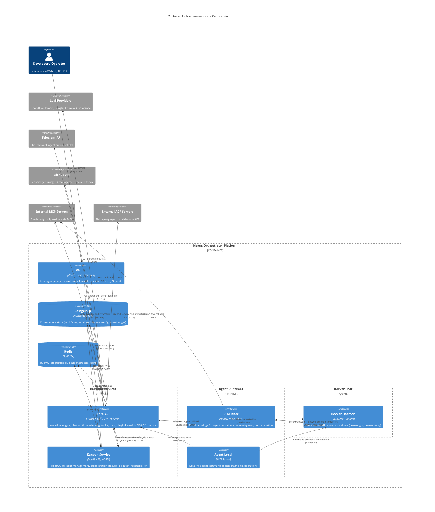

# 03 — Container Architecture

A C4 Level 2 container diagram showing every runtime component of the Nexus Orchestrator, how they connect, and detailed descriptions of each container's role, responsibilities, tech stack, and dependencies.

---

## C4 Level 2 — Container Diagram



---

## Container Details

### Core API (`apps/api`)

**Role:** The central orchestration engine. Owns the workflow engine (DAG parser, state machine, step execution), the chat runtime (Telegram ingestion, session management, memory backends), AI configuration (providers, models, agent profiles), the tool system (registry, runtime, sandbox, policy), the plugin kernel (lifecycle, contributions, capability endpoints), and MCP/ACP runtimes.

**Tech Stack:** NestJS 11+, TypeORM, BullMQ, Socket.IO, Vitest.

**Ports:** 3010 (HTTP REST), 3011 (WebSocket telemetry gateway).

**Key Dependencies:** PostgreSQL (workflow definitions, run state, event ledger, sessions, config), Redis (BullMQ queues for workflow-steps, chat-sessions, distillation, session-cleanup, container-cleanup, scheduled-jobs), Docker daemon (container orchestration for step execution), LLM providers (Anthropic, OpenAI, etc.), Telegram Bot API, GitHub API.

### Kanban Service (`apps/kanban`)

**Role:** The kanban domain service. Manages projects, work items, and the orchestration lifecycle (dispatch, reconciliation). Owns kanban-specific status transitions, lifecycle validation, event payload shapes, and work-item projections. Communicates with the Core API to launch workflows and receive lifecycle events.

**Tech Stack:** NestJS 11+, TypeORM, BullMQ.

**Port:** 3012 (HTTP REST).

**Key Dependencies:** Core API (workflow launch via REST + lifecycle event stream), PostgreSQL (project, work item, and run projection tables), Redis (event pub-sub).

### Web UI (`apps/web`)

**Role:** The management dashboard. Provides a React-based SPA for workflow editing (YAML editor with DAG visualization), kanban board management, AI provider configuration, session/run monitoring, and system administration.

**Tech Stack:** React 18+, Vite, Tailwind CSS, Vitest + Playwright.

**Port:** 3120 (served by Nginx in Docker, Vite dev server natively).

**Key Dependencies:** Core API (REST + WebSocket for real-time run telemetry), Kanban Service (REST for project/work-item data).

### PI Runner (`packages/pi-runner`) — PI engine only

> **Scope note:** This section describes the PI harness engine. The execution layer is now engine-pluggable — see [41 — Harness Runtime](41-harness-runtime.md) for the full harness SPI, engine selection, and Claude Code engine.

**Role:** Runtime bridge for execution containers when using the PI engine (`@nexus/harness-engine-pi`). When the PI engine is selected for a workflow step, the container runs the PI Runner HTTP server. The runner receives configuration from the API (model, provider, prompt, tools), creates an agent session via the PI coding agent SDK, bridges telemetry back to the API via WebSocket, and handles tool callbacks to the orchestrator.

**Tech Stack:** Node.js, `@earendil-works/pi-coding-agent`, Socket.IO client.

**Port:** 8374 (internal container port). Endpoints: `GET /health`, `POST /execute/agent`, `POST /execute/command`, `POST /shutdown`.

**Key Dependencies:** Core API WebSocket (authentication, configuration handshake, telemetry relay, command reception), external MCP servers (tool callbacks), LLM providers (direct API calls via configured credentials).

### Agent Local (`packages/agent-local`)

**Role:** Local MCP-compatible service that exposes governed command execution and file operations on a user's machine. Provides a restricted execution environment for tool calls that need local host access.

**Tech Stack:** Node.js, MCP protocol.

**Port:** 3033 (MCP endpoint at `/mcp`).

**Key Dependencies:** Core API (tool execution via MCP protocol), local filesystem and shell access.

### PostgreSQL

**Role:** Primary data store. Holds all persistent state including workflow definitions, run state, event ledger, chat sessions, chat memory, kanban projects and work items, AI configuration, plugin registrations, user accounts, and secrets.

**Tech Stack:** PostgreSQL 18 with `uuid-ossp` and `vector` extensions (`pgvector/pgvector:0.8.3-pg18`). Honcho profile adds a separate PG 15 instance (`pgvector/pgvector:pg15`).

**Port:** 5433 (external), 5432 (internal Docker network).

### Redis

**Role:** Message queue broker and pub-sub event bus. BullMQ uses Redis for job queues. Socket.IO uses Redis for horizontal scaling. The event publishing layer uses Redis for real-time WebSocket notifications.

**Tech Stack:** Redis 7+.

**Port:** 6380 (external), 6379 (internal Docker network).

---

## Container Communication Matrix

| From        | To            | Protocol         | Purpose                                           |
| ----------- | ------------- | ---------------- | ------------------------------------------------- |
| Web UI      | Core API      | REST + WebSocket | UI operations, real-time telemetry                |
| Web UI      | Kanban        | REST             | Project and work-item operations                  |
| Core API    | Kanban        | REST + Events    | Workflow lifecycle relay, domain event forwarding |
| Kanban      | Core API      | REST + Events    | Workflow launch, lifecycle event consumption      |
| Core API    | PostgreSQL    | SQL              | Persist all state                                 |
| Kanban      | PostgreSQL    | SQL              | Persist kanban state                              |
| Core API    | Redis         | Redis protocol   | BullMQ queues, pub-sub                            |
| Core API    | Docker daemon | Docker API       | Spawn/stop workflow step containers               |
| PI Runner   | Core API      | WebSocket + HTTP | Telemetry relay, tool callbacks, config handshake |
| Agent Local | Core API      | MCP              | Tool execution                                    |
| Core API    | LLM Providers | HTTPS            | AI inference                                      |
| Core API    | Telegram      | HTTPS            | Chat message ingestion and relay                  |
| Core API    | GitHub        | HTTPS            | Repository operations                             |
| Core API    | MCP Servers   | MCP (HTTP/stdio) | External tool discovery and invocation            |
| Core API    | ACP Servers   | ACP (HTTP)       | External agent discovery and invocation           |

---

## Deployment Model

The system is deployed via Docker Compose. All services run in a shared Docker network (`nexus-network`) with health-checked startup ordering:

```
PostgreSQL → Redis → Core API → Kanban → Web UI
```

Each service has its own Dockerfile under `apps/<name>/Dockerfile`. All builds use the repo root as context, ensuring shared dependencies from `package-lock.json` are available.

### Profiles

- **Default profile:** Core API, Kanban, Web UI, PostgreSQL, Redis.
- **Honcho profile** (`--profile honcho`): Adds Honcho API (port 8030), Honcho PostgreSQL (port 5443), and Honcho Deriver for AI-native memory backend support. The Core API environment variable `MEMORY_BACKEND=honcho` switches from the PostgreSQL memory backend.

### Build Dependency Order

```
packages/core  →  apps/api  →  apps/kanban
               →  apps/web
               →  packages/pi-runner
               →  packages/agent-local
```

Container images used at runtime by workflow steps:

- `nexus-light:latest` — lightweight container for simple agent tasks (built from `docker/Dockerfile.light`)
- `nexus-heavy:latest` — full container for complex tasks including web automation (built from `docker/Dockerfile.heavy`)

Both pi images apply vendored SDK patches during build (`COPY patches` + `RUN npx patch-package`, since the images install with `--ignore-scripts`). See [28 — PI Runner → SDK Patches](28-pi-runner.md#sdk-patches) and [`patches/README.md`](../../patches/README.md).

---

## Where Next

- [01 — System Overview](01-system-overview.md): Tech stack, ports, monorepo layout, conventions
- [02 — Getting Started](02-getting-started.md): Developer onboarding, build, test, debug
- [04 — Service Communication](04-service-communication.md): HTTP, WebSocket, queues, events, MCP/ACP
