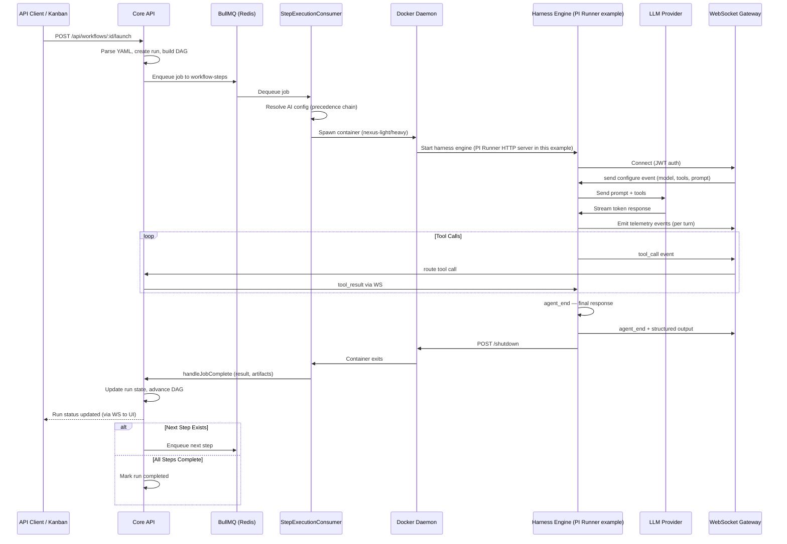
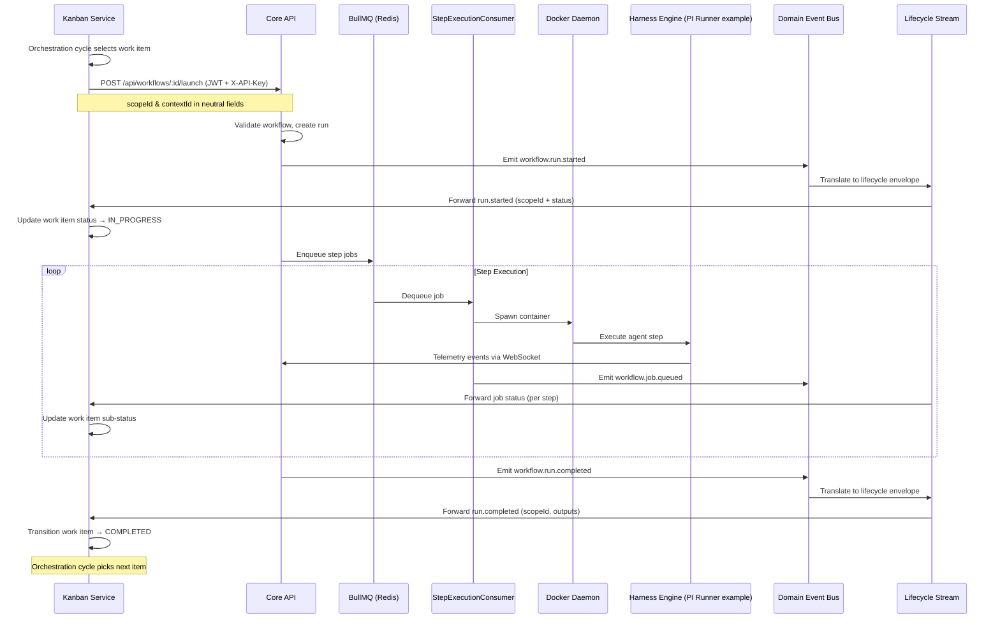

# 04 — Service Communication

A comprehensive reference for how services communicate within the Nexus Orchestrator: HTTP/REST, WebSocket, BullMQ queues, Redis pub-sub, domain events, and the MCP/ACP protocol layers. Includes sequence diagrams for the two most critical interaction flows.

---

## Communication Architecture Overview

The system uses a polyglot communication model — each channel is chosen for its specific use case:

| Pattern       | Protocol                | Use Case                                                             |
| ------------- | ----------------------- | -------------------------------------------------------------------- |
| HTTP REST     | NestJS controllers      | Synchronous service-to-service calls, CRUD operations                |
| WebSocket     | Socket.IO               | Real-time telemetry streaming, run status updates, command relay     |
| Message Queue | BullMQ on Redis         | Asynchronous step execution, chat session processing, scheduled jobs |
| Pub-Sub       | Redis                   | Cross-service event notifications (e.g., run lifecycle broadcast)    |
| Domain Events | In-process bus + outbox | Internal event-driven workflow triggers                              |
| MCP           | HTTP/stdio              | External tool discovery and invocation                               |
| ACP           | HTTP                    | External agent discovery and invocation                              |

---

## HTTP / REST

### NestJS Controllers

All API endpoints are NestJS controllers using decorators for route definitions. The Core API exposes REST endpoints for workflows, sessions, AI config, plugins, tools, chat, and system operations. The Kanban service exposes endpoints for projects, work items, and orchestration hooks.

Endpoints follow a consistent pattern:

- `GET /api/<resource>` — list/query
- `POST /api/<resource>` — create
- `GET /api/<resource>/:id` — get by ID
- `PATCH /api/<resource>/:id` — partial update
- `DELETE /api/<resource>/:id` — soft or hard delete

### Swagger Documentation

Swagger (OpenAPI) documentation is available at `/docs` on each service when running in development mode. The Core API docs are at `http://localhost:3010/docs`; Kanban docs are at `http://localhost:3012/docs`.

### Internal Service Auth

Communication between the Core API and Kanban service uses a dual authentication pattern:

1. **JWT Tokens** — Short-lived JWTs issued by each service and verified by the receiver. Both services share a common `JWT_SECRET` and configure audiences and issuers specific to each direction:
   - Core API → Kanban: issuer `nexus-api`, audience `nexus-kanban-service`
   - Kanban → Core API: issuer `nexus-kanban`, audience `nexus-core-internal`
   - Token TTL: 5 minutes (configurable via `KANBAN_SERVICE_JWT_TTL` / `KANBAN_CORE_JWT_TTL`)

2. **X-API-Key Headers** — A shared bearer token (`KANBAN_SERVICE_BEARER_TOKEN`) used as a simpler alternative for certain endpoints. The Core API's base URL is configured via `KANBAN_CORE_BASE_URL`.

### Request Validation

Requests are validated using Zod schemas via the `@ZodBody()` and `@ZodQuery()` parameter decorators. Invalid requests return 400 with structured error details.

---

## WebSocket (Socket.IO)

### Telemetry Gateway

The Core API exposes a Socket.IO server on port 3011 (`/api/telemetry/ws`). This is the real-time backbone used by:

- **Web UI** — Receives live workflow run status updates, step progress, and tool call events without polling.
- **Harness engine** (e.g. PI Runner when using the PI engine) — Authenticates, receives configuration handshakes, streams agent telemetry events back to the orchestrator, and receives orchestrator commands (`dehydrate`, `abort`, `ask_user_questions`). See [41 — Harness Runtime](41-harness-runtime.md) for the engine-agnostic SPI.

### Connection Flow (PI Engine / PI Runner)

> **Scope note:** This walkthrough uses the PI engine as the example. Other harness engines follow the same handshake protocol via the `HarnessEngine` SPI.

1. PI Runner container starts and connects to `ws://api:3001/api/telemetry/ws` with a JWT bearer token (`AGENT_JWT`).
2. The orchestrator sends a `configure` event containing the model, provider, API key, system prompt, tool set, and run context.
3. PI Runner creates an agent session and begins executing.
4. Telemetry events (`agent_start`, `agent_end`, `tool_call`, `tool_result`, `user_message`, `turn`) stream back to the orchestrator via the WebSocket.
5. The orchestrator can send `dehydrate` (serialize session state), `abort` (stop execution), or `ask_user_questions` (user interaction prompt) commands at any time.

### Message Format

All WebSocket messages follow a typed event envelope:

```typescript
{
  type: string;       // e.g., "tool_call", "turn", "agent_end"
  workflowRunId: string;
  jobId?: string;
  stepId?: string;
  payload: Record<string, unknown>;
  timestamp: string;  // ISO 8601
}
```

### Gateway Connectivity

The `TELEMETRY_PUBLIC_WS_URL` environment variable controls the public WebSocket URL returned to browser clients. It must point to a host-reachable address (e.g., `http://localhost:3011`), not a Docker-internal name.

---

## BullMQ Job Queues

All six queues are backed by Redis and processed by queue-specific consumers in the Core API.

| Queue Name          | Purpose                                                                | Consumer                  | Concurrency |
| ------------------- | ---------------------------------------------------------------------- | ------------------------- | ----------- |
| `workflow-steps`    | Execute workflow step jobs in Docker containers                        | `StepExecutionConsumer`   | 4           |
| `chat-sessions`     | Process chat sessions initiated via Telegram or API                    | `ChatSessionConsumer`     | 4           |
| `distillation`      | Run AI token distillation on chat memory (summarization)               | `DistillationConsumer`    | 1           |
| `session-cleanup`   | Evict stale sessions and clean up orphaned resources                   | `SessionCleanupService`   | 1           |
| `container-cleanup` | Remove completed/failed Docker containers and their volumes            | `ContainerCleanupService` | 1           |
| `scheduled-jobs`    | Execute scheduled automation jobs (heartbeats, standing orders, hooks) | `ScheduledJobsConsumer`   | 1           |

### Queue Registration

Queues are registered through NestJS `BullModule.registerQueue()` in their owning modules:

- `workflow-steps` — `WorkflowStepExecutionModule`, `WorkflowRunOperationsModule`, `WorkflowModule`
- `chat-sessions` — `ChatExecutionModule`, `ChatSessionsModule`
- `distillation` — `MemoryModule`, `SessionModule`
- `session-cleanup` — `SessionModule`
- `container-cleanup` — `DockerModule`
- `scheduled-jobs` — `AutomationModule`, `OperationsModule`

### Job Data Flow

For a workflow step:

1. `WorkflowRunJobExecutionService` enqueues a `JobQueueData` payload to the `workflow-steps` queue.
2. `StepExecutionConsumer` picks up the job and delegates to `StepExecutionOrchestratorService`.
3. The orchestrator spawns a Docker container, waits for it to complete, and publishes the result.
4. On failure after all retries, `StepExecutionConsumer.onFailed()` calls `WorkflowRunJobExecutionService.handleJobFailed()`.

---

## Redis Pub-Sub

### Event Publication

The `WorkflowRedisPublisherListener` subscribes to canonical workflow lifecycle events (`workflow.run.started`, `workflow.run.completed`, `workflow.run.failed`, `workflow.run.cancelled`, `workflow.run.paused`, `workflow.run.resumed`) and publishes them to Redis via `StepEventPublisherService`. This enables the Web UI to receive real-time run status updates without HTTP polling.

### Channel Pattern

Events are published to a Redis channel keyed by workflow run ID, allowing subscribers to filter for specific runs. The `StepEventPublisherService` handles best-effort delivery — failures are logged but do not block workflow progression.

---

## Domain Events

### In-Process Bus

The NestJS `@nestjs/event-emitter` module provides an in-process event bus for decoupled, synchronous/asynchronous event handling within the Core API. Listeners use the `@OnEvent()` decorator to subscribe to specific event types.

Key event constants (defined in `workflow-events.constants.ts`):

- `workflow.run.started` / `.completed` / `.failed` / `.cancelled` / `.paused` / `.resumed`
- `workflow.job.queued`
- `workflow.run.activated.from.queue`

### Outbox Pattern

Domain events that must be delivered to external consumers (like the Kanban service) use the outbox pattern via `OutboxDomainEventBus`:

1. `OutboxDomainEventBus.publish()` writes the event to the outbox store (database table) and optionally fans out to an in-process bus.
2. A periodic worker (`DomainEventOutboxWorker`) picks up pending events and delivers them to external subscribers.
3. Delivery status is tracked (`pending` → `delivered` / `failed`) with retry attempts.

### Event Envelope Schema

```typescript
interface DomainEventEnvelope {
  eventId: string;
  eventType: string;
  aggregateId: string;
  aggregateType: string;
  payload: Record<string, unknown>;
  correlationId?: string;
  causationId?: string;
  occurredAt: Date;
}
```

### Core Lifecycle Stream

The `WorkflowCoreLifecycleStreamListener` translates internal workflow run and job bus events into generic core lifecycle stream envelopes, which are then forwarded to the Kanban service and the event ledger. The stream uses neutral `scopeId` and `contextId` fields (not kanban-specific identifiers) to maintain the API/Kanban boundary.

### Domain Event Ingestion

External services can push domain events into the Core API via `POST /api/internal/:domain/events` (internal endpoint protected by `InternalServiceScopes`). Events carry a `scopeId` and `contextId` for workflow trigger matching. The `WorkflowInternalDomainEventsService` validates, deduplicates, and routes events to matching workflow triggers.

---

## MCP Protocol (Model Context Protocol)

### Runtime Manager

The `McpRuntimeManagerService` manages the lifecycle of MCP server connections. It reads server configurations from the `mcp_servers` database table and maintains persistent connections for tool discovery and invocation.

### Transport Factory

The `McpTransportFactory` supports two transport types:

| Transport | Protocol     | When Used                         | Configuration              |
| --------- | ------------ | --------------------------------- | -------------------------- |
| HTTP      | HTTPS REST   | Remote MCP servers with REST APIs | Server URL, custom headers |
| stdio     | Standard I/O | Local MCP servers (subprocess)    | Command, args              |

Transport selection is determined by the `transport_type` field on each `mcp_server` record (enum: `stdio`, `http`).

### Tool Name Resolution

MCP-discovered tools are registered in the tool registry with a prefixed naming convention. The `McpRuntimeManagerService` handles tool name resolution, includes/excludes filtering (`include_tools` / `exclude_tools` arrays per server), and periodic rediscovery.

Tool call flow:

1. Agent requests tool by name → tool registry resolves to an MCP server.
2. `McpRuntimeManagerService` constructs the tool invocation request using the appropriate transport client.
3. Result is returned to the agent or logged to the event ledger on failure.

### Connection Management

- **Connect timeout:** Configurable per server (`connect_timeout_ms`, default 10000ms).
- **Request timeout:** Configurable per server (`timeout_ms`, default 30000ms).
- **Retry:** Configurable max retries (`max_retries`, default 2) with backoff (`retry_backoff_ms`, default 1000ms).
- **Status tracking:** `last_status` (unknown/connected/error), `last_error`, `last_connected_at`, `last_discovered_at`.

---

## ACP Protocol (Agent Communication Protocol)

### HTTP Client

The `AcpHttpClient` handles communication with external ACP servers. Servers are configured in the `acp_servers` table with connection details, authentication, and agent filtering.

### Runtime Manager

The `AcpRuntimeManagerService` manages ACP server connections and discovered agents:

1. On startup or manual reload, it discovers agents from each configured ACP server.
2. Discovered agents are stored in `acp_discovered_agents` with their available actions.
3. Agents are exposed as tools in the tool registry with an `acp:` namespace prefix.
4. Invocation is routed through the ACP server's HTTP endpoints.

### ACP Auth

ACP servers support authentication via `AcpAuthType` configuration — servers can be configured with API keys, bearer tokens, or custom headers.

---

## Sequence Diagram — Workflow Step Execution Flow

> **Scope note:** This diagram uses PI Runner as the example harness engine. Other engines (e.g. Claude Code) follow the same sequence via the `HarnessEngine` SPI.



## Sequence Diagram — Kanban Dispatch to Lifecycle Update

> **Scope note:** This diagram uses PI Runner as the example harness engine. The execution layer is engine-pluggable — see [41 — Harness Runtime](41-harness-runtime.md).



---

## Event Ledger

All significant runtime events are recorded in the `event_ledger` table for audit and debugging:

| Field                             | Purpose                                                  |
| --------------------------------- | -------------------------------------------------------- |
| `domain`                          | Event domain (e.g., `workflow`, `chat`, `acp`, `plugin`) |
| `event_name`                      | Specific event identifier                                |
| `outcome`                         | `success`, `failure`, `skipped`, `pending`               |
| `severity`                        | `info`, `warn`, `error`, `critical`                      |
| `scope_id`                        | Neutral scope identifier (links to kanban project)       |
| `context_id`                      | Neutral context identifier (links to work item)          |
| `workflow_id` / `workflow_run_id` | Workflow context                                         |
| `job_id` / `step_id`              | Step execution context                                   |
| `payload`                         | JSONB with event-specific data                           |
| `correlation_id`                  | Cross-service trace correlation                          |

The event ledger is indexed on `(domain, event_name, occurred_at)` for efficient querying.

---

## Where Next

- [01 — System Overview](01-system-overview.md): Tech stack, ports, monorepo layout, conventions
- [02 — Getting Started](02-getting-started.md): Developer onboarding, build, test, debug
- [03 — Container Architecture](03-container-architecture.md): C4 Level 2 diagram and container detail
