# 05 - API Module Graph

The Nexus Orchestrator API (`apps/api`) is a NestJS monolith composed of ~30 top-level modules plus 12 workflow sub-modules and 7 chat sub-modules. This document maps the full module dependency graph, categorizes each module, and explains the architectural patterns governing them.

---

## C4 Level 3 Component Diagram

```mermaid
graph TB
    subgraph "Global Infrastructure"
        DatabaseModule["DatabaseModule<br/>TypeORM · 70 entities · 56 repos"]
        RedisModule["RedisModule<br/>ioredis · BullMQ"]
        DockerModule["DockerModule<br/>Dockerode"]
        ConfigModule["ConfigModule<br/>(@nestjs/config)"]
        EventEmitter["EventEmitterModule<br/>(@nestjs/event-emitter)"]
    end

    subgraph "Security & Identity"
        AuthModule["AuthModule<br/>JWT · Passport"]
        SecurityModule["SecurityModule<br/>IAM · Secrets · Audit"]
    end

    subgraph "Observability"
        ObservabilityModule["ObservabilityModule<br/>Metrics · Cost · Event Ledger"]
        TelemetryModule["TelemetryModule<br/>WebSocket Gateways"]
        RuntimeFeedbackModule["RuntimeFeedbackModule<br/>Diagnostic Signalling"]
    end

    subgraph "AI Configuration"
        AiConfigModule["AiConfigModule<br/>Providers · Models · Profiles · Skills"]
    end

    subgraph "Harness"
        HarnessModule["HarnessModule<br/>(apps/api/src/harness/)"]
    end

    subgraph "Session & Memory"
        SessionModule["SessionModule<br/>Hydration · Cleanup"]
        MemoryModule["MemoryModule<br/>Backends · Distillation"]
    end

    subgraph "Chat Domain"
        ChatModule["ChatModule<br/>7 sub-modules"]
        ChatExecutionModule["ChatExecutionModule"]
    end

    subgraph "Workflow Domain (largest)"
        WorkflowModule["WorkflowModule<br/>12 sub-modules · 57 providers"]
    end

    subgraph "Tool Stack"
        CapabilityInfraModule["CapabilityInfraModule"]
        ToolRegistryModule["ToolRegistryModule"]
        ToolRuntimeModule["ToolRuntimeModule"]
        ToolModule["ToolModule"]
        CapabilityGovernanceModule["CapabilityGovernanceModule"]
    end

    subgraph "Feature Modules"
        WarRoomModule["WarRoomModule"]
        WebAutomationModule["WebAutomationModule"]
        McpModule["McpModule"]
        AcpModule["AcpModule"]
        AutomationModule["AutomationModule"]
        PluginKernelModule["PluginKernelModule"]
        GitWorktreeModule["GitWorktreeModule"]
    end

    subgraph "Support"
        HealthModule["HealthModule"]
        SetupModule["SetupModule"]
        SystemSettingsModule["SystemSettingsModule"]
        WebhooksModule["WebhooksModule"]
        OperationsModule["OperationsModule"]
        UsersModule["UsersModule"]
        NotificationsModule["NotificationsModule"]
    end

    WorkflowModule --> DatabaseModule
    WorkflowModule --> DockerModule
    WorkflowModule --> SecurityModule
    WorkflowModule --> CapabilityGovernanceModule
    WorkflowModule --> CapabilityInfraModule
    WorkflowModule --> PluginKernelModule
    WorkflowModule --> ToolRegistryModule
    WorkflowModule --> AutomationModule
    WorkflowModule --> WebAutomationModule
    WorkflowModule --> SystemSettingsModule

    ChatModule --> WorkflowModule
    ChatModule --> DatabaseModule

    AiConfigModule --> DatabaseModule
    AiConfigModule --> ObservabilityModule
    AiConfigModule --> SecurityModule
    AiConfigModule --> CapabilityInfraModule

    TelemetryModule --> RedisModule
    ObservabilityModule --> DatabaseModule
```



---

## Module Categories

| Category                   | Modules                                                                                                                                                | Description                                                                                                                 |
| -------------------------- | ------------------------------------------------------------------------------------------------------------------------------------------------------ | --------------------------------------------------------------------------------------------------------------------------- |
| **Global Infrastructure**  | `DatabaseModule`, `RedisModule`, `DockerModule`                                                                                                        | Persistence, queuing, container orchestration — decorated `@Global()`                                                       |
| **Security & Identity**    | `AuthModule`, `SecurityModule`                                                                                                                         | Authentication, IAM policies, secret encryption, audit trail                                                                |
| **Observability**          | `ObservabilityModule`, `TelemetryModule`, `RuntimeFeedbackModule`                                                                                      | Metrics, cost tracking, event ledger, WebSocket signaling, diagnostics                                                      |
| **AI Configuration**       | `AiConfigModule`                                                                                                                                       | LLM provider/model/profile/skill resolution — decorated `@Global()`                                                         |
| **Harness**                | `HarnessModule`                                                                                                                                        | Pluggable execution harness: provider registry, config, credentials, device flow, scoped defaults — `apps/api/src/harness/` |
| **Session & Memory**       | `SessionModule`, `MemoryModule`                                                                                                                        | Session state hydration/cleanup; memory backends and distillation                                                           |
| **Domain: Workflow**       | `WorkflowModule` + 12 sub-modules                                                                                                                      | Core engine, launch, execution, repair, runtime, subagents                                                                  |
| **Domain: Chat**           | `ChatModule` + `ChatExecutionModule`                                                                                                                   | Channel ingress, session management, agent communication                                                                    |
| **Domain: Tooling**        | `CapabilityInfraModule`, `ToolRegistryModule`, `ToolRuntimeModule`, `ToolModule`, `CapabilityGovernanceModule`                                         | Layered tool stack — registry → runtime → execution with governance                                                         |
| **Domain: WarRoom**        | `WarRoomModule`                                                                                                                                        | Multi-agent consensus sessions                                                                                              |
| **Domain: Web Automation** | `WebAutomationModule`                                                                                                                                  | Playwright browser automation                                                                                               |
| **Integration**            | `McpModule`, `AcpModule`                                                                                                                               | MCP and ACP protocol servers                                                                                                |
| **Automation**             | `AutomationModule`                                                                                                                                     | Scheduled jobs, heartbeats, hooks, standing orders                                                                          |
| **Plugin System**          | `PluginKernelModule`                                                                                                                                   | Plugin registry, lifecycle, event delivery                                                                                  |
| **Support**                | `GitWorktreeModule`, `HealthModule`, `SetupModule`, `SystemSettingsModule`, `WebhooksModule`, `OperationsModule`, `UsersModule`, `NotificationsModule` | Utilities, health checks, settings, webhooks, user management                                                               |

---

## Global Infrastructure Modules

### DatabaseModule (`@Global()`)

**Provides:** TypeORM connection to PostgreSQL. Registers 70 entities and 56 custom repositories. All repositories are exported globally. Runs registered migrations on startup (`migrationsRun` flag), then executes `StartupSeedService.seedOnStartup()` which seeds roles, LLM secrets/providers/models, agent profiles, skills, tool approval rules, and workflow definitions.

**Why global:** Every domain module needs data access. The `@Global()` decorator plus `TypeOrmModule.forFeature(entities)` makes all entity repositories injectable without explicit imports.

### RedisModule (`@Global()`)

**Provides:** ioredis `REDIS_CLIENT` for raw Redis operations; `BullModule.forRootAsync()` configures BullMQ with exponential backoff (3 attempts, 1s delay). Exports `RedisStreamService`, `RedisPubSubService`, `RunnerConfigStoreService`, and `AgentResponseStoreService`.

**Why global:** Job queues, pub/sub, and runtime config storage are needed across workflow step execution, telemetry, and agent communication.

### DockerModule

**Provides:** Dockerode client (`DOCKER_CLIENT` injection token). Container orchestration: `ContainerOrchestratorService` (create/start/stop), `ContainerCleanupService` (zombie reaping), `ContainerHttpClientService` (in-container HTTP communication).

**Why global:** Step execution runs inside Docker containers; workflow cancellation kills containers by label. The `DockerModule` is imported directly where needed (primarily `WorkflowModule`).

---

## Global AI Configuration Module

### AiConfigModule (`@Global()`)

**Provides:** `AiConfigurationService` — the central resolver for model/provider/profile settings using the 4-tier precedence system. `SecretVaultService` — encrypts/decrypts provider credentials. `AgentFactoryService` — constructs configured agent instances. `AgentSkillsService` + `AgentSkillLibraryService` — skill resolution and assignment. `ModelSelectionFactory` — orchestrates `DatabaseModelStrategy` and `EnvironmentModelStrategy`.

**Why global:** Every workflow step, chat session, and agent invocation needs AI configuration resolution. This module is decorated `@Global()` so any module can inject `AiConfigurationService`.

### HarnessModule

**Provides:** `HarnessProviderRegistryService` — central registry of all harness definitions. `HarnessConfigService` and `HarnessConfigController` — CRUD for harness configuration. `HarnessCredentialResolverService` — scope-walk resolution of credential bindings. `DeviceFlowService` — RFC 8628 OAuth Device Authorization Grant flow. `ScopedAiDefaultResolver` — resolves preferred harness/model/provider for a given scope node in the selection precedence chain. `harness-selection.ts`, `harness-policy.ts`, and `harness-diagnostics.ts` provide pure selection helpers and diagnostic utilities. `HarnessDefinitionRepository` owns all persistence. See [41-harness-runtime.md](41-harness-runtime.md) for the full harness runtime deep-dive.

---

## Security & Identity Modules

### AuthModule

**Provides:** JWT authentication via Passport strategies. `Role`, `Permission`, `UserRole`, `RolePermission` entities. Repository layer for permission-based access control (PBAC) — roles are an internal grouping used to grant permission sets via `PermissionsGuard`; see [19 — Security § Unified Authorization Guard](19-security.md#unified-authorization-guard).

### SecurityModule

**Provides:** `IAMPolicyService` — attribute-based access control policy refresh. `SecretStoreRepository` for encrypted credential storage. `RefreshToken` management. Audit log integration.

---

## Observability Modules

### ObservabilityModule

**Provides:** `MetricsService` — collects and exposes Prometheus metrics. `CostTrackingService` — tracks LLM token usage and compute costs. `EventLedgerService` — immutable append-only event store for all domain events. `AutonomySummaryProjection` — aggregates workflow autonomy metrics. OpenTelemetry tracing via `tracing.ts`.

### TelemetryModule

**Provides:** WebSocket gateways (`TelemetryGateway`, `TelemetryWarRoomGateway`) for real-time bidirectional communication with running agents. Handles agent command dispatch, todo updates, container context, session checkpointing, war-room moderation, mesh delegation signaling, tool error reporting, and step-complete notifications. Exports `ChatSessionCollaborationClient`.

### RuntimeFeedbackModule

**Provides:** `RuntimeFeedbackSignalGroup` entities and repository. Ingests and organizes diagnostic signals from running workflows — skill mount errors, host mount failures, tool contract mismatches, credential gaps.

---

## Workflow Module Hierarchy

The `WorkflowModule` is decorated `@Global()` and is the largest module in the system. It contains:

| Sub-Module                      | Path                         | Responsibility                                                                                                                                   |
| ------------------------------- | ---------------------------- | ------------------------------------------------------------------------------------------------------------------------------------------------ |
| `WorkflowLaunchModule`          | `workflow-launch/`           | Launch API, launch contracts, orchestration helpers                                                                                              |
| `WorkflowRunOperationsModule`   | `workflow-run-operations/`   | Run steering, reconciliation, idle tracking, workspace management                                                                                |
| `WorkflowStepExecutionModule`   | `workflow-step-execution/`   | BullMQ consumer, container execution, retry policy                                                                                               |
| `WorkflowSpecialStepsModule`    | `workflow-special-steps/`    | 9 special step handlers (emit-event, git, webhook, invoke-workflow, mcp-tool, register-tool, run-command, web-automation, manage-tool-candidate) |
| `WorkflowSubagentsModule`       | `workflow-subagents/`        | Subagent provisioning, mesh delegation, lifecycle cleanup                                                                                        |
| `WorkflowRuntimeModule`         | `workflow-runtime/`          | Agent-facing tools/capabilities, step-complete protocol                                                                                          |
| `WorkflowRepairModule`          | `workflow-repair/`           | Failure classification, repair dispatch, continuation policy                                                                                     |
| `WorkflowHostMountModule`       | `workflow-host-mount/`       | Host mount resolution, audit, startup validation                                                                                                 |
| `WorkflowInternalToolsModule`   | `workflow-internal-tools/`   | Internal tools: memory, schedule, todo, workflow, skill, playbook                                                                                |
| `WorkflowDelegationToolsModule` | `workflow-delegation-tools/` | Delegation-related capability tools                                                                                                              |

### WorkflowRunOperationsModule ↔ ExecutionLifecycleModule coupling

The `WorkflowRunOperationsModule` (`workflow-run-operations/`) is the only workflow submodule that reaches across into the execution-lifecycle domain. The cross-boundary edge is a `forwardRef(() => ExecutionLifecycleModule)` declared in `apps/api/src/workflow/workflow-run-operations/workflow-run-operations.module.ts` and resolves through three named collaborators consumed by `WorkflowRunReconciliationService`: `ExecutionRepository` (read non-terminal execution rows to immunise active runs and probe `workflow_step` containers during reconciliation), `ServiceLifecycleStateService` (gate the sweep during the API `draining` shutdown phase), and `SubagentContainerLivenessProbe` (confirm a candidate `workflow_step` container is still alive before declaring a run stale, mirroring the supervisor's debounced `container_lost` rule). This is the **only** allowed entry point for run-operations code into the lifecycle domain; anything beyond these three collaborators is a layering violation. See [Relationship to workflow-run-operations](42-execution-lifecycle.md#relationship-to-workflow-run-operations) in the execution-lifecycle guide for the stable-contract vocabulary (`EXECUTION_EVENT_TYPES`, `EXECUTION_STATES`, `EXECUTION_FAILURE_REASONS`, `EXECUTION_KINDS`, `toExecutionReadModel`, `shouldEmitHeartbeat`) and the full coupling matrix.

---

## Chat Module Sub-Modules

The `ChatModule` is organized into 7 sub-directories:

| Sub-Directory       | Purpose                                       |
| ------------------- | --------------------------------------------- |
| `chat-sessions/`    | Session lifecycle, hydration from DB, cleanup |
| `chat-messages/`    | Message persistence, fetching, embedding      |
| `channel-adapters/` | Channel-specific adapters (Telegram, etc.)    |
| `memory/`           | Chat memory context, retrieval, promotion     |
| `chat-actions/`     | Agent action dispatch within chat context     |
| `notifications/`    | Chat-specific notification delivery           |
| `redis/`            | Chat pub/sub, message routing via Redis       |

---

## Tool Stack Architecture

The tool stack is layered bottom-up:

```
CapabilityInfraModule → ToolRegistryModule → ToolRuntimeModule → ToolModule
                         ↑
              CapabilityGovernanceModule (policy layer)
```

| Module                       | Role                                                                                                          |
| ---------------------------- | ------------------------------------------------------------------------------------------------------------- |
| `CapabilityInfraModule`      | Defines canonical capability manifests, maps them to tool registry entries, provides the `CapabilityRegistry` |
| `ToolRegistryModule`         | Stores tool definitions (`ToolRegistry` entity), manages tool lifecycle (create, update, validate, publish)   |
| `ToolRuntimeModule`          | Executes tool calls at runtime, handles sandboxing, validation, and result formatting                         |
| `ToolModule`                 | Tool API controllers, capability preflight service, internal tool registry, tool seeding                      |
| `CapabilityGovernanceModule` | Policy engine, approval rules, call request authorization, policy decision service                            |

---

## BullMQ Queues and Consumers

| Queue Name       | Consumer                                                                     | Registered In                                    | Purpose                                                              |
| ---------------- | ---------------------------------------------------------------------------- | ------------------------------------------------ | -------------------------------------------------------------------- |
| `workflow-steps` | `StepExecutionConsumer` (`@Processor('workflow-steps', { concurrency: 4 })`) | `WorkflowStepExecutionModule` + `WorkflowModule` | Dequeues step execution jobs, orchestrates container-based execution |
| `scheduled-jobs` | `ScheduledJobsConsumer`                                                      | `AutomationModule`                               | Processes cron/scheduled job triggers                                |

BullMQ is configured with 3 retry attempts at exponential backoff (1s delay). Failed jobs are kept (`removeOnFail: false`) for inspection.

---

## Design Patterns

| Pattern                       | Usage                                                                                                                                                                                                                           |
| ----------------------------- | ------------------------------------------------------------------------------------------------------------------------------------------------------------------------------------------------------------------------------- |
| **Dependency Injection (DI)** | NestJS provider system. All services, repositories, and strategies are injectable. Token-based injection via interfaces (`WORKFLOW_ENGINE_SERVICE`, `WORKFLOW_PARSER_SERVICE`, etc.)                                            |
| **Repository Pattern**        | 56 custom TypeORM repositories. Each entity has a dedicated repository class. Repositories own all SQL queries.                                                                                                                 |
| **Zod Validation**            | All DTOs and controller inputs use Zod schemas for runtime validation. NestJS pipes integrate Zod.                                                                                                                              |
| **Strategy Pattern**          | `ModelSelectionFactory` with `DatabaseModelStrategy` and `EnvironmentModelStrategy`. `ConcurrencyPolicyService` with pluggable scope resolution.                                                                                |
| **Observer / Event Emitter**  | `@nestjs/event-emitter` — workflow events (started, completed, cancelled, paused, resumed) are emitted and consumed by listeners (`WorkflowAuditListener`, `WorkflowRedisPublisherListener`, `WorkflowTelemetryListener`, etc.) |
| **Decorator Pattern**         | `@Global()` for infrastructure modules. `@Processor()` for BullMQ workers. Custom decorators for capability registration (`@Capability()`, `@RuntimeCapability()`).                                                             |
| **Factory Pattern**           | `ModelSelectionFactory` constructs the appropriate model selection strategy. `AgentFactoryService` creates configured agent instances.                                                                                          |
| **Port/Adapter**              | `CHAT_SESSION_DOMAIN_PORT` injected as `InProcessChatSessionDomainAdapter` — decouples workflow engine from chat session internals.                                                                                             |
| **Chain of Responsibility**   | `ModelSelectionFactory` iterates strategies in priority order; first that can handle the use case wins. `StepExecutionOrchestratorService` delegates to special-step executor, then agent-step executor.                        |

---

## Port/Adapter Pattern Usage

The codebase uses the Port/Adapter (Hexagonal) pattern at key boundaries:

```
workflow/domain-ports/
  CHAT_SESSION_DOMAIN_PORT  →  InProcessChatSessionDomainAdapter
```

This injection token allows the workflow engine to communicate with chat sessions without importing `ChatModule` directly. The adapter is bound in `WorkflowModule` via:

```typescript
{
  provide: CHAT_SESSION_DOMAIN_PORT,
  useExisting: InProcessChatSessionDomainAdapter,
}
```
