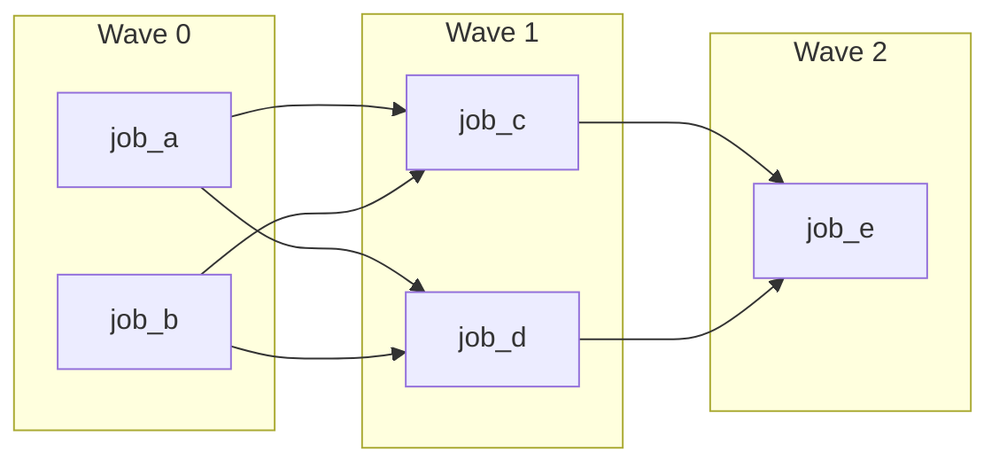
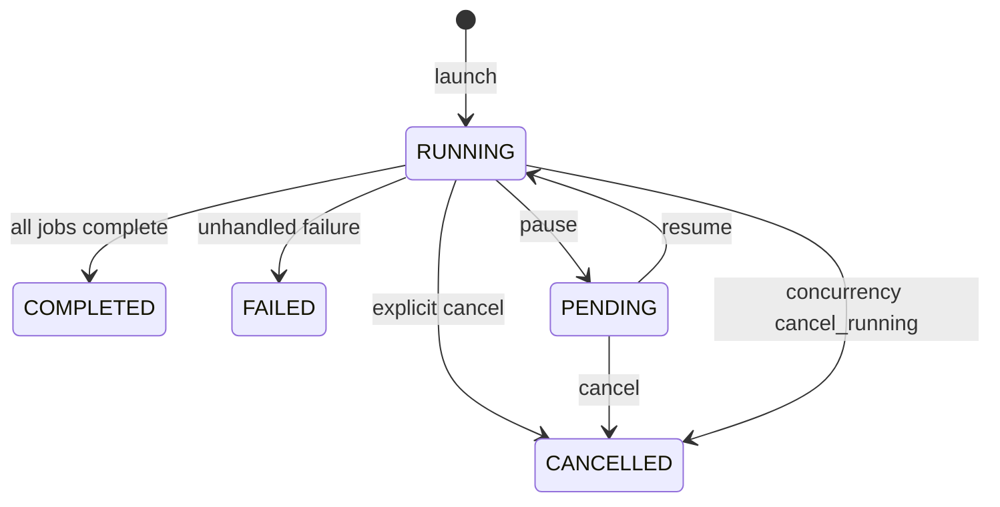
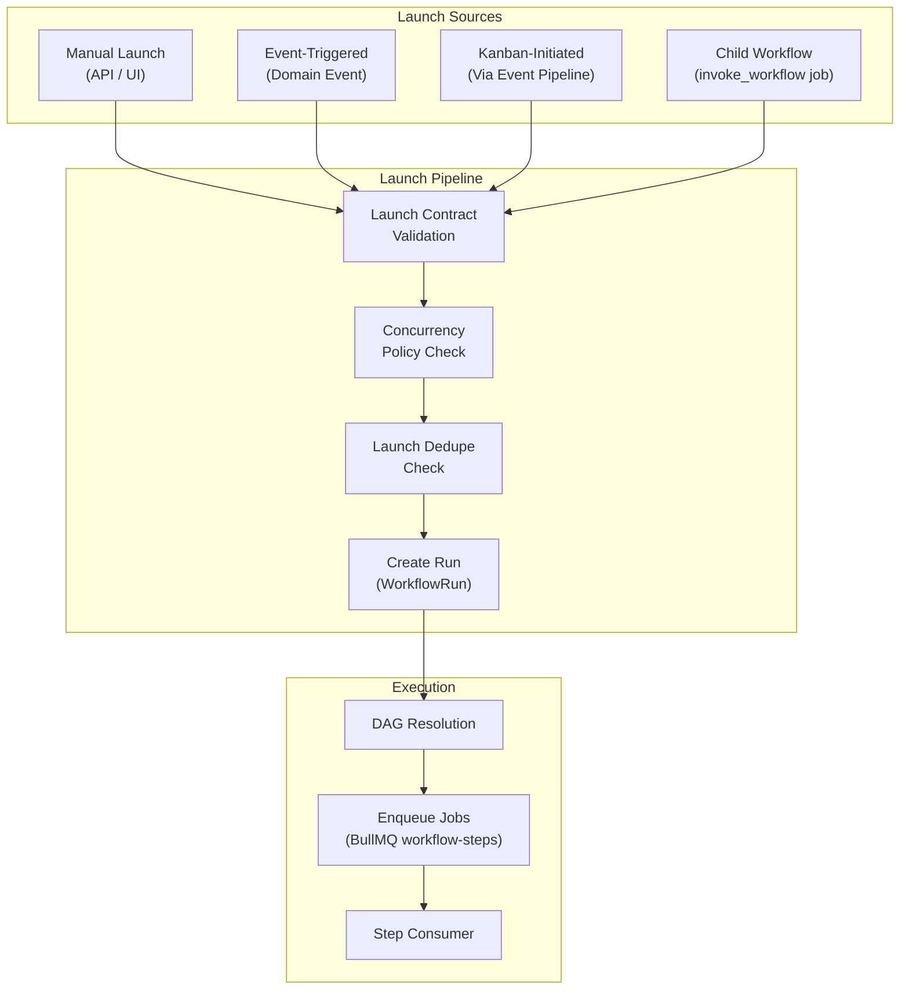
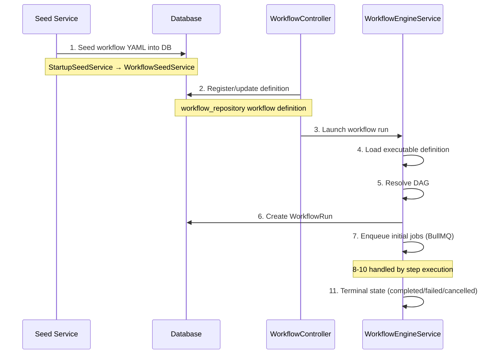

# 06 - Workflow Engine

The workflow engine is the heart of the Nexus Orchestrator. It parses YAML workflow definitions, resolves directed acyclic graphs (DAGs) of jobs and steps, launches workflow runs, pushes steps into execution queues, and manages state transitions through a finite state machine.

---

## What the Workflow Engine Does

1. **Parse YAML** — Reads workflow definition YAML files, validates them against the workflow schema, resolves template expressions (Handlebars `{{ trigger.field }}`), and produces an executable `IWorkflowDefinition`.
2. **Resolve DAG** — Builds a dependency graph from job `depends_on` / `needs` declarations, detects cycles, performs topological sort, and groups jobs into parallel execution waves.
3. **Launch Runs** — Validates trigger data against launch contracts, checks concurrency policies (max_runs, scope), deduplicates against active runs, creates `WorkflowRun` records, and enqueues initial jobs.
4. **Execute Steps** — Dequeues jobs from BullMQ, resolves AI configuration, launches Docker containers, mounts tools and workspace, and captures results.
5. **Manage State** — Transitions runs through a state machine: RUNNING → COMPLETED, FAILED, CANCELLED, or PENDING (paused).

---

## C4 Component Diagram: WorkflowModule + 12 Sub-Modules

```mermaid
graph TB
    subgraph "WorkflowModule Core"
        WE["WorkflowEngineService<br/>start, pause, resume, cancel"]
        WP["WorkflowParserService<br/>YAML → IWorkflowDefinition"]
        DAG["DAGResolverService<br/>Topological sort · parallel groups"]
        SM["StateMachineService<br/>Condition evaluation"]
        STM["StateManagerService<br/>Run state persistence"]
        WV["WorkflowValidationService<br/>Schema + runtime validation"]
        PL["PromptLoaderService<br/>Prompt file loading"]
        WDL["WorkflowDefinitionLoaderService<br/>Load executable defs"]
        WPS["WorkflowPersistenceService<br/>CRUD for WF/runs"]
        WCM["WorkflowConcurrencyManager<br/>Concurrency + dedupe"]
        WLD["WorkflowLaunchDedupeService<br/>Duplicate launch prevention"]
        WOC["WorkflowOutputContractService<br/>Output validation"]
        ECR["ExecutionContextResolverService<br/>Context resolution"]
        TR[("TriggerRegistryService<br/>Event → WF mapping")]
    end

    subgraph "Sub-Modules (12)"
        WL["WorkflowLaunchModule<br/>Launch API · contracts"]
        WRO["WorkflowRunOperationsModule<br/>Steering · reconciliation"]
        WSE["WorkflowStepExecutionModule<br/>BullMQ consumer · containers"]
        WSS["WorkflowSpecialStepsModule<br/>9 special handlers"]
        WSA["WorkflowSubagentsModule<br/>Provisioning · mesh"]
        WR["WorkflowRepairModule<br/>Failure classification"]
        WRT["WorkflowRuntimeModule<br/>Agent tools/capabilities"]
        WHM["WorkflowHostMountModule<br/>Mount resolution"]
        WIT["WorkflowInternalToolsModule<br/>Memory · schedule · todo"]
        WDT["WorkflowDelegationToolsModule<br/>Delegation capability tools"]
    end

    subgraph "Listeners"
        WA["WorkflowAuditListener"]
        WRP["WorkflowRedisPublisherListener"]
        WCLS["WorkflowCoreLifecycleStreamListener"]
        WT["WorkflowTelemetryListener"]
    end

    subgraph "Controllers"
        WC["WorkflowController"]
        WAHS["WorkflowAdHocSessionController"]
        WELC["WorkflowEventLogController"]
        WLC["WorkflowLifecycleController"]
        WRC["WorkflowRepositoryController"]
    end

    WE --> DAG
    WE --> WPS
    WE --> WCM
    WE --> WLD
    WE --> WDL
    WE --> STM
    WE -->|EventEmitter| WA
    WE -->|EventEmitter| WRP
    WE -->|EventEmitter| WT
    WE -->|enqueue| WSE

    WP --> WV
    WP --> PL

    TR --> WE

    WE --> WSE
    WSE --> WSS
    WSE --> WHM
    WSE --> WRT
    WSE --> WSA
```



---

## Workflow YAML Structure

A workflow definition is a YAML file with the following top-level structure:

```yaml
workflow_id: my_workflow # Unique identifier
name: My Workflow # Human-readable name
description: > # Multi-line description
  What this workflow does.

# Optional. Default: native. One of: native | search.
# Controls how assigned skills are surfaced to agents in this workflow.
# Overrides the agent-profile setting; overridden per-step by skill_discovery_mode on each step.
skill_discovery_mode: native

trigger: # How the workflow is invoked
  type: manual | event | scheduled
  name: EventName # For event triggers
  launch: # Manual launch contract
    context: none | optional | required | scope
    allow_raw_json: true
    inputs:
      - key: my_input
        label: My Input
        type: string
        required: true

concurrency: # Concurrency control
  max_runs: 1
  scope: trigger.scopeId # Template expression
  on_conflict: skip | queue | cancel

permissions: # Tool permission policy
  policy_strategy: profile_only # or workflow_only, profile_first
  allow_tools: [read, write, bash]
  deny_tools: []

jobs: # Ordered/parallel execution units
  - id: job_one
    type: execution | invoke_workflow | emit_event | register_tool
    tier: light | heavy
    depends_on: [job_zero] # DAG dependencies
    condition: "trigger.mode == 'fast'" # Execution guard
    inputs: # Resolved via Handlebars
      agent_profile: default
      prompt: |
        You are an agent. Task: {{ trigger.objective }}
    steps: # Sub-steps within a job
      - id: step_1
        type: agent | special
        prompt_file: prompts/my_prompt.md
        # Optional. Overrides workflow + agent-profile settings for this step only.
        skill_discovery_mode: search
    output_contract: # Required output fields
      required: [summary, status]
    max_retries: 2
    retry_prompt: >
      Retry instructions for the agent.
```

### Job Types

| Type              | Description                                                                     |
| ----------------- | ------------------------------------------------------------------------------- |
| `execution`       | Standard AI agent job. Steps run inside a Docker container with AI model.       |
| `invoke_workflow` | Launches another workflow as a child run. The result becomes this job's output. |
| `emit_event`      | Publishes a domain event (no container). Used for lifecycle signaling.          |
| `register_tool`   | Registers a tool candidate into the tool registry.                              |
| `special`         | Delegates to a special step handler (e.g., git operation, webhook).             |

### Step Types

| Type      | Description                                                          |
| --------- | -------------------------------------------------------------------- |
| `agent`   | Standard AI step — agent receives prompt and tools, produces output. |
| `special` | Delegates to a `ISpecialStepHandler` implementation.                 |
| `ai_step` | (Legacy alias for `agent`)                                           |

### DAG Dependencies

Jobs declare dependencies via `depends_on`:

```yaml
jobs:
  - id: build
    type: execution
    steps: [...]
  - id: test
    type: execution
    depends_on: [build] # test waits for build to complete
  - id: deploy
    type: execution
    depends_on: [test] # deploy waits for test
```

### Trigger Types

| Trigger     | Description                                                                                                          |
| ----------- | -------------------------------------------------------------------------------------------------------------------- |
| `manual`    | Launched via API or UI. Has a `launch` contract defining inputs.                                                     |
| `event`     | Triggered when a named domain event is published. `WorkflowTriggerRegistryService` maps event names to workflow IDs. |
| `scheduled` | Cron-based scheduling (part of `AutomationModule`).                                                                  |

### Conditions

Jobs and steps can have `condition` fields that evaluate Handlebars expressions against `state_variables`:

```yaml
condition: "trigger.risk_level == 'high'"
```

The condition is evaluated by `StateMachineService.evaluateTransition()` using the `expr-eval` library.

### Skill Discovery Mode

`skill_discovery_mode` controls how assigned skills are surfaced to agents. It is settable at three levels with a most-specific-wins precedence: **step → workflow → agent profile → default (`native`)**.

| Value    | Behavior                                                                                                                                                                                                                                             |
| -------- | ---------------------------------------------------------------------------------------------------------------------------------------------------------------------------------------------------------------------------------------------------- |
| `native` | **(Default)** The agent's assigned skills are listed by name and description in its system prompt. The agent loads full content via `read_skill_manifest`. The `search_skills` tool is suppressed — the agent can only reach its assigned skill set. |
| `search` | Skills are not listed in the prompt. The agent uses `search_skills` to discover any active skill (legacy behavior).                                                                                                                                  |

`read_skill_manifest` is available in both modes.

```yaml
workflow_id: example
name: Example
# Optional. Default: native. One of: native | search.
skill_discovery_mode: native
jobs:
  - id: build
    type: execution
    tier: heavy
    steps:
      - id: implement
        # Step setting overrides the workflow + agent-profile settings.
        skill_discovery_mode: search
```

The agent-profile level is read from the `skill_discovery_mode` column on the agent profile record. A value set directly on the record participates in the precedence cascade; it is not yet exposed through the agent-profile seed builder or create/update API, so use the workflow or step level in YAML to override per run.

### Skill Assignment (`skills:` YAML surface)

Separate from `skill_discovery_mode` (which controls _how_ assigned skills
are surfaced), `skills:` controls _which_ skills are assigned in the first
place, at author time. It is settable at the workflow level and per-step,
and is additive with skills assigned to the agent profile:

```yaml
workflow_id: example
name: Example
skills: [global-skill] # Optional. Assigned to every step in this workflow.
jobs:
  - id: build
    type: execution
    tier: heavy
    steps:
      - id: implement
        type: agent
        inputs:
          skills: [step-skill] # Optional. Assigned only to this step.
```

Both fields must be arrays of non-empty strings (validated at parse time by
`WorkflowParserService.validateSkillsShape`); unknown skill names are a
**warning**, not a validation error (`validateSkillReferences`,
`unknown_skill_reference` diagnostic code), so a typo doesn't block a
workflow launch.

At runtime, the shared `resolveEffectiveSkills` helper
(`apps/api/src/workflow/agent-prompt/effective-skills.helpers.ts`) merges
this YAML surface with the agent profile's own skills **and** any runtime
`workflow_skill_bindings` (skills assigned by the self-improvement pipeline —
see [48 — Improvement Pipeline](48-improvement-pipeline.md#skill-assignment-epic-b)),
tagging each resolved skill by its most specific source with a
**step → workflow → profile** precedence — the same specificity ordering as
`skill_discovery_mode` above, but this cascade unions all sources instead of
picking one. The two are independent: `skill_discovery_mode` still governs
whether the union is listed in-prompt (`native`) or left to `search_skills`
discovery (`search`).

Unlike `workflow_skill_bindings` (runtime-only, DB-backed, survives a
workflow reseed), the `skills:` YAML surface is part of
`workflows.yaml_definition` and **is** reset on reseed like any other
workflow field.

---

## DAG Resolution

`DAGResolverService` performs the following:

1. **Build Graph** — Iterates all jobs, extracts `depends_on` / `needs` arrays, validates that all dependency targets exist among job IDs, and validates transition targets.
2. **Detect Cycles** — DFS-based cycle detection. Throws `BadRequestException` if a circular dependency is found.
3. **Topological Sort** — Kahn's algorithm with in-degree counting. Produces a linear ordering respecting all dependencies.
4. **Find Parallel Groups** — Assigns each node a level (distance from root), groups nodes at the same level into parallel execution waves.



Waves execute sequentially; jobs within a wave execute in parallel (each enqueued as a separate BullMQ job).

---

## State Machine

### Workflow Run States



### State Transitions

| From      | To          | Trigger                                                              |
| --------- | ----------- | -------------------------------------------------------------------- |
| (none)    | `RUNNING`   | `WorkflowEngineService.createAndStartRun()`                          |
| `RUNNING` | `COMPLETED` | All jobs finished, no more to enqueue                                |
| `RUNNING` | `FAILED`    | Step failure with no retry/repair path                               |
| `RUNNING` | `CANCELLED` | `cancelWorkflowRun()` — kills Docker containers, removes queued jobs |
| `RUNNING` | `PENDING`   | `pauseWorkflow()` — stops enqueuing new jobs                         |
| `PENDING` | `RUNNING`   | `resumeWorkflow()` — re-enqueues current step                        |

### Run Timestamps

Workflow runs persist two timestamp fields alongside `status`:

- **`started_at`** — set on the first transition into `RUNNING`; never overwritten by subsequent transitions (e.g. `PENDING → RUNNING` resume).
- **`completed_at`** — set on the first terminal transition (`COMPLETED`, `FAILED`, or `CANCELLED`); idempotent so retries and reconciliation cannot clobber it.

Both fields are `null` for runs that were created but never started. Historical rows (created before this feature) are backfilled: `started_at` defaults to `created_at` and `completed_at` defaults to `updated_at` where the run is already in a terminal state.

Each state transition emits an `EventEmitter2` event:

- `WORKFLOW_RUN_STARTED_EVENT`
- `WORKFLOW_RUN_COMPLETED_EVENT`
- `WORKFLOW_RUN_CANCELLED_EVENT`
- `WORKFLOW_RUN_PAUSED_EVENT`
- `WORKFLOW_RUN_RESUMED_EVENT`

Listeners (`WorkflowAuditListener`, `WorkflowRedisPublisherListener`, `WorkflowCoreLifecycleStreamListener`, `WorkflowTelemetryListener`) react to these events for audit logging, Redis publishing, and telemetry.

---

## Trigger System

### Event Triggers

`WorkflowTriggerRegistryService` maintains a mapping of event names to workflow IDs. When a domain event is published (e.g., `ProjectOrchestrationCycleRequestedEvent`), the registry looks up which workflows subscribe to that event and launches them with the event payload as trigger data.

### Manual Triggers

`WorkflowLaunchContractService` builds launch contracts from YAML definitions. Contracts specify required context (none, optional, required, scope), input fields, and whether raw JSON is accepted. The launch API validates inputs against these contracts before starting a run.

### Kanban-Initiated Triggers

Kanban domain events flow through the generic event ingestion pipeline. The API records them with neutral `scopeId`/`contextId` fields. Workflows subscribing to Kanban events receive trigger data through the same event trigger registry.

---

## Launch Paths



### Child Workflow Invocation

An `invoke_workflow` job type triggers `WorkflowEngineService.startWorkflow()` for the target workflow. The parent run waits for the child to complete. Child runs are tracked via `parent_run_id` on the `WorkflowRun` entity. When cancelling a parent, all active child runs are cancelled recursively (`cancelActiveChildRuns`).

---

## Concurrency Policies

Workflow YAML can define concurrency controls:

```yaml
concurrency:
  max_runs: 1
  scope: trigger.scopeId
  on_conflict: skip
```

| `on_conflict` | Behavior                                                     |
| ------------- | ------------------------------------------------------------ |
| `skip`        | New launch is dropped if `max_runs` is reached               |
| `queue`       | New launch is persisted as a queued run for later processing |
| `cancel`      | Existing run is cancelled, new run starts                    |

`ConcurrencyPolicyService` resolves the scope template against trigger data. For example, `scope: trigger.scopeId` means only one run per scope is allowed. `scope: global` means one run across all scopes.

### Launch Deduplication

`WorkflowLaunchDedupeService` prevents duplicate launches from near-simultaneous triggers. It derives a dedupe key from trigger data and checks for an existing active run with the same key. The check runs inside a Redis-based exclusive lock (`WorkflowConcurrencyManager.runExclusive()`).

---

## Validation Pipeline

1. **YAML Schema Validation** — `WorkflowBootstrapValidatorService` validates the raw YAML structure against the workflow schema (required fields, types, valid trigger configurations).
2. **Bootstrap Validation** — Validates that referenced jobs, workflow IDs, profiles, and prompt files exist.
3. **Runtime Validation** — `WorkflowValidationService` validates trigger data against launch contracts. `WorkflowOutputContractService` validates job outputs against `output_contract` definitions.

---

## Workflow Definition Lifecycle



| Phase        | Service                                 | Description                                                            |
| ------------ | --------------------------------------- | ---------------------------------------------------------------------- |
| **Seed**     | `WorkflowSeedService`                   | Reads YAML files from `seed/workflows/`, upserts into `workflow` table |
| **Register** | `WorkflowRepositoryController`          | API for listing, creating, updating, and deleting workflow definitions |
| **Launch**   | `WorkflowEngineService.startWorkflow()` | Validates, applies concurrency, creates `WorkflowRun`, enqueues jobs   |
| **Execute**  | `StepExecutionConsumer`                 | Dequeues jobs, runs containers, captures results                       |
| **Terminal** | `WorkflowTerminalRunCloserService`      | Handles completion, failure, or cancellation cleanup                   |
