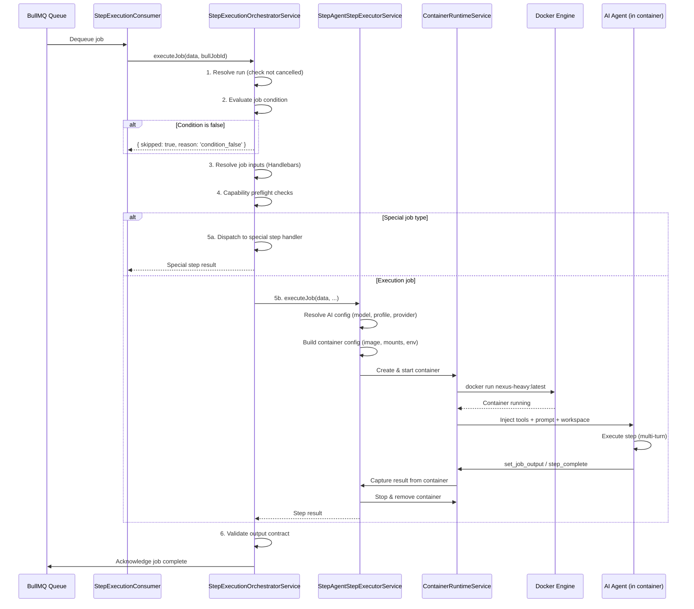

# 07 - Workflow Step Execution

Step execution is where workflow runs actually happen. Each job in a workflow run is enqueued into BullMQ, dequeued by a consumer, and executed inside a Docker container. This document covers the full execution pipeline from queue to result.

---

## Step Queue Consumer Architecture

The step execution system uses BullMQ with Redis as the backing store:

```
Workflow Launch → enqueue jobs → BullMQ 'workflow-steps' queue → StepExecutionConsumer → Docker Container → Result
```

### Key Services

| Service                                   | Responsibility                                                                                                       |
| ----------------------------------------- | -------------------------------------------------------------------------------------------------------------------- |
| `StepExecutionConsumer`                   | BullMQ `@Processor('workflow-steps', { concurrency: 4 })` — dequeues jobs, delegates to orchestrator                 |
| `StepExecutionOrchestratorService`        | Top-level step execution coordinator: validates runs, evaluates conditions, dispatches to special or agent executors |
| `StepAgentStepExecutorService`            | Executes agent-type steps inside Docker containers                                                                   |
| `StepSpecialStepExecutorService`          | Dispatches to registered `ISpecialStepHandler` implementations                                                       |
| `StepContainerRuntimeService`             | Manages Docker container lifecycle for step execution                                                                |
| `StepAgentContainerSupportService`        | Builds container configs, mounts, environment for agent steps                                                        |
| `StepSupportService`                      | Shared helpers: input resolution, tool selection, policy application                                                 |
| `StepEventPublisherService`               | Publishes step lifecycle events (started, completed, failed)                                                         |
| `StepRequiredToolRetryService`            | Detects missing-required-tool failures and schedules retry                                                           |
| `WorkflowAutoRetryActivationGuardService` | Guards against retry loops — prevents runaway auto-retries                                                           |

### BullMQ Configuration

```typescript
// RedisModule sets global defaults:
defaultJobOptions: {
  attempts: 3,
  backoff: { type: 'exponential', delay: 1000 },
  removeOnComplete: true,
  removeOnFail: false,
}
```

The `workflow-steps` queue is registered in both `WorkflowModule` and `WorkflowStepExecutionModule`. The consumer has `concurrency: 4` — up to 4 jobs execute simultaneously.

---

## Container Execution Flow



### Container Images

| Image                | Use                                                                    |
| -------------------- | ---------------------------------------------------------------------- |
| `nexus-light:latest` | Lightweight steps: emit_event, register_tool, git operations, webhooks |
| `nexus-heavy:latest` | AI agent steps with full tool suite, browser automation, multi-turn    |

The image is selected per job based on the `tier` field: `light` or `heavy`.

### Container Configuration

`StepAgentContainerSupportService` builds the container configuration:

- **Image**: Selected from job `tier`
- **Environment**: Provider credentials (resolved from `SecretVaultService`), model name, API keys, runner config
- **Mounts**: Workspace (host mount), tool directories, skill files, prompt files
- **Network**: Connected to the Nexus Docker network for API communication
- **Labels**: `nexus.managed=true`, `nexus.workflow_run_id=<id>`, `nexus.job_id=<id>` — used for cleanup on cancellation

---

## Retry Policy

### Failure Detection

Failures are detected at multiple levels:

1. **Container failure** — Docker container exits with non-zero code or fails to start
2. **Tool failure** — Agent encounters a required-tool-not-found error (`StepRequiredToolRetryService`)
3. **Output contract failure** — Agent's output doesn't satisfy `output_contract.required` fields
4. **Timeout** — Container exceeds execution time limit
5. **Provider overload** — LLM provider returns rate limit or overload errors

### Retry Mechanics

| Mechanism                   | Description                                                                                                                                          |
| --------------------------- | ---------------------------------------------------------------------------------------------------------------------------------------------------- |
| **BullMQ built-in**         | 3 attempts with exponential backoff (1s → 2s → 4s) configured globally                                                                               |
| **Job-level retries**       | `max_retries` in job YAML overrides the default                                                                                                      |
| **Retry prompt**            | `retry_prompt` in job YAML provides context to the agent on retry: "You must call set_job_output. Required fields: decision, confidence, rationale." |
| **Provider overload retry** | `WorkflowProviderOverloadRetryHelpers` detects rate-limit errors and applies longer backoff                                                          |
| **Auto-retry guard**        | `WorkflowAutoRetryActivationGuardService` prevents infinite retry loops by capping consecutive auto-retries                                          |
| **Non-retryable failures**  | `WorkflowNonRetryableFailuresHelpers` classifies certain errors as terminal (e.g., invalid workflow definition, missing required credential)         |
| **Failed job recovery**     | `WorkflowFailedJobRetryService` provides manual retry of failed jobs with updated instructions                                                       |
| **Job message queue**       | `WorkflowJobMessageQueueService` allows resuming a paused job with a user-provided message                                                           |

### Retry Decision Flow

```
Step Fails
    ↓
Is error non-retryable? → YES → Mark run FAILED
    ↓ NO
Is max_retries reached? → YES → Escalate to WorkflowRepairModule
    ↓ NO
Is it a required-tool error? → YES → StepRequiredToolRetryService: add missing tool + retry
    ↓ NO
Is it a provider overload? → YES → Apply longer backoff + retry
    ↓ NO
General retry: apply retry_prompt (if defined), re-enqueue
```

---

## Special Step Handlers

Special steps bypass the AI agent container and execute predefined logic directly. All implement the `ISpecialStepHandler` interface.

| Handler                 | YAML `type`             | Description                                                                                                                                                 |
| ----------------------- | ----------------------- | ----------------------------------------------------------------------------------------------------------------------------------------------------------- |
| `emit-event`            | `emit_event`            | Publishes a domain event with the configured payload. No container. Used for workflow lifecycle signaling (e.g., `StandardFeatureFlowStageCompletedEvent`). |
| `git`                   | `git_operation`         | Executes git operations (clone, checkout, branch, commit) in the workspace. Uses `GitWorktreeModule`.                                                       |
| `webhook`               | `http_webhook`          | Sends an HTTP request to a configured webhook URL. Supports GET, POST with JSON payload.                                                                    |
| `invoke-workflow`       | `invoke_workflow`       | Launches another workflow as a child run. Waits for the child to complete and captures its result as job output.                                            |
| `mcp-tool`              | `mcp_tool_call`         | Calls an MCP tool on a configured MCP server. Bridges workflow execution with MCP protocol.                                                                 |
| `register-tool`         | `register_tool`         | Registers a tool candidate into the tool registry. Follows the tool candidate lifecycle (create → validate → publish).                                      |
| `run-command`           | `run_command`           | Executes a shell command directly (without AI agent). Used for simple script execution.                                                                     |
| `web-automation`        | `web_automation`        | Performs browser automation using Playwright. Navigates pages, clicks, types, takes screenshots.                                                            |
| `manage-tool-candidate` | `manage_tool_candidate` | Manages the tool candidate lifecycle — creates, validates, publishes, or rejects tool candidates.                                                           |

### Handler Registration

Handlers are registered in `WorkflowSpecialStepsModule` via the `SPECIAL_STEP_HANDLER` injection token. `StepSpecialStepExecutorService` iterates registered handlers and dispatches to the one matching the job type.

---

## Host Mount Resolution

`WorkflowHostMountModule` resolves how files on the host filesystem are mounted into execution containers.

### Services

| Service                                      | Responsibility                                                       |
| -------------------------------------------- | -------------------------------------------------------------------- |
| `HostMountResolutionService`                 | Resolves mount paths from workflow configuration and system settings |
| `HostMountAuditService`                      | Audits mount resolution results for diagnostics                      |
| `HostMountStartupValidationService`          | Validates mount configurations on system startup                     |
| `WorkflowHostMountRuntimeDiagnosticsService` | Collects mount diagnostics during runtime for repair/feedback        |

### Mount Types

1. **Workspace mount** — The project workspace directory is mounted into the container so the agent can read/write files
2. **Tool mount** — Tool directories are mounted so the agent has access to runtime tools (bash, read, write, edit)
3. **Skill mount** — Agent skill files (SKILL.md, supporting files) are mounted for reference
4. **Prompt mount** — Prompt template files are mounted for step execution

Mount paths are resolved relative to the Docker host path, which is configurable via environment variables. The system handles Docker host path remapping to ensure consistency between host and container paths.

---

## Tool Mounting

Runtime tools are injected into execution containers through the tool mounting system:

1. `ToolRegistry` entities define tool metadata (name, schema, handler path)
2. `CapabilityInfraModule` maps capability manifests to tool registry entries
3. During container setup, `StepAgentContainerSupportService` resolves allowed tools based on:
   - Workflow permission policy (`allow_tools` / `deny_tools`)
   - Job-level permission overrides (`permissions` at job level)
   - Profile-based tool policies (`policy_strategy`)
   - Capability governance policy decisions
4. Allowed tools are mounted into the container as executable scripts or API endpoints
5. The agent inside the container discovers tools via `get_capabilities` and invokes them

### Tool Permission Policy

Policies are evaluated in order:

1. **Job-level** `permissions` override workflow-level
2. **Profile-based** (`profile_only` strategy) uses the agent profile's allowed tools
3. **Workflow-based** (`workflow_only` strategy) uses the workflow's permission list
4. **Profile-first** (`profile_first` strategy) starts with profile tools, allows workflow overrides
5. **Capability governance** evaluates runtime tool call approval rules

---

## Step Output Contracts

Jobs can define an `output_contract` specifying required and optional output fields:

```yaml
jobs:
  - id: quality_check
    type: execution
    output_contract:
      required: [summary, pass_fail_status]
      optional: [findings, recommendations]
```

### Validation

`WorkflowOutputContractService` validates that the agent's output contains all required fields. If validation fails:

- The step is retried with a `retry_prompt` that explicitly lists missing fields
- If `max_retries` is exhausted with validation failure, the job is marked as failed

### Empty Values Are Not Satisfied

A declared field (`required`, or typed via `types`) that is present but empty
— `""`, `[]`, or `{}` — does not satisfy the contract. This is enforced at two
points:

- **Write-time**: `set_job_output` rejects an empty value for a declared field
  with a `BadRequestException` before anything persists.
- **Post-turn validation**: `WorkflowOutputContractService.validateOutputContract`
  (via `validateShape`) reports an empty declared field in `missing`, driving
  the same retry-prompt/exhaustion path as an absent field.

This matters because downstream Handlebars conditions
(e.g. `{{#if jobs.some_job.output.some_field}}`) and DAG gates treat an empty
string the same as absent. Without this check, a model that silently
serializes a required field as `""` would pass contract validation while
leaving every consumer with no usable data.

> **Model compatibility note:** avoid declaring `object`/array-of-object output
> fields on jobs that may route to an OpenAI-compatible completions provider.
> Some providers' streaming tool-call JSON repair can mis-terminate a string
> embedded inside a nested object and silently drop that field plus its
> siblings, even though the full payload was received intact. Prefer flat
> string or array-of-string fields (e.g. markdown text) for content that must
> survive reliably, and reserve nested-object schemas for jobs pinned to a
> provider with robust structured tool-call output.

### Reconciliation — guarding against fabricated counts

A contract may add `reconcile` rules to bind a reported numeric field to the
number of times the agent actually succeeded in calling a tool:

```yaml
output_contract:
  required: [items_created]
  types: { items_created: integer }
  reconcile:
    - field: items_created
      tool: kanban.work_item_create
```

After the `required`/`types` checks pass, `WorkflowOutputContractService` counts
successful `tool.execution.completed` events for `tool` scoped to the run and
job (via the `IToolExecutionCounter` port, backed by the event ledger) and
fails the contract unless the reported value equals that count. This closes a
"laundered success" gap where an agent that lacked the create tool (e.g. its
profile stripped it from the catalog) reported items it never created — the job
now fails honestly instead of completing green. The reconciliation mismatch is
included in the retry prompt so the agent is nudged to actually call the tool.

> **`max_retries` defaults to `0`.** A job that declares an `output_contract` but no
> `max_retries` gets **zero** nudge-back retries — if the agent ends its turn without
> calling `set_job_output` (or emits a field of the wrong type), the run fails
> immediately with no recovery prompt. Any execution job whose completion depends on the
> agent remembering a terminal `set_job_output` call should set `max_retries: >= 1` so the
> engine can re-prompt. See `StepRequiredToolRetryService.checkOutputContractAndRetry`.

### Contract Enforcement

The agent signals completion via `set_job_output` or `step_complete` runtime tools. The runtime captures the JSON payload and `StepExecutionOrchestratorService` validates it against the contract before marking the job complete.

---

## Execution Lifecycle

Each agent step runs through the `ExecutionLifecycleModule` (`apps/api/src/execution-lifecycle/`), which owns the per-execution health record independently of the BullMQ job state.

The key points for step execution:

- **Fire-and-poll dispatch** — `StepExecutionOrchestratorService` creates an `ExecutionEntity` (kind `workflow_step`), claims an owner lease for the background promise, fires the container job, and returns immediately to release the BullMQ lock. Completion arrives later via `StepExecutionCompletionListener`.
- **Heartbeat wiring** — Every container log chunk calls `ExecutionHeartbeatService.recordActivity(executionId, 'container_log')`, which refreshes `last_heartbeat_at` in the DB (throttled to once per 15 s).
- **Owner-lease recovery** — If the API process dies while owning the background promise, the lease stops renewing. Once the lease is expired and the event ledger shows no recent activity for the same job, the supervisor emits `execution.reaped` with `idle_timeout`, and the listener routes it through interruption recovery and retry.
- **Supervisor exemption** — The `ExecutionSupervisorService` (30 s sweep) deliberately skips generic heartbeat-based `idle_timeout` reaping for `workflow_step` executions. `container_lost`, `max_runtime_exceeded`, and expired-owner-lease orphan recovery still apply.
- **Terminal-state guard** — When a `workflow_step` execution is reaped, `StepExecutionCompletionListener` checks for a sibling execution that already completed the same job before scheduling a retry. This prevents duplicate containers when a stale entity is reaped after the job has succeeded.

See **[42 — Execution Lifecycle](42-execution-lifecycle.md)** for the full execution entity state machine, reaping rules, heartbeat pipeline, and failure reason codes.
