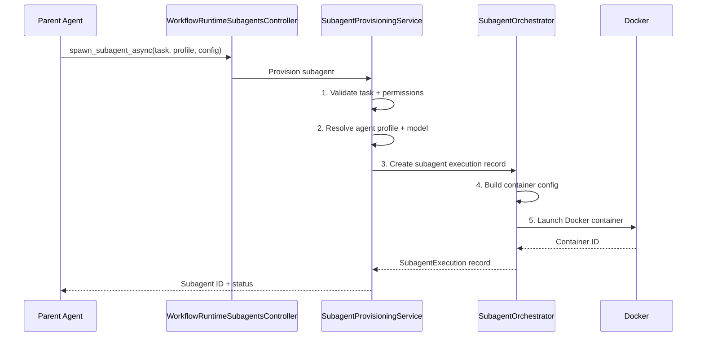
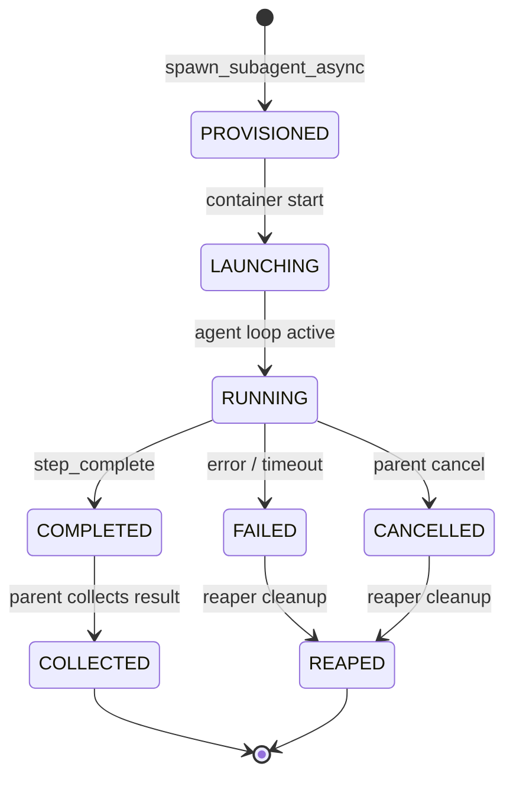
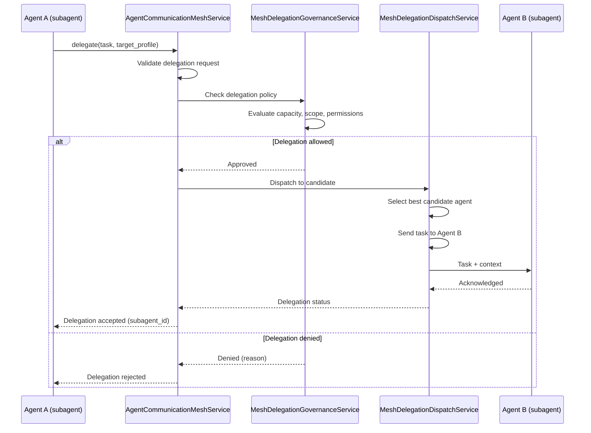

# 09 - Workflow Subagents

Subagents enable parallel execution within workflows. A parent agent can spawn multiple subagents to work on independent tasks simultaneously, then collect and aggregate their results. The subagent system handles provisioning, lifecycle management, mesh communication, and capacity-aware pooling.

---

## Subagent Provisioning

When a workflow step requires parallel work, the parent agent calls `spawn_subagent_async` (or a delegation tool) which triggers the subagent provisioning pipeline.

### Provisioning Pipeline

### Key Services

| Service                         | Responsibility                                                                                                    |
| ------------------------------- | ----------------------------------------------------------------------------------------------------------------- |
| `SubagentProvisioningService`   | Entry point for subagent creation — validates task, resolves profile/model, delegates to orchestrator             |
| `SubagentOrchestrator`          | Orchestrator with specialized operations modules: spawn, kickoff, container config, coordination, skills, runtime |
| `SubagentCoordinationService`   | Manages the coordination lifecycle: subagent groups, wait conditions, result aggregation                          |
| `SubagentReapedListener`        | Handles `execution.reaped` events for subagent executions — removes containers, cancels mesh delegations          |
| `SubagentLifecycleEventService` | Publishes lifecycle events for subagent state transitions                                                         |
| `SubagentParentLockService`     | Ensures the parent agent doesn't terminate while subagents are active                                             |
| `SubagentParentResumeService`   | Handles parent agent resumption after subagents complete                                                          |

### Subagent Orchestrator Operations

The orchestrator is split into specialized operation modules:

| Module                         | Purpose                                                                       |
| ------------------------------ | ----------------------------------------------------------------------------- |
| `container-config.operations`  | Builds Docker container configuration for subagents                           |
| `spawn.operations`             | Validates spawn requests, creates execution records, enforces capacity limits |
| `kickoff-execution.operations` | Launches the container and starts the subagent's execution loop               |
| `coordination.operations`      | Manages coordination groups, dependency tracking between subagents            |
| `runtime.operations`           | Handles runtime callbacks from subagent containers                            |
| `skills.helpers`               | Resolves and mounts skill files for subagent execution                        |
| `utils`                        | Shared helpers: result sanitization, ID generation, config normalization      |

### Skill Resolution

`subagent-orchestrator.skills.helpers.ts` resolves a subagent's assigned
skills via the same shared `resolveAgentAssignedSkills` helper the
step-executor path uses (`apps/api/src/workflow/agent-prompt/agent-assigned-skills.helpers.ts`,
built on `resolveEffectiveSkills` — see
[48 — Improvement Pipeline](48-improvement-pipeline.md#skill-assignment-epic-b)
and [06 — Workflow Engine](06-workflow-engine.md#skill-assignment-skills-yaml-surface)).
This closed a historical divergence bug where the subagent path
re-implemented skill resolution independently of the step-executor path and
silently dropped sources (e.g. job-scoped tool policy). The parent step's
YAML id is threaded through `SubagentSpawnParams.parent_step_id` (set from
the agent JWT's `stepId` claim in `WorkflowRuntimeSubagentToolsService`), so
**step-scoped** YAML `skills:`/`workflow_skill_bindings` reach subagents the
same way they reach the step executor — only subagents spawned outside a
step context (no `parent_step_id`) fall back to workflow-level-only sources.

---

## Subagent Lifecycle

### Lifecycle Stages

| Stage           | Description                                         | Trigger                                                     |
| --------------- | --------------------------------------------------- | ----------------------------------------------------------- |
| **PROVISIONED** | Execution record created in DB, resource allocated  | `spawn_subagent_async`                                      |
| **LAUNCHING**   | Docker container being started, tools being mounted | Container creation                                          |
| **RUNNING**     | Agent executing its task inside the container       | Container running                                           |
| **COMPLETED**   | Agent called `step_complete` or `set_job_output`    | Agent completion                                            |
| **FAILED**      | Unrecoverable error or timeout                      | Error event                                                 |
| **CANCELLED**   | Parent workflow cancelled or explicit cancel call   | Cancel signal                                               |
| **COLLECTED**   | Parent agent retrieved and processed the result     | `wait_for_subagents`                                        |
| **REAPED**      | Containers removed, resources released              | `ExecutionSupervisorService` (via `execution.reaped` event) |

### Reaping

Subagents are reaped by `ExecutionSupervisorService` (30 s sweep interval). When it detects an idle, container-lost, or spawn-timeout execution it publishes an `execution.reaped` domain event. `SubagentReapedListener` handles the event by stopping the Docker container and cancelling any pending mesh delegations. `ChatSessionTerminalRouter` (in `chat-execution`) marks the linked `chat_sessions` row as `FAILED` via the idempotent `failIfNotTerminal` writer. This replaces the former `SubagentExecutionReaperService` standalone sweeper.

---

## Mesh Delegation

The mesh delegation system enables subagents to communicate and delegate work to each other — forming a peer-to-peer mesh of collaborating agents.

### Delegation Flow

### Mesh Services

| Service                                 | Responsibility                                                                                  |
| --------------------------------------- | ----------------------------------------------------------------------------------------------- |
| `AgentCommunicationMeshService`         | Central mesh hub — routes messages between agents, maintains agent presence                     |
| `MeshDelegationService`                 | Entry point for delegation requests — validates, routes, tracks                                 |
| `MeshDelegationGovernanceService`       | Policy enforcement — determines if delegation is allowed based on scope, permissions, and trust |
| `MeshDelegationCandidateQueryService`   | Queries available agents that could handle a delegation request                                 |
| `MeshDelegationCapacityPolicyService`   | Enforces capacity limits — prevents overloading busy agents                                     |
| `MeshDelegationDispatchService`         | Dispatches delegation to the selected candidate agent                                           |
| `MeshDelegationDispatchExecutorService` | Executes the dispatch — sends the actual task payload                                           |
| `MeshDelegationStatusUpdaterService`    | Updates delegation status (accepted, running, completed, failed)                                |
| `MeshDelegationAuditPublisherService`   | Publishes delegation events to the audit trail                                                  |

---

## Peer Communication Protocol

Subagents communicate through the mesh using a structured protocol:

1. **Presence registration** — When a subagent starts, it registers with `AgentCommunicationMeshService` (agent ID, capabilities, current load)
2. **Capability advertisement** — Agents advertise their capabilities (available tools, agent profile, current task context)
3. **Delegation request** — Agent A sends a structured delegation request: `{ task, target_profile?, priority, deadline }`
4. **Governance check** — `MeshDelegationGovernanceService` validates the request against policy
5. **Candidate selection** — `MeshDelegationCandidateQueryService` finds matching agents; `MeshDelegationCapacityPolicyService` filters by capacity
6. **Task dispatch** — `MeshDelegationDispatchExecutorService` sends the task to the selected agent via the mesh
7. **Result delivery** — The delegated agent completes the task and publishes results back through the mesh
8. **Audit** — Every delegation event is recorded by `MeshDelegationAuditPublisherService`

---

## Worktree Management for Subagents

`GitWorktreeModule` provides isolated git worktrees for subagents:

1. When a subagent is provisioned, it may receive its own git worktree (isolated working directory)
2. The worktree is mounted into the subagent's Docker container
3. The subagent can make changes without affecting other subagents or the parent
4. On completion, the worktree is cleaned up (branches merged or discarded based on policy)

---

## Capacity-Aware Subagent Pooling

`MeshDelegationCapacityPolicyService` enforces limits to prevent resource exhaustion:

| Limit                                          | Description                                                                   |
| ---------------------------------------------- | ----------------------------------------------------------------------------- |
| **Max concurrent subagents per run**           | System setting controlling how many subagents a single workflow run can spawn |
| **Max concurrent subagents per agent profile** | Limits per profile to prevent overloading shared profiles                     |
| **Agent load balancing**                       | Selects the least-loaded agent among candidates                               |
| **Queue depth limiting**                       | Rejects delegations if the target agent's queue is full                       |
| **Container resource limits**                  | CPU/memory limits enforced via Docker container config                        |

---

## Subagent Execution Telemetry

Subagent telemetry is emitted through the event system:

| Event                      | Description                                                              |
| -------------------------- | ------------------------------------------------------------------------ |
| `SubagentLifecycleEvent`   | Emitted at each lifecycle stage transition                               |
| `MeshDelegationAuditEvent` | Every delegation (success or failure) is audited                         |
| Container telemetry        | Containers send heartbeat and status via WebSocket to `TelemetryGateway` |
| Cost tracking              | Token usage and compute costs are tracked per subagent execution         |
| Event ledger               | All subagent events are appended to the immutable `EventLedger`          |

The `SubagentLifecycleEventService` publishes structured events that feed into:

- `ObservabilityModule` (metrics, cost tracking)
- `WorkflowTelemetryListener` (real-time UI updates)
- `WorkflowAuditListener` (audit trail)
