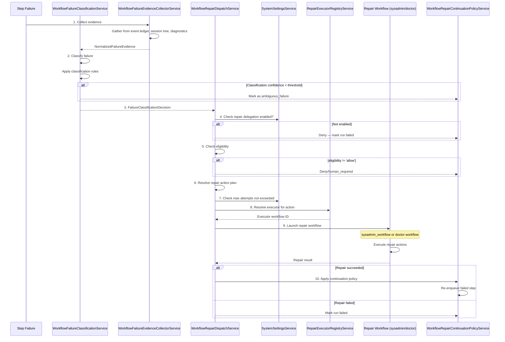

# 10 - Workflow Repair

When a workflow step fails, the repair system classifies the failure, determines whether it is repairable, and dispatches the appropriate repair action — ranging from automated retry to in-process runtime remediation. Source-code fixes are diagnosed and filed as `code_change` proposals that flow through the governed improvement-proposal → work-item pipeline rather than an autonomous standalone agent. If repair succeeds, the workflow continues; if not, the run is marked as failed.

> **Operator configuration required.** Automated repair delegation is **disabled by default**. See [Operator Configuration](#operator-configuration) below for the system settings you must enable before the repair pipeline fires.

---

## Operator Configuration

The repair pipeline is gated by two runtime settings stored in the `system_settings` table (managed via `SystemSettingsService`):

| Setting Key                               | Default | Description                                                                                                  |
| ----------------------------------------- | ------- | ------------------------------------------------------------------------------------------------------------ |
| `workflow_repair_delegation_enabled`      | `false` | Master on/off switch. **Must be set to `true`** for any automated repair to fire.                            |
| `workflow_repair_delegation_max_attempts` | `1`     | Maximum repair attempts per workflow run per policy action. Once this cap is reached the run stays `FAILED`. |

To enable repair delegation at runtime:

```sql
-- Enable automated repair delegation
INSERT INTO system_settings (key, value)
VALUES ('workflow_repair_delegation_enabled', 'true')
ON CONFLICT (key) DO UPDATE SET value = 'true';

-- Optionally raise the attempt cap (default is 1)
INSERT INTO system_settings (key, value)
VALUES ('workflow_repair_delegation_max_attempts', '2')
ON CONFLICT (key) DO UPDATE SET value = '2';
```

Or via the Management API if a settings endpoint is available.

### Auto-Retry Settings

A separate auto-retry loop runs before the repair pipeline and is also disabled by default:

| Setting Key                              | Default           | Description                                                            |
| ---------------------------------------- | ----------------- | ---------------------------------------------------------------------- |
| `workflow_auto_retry_enabled`            | `false`           | Enable fast auto-retry for transient provider failures (HTTP 429, 529) |
| `workflow_auto_retry_max_attempts`       | `2`               | Maximum auto-retry attempts per step                                   |
| `workflow_auto_retry_max_duration_ms`    | `86400000` (24 h) | Maximum wall-clock window for auto-retries                             |
| `workflow_auto_retry_initial_delay_ms`   | `60000` (1 min)   | Initial delay before first retry                                       |
| `workflow_auto_retry_max_delay_ms`       | `300000` (5 min)  | Maximum delay between retries (exponential backoff)                    |
| `workflow_auto_retry_backoff_multiplier` | `2`               | Exponential backoff multiplier                                         |
| `workflow_auto_retry_jitter_ratio`       | `0.2`             | Jitter factor applied to each delay                                    |
| `workflow_auto_retry_max_in_flight`      | `5`               | Maximum concurrent auto-retries across all runs                        |

### Auto-retry state lifecycle

When a step fails transiently, the scheduler records a per-job marker under
`state_variables._internal.auto_retry.<jobId>`:

- `last_failure` — the **pending-retry marker**: carries `nextRetryAt`,
  `retryQueueJobId`, `reasonCode`, etc. Its presence is what the UI treats as
  "this step is waiting on a delayed retry".
- `attempt` / `first_failure_at` — the **retry budget**, used to enforce
  `max_attempts` and the 24 h duration cap.

The marker is authoritative for current state and **must be cleared promptly** —
otherwise the run keeps showing a "Workflow retry queued" banner long after the
retry has already run:

| When                                             | Cleared by                                                       | What is cleared                   |
| ------------------------------------------------ | ---------------------------------------------------------------- | --------------------------------- |
| Retry job activates (passes the staleness guard) | `WorkflowAutoRetryActivationGuardService.markAutoRetryActivated` | `last_failure` only (budget kept) |
| Job completes successfully                       | `WorkflowRunJobExecutionService.handleJobComplete`               | whole `auto_retry.<jobId>` entry  |
| Job fails for good (retries exhausted)           | `WorkflowRunJobExecutionService.handleJobFailed` (terminal path) | whole `auto_retry.<jobId>` entry  |

Clearing uses `StateManagerService.deleteVariable` → `deleteStateVariableAtomic`
(Postgres `#-` delete-path operator). The UI derivation
(`deriveWorkflowRunRetryMetadata`) only treats a step as waiting on a retry when a
live `last_failure` marker exists; it never reconstructs the banner from historical
`retry_scheduled` telemetry alone, and it suppresses the banner entirely for
terminal runs.

---

## Failure Classification

### Classification Categories

`WorkflowFailureClassificationService` categorizes failures into the following policy classes:

| Classification              | Definition                                                                                                     | Example                                                                                     |
| --------------------------- | -------------------------------------------------------------------------------------------------------------- | ------------------------------------------------------------------------------------------- |
| `dependency_missing`        | A required package, library, or tool is not available                                                          | `npm install` fails because a package is not in `package.json`                              |
| `config_missing_local`      | A local configuration file is missing                                                                          | Missing `.env.local` or `config.json`                                                       |
| `runtime_artifact_stale`    | A cached artifact (skill, tool, prompt) is outdated                                                            | Skill version mismatch between cache and filesystem                                         |
| `runtime_stall_recoverable` | The run was left with no live step job (container loss, boot health-check timeout, or stale-run watchdog reap) | "Execution container exited or was lost"; "Container health check timed out"                |
| `provider_transient`        | A transient LLM provider or transport fault (5xx / overload / rate limit / dropped connection)                 | `529 server cluster under high load`; `504 Gateway Timeout`; `socket hang up`; `ECONNRESET` |
| `context_window_exceeded`   | The prompt is larger than the configured model's context window                                                | `400 ... context window exceeds limit`; "maximum context length is N tokens"                |
| `tool_contract_mismatch`    | A tool's input/output schema doesn't match the expected contract                                               | Tool expects `username` but agent provided `user`                                           |
| `credential_missing`        | Required API keys, tokens, or secrets are missing                                                              | LLM provider API key not found                                                              |
| `quality_gate_failed`       | A local pre-push hook (lint/tests) declined the merge push                                                     | `eslint` errors block `git push` during a merge                                             |
| `merge_dirty_worktree`      | A context merge aborted on uncommitted/untracked worktree scratch                                              | `git merge` reports "local changes would be overwritten"                                    |
| `split_coverage_invalid`    | A producer job's output was rejected by a downstream coverage-validation guard                                 | `Split coverage validation failed for <id>: acceptance criteria duplicated across children` |
| `ambiguous_failure`         | The failure cannot be confidently classified                                                                   | Unknown error with insufficient context                                                     |

### Evidence Collection

Before classification, `WorkflowFailureEvidenceCollectorService` gathers evidence from multiple sources:

| Evidence Source         | Description                                                                                              |
| ----------------------- | -------------------------------------------------------------------------------------------------------- |
| **Event ledger**        | Immutable timeline of all workflow events up to the failure point                                        |
| **Workflow events**     | Domain events emitted during the run (job started, step completed, etc.)                                 |
| **Job output**          | The last known output from the failed job                                                                |
| **Session tree**        | Agent session transcripts — what the agent was doing when it failed                                      |
| **Runtime diagnostics** | Skill mount errors, host mount failures, collection errors from `WorkflowSkillRuntimeDiagnosticsService` |

Evidence is normalized into `NormalizedFailureEvidence` with:

- Workflow run ID, workflow ID, job ID
- Error code and error message
- Full event timeline with outcomes and severities
- Transcript references with session tree IDs and event indices
- Runtime diagnostics (skill mounts, host mounts, collection errors)

### Classification Decision

```typescript
interface FailureClassificationDecision {
  class: RepairPolicyClass; // One of the 6 classes above
  confidence: number; // 0.0 - 1.0
  reason: string; // Human-readable explanation
  safetyTags?: FailureClassificationSafetyTag[]; // e.g., 'destructive_operation'
  evidenceReferences: FailureEvidenceReference[]; // Links to supporting evidence
  eligibility: RepairEligibility; // 'allow' | 'deny' | 'human_required'
  allowedRepairActionIds: string[]; // Which repair actions are permitted
}
```

---

## Repair Policy Matrix

Each failure class maps to a repair policy in `repair-policy.config.ts` (`REPAIR_POLICY_CONFIG`):

| Classification              | Minimum Confidence | Allowed Actions                                                                                                                                                  | Human Required | Default Executor    |
| --------------------------- | ------------------ | ---------------------------------------------------------------------------------------------------------------------------------------------------------------- | -------------- | ------------------- |
| `dependency_missing`        | 0.7                | `repair.dependency.add_declared_package`                                                                                                                         | No             | `sysadmin_workflow` |
| `config_missing_local`      | 0.7                | `repair.config.create_local_placeholder`                                                                                                                         | No             | `sysadmin_workflow` |
| `runtime_artifact_stale`    | 0.7                | `doctor.runtime_artifact.refresh_stale_artifacts`, `doctor.polling.clear_stale_markers`, `doctor.workflow_run.requeue_recoverable`, `doctor.git.clean_worktrees` | No             | `doctor`            |
| `runtime_stall_recoverable` | 0.7                | `doctor.workflow_run.requeue_recoverable`                                                                                                                        | No             | `doctor`            |
| `provider_transient`        | 0.7                | `doctor.workflow_run.requeue_recoverable`                                                                                                                        | No             | `doctor`            |
| `context_window_exceeded`   | 0.7                | (none)                                                                                                                                                           | Yes ²          | —                   |
| `tool_contract_mismatch`    | 0.7                | (none)                                                                                                                                                           | Yes            | —                   |
| `credential_missing`        | 0.7                | (none)                                                                                                                                                           | No ¹           | —                   |
| `quality_gate_failed`       | 0.7                | (none)                                                                                                                                                           | Yes            | —                   |
| `merge_dirty_worktree`      | 0.7                | `doctor.git.clean_worktrees`                                                                                                                                     | No             | `doctor`            |
| `split_coverage_invalid`    | 0.8                | `doctor.workflow_run.redispatch_producer_with_feedback`                                                                                                          | No             | `doctor`            |
| `ambiguous_failure`         | 0.7                | (none)                                                                                                                                                           | Yes            | —                   |

¹ `credential_missing` has `humanRequired: false` but no `allowedRepairActionIds`, so it resolves to `eligibility: 'deny'` rather than `human_required`. The run is marked `FAILED` without any escalation. Human review is still needed — this is a known design gap.

² `context_window_exceeded` is deterministic, not transient: requeuing the same oversized prompt would loop. It routes to `human_required` so the fix (a larger-context model, or prompt/summarisation changes) is applied deliberately rather than auto-retried. It is classified as its own class — instead of falling through to `ambiguous_failure` — so the signal is legible to operators and the runtime-feedback learning loop.

### Eligibility

| Eligibility      | Meaning                                                              |
| ---------------- | -------------------------------------------------------------------- |
| `allow`          | Repair can proceed automatically                                     |
| `deny`           | Repair is not possible — run is marked failed                        |
| `human_required` | Repair requires human intervention — run is paused with a diagnostic |

---

## Repair Dispatch Flow



### Dispatch Decision Flow

1. **Feature gate** — `SystemSettingsService` checks `workflow_repair_delegation_enabled` (default `false`)
2. **Eligibility check** — Only `eligibility: 'allow'` proceeds; `deny` and `human_required` stop here
3. **Action plan resolution** — `resolveFirstPlan()` maps `allowedRepairActionIds` to a `RepairExecutionPlan` with a specific executor. **Only the first resolvable action is dispatched** — for `runtime_artifact_stale` this means only `doctor.runtime_artifact.refresh_stale_artifacts` is used; the other three action IDs are fallback candidates if the first is unresolvable.
4. **Attempt limiting** — `workflow_repair_delegation_max_attempts` caps retries per policy action ID (default `1`)
5. **Deduplication** — Per-run, per-action in-process dispatch locks prevent duplicate repair launches
6. **Executor dispatch** — `RepairExecutorRegistryService` resolves the executor and emits a NestJS EventEmitter2 event (not a BullMQ job — dispatch is non-durable)

### Repair Executors

| Executor            | Execution Model                                          | Handles                                                                                                        |
| ------------------- | -------------------------------------------------------- | -------------------------------------------------------------------------------------------------------------- |
| `sysadmin_workflow` | Launches `workflow_environment_repair` workflow run      | `dependency_missing`, `config_missing_local`                                                                   |
| `doctor`            | Calls `DoctorRepairExecutorService.execute()` in-process | `runtime_artifact_stale` — prunes artifacts, clears stale markers, requeues recoverable runs, cleans worktrees |

The `doctor` executor maps policy action IDs to concrete `DoctorRepairActionId` values via `RepairExecutorRegistryService`. Two additional actions (`doctor.mcp.refresh_plugin_catalogs`, `doctor.api.recover_fetch_failures`) are registered in the registry but not in `REPAIR_POLICY_CONFIG` — they can only be triggered manually via `POST /operations/doctor/repair`.

### The `workflow_failure_doctor` Path (AI-mediated)

In parallel with the dispatch pipeline, `WorkflowFailureDoctorTriggerListener` also listens for `WORKFLOW_RUN_FAILED_EVENT`. If a workflow named `workflow_failure_doctor` exists and is active, it launches that workflow with the failed run's context. When it completes, `WorkflowFailureDoctorCompletionListener` reads the AI diagnosis (`decision: 'fixable' | 'not_fixable'`, `rationale`, `remediation_instructions`, `suggested_input_patch`) and — if fixable — retries the failed step with the doctor's guidance injected into the prompt.

This path is independent of `WorkflowRepairDispatchService` and the feature-flag gate.

---

## Continuation Policy

`WorkflowRepairContinuationPolicyService` determines how the workflow resumes after repair:

1. **On repair success** — The failed step is re-enqueued with updated context (fixed configuration, added dependencies)
2. **On repair failure** — The workflow run is marked `FAILED`
3. **On doctor diagnosis** — The doctor workflow classifies the failure as `fixable` or `not_fixable`:
   - `fixable`: The failed step is re-enqueued with `remediation_instructions` and `suggested_input_patch`
   - `not_fixable`: The run is marked `FAILED`

### Doctor Workflow

The `workflow_failure_doctor` workflow:

- Takes `failed_workflow_run_id`, `failed_workflow_id`, `failed_job_id`, `failure_reason`, and `source_context` as inputs
- Uses the `qa_automation` agent profile
- Produces a structured output: `{ decision: 'fixable' | 'not_fixable', confidence: number, rationale: string, remediation_instructions?: string }`
- Has `max_retries: 1` with a retry prompt that enforces required output fields

---

## Integration with Runtime Feedback Diagnostics

The failure classification system consumes diagnostics from `WorkflowSkillRuntimeDiagnosticsService`:

```typescript
interface FailureEvidenceRuntimeDiagnostics {
  skillMounts?: Record<string, unknown>; // Skill file mount errors
  hostMounts?: Record<string, unknown>; // Host workspace mount errors
  collectionErrors: string[]; // General diagnostic errors
}
```

These diagnostics are collected during step execution and fed into the `NormalizedFailureEvidence` used by the classifier. This creates a feedback loop where runtime problems inform repair decisions.

### Listeners

| Listener                                  | Event(s)                            | Purpose                                                                                    |
| ----------------------------------------- | ----------------------------------- | ------------------------------------------------------------------------------------------ |
| `WorkflowFailureClassificationListener`   | `WORKFLOW_RUN_FAILED_EVENT`         | Triggers evidence collection and classification                                            |
| `WorkflowFailureDoctorTriggerListener`    | `WORKFLOW_RUN_FAILED_EVENT`         | Launches `workflow_failure_doctor` if active                                               |
| `WorkflowRepairCompletionListener`        | `REPAIR_DELEGATION_COMPLETED_EVENT` | Retries failed step on success; writes repair state and runtime feedback                   |
| `SysadminRepairCompletionListener`        | `workflow.run.completed` (filtered) | Converts `workflow_environment_repair` completion into `REPAIR_DELEGATION_COMPLETED_EVENT` |
| `WorkflowFailureDoctorCompletionListener` | `workflow.run.completed` (filtered) | Reads AI doctor output and retries failed step if `decision: 'fixable'`                    |

---

## Manual Operations

### Re-trigger Failure Classification

If you want to re-run classification on a failed run without re-executing the workflow:

```bash
POST /api/workflows/runs/:runId/failure-classification
Authorization: Bearer <token>
```

This re-invokes `WorkflowFailureClassificationService.classifyRunFailure` and (if delegation is enabled) dispatches a repair attempt. Useful after fixing an underlying environment issue.

### Query the Audit Trail

Classification decisions are written to the `event_ledger` under event name `workflow.failure.classification.decided`. Each entry includes `class`, `confidence`, `eligibility`, `allowedRepairActionIds`, and `reason`.

The repair delegation state for a run is stored in the run's state variables under the key `_internal.repair_delegation`:

```json
{
  "status": "dispatched" | "succeeded" | "failed" | "retry_limit_exceeded",
  "policyActionId": "doctor.runtime_artifact.refresh_stale_artifacts",
  "currentAttempts": 1,
  "repairWorkflowRunId": "<uuid>"
}
```

---

## Extending the Repair Policy

To add a new automated repair action:

1. **Add an action to `RepairExecutorRegistryService`** (`repair-executor-registry.service.ts`) — map a new policy action ID string to an `ExecutionPlan` with `path: 'doctor'` or `path: 'sysadmin_workflow'` and a concrete `DoctorRepairActionId` or workflow identifier.

2. **Implement the repair action** — for the `doctor` path, add a case to `DoctorRepairExecutorService.execute()` and implement the repair in the appropriate service. For the `sysadmin_workflow` path, the repair logic lives in the `workflow_environment_repair` YAML workflow.

3. **Register the action in `REPAIR_POLICY_CONFIG`** (`repair-policy.config.ts`) — add your policy action ID to the `allowedRepairActionIds` array of the relevant failure class. Adjust `minimumConfidence`, `humanRequired`, and `defaultExecutor` as needed.

4. **Add the new action to `DoctorRepairActionId`** (if it uses the doctor path) — update the enum/type in `doctor-repair-action.types.ts` and expose it via `POST /operations/doctor/repair` if manual triggering is also needed.

> **Note:** The `runtime_artifact_stale` class currently lists four policy action IDs in `REPAIR_POLICY_CONFIG`, but `resolveFirstPlan` only dispatches the first resolvable one. If you add multiple action IDs for a new class, only the first will be automatically dispatched.
