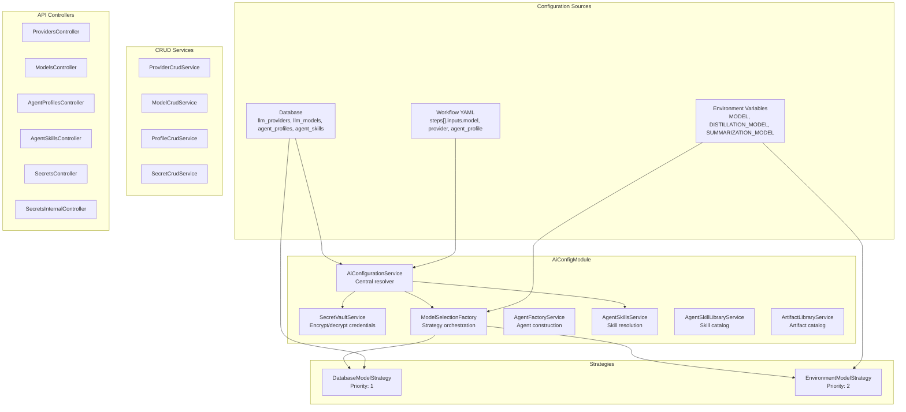
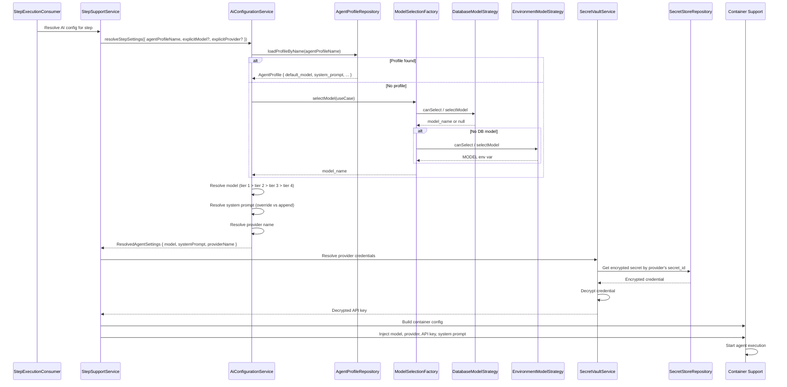

# 12 - AI Configuration

The AI configuration system manages LLM providers, models, agent profiles, and skills. It provides a centralized resolution mechanism using a 4-tier precedence model that determines which model, provider, and configuration an agent uses at runtime.

---

## AI Configuration Architecture



### Key Entities

| Entity Table           | Purpose                                                                                          |
| ---------------------- | ------------------------------------------------------------------------------------------------ |
| `llm_providers`        | LLM provider definitions (OpenAI, Anthropic, etc.) with configuration and `secret_id` references |
| `llm_models`           | Model definitions with names, token limits, and use-case mappings                                |
| `agent_profiles`       | Agent profiles with system prompts, default models, provider preferences, and tool policies      |
| `agent_skills`         | Skill definitions with manifests and file listings                                               |
| `agent_profile_skills` | Many-to-many join: which skills are assigned to which profiles                                   |
| `secret_store`         | Encrypted storage for provider API keys and credentials                                          |

---

## 4-Tier Configuration Precedence

When a workflow step needs AI configuration, the system checks four tiers in order:

```
Tier 1: Step override     →  steps[].inputs.model / provider / agent_profile
Tier 2: Agent profile     →  agent_profiles table
Tier 3: DB default         →  llm_models use_case default
Tier 4: Environment fallback →  MODEL, DISTILLATION_MODEL, SUMMARIZATION_MODEL
```

### Tier 1: Workflow Step Override

The highest precedence. Defined inline in the workflow YAML:

```yaml
jobs:
  - id: my_job
    type: execution
    inputs:
      model: gpt-4o # Explicit model override
      provider: openai # Explicit provider override
      agent_profile: ceo # Agent profile reference
    steps:
      - id: step_1
        type: agent
        prompt: "You are a CEO agent..."
```

Values specified at this level always win, regardless of what the agent profile or defaults say.

### Thinking / Effort Level

The thinking/effort level controls how deeply an LLM reasons through a task (when supported by the model). It follows the same 4-tier precedence:

```
Tier 1: Step override     →  steps[].inputs.thinking_level
Tier 2: Agent profile     →  agent_profiles.thinking_level
Tier 3: Per-model default →  llm_models.default_thinking_level
Tier 4: Omit              →  unset (model uses its default)
```

The resolved level is clamped to the model's supported range (queried from the pi SDK's `getSupportedThinkingLevels` or the DB's `thinkingLevelMap` fallback); `off` is never clamped upward. Supported levels are: `off`, `minimal`, `low`, `medium`, `high`, `xhigh`.

---

### Tier 2: Agent Profile from DB

If the step doesn't override a value, the agent profile referenced by `inputs.agent_profile` (or fallback) is queried from the `agent_profiles` table:

```typescript
// AiConfigurationService.resolveStepSettings()
const profile = await this.loadProfileByName(params.agentProfileName);
const model = profile?.default_model; // Used if no tier-1 override
const providerName = profile?.default_provider; // Used if no tier-1 override
const systemPrompt = profile?.system_prompt; // Used if no tier-1 override
```

Agent profiles can specify:

- `default_model` — The model to use for this agent type
- `default_provider` — The provider to use
- `system_prompt` — The system prompt for the agent
- `tool_policy` — Which tools the agent is allowed to use
- `temperature`, `max_tokens`, etc.

### Tier 3: DB Default Model for Use Case

If no profile is specified or the profile doesn't define a model, the system queries the database for a default model by use case:

```typescript
// ModelSelectionFactory.selectModel(useCase)
const strategies = [databaseStrategy, environmentStrategy].sort(...);
for (const strategy of strategies) {
  if (strategy.canSelect(useCase)) {
    const model = await strategy.selectModel(useCase);
    if (model) return model;
  }
}
return 'default-model'; // Last resort
```

`DatabaseModelStrategy` queries `llm_models` table for a model marked as default for the given use case. If no database default exists, it falls through.

### Tier 4: Environment Fallback

`EnvironmentModelStrategy` reads from environment variables:

```typescript
// Environment variables (from ai-configuration-runner-provider.helpers)
MODEL; // General default model
DISTILLATION_MODEL; // For lightweight/summarization tasks
SUMMARIZATION_MODEL; // For summarization-specific tasks
```

These are set in `.env` files and provide the ultimate fallback.

---

<a id="combined-precedence"></a>

## Combined Precedence (Harness + Model + Provider)

Harness, model, and provider all resolve through the **same** ordered chain:

| Priority | Source                                                             |
| -------- | ------------------------------------------------------------------ |
| 1        | Step `inputs` override (`harness_id`, `model`, `provider`)         |
| 2        | Agent profile's harness / model / provider setting                 |
| 3        | Scoped default (`scoped_ai_default` via `ScopedAiDefaultResolver`) |
| 4        | Platform/DB default                                                |
| 5        | Environment variable / `pi` fallback (harness only)                |

The existing model/provider 4-tier chain is unchanged; the scoped default (via `ScopedAiDefaultResolver`) is inserted _ahead of_ the DB default. The harness adds the terminal `pi` fallback at position 5.

### Harness / Model / Provider Relationship

A harness may constrain valid providers via `compatibleProviderIds`; incompatible resolved providers fall back to the harness `defaultProviderId` with a `harness.selection.fallback` diagnostic emitted before runtime. The model is resolved by the existing strategies; the harness governs _how_ that model/provider is executed, not _which_ model is chosen.

See [41 — Harness Runtime § Selection Precedence](41-harness-runtime.md#selection-precedence) and [§ Harness ↔ Provider Compatibility](41-harness-runtime.md#harness--provider-compatibility).

---

## Fallback Chains

A **fallback chain** is an ordered list of alternative `(provider, model)` pairs that the system automatically tries when the primary provider fails. This allows jobs to continue running despite provider outages, rate limits, or billing issues.

### Chain Resolution Precedence

Like model and provider selection, fallback chains are resolved through three tiers:

```
Tier 1: Step inline         →  steps[].inputs.fallback_chain
Tier 2: Agent profile       →  agent_profiles.fallback_chain
Tier 3: Global default      →  fallback_chains table (when enabled)
```

Each tier completely overrides the previous one if present.

### Chain Structure

A fallback chain is a JSONB array of chain entries:

```typescript
[
  { provider: "openai", model: "gpt-4o" },
  { provider: "anthropic", model: "claude-opus-4-1" },
  { provider: "google" }, // model omitted; uses provider default
];
```

- **Provider** (required): The name of the LLM provider
- **Model** (optional): The specific model to use. If omitted, the provider's default model is used.

### Failure Classification and Automatic Retry

When a step fails, the system classifies the failure:

| Failure Type  | Trigger                            | Action                                    | Cooldown  |
| ------------- | ---------------------------------- | ----------------------------------------- | --------- |
| **Outage**    | 5xx, 529, service unavailable      | Advance chain to next entry               | 2 minutes |
| **Terminal**  | 401 auth, 403 billing, 4xx invalid | Do not advance; retry same provider later | 30 min    |
| **Transient** | 429 rate limit                     | Retry immediately, same provider          | None      |

- **Outage**: The provider is temporarily down; the system moves to the next (provider, model) pair in the chain.
- **Terminal**: The request itself is invalid (bad credentials, billing exhausted, invalid model); the system does not advance the chain, as the error will recur on the next provider.
- **Transient**: Rate limited by the provider; retry the same provider without advancing the chain.

### Per-Provider Cooldown Registry

To avoid hammering a downed provider across all concurrent jobs, the system maintains a system-wide **provider cooldown registry** (`provider_cooldowns` table):

```typescript
{
  provider_name: 'openai',
  failed_at: '2026-06-29T10:15:00Z',
  cooled_until: '2026-06-29T10:17:00Z',  // Outage: 2 min; Terminal: 30 min
  failure_reason: '503 Service Unavailable'
}
```

When a provider fails:

1. A new cooldown entry is created (or existing one is updated) with `cooled_until = now + cooldown_duration`
2. On the next step execution, any chain entry referencing a cooled provider is skipped
3. When the cooldown window expires, the entry is automatically removed and the provider is available again

This ensures that all jobs in the system automatically route around known provider issues without requiring operator intervention.

### Configuring Global Fallback Chain

Operators can define a global default fallback chain via the API or UI:

**API:**

```bash
PUT /ai-config/fallback-chains/global
Content-Type: application/json

{
  "enabled": true,
  "chain": [
    { "provider": "openai", "model": "gpt-4o" },
    { "provider": "anthropic", "model": "claude-opus-4-1" },
    { "provider": "google", "model": "gemini-2.0-flash" }
  ]
}
```

**UI:**

- Navigate to **Settings > AI Configuration > Fallback Chains**
- Enable the global default chain
- Add, edit, or remove chain entries
- Click **Save**

### Overriding at Agent Profile Level

To give a specific agent profile its own fallback chain:

1. Navigate to **Settings > AI Configuration > Agent Profiles**
2. Select the profile to edit
3. Scroll to **Fallback Chain**
4. Enable and define the chain for this profile only
5. Save

This overrides the global chain for any step that uses this profile.

### Overriding at Workflow Step Level

For maximum control, define a fallback chain inline in the workflow YAML:

```yaml
jobs:
  - id: my_job
    type: execution
    steps:
      - id: analyze_with_fallback
        type: agent
        inputs:
          agent_profile: architect
          fallback_chain:
            - provider: openai
              model: gpt-4o
            - provider: anthropic
              model: claude-opus-4-1
        prompt: "Analyze this code..."
```

This chain applies only to this step and overrides both the profile and global chains.

### Monitoring Cooldown Status

Operators can view active provider cooldowns via:

**API:**

```bash
GET /ai-config/provider-cooldowns
```

Response:

```json
[
  {
    "provider_name": "openai",
    "failed_at": "2026-06-29T10:15:00Z",
    "cooled_until": "2026-06-29T10:17:00Z",
    "failure_reason": "503 Service Unavailable"
  }
]
```

**UI:**

- Navigate to **Settings > Provider Cooldowns**
- View all active cooldowns and their auto-recovery times
- Cooldowns are automatically cleared once `cooled_until` is reached

### Chain Precedence During Resolution

When a step is about to execute, `FallbackChainResolverService` resolves the effective chain:

1. Check for step-level inline chain → use it if present
2. Check agent profile for `fallback_chain` → use it if present
3. Check global default chain → use it if enabled
4. No chain → primary provider/model only (no fallback)

Within the effective chain, `selectViableEntry` then:

1. Reads each entry in order
2. Skips entries whose provider is actively cooled
3. Returns the first viable (non-cooled) entry
4. If all entries are cooled or chain is empty → no fallback available

If no viable entry is found after the chain is exhausted, the job terminates with a `fallback_exhausted` event.

### Limitations and Best Practices

**Limitations:**

- Cooldowns are per-provider, not per-provider-model. If OpenAI's general API fails, both GPT-4 and GPT-3.5 are cooled.
- The system only reacts to explicit errors (5xx, 4xx, 429). Subtle degradation (high latency, timeout) may not trigger fallback.
- Fallback is transparent; users and logs show which provider was eventually used, but not all intermediate attempts.

**Best Practices:**

1. **Test your chain:** Verify that secondary providers have the models you reference; missing models will cause termination.
2. **Balance chain length and concurrency:** A very long chain or very short cooldown window can lead to job termination under high concurrent failure (all entries cooled simultaneously).
3. **Monitor cooldown status:** Regularly check **Settings > Provider Cooldowns** to understand which providers are currently unavailable and plan accordingly.
4. **Use profiles for consistency:** Define chains at the profile level to ensure all agents of a given type (CEO, architect, etc.) use the same fallback strategy.

See [ADR-0029: Fallback Models and Providers](../adrs/0029-fallback-models-providers.md) for architectural context and decision rationale.

### Session Persistence (Harness Parity)

Both the PI and the claude-code harnesses persist their session as a
pi-compatible **v3 JSONL tree** so a single downstream pipeline stores every
run in `pi_session_trees`, regardless of which engine produced it.

- During a run, the claude-code engine maps each Anthropic SDK message to v3
  nodes (`ClaudeV3Mapper`) and appends them to the session JSONL via the shared
  `V3SessionWriter` (best-effort — a write failure never aborts the turn).
- `chat_sessions.harness_id` records the originating harness: for subagent
  sessions it is written back once the harness is resolved at spawn. Ad-hoc /
  inbound chat sessions resolve their harness later (inside the container), so
  `harness_id` is `null` at creation for those — a follow-up can add a
  dispatch-time write-back mirroring the subagent path.
- The execution-supervisor reap path persists the host session JSONL into the
  session tree store for **both** engines; the freshly reaped tree is referenced
  as a `pi` tree while the originating engine is recorded separately on the
  checkpoint row.

**Non-goal:** claude-code resume remains **linear** (no mid-session branching).
Mechanism depends on what was persisted: a reaped run has a v3 tree, which is
re-injected into the container as `SESSION_PATH` and continued via
`V3SessionWriter.open()` (the `pi`-kind tree-file-injection path); when no tree
was persisted, resume falls back to the SDK-native `sessionId`. Either way the
conversation continues as a single linear chain.

---

## Provider Credentials

### Secret Store

Provider API keys and credentials are stored in the `secret_store` table with server-side encryption:

```typescript
// SecretVaultService
async encrypt(plaintext: string): Promise<string>
async decrypt(ciphertext: string): Promise<string>
```

The `SecretVaultService` uses a configurable encryption key (from environment) to encrypt secrets before storing them. Decryption happens only when needed (at runtime, when preparing a container's environment).

### Secret References

`llm_providers` reference secrets via `secret_id`:

```typescript
// llm_providers table
{
  id: 'provider-uuid',
  name: 'openai',
  secret_id: 'secret-uuid',  // References secret_store.id
  base_url: 'https://api.openai.com/v1',
  config: { ... }
}
```

When `AiConfigurationService` resolves provider configuration, it:

1. Looks up the provider by name
2. Resolves the `secret_id` to retrieve the encrypted credential
3. Decrypts the credential via `SecretVaultService`
4. Assembles the runner configuration payload (provider, auth, API key, base URL, env vars)

The decrypted credential is injected into the Docker container as an environment variable (`RUNNER_PROVIDER_CONFIG`) — it never travels over the network between services.

Under the harness runtime, provider/harness credentials are resolved API-side and delivered over the `configure` WebSocket handshake (not as `RUNNER_PROVIDER_CONFIG` env) for harness-bound credentials. See [41 — Harness Runtime § Secure Handshake Delivery](41-harness-runtime.md#secure-handshake-delivery) and [19-security.md](19-security.md).

The OAuth device-code flow documented above applies to `llm_providers` (provider-level). For harness-level OAuth device flow, see [12a-secret-provider-setup.md](12a-secret-provider-setup.md).

---

## OAuth Device Code Flow (RFC 8628)

Nexus supports both standard OAuth2 authorization code flows (e.g. Anthropic Claude Pro/Max) and the OAuth2 Device Authorization Grant (RFC 8628) flow for headless environments and command-line compatible credentials (e.g., GitHub Copilot, ChatGPT Plus/Pro).

### Dynamic Capabilities Detection

Rather than maintaining a hardcoded list of provider IDs (like `github-copilot` or `openai-codex`), both the frontend and backend dynamically query the capability metadata of the OAuth provider presets:

- **Backend detection**: When resolving a provider's capabilities or token connection status in [provider-oauth.service.ts](file:///g:/code/AI/nexus-orchestator/apps/api/src/ai-config/services/provider-oauth.service.ts), the service loads the provider preset from the `@earendil-works/pi-ai/oauth` registry. It detects whether the provider supports device-code authentication by checking if its `login` function string representation references device code inputs:
  ```typescript
  const isDeviceFlow = oauthProvider.login.toString().includes("onDeviceCode");
  ```
- **Frontend/UI adaptation**: The management console dynamically receives this `is_device_flow` flag via the `/presets` API. If `is_device_flow` is `true`:
  - Standard client credential input fields (Client ID, Redirect URL, Scopes, Client Secret) are hidden during creation/editing.
  - The provider edit modal displays a direct, interactive "Connect" / "Reconnect" option.
  - Clicking "Connect" launches the [DeviceFlowModal](file:///g:/code/AI/nexus-orchestator/apps/web/src/pages/providers/DeviceFlowModal.tsx) which displays a User Code, verification URL, and enterprise domain options.

### Secret Auto-Provisioning

To prevent validation and `422 Unprocessable Entity` errors, the [ProviderDeviceFlowService](file:///g:/code/AI/nexus-orchestator/apps/api/src/ai-config/services/provider-device-flow.service.ts) automatically checks if the provider database record has an associated `secret_id`. If `secret_id` is missing when initiating a connection:

1. It automatically generates and registers a new encrypted credential container in the `secret_store` with a name scoped to the provider (e.g. `oauth-tokens-github-copilot-[hash]`).
2. It links the `secret_id` directly to the `llm_providers` DB record.
3. It stores the resulting access/refresh tokens in the new secret once authorization completes.

---

## Agent Profiles

### What They Contain

An agent profile is a database record that defines an agent type:

```typescript
// agent_profiles entity
{
  name: 'ceo',
  display_name: 'CEO Agent',
  description: 'High-level project orchestration agent',
  system_prompt: 'You are a CEO-level orchestrator...',
  default_model: 'gpt-4o',      // Optional: model to use
  default_provider: 'openai',    // Optional: provider to use
  temperature: 0.7,
  max_tokens: 4096,
  tool_policy_strategy: 'profile_only',  // Tool permission strategy
  allowed_tools: ['read', 'search_skills', 'query_memory', ...],
  version: 1,
}
```

### Profile Resolution at Runtime

When `AiConfigurationService.resolveStepSettings()` runs:

```typescript
async resolveStepSettings(params: {
  explicitModel?: string;
  explicitSystemPrompt?: string;
  explicitProviderName?: string;
  agentProfileName?: string;
  promptMode?: 'override' | 'append';
}): Promise<ResolvedAgentSettings> {
  const profile = await this.loadProfileByName(params.agentProfileName);
  const model = await this.resolveStepModel(params.explicitModel, profile);
  const systemPrompt = this.resolveStepSystemPrompt(
    params.explicitSystemPrompt, profile, params.promptMode
  );
  const providerName = this.resolveStepProviderName(
    params.explicitProviderName, profile
  );

  return { model, systemPrompt, providerName };
}
```

The `promptMode` controls how explicit prompts interact with the profile's system prompt:

- `override` — The step's prompt completely replaces the profile's system prompt
- `append` — The step's prompt is appended to the profile's system prompt

---

## Agent Skills

### Skill Library

Skills are reusable instruction sets with a `SKILL.md` manifest and supporting files. They are stored in the `agent_skills` table and on the filesystem.

`AgentSkillLibraryService` manages the skill catalog:

- Lists all available skills with metadata
- Searches skills by name, category, or description
- Reads skill manifests and files

`AgentSkillsService` manages skill-to-profile assignments:

- `add_profile_skills` — Assign skills to a profile
- `remove_profile_skills` — Remove skills from a profile
- `replace_profile_skills` — Replace all skills for a profile
- `listCategories` — List skill categories for filtering

### Skill Assignment

Skills are assigned to profiles via the `agent_profile_skills` join table. During runtime resolution:

1. The agent profile's assigned skills are loaded
2. Skill files are mounted into the agent's container (via `WorkflowHostMountModule`)
3. The agent discovers skills via `search_skills` and `read_skill_manifest` tools
4. The agent can also create or modify skills at runtime via skill management tools

---

## Skill Search Pipeline

The skill search pipeline replaced literal substring matching with a multi-strategy approach that scores and ranks skills from the library against a query before returning results to the agent.

### Components

| Component                    | Role                                                                                                                                                                                           |
| ---------------------------- | ---------------------------------------------------------------------------------------------------------------------------------------------------------------------------------------------- |
| `SkillIndexService`          | Builds and maintains a lazy, in-memory index of all active skills. Exposes a primary `Map<string, SkillLibraryRecord>` (skill name → record) and an inverted index (token word → skill names). |
| `TokenMatchStrategy`         | Field-weighted word match. Exact token hit scores 1.0; substring hit scores 0.7.                                                                                                               |
| `FuzzyMatchStrategy`         | Levenshtein-distance match. Skips tokens of three characters or fewer; threshold is configurable.                                                                                              |
| `TfIdfMatchStrategy`         | Corpus-aware TF-IDF relevance scoring across the indexed skill set.                                                                                                                            |
| `SkillSearchPipelineService` | Orchestrates all three strategies using max-score merging, then applies optional `minScore` and `limit` filters.                                                                               |

### How a Search Runs

1. `SkillIndexService` returns the current in-memory skill set (rebuilding from the filesystem if the index has been invalidated).
2. Active skills are pre-filtered by `category` and `tags` when those params are provided.
3. All three strategies run against the filtered set and each returns a `ScoredSkillResult[]`.
4. The pipeline merges results by keeping the highest score per skill name across all strategies.
5. The merged list is sorted descending by score.
6. `minScore` and `limit` filters are applied. When `query` is empty, all filtered skills are returned with score 1.0.

`AgentSkillsService.searchSkills()` delegates entirely to `SkillSearchPipelineService`, so all skill lookups from agents go through the pipeline.

### TokenMatchStrategy Field Weights

| Field               | Weight |
| ------------------- | ------ |
| `name`              | 0.40   |
| `description`       | 0.25   |
| `tags`              | 0.20   |
| `category`          | 0.10   |
| semantic (reserved) | 0.05   |

### Index Invalidation

The index is built lazily: the first search after a skill write, rename, or delete triggers a full rebuild from the current filesystem state. Subsequent searches reuse the in-memory index until the next mutation.

`AgentSkillLibraryService` calls `SkillIndexService.invalidate(skillName)` on `writeSkillMarkdown` and `renameSkill`, and `invalidateAll()` on `deleteSkill`. Agents that search skills repeatedly within a session do not incur repeated filesystem reads.

### Search Parameters

Callers pass a `SkillSearchParams` object:

| Param           | Type        | Effect                                                                           |
| --------------- | ----------- | -------------------------------------------------------------------------------- |
| `query`         | `string?`   | Free-text search term. Omit or pass empty to return all skills (score 1.0).      |
| `category`      | `string?`   | Pre-filter: only skills whose category matches.                                  |
| `tags`          | `string[]?` | Pre-filter: only skills that carry all specified tags.                           |
| `minScore`      | `number?`   | Drop results below this threshold (0.0–1.0).                                     |
| `limit`         | `number?`   | Cap the number of results returned.                                              |
| `includeScores` | `boolean?`  | When true, attach `matchDetails` (strategy name, matched fields) to each result. |

---

## Model Selection Strategy

### Strategy Pattern

`ModelSelectionFactory` orchestrates two strategies:

```typescript
@Injectable()
export class ModelSelectionFactory {
  constructor(
    private readonly databaseStrategy: DatabaseModelStrategy,
    private readonly environmentStrategy: EnvironmentModelStrategy,
  ) {}

  async selectModel(useCase: string): Promise<string> {
    const strategies = [this.databaseStrategy, this.environmentStrategy].sort(
      (a, b) => a.priority - b.priority,
    );

    for (const strategy of strategies) {
      if (strategy.canSelect(useCase)) {
        const model = await strategy.selectModel(useCase);
        if (model) return model;
      }
    }
    return "default-model";
  }
}
```

### DatabaseModelStrategy (Priority: 1)

- Queries `llm_models` table for a model matching the use case
- Checks if the model is active and has a valid provider
- Returns the model name if found

### EnvironmentModelStrategy (Priority: 2)

- Reads from environment variables based on use case
- Falls back to the generic `MODEL` variable
- Always returns something (even if just the raw env value)

---

## Admin API Endpoints

The AI config system exposes REST APIs for management:

| Controller                  | Endpoints     | Purpose                                             |
| --------------------------- | ------------- | --------------------------------------------------- |
| `ProvidersController`       | CRUD          | Manage LLM provider definitions                     |
| `ModelsController`          | CRUD          | Manage LLM model definitions                        |
| `AgentProfilesController`   | CRUD          | Manage agent profiles                               |
| `AgentSkillsController`     | CRUD + Assign | Manage skills and profile assignments               |
| `SecretsController`         | CRUD          | Manage encrypted credentials (admin-facing)         |
| `SecretsInternalController` | Read          | Internal API for secret retrieval (used by runtime) |
| `AiConfigController`        | Query         | Unified query endpoint for AI configuration         |

### CRUD Services

| Service               | Repository               | Operations                                                    |
| --------------------- | ------------------------ | ------------------------------------------------------------- |
| `ProviderCrudService` | `LlmProviderRepository`  | Create, read, update, delete providers                        |
| `ModelCrudService`    | `LlmModelRepository`     | Create, read, update, delete models; manage use-case defaults |
| `ProfileCrudService`  | `AgentProfileRepository` | Create, read, update, delete agent profiles                   |
| `SecretCrudService`   | `SecretStoreRepository`  | Create, read, update, delete secrets (with encryption)        |

---

## Runtime Resolution Flow

When a workflow step is about to execute, the AI configuration is resolved:



### What the Agent Receives

The Docker container receives the resolved configuration as:

- **Environment variable** — `RUNNER_PROVIDER_CONFIG` (provider, auth, API key, base URL)
- **Environment variable** — `RUNNER_MODEL` (model name)
- **Config file** — Complete runner configuration with all settings
- **Mounted prompt** — System prompt as a mounted file or environment variable
