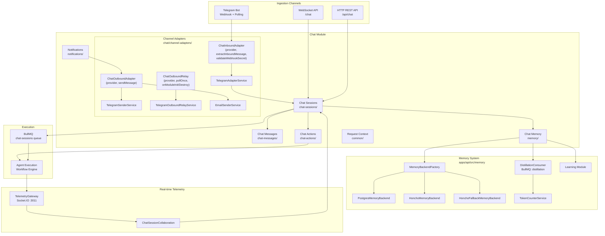

# 13 — Chat System

The chat system provides multi-channel, persistent conversational AI. It ingests messages from external channels (Telegram, API), manages session lifecycle, stores conversation history with memory backends, and executes agent workflows via BullMQ queues. Chat sessions support real-time collaboration through WebSocket telemetry and provide actions that bridge chat commands to core workflow execution.

## Architecture

## Sub-Modules

The ChatModule (`apps/api/src/chat/chat.module.ts`) composes seven sub-modules:

| Module                  | Path                     | Responsibility                                                 |
| ----------------------- | ------------------------ | -------------------------------------------------------------- |
| `ChannelAdaptersModule` | `chat/channel-adapters/` | Ingress/outbound messaging across channels (Telegram, Email)   |
| `ChatSessionsModule`    | `chat/chat-sessions/`    | Session lifecycle, collaboration, start-sequence orchestration |
| `ChatMessagesModule`    | `chat/chat-messages/`    | Message persistence and retrieval                              |
| `ChatMemoryModule`      | `chat/memory/`           | Memory backend bridge, agent-facing memory operations          |
| `ChatActionsModule`     | `chat/chat-actions/`     | Command-to-workflow translation, core lookup bridge            |
| `NotificationsModule`   | `chat/notifications/`    | Outbound notification dispatch                                 |
| `RequestContextModule`  | `chat/common/`           | Per-request context propagation                                |

## Channel Adapter Abstractions

The `ChannelAdaptersModule` (`chat/channel-adapters/`) wraps every supported chat provider behind three narrow interfaces so downstream consumers (ingress router, notification consumer, future schedulers) never take a hard dependency on a concrete Telegram or Email class. Implementations are registered through multi-provider registries keyed by the `ChatChannelProvider` discriminant (`'telegram' | 'email' | (string & {})`) declared in `chat/channel-adapters/chat-channel-provider.types.ts`. The trailing `(string & {})` is an open-extension escape hatch — adapters added later (`'slack'`, `'discord'`) compile at every existing call site without forcing churn.

| Interface                | Surface                                                                                          | Built by                                                            |
| ------------------------ | ------------------------------------------------------------------------------------------------ | ------------------------------------------------------------------- |
| `ChatInboundAdapter`     | `provider`, `extractInboundMessage(payload)`, `validateWebhookSecret(secretHeader)`              | `TelegramAdapterService` (today)                                    |
| `ChatOutboundAdapter`    | `provider`, `sendMessage(message)`                                                               | `TelegramSenderService`, `EmailSenderService`                       |
| `ChatOutboundRelay`      | `provider`, `onModuleInit`, `onModuleDestroy`, `pollOnce`                                        | `TelegramOutboundRelayService` (today)                              |

A "fat" adapter (the `ChannelAdapter` type alias in `channel-adapter.types.ts`) satisfies both halves through the `&` intersection, so providers that prefer one service for ingress + outbound (e.g. today's Telegram) implement `ChannelAdapter` and register through `CHAT_INBOUND_ADAPTERS` + `CHAT_OUTBOUND_SENDERS` separately. The `ChannelOutboundSender` shape is the narrow outbound-only contract retained for senders that historically only carried `sendMessage`.

The two outbound registries are distinct:

- **`CHAT_OUTBOUND_SENDERS`** — single-shot dispatch (the notification consumer delivering a queued message). Built by `ChannelAdaptersModule`'s `useFactory` from `TelegramSenderService` + `EmailSenderService`.
- **`CHAT_OUTBOUND_RELAYS`** — long-running poll loops that re-publish workflow-run status updates back to the channel. Built from `TelegramOutboundRelayService`.

Adding a future channel only requires implementing the relevant interface(s) and registering the implementation in `ChannelAdaptersModule` — downstream consumers look up providers via `Map.get(channel)` and never need to be touched.

## Telegram Adapter

The Telegram adapter (`chat/channel-adapters/telegram/`) handles bidirectional messaging through the Telegram Bot API.

### Ingress Flow

1. **Webhook controller** (`telegram-webhook.controller.ts`) receives inbound updates from Telegram. Messages are deserialized and passed to the ingress service.
2. **Polling service** (`telegram-polling.service.ts`) provides an alternative polling-based ingestion for environments where webhooks are unavailable. It long-polls Telegram's `getUpdates` endpoint.
3. **Ingress service** (`telegram-ingress.service.ts`) normalizes Telegram messages into the internal chat message format, extracting chat and user identifiers.
4. **Command router** (`telegram-command-router.service.ts`) routes slash commands (`/new`, `/help`, `/resume`) to registered command handlers:
   - `TelegramNewCommandHandler` — creates new chat sessions
   - `TelegramHelpCommandHandler` — returns available commands and usage
   - `TelegramResumeCommandHandler` — resumes existing sessions
   - `TelegramAgentCommandHandler` — delegates messages to the agent execution pipeline
5. **Runtime settings service** (`telegram-runtime-settings.service.ts`) resolves per-chat AI configuration overrides (model, provider, agent profile).

### Outbound Flow

The outbound relay service (`telegram-outbound-relay.service.ts`) sends agent responses back to Telegram users. It provides multiple formatting helpers:

- **Progress updates** (`telegram-outbound-relay-progress.utils.ts`) — streaming step progress as Telegram edits
- **Terminal text** (`telegram-outbound-relay-terminal-text.utils.ts`) — final agent responses
- **Status edits** (`telegram-outbound-relay-status-edit.utils.ts`) — updating previously sent messages
- **Command menus** (`telegram-outbound-relay-command-menu.utils.ts`) — interactive reply keyboards
- **Active run relay** — forwards output from currently executing workflow runs

The sender service (`telegram-sender.service.ts`) wraps the Telegram Bot API HTTP client for sending messages, photos, and documents.

### Tool Approval Handler

`telegram-tool-approval.handler.ts` intercepts tool calls requiring human approval and presents them to the Telegram user as inline-keyboard prompts. The user can approve or deny the tool call directly within the chat.

## Chat Session Lifecycle

### 1. Creation

Sessions are created via:

- **HTTP API** — `POST /api/chat/sessions` with `CreateChatSessionDto`
- **Telegram** — `/new` command handler invokes the sessions service
- **WebSocket** — `create-session` event over the telemetry gateway

The sessions service (`chat-sessions.service.ts`) validates the request, resolves the agent profile, creates the session entity, and emits a session-creation event.

### 2. Context Assembly

Before agent execution, the system assembles execution context:

1. **Profile validation** (`chat-sessions.profile-validation.ts`) — ensures the requested agent profile exists and is active
2. **Memory attachment** — the memory backend is queried for relevant conversation history
3. **File attachment context** — linked attachments are resolved and parsed markdown is injected when available
4. **System prompt resolution** — agent profile system prompt is loaded and personalized
5. **Tool capability attachment** — the tool catalog is filtered for the agent's tier and permissions
6. **Session start helpers** (`chat-sessions.session-start.helpers.ts`) compose the initial workflow inputs

### 3. Agent Execution

The assembled context is enqueued as a job on the **`chat-sessions`** BullMQ queue. The queue consumer:

1. Hydrates the session context
2. Launches the workflow execution engine with the chat session's scope
3. Streams execution telemetry back through the WebSocket gateway
4. Handles tool calls, user questions, and agent turn transitions

The start sequence helpers (`chat-sessions.start-sequence.helpers.ts`) orchestrate the multi-step initialization: session creation → context assembly → workflow launch → initial agent message.

### 4. Cleanup

On session completion or expiration, the system:

- Marks the session as completed in the database
- Triggers memory distillation if the conversation exceeded token thresholds
- Emits session telemetry events for observability
- Removes ephemeral runtime artifacts

## Session Collaboration

The collaboration system lets multiple participants join a single chat session. Components:

- **Collaboration service** (`chat-session-collaboration.service.ts`) — manages participant lifecycle
- **Collaboration controller** (`chat-session-collaboration.controller.ts`) — REST API for join/leave/invite
- **Collaboration client** (`telemetry/chat-session-collaboration.client.ts`) — WebSocket client for real-time participant updates
- **Participant rules** (`chat-session-collaboration.rules.ts`) — enforce max participants, role checks
- **Participant setup helpers** — initializes collaboration context for new joiners

Collaboration events flow through the `TelemetryGateway` WebSocket, allowing all participants to see agent responses, step progress, and tool calls in real time.

## Memory System

The memory system (`apps/api/src/memory/`) provides persistent conversation context across sessions.

### Memory Backend Factory

The `MemoryBackendFactory` selects the active backend based on the `MEMORY_BACKEND` environment variable:

| Value                | Backend                       | Description                                                                                                           |
| -------------------- | ----------------------------- | --------------------------------------------------------------------------------------------------------------------- |
| `postgres` (default) | `PostgresMemoryBackend`       | Stores messages in the local PostgreSQL database. Full control, zero external dependencies.                           |
| `honcho`             | `HonchoMemoryBackend`         | Delegates memory to an external Honcho API server. Requires Honcho profile in Docker Compose.                         |
| `dual`               | `HonchoFallbackMemoryBackend` | Writes to both Postgres and Honcho simultaneously. Reads from Honcho first; falls back to Postgres on Honcho failure. |

Invalid values fall back to `postgres` with a warning log.

### HonchoFallbackMemoryBackend

The fallback backend (`honcho-fallback-memory-backend.service.ts`) implements a circuit-breaker pattern:

1. Writes are always mirrored to both Postgres and Honcho
2. Reads attempt Honcho first with a configurable timeout
3. If Honcho fails or times out, the read falls back to Postgres
4. After N consecutive Honcho failures, the backend degrades to Postgres-only reads for a cooldown period

### Token Counting

The `TokenCounterService` estimates token counts using model-specific tokenizers. It provides:

- **countJSONLTokens** — counts tokens for a compressed JSONL session tree (used by distillation)
- **countStringTokens** — counts tokens for a raw text string
- Model-aware counting with different encodings per provider

### Distillation

Long conversations are automatically summarised via the `distillation` BullMQ queue to keep context windows manageable.

**How it works:**

1. The memory manager detects when a session tree exceeds a token threshold
2. A distillation job is submitted to the `distillation` BullMQ queue with the session tree ID and model
3. The `DistillationConsumer` processes the job:

   **Recursive Summarisation Strategy:**

   | Node Age (turns old) | Target Compression     |
   | -------------------- | ---------------------- |
   | 0–10 turns           | No compression (100%)  |
   | 10–20 turns          | 70% of original length |
   | 20–50 turns          | 50% of original length |
   | 50+ turns            | 30% of original length |
   - Tool-use and tool-result nodes are preserved verbatim (never summarised)
   - Context window of ±2 surrounding nodes is provided to the LLM for coherent summaries
   - Nodes are marked `distilled: true` after summarisation

4. The summarised JSONL is compressed (gzip) and stored back to the session tree
5. Final token ratio is logged for observability

### Memory Lifecycle and Cleanup

Per the [Chat Memory Lifecycle Runbook](../operations/chat-memory-lifecycle-runbook.md):

- **Session trees** are compressed via gzip and stored as base64 in `pi_session_trees`
- **Message archives** may be pruned after configurable retention periods
- **Distillation thresholds** and intervals are configurable via environment variables
- **Memory manager admin API** (`chat-memory-admin.controller.ts`) allows manual memory inspection and cleanup

### Learning Module

The learning module (`memory/learning/`) provides autonomous skill improvement:

- **Skill proposals** — the agent can propose new skills based on successful interaction patterns
- **Promotion policy** — governs when a proposed skill is promoted to a seedable skill
- Skills are stored in the agent profile system and automatically mounted in future sessions

## File Attachments

Browser chat sessions can include uploaded files alongside message text. The file pipeline is domain-neutral and shared with other attachment owners through `AttachmentsModule` (`apps/api/src/attachments`).

### Upload and Storage

Attachments are uploaded through `POST /api/attachments` as multipart form data. The controller requires JWT authentication plus `PermissionsGuard`, checks that attachments are enabled, and stores metadata in the `attachments` table. Ownership is represented separately in `attachment_links`, so a single file can be associated with a chat message, workspace surface, or another supported owner type without duplicating the object.

Binary content is stored behind the object-storage abstraction. Local deployments use Garage-compatible S3 storage, while the API keeps only metadata, parse status, checksum, and object keys in Postgres.

### Parsing and Context Injection

After upload, the attachment parse queue eagerly converts supported content into cached markdown or text context:

| Input Type     | Parse Behavior                                      |
| -------------- | --------------------------------------------------- |
| PDF / DOCX     | Extract document text into markdown-like content    |
| TXT / MD / CSV | Normalize textual content for direct model context  |
| Images         | Produce an image description through vision support |

Parse state is tracked as attachment metadata. Agents receive parsed content in their assembled chat context when it is available, while unavailable or failed parses remain visible through the attachment metadata so the UI can show status.

### Chat Message Linking

`ChatMessagesService.create()` accepts `attachmentIds` and links each attachment to the persisted message after the message is created. This keeps the chat transcript append-only while allowing the attachment system to own storage, parse lifecycle, and retrieval.

The web UI uses reusable attachment primitives:

| Component        | Role                                        |
| ---------------- | ------------------------------------------- |
| `FileDropzone`   | Drag-and-drop or picker upload surface      |
| `AttachmentChip` | Inline selected/uploaded attachment status  |
| `ImageThumbnail` | Preview for image attachments               |
| `AddFilesPanel`  | Workspace-style attachment management panel |

### Agent Tools

Agents access attachments through governed internal tools:

| Tool               | Purpose                                                                  |
| ------------------ | ------------------------------------------------------------------------ |
| `list_attachments` | Lists attachments for an owner using `owner_type` and `owner_id`         |
| `get_attachment`   | Materializes one attachment into `.attachments/<id>/...` in the worktree |

`get_attachment` also returns parsed content, parse status, and MIME type. Materialization is path-checked so attachment files cannot be written outside the `.attachments` directory.

## Chat Execution Consumer

Chat sessions are executed via a BullMQ consumer on the `chat-sessions` queue:

1. The consumer dequeues a session execution job
2. It hydrates the full session context (messages, memory, agent profile, tools)
3. It invokes the workflow engine to run the chat agent workflow
4. Runtime telemetry is streamed through the `TelemetryGateway` WebSocket
5. On completion, the session state is updated and cleanup triggers fire

## Chat Actions Module

The Chat Actions module (`chat/chat-actions/`) translates chat commands and interactions into core workflow actions.

### Core Lookup Service

`chat-core-lookup.service.ts` resolves chat-specific references to core entities:

- Agent profile names → profile IDs
- Workflow names → workflow IDs
- Tool names → tool registry entries

### Action Bridge

`chat-to-core-action.service.ts` translates chat channel interactions into standardised action payloads consumed by the workflow engine. Key utilities:

- **`chat-to-core-action.parsers.ts`** — parses chat message content into structured action parameters
- **`chat-to-core-action-http.helpers.ts`** — resolves HTTP callback configurations for remote tool actions
- **`chat-to-core-action.utils.ts`** — general-purpose translation helpers
- **Per-channel field utilities** — Telegram-specific runtime field resolution

### Run Questions

`chat-run-questions.util.ts` handles the flow when an agent poses a question to the user mid-execution. The question is formatted for the chat channel (Telegram inline keyboard, WebSocket event, etc.) and the user's response is routed back to the waiting agent.

## Cross-References

- [Workflow Engine](06-workflow-engine.md) — how the workflow engine executes chat agent workflows
- [Workflow Runtime](08-workflow-runtime.md) — agent-facing runtime capabilities during chat execution
- [Telemetry & Observability](18-telemetry-observability.md) — WebSocket telemetry and event ledger
- [AI Config](12-ai-config.md) — agent profile and model selection for chat sessions
- [Kanban Overview](21-kanban-overview.md) — how Kanban work items can spawn chat sessions
- [Chat Memory Lifecycle Runbook](../operations/chat-memory-lifecycle-runbook.md) — memory cleanup procedures
