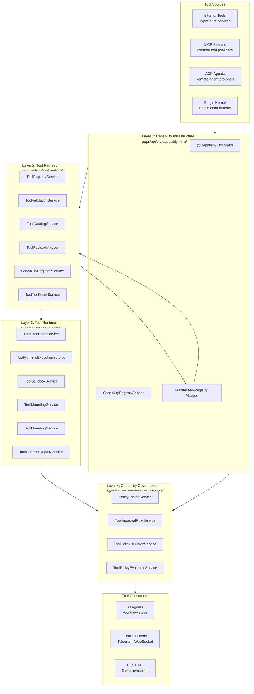
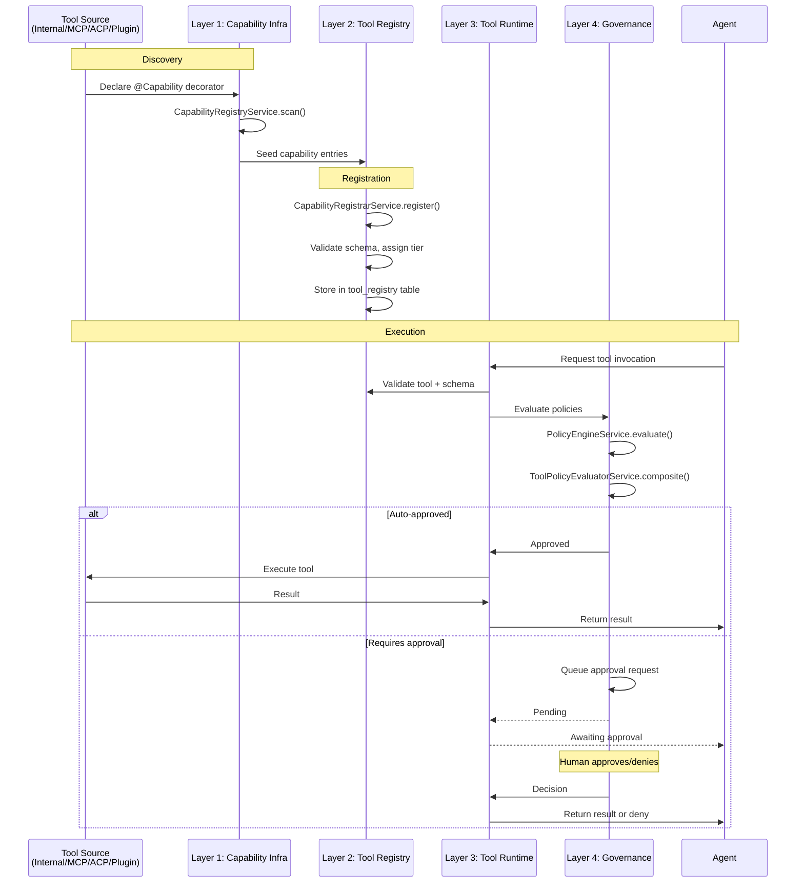

# 14 — Tool System

The tool system is a four-layer stack that manages tool capabilities from discovery through execution to governance. Tools are the primary interface between agents and the external world: they can read files, execute commands, query databases, call APIs, and interact with plugins. Every tool invocation flows through all four layers, ensuring tools are discovered, registered, validated, executed safely, and governed by policy.

## Layer Architecture



## Layer 1 — Capability Infrastructure

The capability infrastructure layer provides the primitives for declaring and discovering tool capabilities.

### @Capability Decorator

The `@Capability` decorator (`capability.decorator.ts`) marks service methods and classes as tool capabilities. It stores metadata via `Reflect.getMetadata` using the `CAPABILITY_METADATA_KEY` symbol.

```typescript
// Conceptual usage — decorator attaches DiscoveredCapabilityDefinition metadata
@Capability({
  name: 'file.read',
  description: 'Read contents of a file',
  tierRestriction: 1,
  inputSchema: z.object({ path: z.string() }),
  apiCallback: { method: 'POST', path_template: '/api/tools/file/read' },
  seedInRegistry: true,
})
async readFile(path: string): Promise<string> { ... }
```

Key metadata fields:

| Field             | Description                                             |
| ----------------- | ------------------------------------------------------- |
| `name`            | Unique tool name (e.g., `file.read`, `git.commit`)      |
| `description`     | Human-readable description for the tool catalog         |
| `tierRestriction` | Minimum tool tier required to access (0 = unrestricted) |
| `inputSchema`     | Zod schema defining the tool's input parameters         |
| `transport`       | Execution transport hint                                |
| `policyTags`      | Tags used by the policy engine for access decisions     |
| `apiCallback`     | HTTP callback configuration for direct API invocation   |
| `bridgeAction`    | Named action used by the bridge action system           |
| `seedInRegistry`  | Whether automatically seeded into the tool registry     |
| `mutatingAction`  | Whether the tool mutates external state                 |
| `modeBehavior`    | Tool behavior per agent mode                            |
| `runtimeOwner`    | The runtime component responsible for execution         |

### CapabilityRegistryService

The `CapabilityRegistryService` scans all NestJS providers at module initialization:

1. Uses NestJS's `DiscoveryService` to enumerate all provider instances
2. Uses `MetadataScanner` to enumerate all method names on each instance
3. Reads `@Capability` metadata from methods and class constructors
4. Builds `CapabilityManifestEntry` objects from discovered metadata
5. Converts Zod schemas to JSON Schema via `zodSchemaToCapabilityJsonSchema`
6. Sorts entries alphabetically by name
7. Separates bridge action names into a dedicated set

The registry exposes:

- `getDiscoveredEntries()` — all discovered capabilities
- `getSeededCapabilityEntries()` — only capabilities with `seedInRegistry !== false`
- `getDiscoveredBridgeActions()` — all registered bridge action names
- `getDiscoveredEntryByName(name)` — single capability lookup

### Manifest-to-Registry Mapper

`capability-manifest-to-tool-registry.mapper.ts` transforms capability manifest entries into the format required by the tool registry, handling schema coercion, default values, and type bridging.

## Layer 2 — Tool Registry

The tool registry layer manages the persistent catalog of registered tools, their schemas, and their metadata.

### ToolRegistryService

The central service for tool management. It provides CRUD operations on tool records and handles:

- Tool registration from all sources (internal, MCP, ACP, plugins)
- Tool lookup by name, ID, or source
- Tool schema retrieval
- Dynamic tool enable/disable

### CapabilityRegistrarService

`capability-registrar.service.ts` is the primary entry point for tool registration. It accepts tool projections from multiple sources and enforces:

- **Uniqueness** — prevents duplicate tool names within a source
- **Schema validation** — ensures the tool schema is well-formed JSON Schema
- **Tier assignment** — validates and applies tier restrictions
- **Source tracking** — every tool projection carries a `source` (`decorator_provider`, `internal_tool_handler`, `external_mcp`, `external_acp`, or `manual`), persisted on the `tool_registry` row via the `source` column and surfaced on the Tools page (see "Tool Provenance" below)

### ToolCatalogService

`tool-catalog.service.ts` provides indexed, searchable access to the tool registry. It supports:

- Full-text search across tool names and descriptions
- Filtering by tier, source, and policy tags
- Pagination and sorting
- Batch resolution for agent context assembly

### ToolValidationService

`tool-validation.service.ts` validates tool invocations:

- Schema validation against the tool's JSON Schema input contract
- Type coercion for loosely-typed inputs
- Required field enforcement
- Custom validation rules per tool

### ToolPayloadMapper

`tool-payload.mapper.ts` transforms tool invocation payloads between different representations:

- Raw JSON → typed tool inputs
- Tool output → standardised result format
- Error responses → structured error objects

### Tool Provenance (`source`)

Every `tool_registry` row carries a `source` column (`ToolRegistrySource` in
`packages/core`): `decorator_provider` and `internal_tool_handler` for
built-in capabilities, `external_mcp`/`external_acp` for tools synced from
remote servers, and `manual` for tools created directly via `POST /tools`.
The value originates once, at registration time
(`CapabilityRegistrarService.registerCanonicalCapabilities` /
`registerToolProjection`), and is never client-writable — `createToolSchema`
has no `source` field, and `ToolRegistryService.createTool` always forces
`manual` regardless of what a caller supplies.

The Tools page (`apps/web/src/pages/tools/`) uses `source` to distinguish
built-in/synced tools from custom ones: the list shows a badge ("Built-in" /
"MCP" / "ACP" / "Custom"), and opening a non-`manual` tool shows a read-only
`ToolDetailDialog` instead of the editable `ToolForm` — built-in tools don't
have a real, editable TypeScript source in the registry (the `typescript_code`
column holds a placeholder for them), so surfacing it as editable was
misleading.

### ToolTierPolicyService

`tool-tier-policy.service.ts` enforces tier-based access control:

| Tier | Access Level | Description                                                               |
| ---- | ------------ | ------------------------------------------------------------------------- |
| 0    | Unrestricted | Available to all agents regardless of tier                                |
| 1    | Standard     | Available to agents with tier 1+                                          |
| 2    | Elevated     | Available to agents with tier 2+, typically requiring explicit assignment |
| 3    | Restricted   | Available only to agents with tier 3+, typically admin workflows          |

Agents are assigned a tool tier via their agent profile. The service checks the agent's tier against each tool's `tier_restriction` and filters the catalog accordingly.

## Layer 3 — Tool Runtime

The tool runtime layer handles actual tool execution, sandboxing, and mounting into agent contexts.

### ToolCandidateService

`tool-candidate.service.ts` resolves which tools are available to a given execution context. It filters the full tool catalog based on:

- **Agent tier** — tier-based access (from Layer 2)
- **Runtime owner** — which runtime component handles execution
- **Policy decisions** — governance layer approvals/denials
- **Context scope** — workflow-specific or session-specific overrides

### ToolRuntimeExecutionService

`tool-runtime-execution.service.ts` orchestrates tool execution:

1. Receives a tool invocation request (tool name + parameters + context)
2. Validates the invocation via `ToolValidationService`
3. Routes execution to the appropriate handler:
   - **Internal tools** — direct TypeScript function call
   - **MCP tools** — delegates to `McpRuntimeManagerService`
   - **ACP agents** — delegates to `AcpRuntimeManagerService`
   - **Plugin tools** — delegates to plugin runtime adapter
4. Applies sandbox constraints
5. Records execution telemetry and costs
6. Returns the structured result

### ToolSandboxService

`tool-sandbox.service.ts` enforces runtime boundaries for tool execution:

- **Timeouts** — configurable per-tool execution timeout
- **Resource limits** — CPU, memory, and I/O quotas
- **Output size limits** — maximum result payload size
- **Rate limiting** — per-tool invocation rate caps
- **Path restrictions** — allowed filesystem paths for file operations

### ToolMountingService

`tool-mounting.service.ts` prepares tools for execution within Docker containers. It handles:

- **Filesystem mounting** — placing tool binaries and dependencies in the container
- **Environment variable injection** — API keys, endpoint URLs, authentication tokens
- **Network configuration** — container network access for remote tool calls
- **Volume mounting** — shared workspaces and data directories

This service works closely with the [Workflow Host Mount](07-workflow-step-execution.md) system.

### SkillMountingService

`skill-mounting.service.ts` mounts agent skills as executable tool bundles. Skills differ from tools:

- **Skills** are context-specific prompt+tool bundles defined in agent profiles
- **Tools** are generic, reusable capabilities in the tool registry

The skill mounting service:

1. Resolves skills from the agent's profile
2. Resolves each skill's required tools from the tool registry
3. Builds the combined skill+tools bundle for the execution context
4. Applies skill-level policy restrictions

### ToolContractRepairAdapter

`tool-contract-repair.adapter.ts` detects and repairs tool contract mismatches. When a tool's schema changes (e.g., an MCP server adds a new required parameter), the adapter:

1. Intercepts schema validation failures
2. Attempts to repair the invocation by adding defaults or transforming parameters
3. Logs repair attempts to the event ledger
4. Falls back to error if repair is impossible

## Layer 4 — Capability Governance

The governance layer enforces human approval requirements for high-risk tool calls.

### PolicyEngineService

`policy-engine.service.ts` is the central decision point for tool access. It evaluates tool invocations against:

- **Approval rules** — criteria requiring human approval
- **Policy tags** — tag-based access patterns
- **Context** — workflow type, session scope, agent identity
- **Risk assessment** — mutating actions, data access patterns

### ToolApprovalRuleService

`tool-approval-rule.service.ts` manages dynamic approval rules. Rules specify:

- **Tool name pattern** — glob or exact match on tool names
- **Condition** — when the rule triggers (e.g., "always", "when mutating", "on first use")
- **Approval mode** — "auto-approve", "require-approval", "deny"
- **Scope** — workflow-scoped, session-scoped, or global

The service provides CRUD operations on approval rules and a `ToolApprovalRulesController` for management via the API and Web UI.

### ToolPolicyDecisionService

`tool-policy-decision.service.ts` records and tracks policy decisions. Each tool invocation that requires governance produces a decision record:

- **Approved** — tool was allowed to execute
- **Denied** — tool was blocked by policy
- **Pending** — awaiting human approval
- **Timed out** — approval request expired

Pending decisions are queued and surfaced to the appropriate channel (Telegram inline keyboard, WebSocket event, API endpoint) for human action.

### ToolPolicyEvaluatorService

`tool-policy-evaluator.service.ts` evaluates all applicable policies for a given tool invocation and produces a composite decision. Evaluation order:

1. **Explicit denials** — if any rule denies, the tool is blocked immediately
2. **Explicit approvals** — if any rule auto-approves, skip further checks
3. **Approval requirements** — if any rule requires approval, queue the request
4. **Default** — apply the default policy for the tool tier

## Tool Lifecycle



## Tool Types Comparison

| Type             | Source                                           | Execution                                      | Latency               | Use Case                                      |
| ---------------- | ------------------------------------------------ | ---------------------------------------------- | --------------------- | --------------------------------------------- |
| **Internal**     | TypeScript services with `@Capability` decorator | Direct function call in API process            | Minimal               | File I/O, database queries, system operations |
| **External MCP** | Remote MCP servers via HTTP or stdio             | JSON-RPC over HTTP or subprocess stdio         | Network + processing  | Third-party tool servers, language servers    |
| **External ACP** | Remote agent servers via HTTP                    | ACP protocol (runs + polling)                  | Variable (sync/async) | Remote AI agents, specialised reasoning       |
| **Plugin**       | Plugin kernel contributions                      | Plugin runtime adapter (none/worker/container) | Depends on adapter    | Extensible third-party tools                  |

## Skill Mounting vs Tool Mounting

| Aspect          | Tool Mounting                                    | Skill Mounting                                                                            |
| --------------- | ------------------------------------------------ | ----------------------------------------------------------------------------------------- |
| **Definition**  | Individual capability in the tool registry       | Curated bundle of prompt + tools                                                          |
| **Scope**       | Global — available to any agent with tier access | Session-specific — mounted from agent profile                                             |
| **Granularity** | Single function (e.g., `file.read`)              | Multi-step capability (e.g., "code review" skill = `file.read` + `git.diff` + LLM prompt) |
| **Policy**      | Per-tool governance                              | Skill-level policy (may override individual tool policies)                                |
| **Storage**     | `tool_registry` table                            | Agent profile → skill definitions                                                         |
| **Mounting**    | `ToolMountingService` in container context       | `SkillMountingService` in agent context                                                   |

## Tool Policy Document Layer

The `ToolPolicyDocument` is the canonical model for tool permissions. Defined in `packages/core/src/tool-policy/tool-policy.types.ts`, it provides:

- **Ordered rules with first-match-wins semantics** — rules can be expressed as structured `ToolPolicyRule` objects or string shorthands like `"allow read *"`
- **Argument-aware matching** — rules inspect tool call arguments (e.g., bash `command`, spawn subagent `agent_profile`) not just tool names
- **Four effects** — `allow`, `deny`, `require_approval`, `guardrail_deny`
- **Policy layering** — agent profile rules stack with workflow/job rules and dynamic approval rules

At preflight, the policy is evaluated with tool names to build a capability snapshot. At execution time, argument-aware rules are evaluated for **all** callable tools — not only approval-required ones. This allows rules to promote `allow` to `require_approval` for specific arguments (e.g., "allow bash, but require approval for `rm`").

### Further Reading

See [36 — Tool Policy System](36-tool-policy.md) for the complete guide including string rule syntax, argument-aware examples, spawn subagent profile gating, YAML authoring, and migration patterns.

## Cross-References

- [Tool Policy System](36-tool-policy.md) — unified tool policy model, argument-aware rules, spawn gating
- [Workflow Runtime](08-workflow-runtime.md) — how agents consume tools at runtime
- [Workflow Step Execution](07-workflow-step-execution.md) — container execution and tool mounting
- [MCP and ACP](16-mcp-acp.md) — external tool/agent integration protocols
- [Plugin Kernel](17-plugin-kernel.md) — plugin tool contributions
- [Security](19-security.md) — IAM policies and secret management for tools
- [Workflow Repair](10-workflow-repair.md) — tool contract repair adapter
