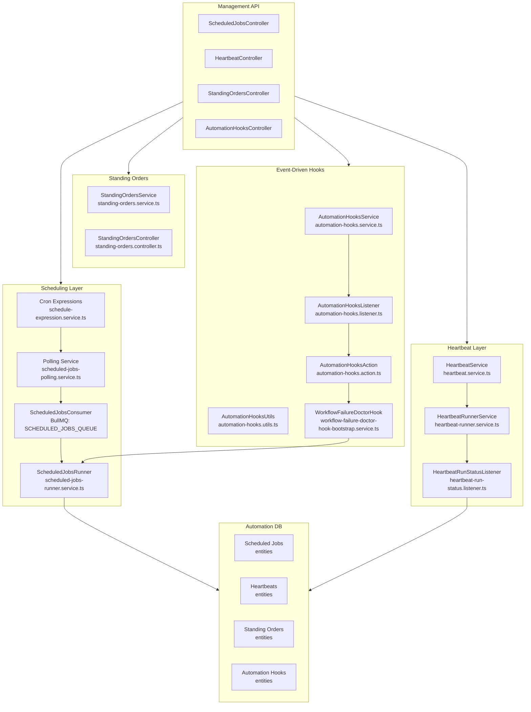
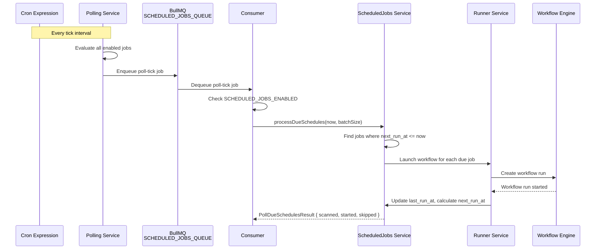

# 15 — Automation

The automation system manages scheduled jobs, heartbeats, standing orders, and event-driven hooks. It provides the infrastructure for time-based workflow triggers, periodic health monitoring, persistent automation rules, and reactive event handling — including automatic failure repair.

## Architecture

## Scheduled Jobs

Scheduled jobs execute time-based automation. Each job has a cron expression that defines its schedule and a target action (typically launching a workflow).

### Cron Expression Parsing

The `ScheduleExpressionService` (`schedule-expression.service.ts`) parses and validates cron expressions. It supports:

- Standard 5-field cron (`minute hour day-of-month month day-of-week`)
- Human-readable aliases (e.g., `@daily`, `@hourly`)
- Next-execution-time calculation
- Expression validation with descriptive error messages

### Job Lifecycle

1. **Definition** — A scheduled job is created via the `ScheduledJobsController` API or seed data, specifying:
   - Cron expression
   - Target workflow ID or name
   - Input parameters for the workflow
   - Enabled/disabled flag
   - Concurrency policy (skip, queue, or parallel)

2. **Polling** — The `ScheduledJobsPollingService` periodically polls for due schedules. It evaluates all enabled jobs against the current time and collects jobs whose next execution time has arrived.

3. **Consumer** — The `ScheduledJobsConsumer` (`scheduled-jobs.consumer.ts`) processes poll-tick jobs from the `SCHEDULED_JOBS_QUEUE` BullMQ queue:
   - Checks the `SCHEDULED_JOBS_ENABLED_KEY` system setting
   - Reads the `SCHEDULED_JOBS_POLL_BATCH_SIZE_KEY` for batch sizing (default: configurable)
   - Delegates to `ScheduledJobsService.processDueSchedules()` with current timestamp and batch size

4. **Execution** — The `ScheduledJobsRunnerService` launches the target workflow for each due job, respecting concurrency policies.

5. **Status Tracking** — The `ScheduledJobRunStatusListener` records execution outcomes (success, failure, skipped) and updates the job's `last_run_at` and `next_run_at` timestamps.

### System Settings

| Setting Key                          | Default      | Description                                      |
| ------------------------------------ | ------------ | ------------------------------------------------ |
| `SCHEDULED_JOBS_ENABLED_KEY`         | `true`       | Master switch to pause/resume all scheduled jobs |
| `SCHEDULED_JOBS_POLL_BATCH_SIZE_KEY` | Configurable | Maximum jobs to process per poll tick            |

## Heartbeats

The heartbeat system provides periodic health checks and status reporting for services, workflows, and external dependencies.

### HeartbeatService

`heartbeat.service.ts` manages heartbeat definitions: creation, configuration, enable/disable, and schedule management. Each heartbeat defines:

- **Target** — what is being monitored (service URL, workflow ID, queue name)
- **Interval** — how frequently to check
- **Timeout** — maximum time to wait for a response
- **Expected status** — what constitutes a healthy response
- **Alert configuration** — who to notify on failure

### HeartbeatRunnerService

`heartbeat-runner.service.ts` executes heartbeat checks on their defined intervals. For each heartbeat:

1. Dispatches the check (HTTP request, queue inspection, Docker API call)
2. Records the response status, latency, and any error details
3. Updates the heartbeat's current state (healthy/unhealthy/unknown)

### HeartbeatRunStatusListener

`heartbeat-run-status.listener.ts` reacts to heartbeat state changes:

- **Healthy → Unhealthy** — triggers alerts and optionally launches repair workflows
- **Unhealthy → Healthy** — records recovery and clears alerts
- **Prolonged unhealthy** — escalates via notification channels

### Management

The `HeartbeatController` provides REST endpoints for:

- Listing all heartbeats with current status
- Creating and configuring heartbeats
- Manually triggering a heartbeat check
- Viewing heartbeat history

## Standing Orders

Standing orders are persistent automation rules that express "when X happens, do Y" intent. Unlike scheduled jobs (time-driven) or event hooks (reactive), standing orders represent ongoing policy.

### StandingOrdersService

`standing-orders.service.ts` manages the lifecycle of standing orders:

- **Creation** — define condition, action, and priority
- **Activation** — an order is active and will be evaluated
- **Suspension** — temporarily paused
- **Deactivation** — permanently disabled

Each standing order specifies:

- **Condition** — a predicate evaluated against system state (workflow status, queue depth, resource usage)
- **Action** — what to do when the condition is met (launch workflow, send notification, adjust settings)
- **Priority** — resolves conflicts when multiple orders match
- **Cooldown** — minimum time between action triggers

### Management

The `StandingOrdersController` provides REST endpoints for CRUD operations and listing.

## Automation Hooks

Automation hooks react to system events in real time. They subscribe to the NestJS `EventEmitter2` bus and trigger actions when matching events fire.

### AutomationHooksService

`automation-hooks.service.ts` manages hook definitions. Each hook specifies:

- **Event pattern** — which system events trigger the hook (e.g., `workflow.step.failed`, `kanban.item.entered.*`)
- **Filter condition** — additional filtering on event payload
- **Action** — what action to take (launch workflow, send webhook, trigger repair)
- **Throttle** — rate limiting to prevent cascading triggers

### AutomationHooksListener

`automation-hooks.listener.ts` subscribes to the NestJS event bus. When a matching event fires:

1. Filters events against hook definitions
2. Evaluates filter conditions against the event payload
3. Applies throttling rules
4. Dispatches the action via `AutomationHooksAction`

### AutomationHooksAction

`automation-hooks.action.ts` executes the hook's configured action:

- **Launch workflow** — creates a workflow run with event payload as input
- **Send webhook** — POSTs event data to an external URL
- **Trigger repair** — invokes the repair engine
- **Update status** — modifies entity state

### AutomationHooksUtils

`automation-hooks.utils.ts` provides helpers for:

- Event pattern matching and wildcard expansion
- Payload extraction and transformation
- Hook audit logging
- Error handling and retry

### Audit and Views

- `automation-hooks.audit.ts` — records hook execution history for debugging
- `automation-hooks.view.ts` — formats hook data for API responses
- `automation-hooks.types.ts` — shared type definitions

### Management

The `AutomationHooksController` provides REST endpoints for:

- CRUD operations on automation hooks
- Listing hooks with filter/sort
- Viewing hook execution history

## Workflow Failure Doctor Hook

The Workflow Failure Doctor Hook (`workflow-failure-doctor-hook-bootstrap.service.ts`) is a specialised automation hook that automatically triggers the repair system when workflow failures are detected.

### Bootstrap Flow

1. On application bootstrap, the service registers a hook for `workflow.step.failed` events
2. When a step failure event fires, the hook evaluates:
   - **Failure classification** — is the failure repairable? (see [Workflow Repair](10-workflow-repair.md))
   - **Retry state** — has the step exhausted its retry policy?
   - **Repair eligibility** — does the workflow allow automatic repair?
3. If eligible, the hook dispatches a repair request to the `WorkflowRepairModule`
4. The repair result is recorded in the event ledger

## Scheduled Job Execution Flow

## Cross-References

- [Workflow Engine](06-workflow-engine.md) — workflow execution that automation triggers
- [Workflow Repair](10-workflow-repair.md) — automated repair triggered by failure hooks
- [Operations](20-operations.md) — doctor checks and recovery flows
- [Security](19-security.md) — YAML validation for automation workflow definitions
