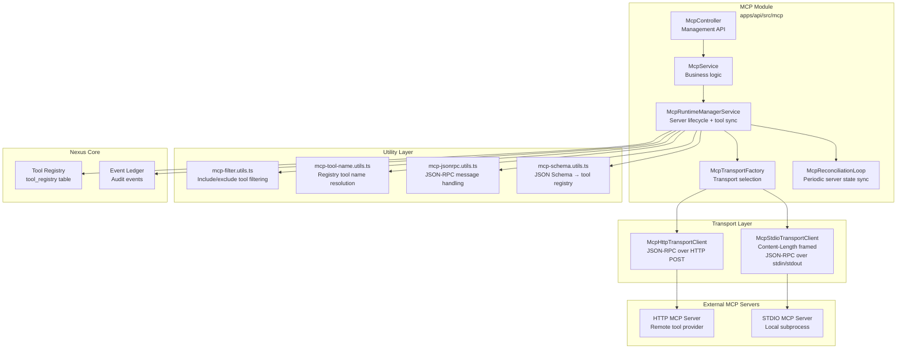
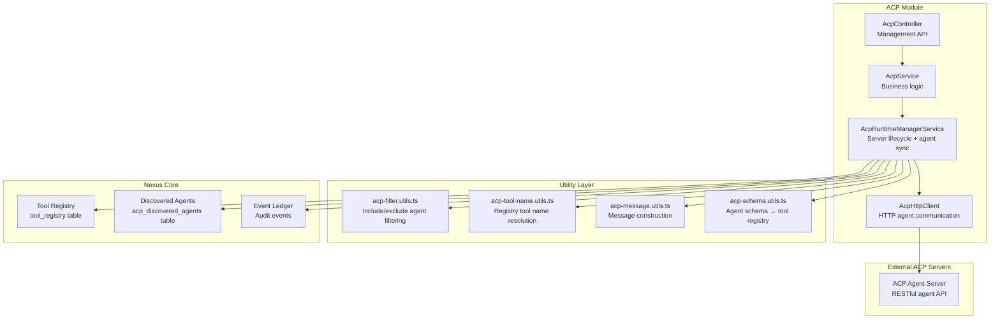

# 16 — MCP and ACP

Nexus Orchestrator integrates with external tool and agent providers through two protocols: **MCP** (Model Context Protocol) for tool servers and **ACP** (Agent Communication Protocol) for remote AI agents. Both protocols share a common runtime management pattern built on `BasePluginRuntimeManagerService`, but differ in transport, communication style, and integration model.

## MCP (Model Context Protocol)

MCP enables discovery and invocation of tools hosted by external servers. MCP servers expose a list of tools via JSON-RPC and accept tool invocation requests.

### Architecture



### Runtime Manager

The `McpRuntimeManagerService` extends `BasePluginRuntimeManagerService` and provides:

- **Server lifecycle** — discover tools, sync to registry, test connectivity
- **Tool invocation** — call remote tools with parameter forwarding
- **Tool cleanup** — remove stale tools when servers disconnect
- **Event emission** — emits `mcp.invoke.succeeded`, `mcp.invoke.failed`, `mcp.reload.succeeded`, `mcp.reload.failed` events

On application bootstrap, it calls `reloadAllServers()` to discover tools from all configured MCP servers. It starts a reconciliation loop for periodic re-discovery.

### Transport Factory

The `McpTransportFactory` selects the appropriate transport client based on the server's `transport_type` configuration.

#### HTTP Transport

`McpHttpTransportClient` sends JSON-RPC requests over HTTP POST to remote MCP servers. Use when:

- The MCP server is a remote service accessible via URL
- Network isolation between the API and tool server is desired
- The server does not support persistent subprocess communication

#### STDIO Transport

`McpStdioTransportClient` spawns a local subprocess and communicates via stdin/stdout using Content-Length framed JSON-RPC messages. Use when:

- The MCP server is a local executable (e.g., a language server, CLI tool wrapper)
- Low-latency tool calls are required
- The server runs on the same host as the API

| Aspect           | HTTP                    | STDIO                          |
| ---------------- | ----------------------- | ------------------------------ |
| Communication    | HTTP POST requests      | Stdin/stdout subprocess        |
| Connection       | Stateless per-request   | Content-Length framed messages |
| Latency          | Network + HTTP overhead | Minimal (local process)        |
| Use Case         | Remote servers          | Local tool servers             |
| State Management | Stateless               | Per-call process sessions      |

### Tool Name Resolution

Tools discovered from MCP servers are registered with two names in the tool registry:

1. **Registry tool name** — `mcp:<server-id>:<remote-tool-name>` (namespaced to prevent collisions)
2. **Remote tool name** — the original tool name from the MCP server

The `mcp-tool-name.utils.ts` provides:

- `buildMcpToolPrefix(serverId)` — generates the namespace prefix
- `buildMcpRegistryToolName(serverId, remoteToolName)` — constructs the registry name
- `buildMcpInvokePath(serverId, remoteToolName)` — builds the API callback path

### Tool Filtering

`mcp-filter.utils.ts` applies server-configured include/exclude filters:

- `include_tools` — if set, only these tools are registered (whitelist)
- `exclude_tools` — if set, these tools are excluded from registration (blacklist)
- All other tools — filtered out when neither list is specified (explicit opt-in)

### JSON-RPC Message Handling

`mcp-jsonrpc.utils.ts` handles:

- Request construction — building valid JSON-RPC 2.0 request objects
- Response parsing — extracting results and error objects
- Error mapping — translating JSON-RPC error codes to NestJS exceptions
- Notification handling — server-to-client notifications

### Schema Construction

`mcp-schema.utils.ts` transforms MCP tool input schemas into the JSON Schema format required by the Nexus tool registry, handling:

- Schema normalisation
- Default value injection
- Description propagation
- Type coercion

### Reconciliation Loop

The `McpReconciliationLoop` (`mcp-reconciliation-loop.ts`) periodically re-discovers tools from all MCP servers to keep the tool registry synchronised:

1. **Default interval** — 5 minutes (`MCP_RECONCILIATION_INTERVAL_MS`, default: 300000ms)
2. **Jitter** — up to 30 seconds random jitter (`MCP_RECONCILIATION_JITTER_MS`, default: 30000ms)
3. **Backoff** — on consecutive failures, delays multiply by the failure streak (max 4x)
4. **Disable** — set `MCP_RECONCILIATION_ENABLED=false` to pause reconciliation

On each loop iteration:

1. Calls `reloadAllServers()` to discover and sync tools from all servers
2. Removes tools that no longer exist on the server
3. Adds newly discovered tools
4. Updates server status and discovery timestamps

## ACP (Agent Communication Protocol)

ACP enables communication with external AI agent servers. Unlike MCP (which exposes tools), ACP exposes agents that can perform multi-turn reasoning tasks.

### Architecture



### Runtime Manager

The `AcpRuntimeManagerService` extends `BasePluginRuntimeManagerService` and provides:

- **Agent discovery** — lists available agents from ACP servers
- **Agent invocation** — creates and monitors agent runs
- **Run modes** — synchronous (poll until complete) and asynchronous (fire-and-forget)
- **Await policy** — handles agent requests for user input

### HTTP Client

The `AcpHttpClient` communicates with ACP servers via REST:

- **`listAgents()`** — `GET /agents` — discover available agents
- **`createRun()`** — `POST /agents/{name}/runs` — start an agent run
- **`getRun()`** — `GET /runs/{run_id}` — poll run status
- **`resumeRun()`** — `POST /runs/{run_id}/resume` — resume an awaiting run

Configuration per server:

- `baseUrl` — server URL
- `auth_type` — authentication type (none, bearer, api-key)
- `auth_token` — authentication token
- `timeout_ms` — request timeout
- `connect_timeout_ms` — connection timeout

### Run Lifecycle

1. **Create** — A run is created with an agent name, input message, and run mode
2. **Sync mode** — the runtime polls `getRun()` up to 60 times (1s intervals) until the run reaches `COMPLETED`, `FAILED`, or `AWAITING`
3. **Awaiting** — the agent needs user input. Behavior depends on `await_policy`:
   - `FAIL` — treat awaiting as a failure
   - `AUTO_RESUME` — send a "continue" message and resume the run
4. **Async mode** — the run ID is returned immediately; the caller is responsible for status polling

### Tool Name Resolution

Similar to MCP, ACP agents are registered as tools with namespaced names:

- Registry name: `acp:<server-id>:<agent-name>`
- Namespace prefix: `buildAcpToolPrefix(serverId)`
- API callback path: `buildAcpInvokePath(serverId, agentName)`

### Message Handling

`acp-message.utils.ts` constructs ACP-compliant messages with:

- `role` — `user` or `assistant`
- `content_type` — `application/json`, `text/plain`, etc.
- `content` — message body

Discovered agents are persisted in the `acp_discovered_agents` table alongside their tool registry entries.

## MCP vs ACP — Comparison

| Aspect               | MCP                                         | ACP                                                   |
| -------------------- | ------------------------------------------- | ----------------------------------------------------- |
| **Purpose**          | Tool discovery and invocation               | Agent discovery and execution                         |
| **What it exposes**  | Tools (functions with input/output schemas) | Agents (multi-turn reasoning entities)                |
| **Communication**    | JSON-RPC 2.0                                | RESTful HTTP                                          |
| **Transports**       | HTTP + STDIO                                | HTTP only                                             |
| **Invocation**       | Stateless tool call                         | Stateful agent run with polling                       |
| **Latency**          | Low (single request-response)               | Variable (multi-turn, can be minutes)                 |
| **Tool naming**      | `mcp:<server-id>:<tool-name>`               | `acp:<server-id>:<agent-name>`                        |
| **Registry**         | Direct tool registry entries                | Tool registry entries + `acp_discovered_agents` table |
| **Reconciliation**   | Background loop (every ~5 min)              | On bootstrap + explicit reload                        |
| **User interaction** | Not applicable (tools are stateless)        | AWAITING state with resume capability                 |
| **Use case**         | File operations, calculations, API calls    | Complex reasoning, code generation, research          |

## External MCP Server Integration Pattern

To integrate a new external MCP server:

1. **Create a server record** via the `McpController` API:

   ```json
   {
     "name": "my-tool-server",
     "transport_type": "http",
     "url": "https://my-server.example.com/mcp",
     "include_tools": ["tool-a", "tool-b"],
     "enabled": true
   }
   ```

2. **Server registration flow:**
   - The `McpRuntimeManagerService` discovers tools via `listTools`
   - `filterMcpTools` applies include/exclude filters
   - Each discovered tool is registered in the tool registry with prefix `mcp:<server-id>:<tool-name>`
   - API callback paths are generated: `POST /api/mcp/servers/{serverId}/tools/{toolName}/invoke`
   - Events are emitted to the event ledger (`mcp.reload.succeeded`)

3. **Tool invocation flow:**
   - Agent requests tool `mcp:<server-id>:<tool-name>`
   - `ToolRuntimeExecutionService` routes to `McpRuntimeManagerService.invokeTool`
   - Transport factory selects HTTP or STDIO client
   - JSON-RPC call is made: `{"jsonrpc": "2.0", "method": "tools/call", "params": {...}}`
   - Result is returned to the agent
   - Success/failure is recorded in the event ledger

4. **Ongoing maintenance:**
   - Reconciliation loop re-discovers tools every 5 minutes (configurable)
   - Stale tools (no longer on the server) are automatically removed
   - New tools are automatically registered
   - Server status is tracked: `CONNECTED`, `FAILED`, `DISABLED`

## Cross-References

- [Tool System](14-tool-system.md) — how MCP and ACP tools integrate into the four-layer tool stack
- [Workflow Runtime](08-workflow-runtime.md) — agent-facing tool execution
- [Plugin Kernel](17-plugin-kernel.md) — plugin runtime adapters share the same `BasePluginRuntimeManagerService` pattern
- [Container Architecture](03-container-architecture.md) — Docker container execution context for tool calls
- [Telemetry & Observability](18-telemetry-observability.md) — event ledger recording of MCP/ACP invocations
