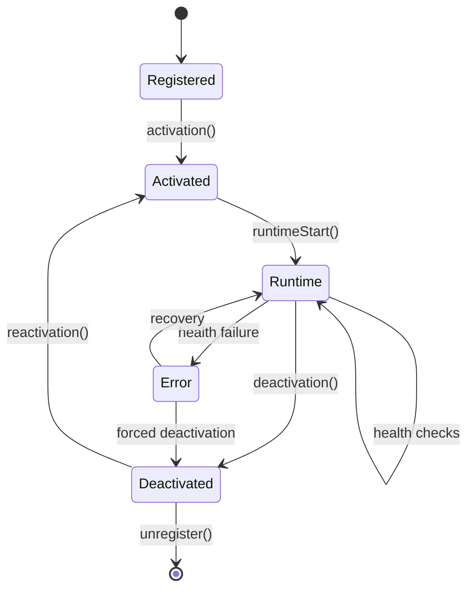
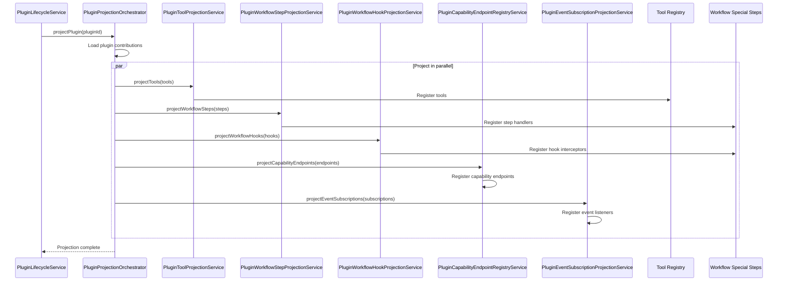
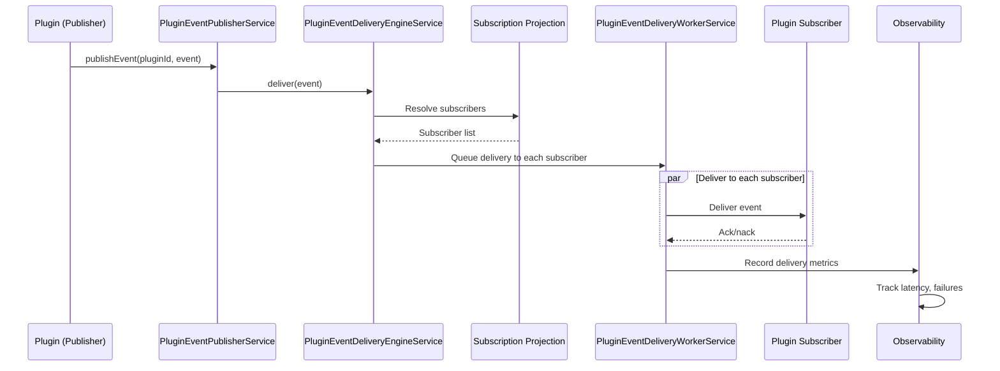

# 17 — Plugin Kernel

The Plugin Kernel provides a modular, extensible plugin system for the Nexus Orchestrator. Plugins can contribute tools, workflow steps, workflow hooks, and capability endpoints. The kernel manages the full plugin lifecycle — from registration to deactivation — and orchestrates how plugin contributions become live system features. Pluigns run in one of three runtime adapters: none (in-process), worker (separate Node.js process), or container (Docker).

## Architecture

```mermaid
graph TB
    subgraph Kernel["Plugin Kernel Module<br/>apps/api/src/plugin-kernel"]
        direction TB

        subgraph Lifecycle["Lifecycle"]
            PLS["PluginLifecycleService"]
            PLSMS["PluginLifecycleStateMachineService"]
        end

        subgraph Contributions["Contributions"]
            PCRS["PluginContributionRegistryService"]
            PPOS["PluginProjectionOrchestratorService"]
            PTPS["PluginToolProjectionService"]
            PWSPS["PluginWorkflowStepProjectionService"]
            PWHPS["PluginWorkflowHookProjectionService"]
        end

        subgraph Events["Event System"]
            PESPS["PluginEventSubscriptionProjectionService"]
            PEPS["PluginEventPublisherService"]
            PEDE["PluginEventDeliveryEngineService"]
            PEDW["PluginEventDeliveryWorkerService"]
            PEDOS["PluginEventDeliveryObservabilityService"]
        end

        subgraph Capabilities["Capability Endpoints"]
            PCERS["PluginCapabilityEndpointRegistryService"]
            PCEIS["PluginCapabilityEndpointInvocationService"]
        end

        subgraph Runtime["Runtime Adapters"]
            PRMS["PluginRuntimeManagerService"]
            PRHS["PluginRuntimeHealthService"]
            PRSS["PluginRuntimeSupervisorService"]
            PNRA["PluginNoneRuntimeAdapter"]
            PWRA["PluginWorkerRuntimeAdapter"]
            PCRA["PluginContainerRuntimeAdapter<br/>Docker"]
        end

        subgraph Policy["Policy"]
            PPS["PluginPolicyService"]
            PAS["PluginAuditService"]
        end

        subgraph API["Management"]
            PMC["PluginManagementController"]
            PTIC["PluginToolInvocationController"]
        end
    end

    subgraph Core["Nexus Core"]
        TR["Tool Registry<br/>tool_registry table"]
        WFS["Workflow Special Steps<br/>workflow-special-steps/"]
        EL["Event Ledger"]
    end

    subgraph External["Plugin Runtimes"]
        NONE["In-Process<br/>Direct function call"]
        WORKER["Worker Process<br/>Child process via IPC"]
        CONTAINER["Docker Container<br/>Isolated execution"]
    end

    PLS --> PLSMS
    PLS --> PCRS
    PCRS --> PPOS
    PPOS --> PTPS
    PPOS --> PWSPS
    PPOS --> PWHPS
    PPOS --> PCERS
    PTPS --> TR
    PWSPS --> WFS
    PESPS --> PEPS
    PEPS --> PEDE
    PEDE --> PEDW
    PEDW --> PEDOS
    PRMS --> PRHS
    PRMS --> PRSS
    PRMS --> PNRA
    PRMS --> PWRA
    PRMS --> PCRA
    PNRA --> NONE
    PWRA --> WORKER
    PCRA --> CONTAINER
    PPS --> PAS
```



## Plugin Lifecycle

The plugin lifecycle is managed by `PluginLifecycleService` with a state machine (`PluginLifecycleStateMachineService`).



### 1. Registration

A plugin is registered by creating a plugin record via the `PluginManagementController`. The record includes:

- Plugin manifest (name, version, capabilities)
- Runtime configuration (adapter type, entry point)
- Contribution declarations (tools, steps, hooks, capability endpoints)
- Policy constraints

### 2. Activation

During activation:

- The `PluginLifecycleStateMachineService` transitions the plugin from `Registered` to `Activated`
- `PluginPolicyService` evaluates the plugin against system policies
- `PluginAuditService` records activation events
- If policy denies, activation fails and the plugin remains `Registered`

### 3. Runtime

At runtime:

- The `PluginRuntimeManagerService` selects the appropriate runtime adapter
- `PluginRuntimeHealthService` performs periodic health checks
- `PluginRuntimeSupervisorService` monitors for crashes and triggers restarts
- Plugin contributions are projected into the system by `PluginProjectionOrchestratorService`

### 4. Deactivation

On deactivation:

- Runtime processes are gracefully shut down
- Plugin contributions are removed from the registry
- Event subscriptions are unregistered
- Capability endpoints are revoked
- Audit trail is recorded

## Contribution Types

Plugins contribute capabilities through four contribution types, all managed by `PluginContributionRegistryService`.

### Tools

```typescript
// Plugin manifests declare tools with input/output schemas
// PluginToolProjectionService projects them into the tool registry
```

Tools contributed by plugins are registered in the `tool_registry` table via `PluginToolProjectionService`. They participate in the full [tool system](14-tool-system.md) lifecycle: capability discovery → registry → runtime → governance.

### Workflow Steps

Plugins can define custom workflow step types. `PluginWorkflowStepProjectionService` registers these step types in the [Workflow Special Steps](07-workflow-step-execution.md) module, allowing workflow YAML definitions to reference plugin-provided steps.

### Workflow Hooks

`PluginWorkflowHookProjectionService` projects plugin hook handlers into the workflow engine. Plugins can intercept workflow lifecycle events (pre-step, post-step, on-failure, on-complete) and inject custom behavior.

### Capability Endpoints

Capability endpoints expose plugin functionality as callable API endpoints. The `PluginCapabilityEndpointRegistryService` manages endpoint registration, and `PluginCapabilityEndpointInvocationService` handles invocation with schema validation and policy enforcement.

## Plugin Projection Orchestrator

The `PluginProjectionOrchestratorService` is the central coordinator that transforms plugin contribution declarations into live system features.



The orchestrator is exposed via the `PLUGIN_PROJECTION_ORCHESTRATOR` injection token, allowing other modules to request re-projection when plugin state changes.

## Plugin Event System

The event system enables plugins to publish and subscribe to system events.

### Event Flow



### Components

| Service                                    | Responsibility                                                                                           |
| ------------------------------------------ | -------------------------------------------------------------------------------------------------------- |
| `PluginEventSubscriptionProjectionService` | Projects plugin event subscriptions into the delivery engine. Maps event patterns to subscriber plugins. |
| `PluginEventPublisherService`              | Accepts events from plugins, validates event schemas, and submits to the delivery engine.                |
| `PluginEventDeliveryEngineService`         | Resolves subscribers for each event, manages delivery routing, handles backpressure.                     |
| `PluginEventDeliveryWorkerService`         | Delivers events to individual subscribers, handles retries and timeouts.                                 |
| `PluginEventDeliveryObservabilityService`  | Tracks delivery latency, success rates, and failure patterns.                                            |

## Runtime Adapters

Plugins execute in one of three runtime adapters, selected per-plugin.

| Adapter                         | Runtime                                     | Isolation                | Latency | Use Case                                                              |
| ------------------------------- | ------------------------------------------- | ------------------------ | ------- | --------------------------------------------------------------------- |
| `PluginNoneRuntimeAdapter`      | In-process (same Node.js thread as the API) | None                     | Minimal | Trusted simple plugins, utility functions                             |
| `PluginWorkerRuntimeAdapter`    | Separate Node.js child process              | Process-level (IPC)      | Low     | Complex logic requiring memory isolation without container overhead   |
| `PluginContainerRuntimeAdapter` | Docker container                            | Full container isolation | Higher  | Untrusted plugins, plugins with system dependencies, maximum security |

### PluginNoneRuntimeAdapter

- Plugin code runs in the same V8 isolate as the API
- No process boundary — direct function calls
- Suitable for lightweight transformation, validation, or utility plugins
- **Security:** No isolation — the plugin has full access to the API process memory

### PluginWorkerRuntimeAdapter

- Plugin code runs in a separate Node.js child process
- Communication via IPC (`PLUGIN_WORKER_PROCESS_FACTORY` injection token)
- Process factory is configurable — defaults to `child_process.fork`
- Environment configuration via `PLUGIN_WORKER_SOURCE_ENV`

### PluginContainerRuntimeAdapter

- Plugin code runs in an isolated Docker container
- Full filesystem, network, and resource isolation
- Container client provided via `PLUGIN_CONTAINER_RUNTIME_CLIENT` injection token
- Environment configuration via `PLUGIN_CONTAINER_RUNTIME_ENV`
- Health checks monitor container status and restart crashed containers

### Runtime Management

The runtime management layer provides:

- **`PluginRuntimeManagerService`** — selects and initializes the correct adapter for each plugin
- **`PluginRuntimeHealthService`** — periodic health checks, monitors process/container alive status
- **`PluginRuntimeSupervisorService`** — crash detection, automatic restarts, backoff on repeated failures. Exposed via `PLUGIN_RUNTIME_SUPERVISOR` injection token.

## Kernel Port Interfaces

The plugin kernel exposes key interfaces via injection tokens for extensibility:

| Token                             | Interface                             | Purpose                                            |
| --------------------------------- | ------------------------------------- | -------------------------------------------------- |
| `PLUGIN_PROJECTION_ORCHESTRATOR`  | `PluginProjectionOrchestratorService` | Project plugin contributions into live features    |
| `PLUGIN_RUNTIME_SUPERVISOR`       | `PluginRuntimeSupervisorService`      | Monitor and recover plugin runtimes                |
| `PLUGIN_CONTAINER_RUNTIME_CLIENT` | Docker client                         | Container management for container-adapter plugins |
| `PLUGIN_RUNTIME_ADAPTERS`         | Array of runtime adapters             | Runtime adapter selection (multi-provide)          |
| `PLUGIN_WORKER_PROCESS_FACTORY`   | Worker process factory function       | Child process creation for worker-adapter plugins  |

## Plugin Policy and Governance

The `PluginPolicyService` enforces security and governance rules over plugins:

- **Installation policy** — which plugin sources are trusted
- **Capability limits** — which contribution types a plugin may register
- **Resource quotas** — CPU, memory, and execution time limits per plugin
- **Network access** — which hosts/ports a plugin may access
- **Filesystem access** — which paths a plugin may read/write

Policy violations are logged by `PluginAuditService` and may trigger automatic plugin deactivation.

## Cross-References

- [Tool System](14-tool-system.md) — how plugin tools integrate into the four-layer tool stack
- [Workflow Step Execution](07-workflow-step-execution.md) — special step handler registration for plugin steps
- [MCP and ACP](16-mcp-acp.md) — plugin runtime adapters share `BasePluginRuntimeManagerService` with MCP/ACP
- [Container Architecture](03-container-architecture.md) — Docker container execution for container-adapter plugins
- [Security](19-security.md) — IAM policies and plugin governance
