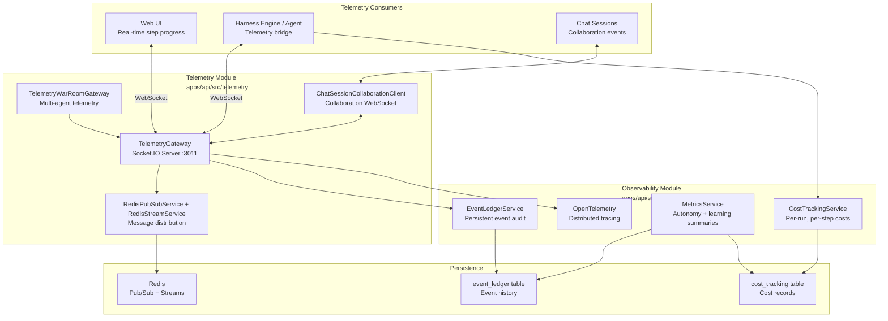

# 18 — Telemetry & Observability

The telemetry and observability system provides real-time visibility into agent execution, historical audit trails, cost tracking, and operational metrics. It combines a Socket.IO WebSocket gateway for live streaming, a persistent event ledger for audit and debugging, cost aggregation for resource accounting, and OpenTelemetry integration for distributed tracing.

## Architecture



## WebSocket Gateway (Port 3011)

The `TelemetryGateway` is a Socket.IO server running on port 3011. It is the primary real-time communication channel between the API and all connected clients.

### Connection Lifecycle

1. **Connection** — Clients connect via Socket.IO with authentication (JWT or internal service token)
2. **Post-auth** — After authentication, the gateway sets up:
   - Room membership (workflow run, chat session, or admin rooms)
   - Connection tracking in Redis for agent socket resolution
3. **Runtime events** — During execution, the gateway streams events and handles commands
4. **Disconnection** — Cleanup of room membership, Redis state, and idle tracking

Helper modules in `telemetry-gateway-*.helpers.ts` handle specific concerns:

- `connection.helpers` — connection and disconnection lifecycle
- `runtime.helpers` — step progress, tool execution, agent turns, questions
- `subagent.helpers` — subagent spawn, status check, wait-for-subagents
- `agent-command.helpers` — send commands to connected agents, dehydrate sessions

### Real-Time Event Types

The gateway streams these event types:

| Event                   | Direction        | Description                                                |
| ----------------------- | ---------------- | ---------------------------------------------------------- |
| `agent.telemetry`       | Agent → Server   | Step progress: token usage, thinking output, actions taken |
| `agent.error`           | Agent → Server   | Execution errors with stack traces and context             |
| `agent.end`             | Agent → Server   | Agent turn completion                                      |
| `step.complete`         | Server → Clients | Step finished with output and summary                      |
| `tool.execution.start`  | Server → Clients | Tool invocation starting                                   |
| `tool.execution.update` | Server → Clients | Tool invocation progress                                   |
| `tool.execution.end`    | Server → Clients | Tool invocation completed with result                      |
| `turn.end`              | Server → Clients | Agent turn ended; next turn starting                       |
| `user.questions.posed`  | Server → Clients | Agent needs user input                                     |

### Agent Command Handling

The gateway also handles server-to-agent commands:

- **`agent.command`** — sends directives to running agents (pause, resume, abort, reconfigure)
- **`dehydrate`** — requests the agent to persist its state for later resumption (see `telemetry-gateway-agent-command.helpers.ts`)

### Session Checkpoint Helpers

`telemetry-gateway-session-checkpoint.helpers.ts` handles session state persistence during active execution, allowing recovery if the WebSocket connection drops.

### Web UI Integration

The Web UI connects to the gateway and receives:

- **Step progress** — live display of current step, tokens consumed, elapsed time
- **Tool calls** — real-time list of tool invocations with parameters and results
- **Session state** — agent mode, turn count, conversation history
- **Questions** — interactive prompts when the agent needs user input

### Redis Pub/Sub and Streams

The gateway uses Redis for horizontal scaling:

- **`RedisPubSubService`** — broadcast events across multiple API instances so all WebSocket connections receive updates regardless of which instance the client is connected to
- **`RedisStreamService`** — persistent event streaming for replay and late-joining clients

## War Room Gateway

The `TelemetryWarRoomGateway` extends the telemetry system for multi-agent war-room sessions (see [War Room Module](08-workflow-runtime.md)).

### What it provides:

- **Moderation helpers** (`telemetry-gateway-war-room-moderation.helpers.ts`) — controls agent participation, turn-taking
- **Command helpers** (`telemetry-gateway-war-room.command-helpers.ts`) — war-room-specific agent commands
- **Tool tracking** (`telemetry-gateway-war-room.tool-tracking.ts`) — multi-agent tool usage visualisation
- **Payload helpers** (`telemetry-gateway-war-room-payload.helpers.ts`) — specialised event formatting

### Multi-Agent Event Types

- **Blackboard updates** — when an agent posts to the shared blackboard
- **Consensus events** — voting and agreement between agents
- **Agent join/leave** — when agents enter or exit the war room
- **Turn transitions** — which agent has the floor

## Event Ledger

The `EventLedgerService` provides a persistent, queryable audit trail of all significant system events.

### What Events Are Recorded

Events span multiple domains:

| Domain     | Example Events                                                                           |
| ---------- | ---------------------------------------------------------------------------------------- |
| `workflow` | `workflow.run.started`, `workflow.step.completed`, `workflow.run.failed`                 |
| `mcp`      | `mcp.invoke.succeeded`, `mcp.invoke.failed`, `mcp.reload.succeeded`, `mcp.reload.failed` |
| `acp`      | `acp.invoke.succeeded`, `acp.invoke.failed`, `acp.reload.succeeded`, `acp.reload.failed` |
| `tool`     | Tool call lifecycle events                                                               |
| `kanban`   | Kanban lifecycle transitions                                                             |
| `chat`     | Chat session events                                                                      |
| `plugin`   | Plugin lifecycle and contribution events                                                 |

Each event record contains:

- `domain` — system domain (workflow, mcp, acp, tool, etc.)
- `eventName` — specific event identifier (dot-delimited)
- `outcome` — `success` or `failure`
- `correlationId` — ties events to a workflow run or session
- `payload` — structured JSON payload
- `errorMessage` — truncated to 2000 characters (with `[REDACTED]` placeholder for sensitive data)

### Query Patterns

The event ledger supports:

- **By correlation ID** — `getByCorrelationId(id, limit, offset)` retrieves all events for a specific workflow run or session
- **By ID** — `getById(id)` retrieves a single event
- **Flexible query** — `query(params)` supports domain, event name, outcome, time range, and pagination
- **Best-effort emission** — `emitBestEffort(params)` silently logs failures if event recording fails (non-blocking)

### Event Lifecycle

1. **Emission** — services call `eventLedger.emit()` or `eventLedger.emitBestEffort()`
2. **Storage** — events are persisted to the `event_ledger` table via `EventLedgerRepository`
3. **Query** — the `EventLedgerController` provides REST API access for the Web UI and debugging tools
4. **Retention** — events can be queried historically; retention is configurable

For debugging workflows, use the `retrieve-workflow-events` and `retrieve-debug-bundle` skills.

## Authorization Audit Events

Authorization audit records live in the security audit log, not the workflow event ledger. They are still part of the observability surface because they provide compliance-focused visibility into permission denials, role changes, and neutral scope-node mutations.

They are queryable through the audit API:

```http
GET /api/audit?scopeNodeId=<scope-node-id>&eventType=authz.denied&limit=50&offset=0
Permission: audit:read
```

The implemented authorization event names are `authz.denied`, `authz.role_granted`, `authz.role_revoked`, `authz.scope_created`, `authz.scope_moved`, and `authz.scope_deleted`. Payload metadata is intentionally limited to redacted operational context such as required permission, scope path or scope node ID, enforcement mode, target user, and role ID.

## Cost Tracking

The `CostTrackingService` provides per-run, per-step cost aggregation.

### Tracked Resources

| Resource            | Unit          | Pricing                                     |
| ------------------- | ------------- | ------------------------------------------- |
| **LLM tokens**      | Per 1K tokens | `LLM_PRICE_PER_1K` (based on model pricing) |
| **Compute (heavy)** | Per hour      | `COMPUTE_PRICE_PER_HOUR_HEAVY`              |
| **Compute (light)** | Per hour      | `COMPUTE_PRICE_PER_HOUR_LIGHT`              |

### Tracking Flow

1. During workflow execution, the agent reports token usage to the gateway
2. Container execution durations are recorded from the step consumer
3. `CostTrackingService` calculates costs and stores records in the `cost_tracking` table
4. Each record includes: `resource_type`, `model`, `units_consumed`, `cost_usd`, `workflow_run_id`
5. `getMonthlySummary()` aggregates costs by resource type for the current calendar month

## Metrics Service

The `MetricsService` computes operational summaries from event ledger and cost tracking data.

### Autonomy Summaries

Autonomy metrics measure how independently agents operate:

- **Autonomous steps** — steps completed without human intervention
- **Human-in-the-loop steps** — steps requiring approval or user input
- **Autonomy ratio** — autonomous steps / total steps
- **Intervention latency** — time between posing a question and receiving a response

The `autonomy-summary.projection.ts` and `autonomy-learning-summary.projection.ts` compute these from event ledger data.

### Learning Summaries

Learning metrics track skill improvement over time:

- **Skills proposed** — new skills suggested by agents
- **Skills promoted** — skills that passed the promotion policy
- **Skill success rate** — how often promoted skills lead to successful outcomes
- **Distillation events** — how often memory distillation runs

Safety checks (`autonomy-summary.safety.ts`) prevent the system from learning dangerous patterns.

### Metrics API

The `MetricsController` exposes endpoints for:

- `GET /api/metrics/autonomy` — autonomy summary
- `GET /api/metrics/learning` — learning summary
- `GET /api/metrics/costs` — cost summary

## OpenTelemetry Tracing

The `tracing.ts` module configures OpenTelemetry for distributed tracing across service boundaries:

- **Span propagation** — trace context is propagated through HTTP headers and message queue metadata
- **Key spans** — workflow run creation, step execution, tool invocation, MCP/ACP calls, database queries
- **Export** — traces are exported to a configured collector (OTLP-compatible)
- **Sampling** — configurable sampling rate to manage trace volume

## Session Telemetry

Chat sessions receive real-time updates through the WebSocket gateway:

1. **Session creation** — the Web UI opens a Socket.IO connection to port 3011
2. **Room subscription** — the client joins a room named after the session ID or workflow run ID
3. **Step events** — as the agent executes, `step.complete`, `tool.execution.*`, and `turn.end` events stream to the room
4. **Question handling** — `user.questions.posed` events prompt the user for input; responses are sent back via the gateway
5. **Session completion** — final `turn.end` with completion status closes the telemetry session

## Subagent Execution Telemetry

When subagents execute (see [Workflow Subagents](09-workflow-subagents.md)), the telemetry gateway tracks:

- **Spawn events** — `handleSpawnSubagentAsyncCompat` records subagent creation
- **Status polling** — `handleCheckSubagentStatusCompat` provides subagent progress
- **Completion tracking** — `handleWaitForSubagentsCompat` blocks until all subagents complete
- **Container context** — `resolveContainerContextForSubagent` maps subagents to their execution containers

Subagent telemetry is aggregated into the parent workflow's event stream, with subagent-specific rooms for drill-down.

## Cross-References

- [Workflow Engine](06-workflow-engine.md) — workflow events recorded in the event ledger
- [Workflow Step Execution](07-workflow-step-execution.md) — step-level telemetry during container execution
- [Workflow Subagents](09-workflow-subagents.md) — subagent telemetry and status tracking
- [Chat System](13-chat-system.md) — session collaboration telemetry
- [MCP and ACP](16-mcp-acp.md) — protocol-level event recording
- [Security](19-security.md) — audit logging and redacted sensitive data
- [PI Runner](28-pi-runner.md) — agent-side telemetry bridge
- [Steering Operations Runbook](../operations/steering-operations-runbook.md) — using telemetry for runtime steering
