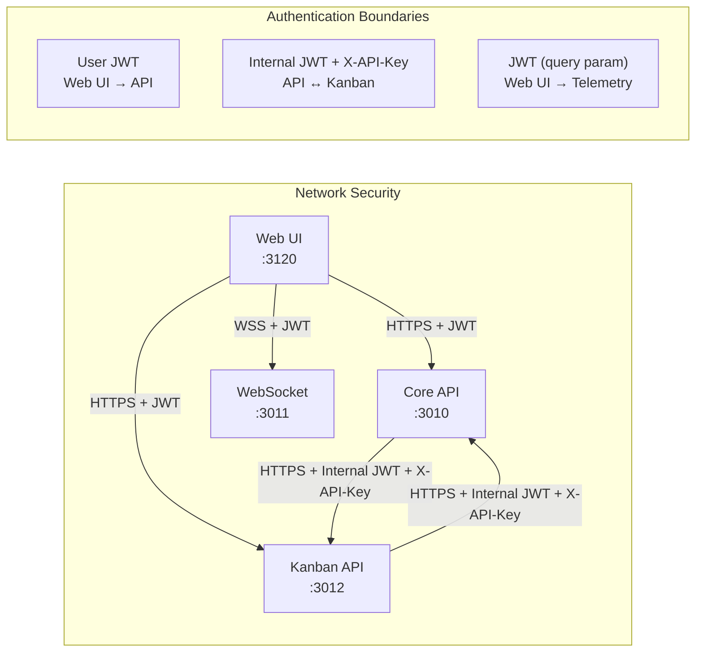

# 19 — Security

The security system provides authentication, authorization, secret management, and audit logging across the Nexus Orchestrator. It protects the API, enforces access control between internal services, secures AI provider credentials, validates workflow YAML for security issues, and maintains an audit trail of all sensitive operations.

## Architecture

```mermaid
graph TB
    subgraph Auth["Authentication<br/>apps/api/src/auth"]
        JWT_STRAT["JwtStrategy<br/>Passport JWT validation"]
        AUTH_SVC["AuthService<br/>Login, token issuance"]
        TOKEN_SVC["TokenService<br/>JWT generation and verification"]
        REFRESH_SVC["RefreshTokenService<br/>Token rotation"]
        JWT_GUARD["JwtAuthGuard<br/>Route protection"]
    end

    subgraph AuthZ["Authorization<br/>apps/api/src/auth"]
        PERM_DEC["RequirePermission Decorator<br/>@RequirePermission('resource:action')"]
        PERM_GUARD["PermissionsGuard<br/>Permission-based access control"]
        ISS_GUARD["InternalServiceScopeGuard<br/>Service-to-service auth"]
        ISS_DEC["InternalServiceScopes Decorator<br/>Scope requirements"]
    end

    subgraph IAM["IAM Policy<br/>apps/api/src/security"]
        IAM["IAMPolicyService<br/>Access control rules"]
    end

    subgraph Secrets["Secret Management<br/>apps/api/src/security"]
        SM["SecretManagerService<br/>Encrypted secret store"]
        SS["SecretScannerService<br/>Secret leakage detection"]
    end

    subgraph Validation["Input Validation<br/>apps/api/src/security"]
        YAML_VAL["YAMLValidationService<br/>Workflow YAML scanning"]
    end

    subgraph Audit["Audit<br/>apps/api/src/security"]
        AUDIT["AuditLogService<br/>Audit trail"]
    end

    subgraph Clients["Clients"]
        WEB["Web UI<br/>User JWT"]
        API_CLIENT["API Clients<br/>User JWT"]
        KANBAN["Kanban Service<br/>Internal JWT + X-API-Key"]
        OTHER["Other Services<br/>Internal auth"]
    end

    subgraph Store["Persistence"]
        USERS["users table"]
        REFRESH_TOKENS["refresh_tokens table"]
        SECRET_STORE["secret_store table<br/>Encrypted secrets"]
        AUDIT_LOG["audit_log table"]
        IAM_POLICIES["iam_policies table"]
    end

    WEB --> JWT_GUARD
    API_CLIENT --> JWT_GUARD
    JWT_GUARD --> JWT_STRAT
    JWT_STRAT --> TOKEN_SVC
    AUTH_SVC --> TOKEN_SVC
    AUTH_SVC --> REFRESH_SVC
    REFRESH_SVC --> REFRESH_TOKENS

    JWT_GUARD --> PERM_GUARD
    PERM_GUARD --> PERM_DEC

    KANBAN --> ISS_GUARD
    OTHER --> ISS_GUARD
    ISS_GUARD --> ISS_DEC
    ISS_GUARD --> TOKEN_SVC

    PERM_GUARD --> IAM
    ISS_GUARD --> IAM
    IAM --> IAM_POLICIES

    SM --> SECRET_STORE
    SS --> SECRET_STORE
    YAML_VAL --> AUDIT
    AUDIT --> AUDIT_LOG

    SM --> AUTH_SVC
```

## Authentication

### JWT Strategy

The `JwtStrategy` implements Passport.js JWT authentication. On each request:

1. The JWT is extracted from the `Authorization: Bearer <token>` header
2. The `JwtModule` (configured with `JWT_SECRET` from environment) validates the token signature
3. The strategy validates the token payload, checks expiration, and verifies the user exists
4. The validated user object is attached to the request (`req.user`)

JWT configuration:

- **Secret** — `JWT_SECRET` environment variable (required)
- **Expiration** — 1 hour (`expiresIn: '1h'`)
- **Algorithm** — HS256 (configurable)

### Token Service

The `TokenService` handles JWT generation and lifecycle:

- **Access tokens** — short-lived JWTs (1 hour) for API access
- **Token payload** — user ID, roles, and metadata
- **Token verification** — signature validation and expiration checking
- **Token invalidation** — server-side token blacklisting for forced logout

### Refresh Tokens

The `RefreshTokenService` provides token rotation:

- **Issue** — a refresh token is issued alongside each access token
- **Rotate** — clients exchange an expired access token + valid refresh token for a new pair
- **Revoke** — refresh tokens can be revoked server-side (stored in `refresh_tokens` table)
- **Rotation security** — each refresh token is single-use; a new one is issued with each rotation

### Auth Controller

The `AuthController` exposes:

- `POST /api/auth/login` — username/password → access token + refresh token
- `POST /api/auth/refresh` — refresh token → new access token + refresh token
- `POST /api/auth/logout` — revoke refresh token

### Internal Service Authentication

Service-to-service communication uses a dual authentication mechanism:

1. **JWT tokens** — issued with internal service claims (`iss: 'nexus-internal'`)
2. **X-API-Key header** — shared secret header for simplified internal calls

The `InternalServiceScopeGuard` validates both mechanisms and attaches service identity to the request context.

## Authorization

### Permission-Based Access Control

API routes declare the permission they require via the
`@RequirePermission(...)` decorator. `PermissionsGuard` reads that
declaration, resolves the calling user, resolves the target scope node
from the request, and asks `AuthorizationService` whether the user holds
the permission at that scope:

```typescript
@RequirePermission('audit:read')
@Get('audit-entries')
async listEntries() { ... }
```

`PermissionsGuard` is the **only** HTTP-boundary authorization guard. The
historical `RolesGuard` + `@Roles(...)` pair has been removed (see
[Unified Authorization Guard](#unified-authorization-guard) below for the
migration notes).

**Built-in roles** are seeded by
`apps/api/src/database/seeds/authorization/role-permissions.seed.ts` and
each role grants a fixed set of permissions:

| Role             | Permission Set                                                                                                                                        |
| ---------------- | ----------------------------------------------------------------------------------------------------------------------------------------------------- |
| `platform_admin` | All permissions in the catalog                                                                                                                        |
| `admin`          | All permissions in the catalog                                                                                                                        |
| `tenant_admin`   | `manage` on `scopes`, `resources`, `workflows`, `agents`, `skills`, `approvals`, `goals`, `memory`, `budgets`, `roles`; `read` on `users`, `settings` |
| `member`         | `read`/`create`/`update` on `resources`, `workflows`, `agents`, `skills`, `goals`, `memory`; `read` on `scopes`, `approvals`, `budgets`               |
| `viewer`         | `read` on every resource in the catalog                                                                                                               |

`tenant_admin` was renamed from the legacy `org_admin` (migration
`20260714010000-rename-org-admin-to-tenant-admin.ts`) as part of the
multi-tenant scopes work; the permission set is unchanged, only the name and
description were updated. That work also adds one auto-generated
`<resource>_admin` role per catalog resource (each granting
`<resource>:manage`) plus a `member_admin` composite role (`roles:manage` +
`users:manage`) — see
[multi-tenant-scopes.md](multi-tenant-scopes.md#phase-1--member-management--granular-roles)
for the full role catalog.

Roles are an internal grouping mechanism for granting permission sets to
users. Authorization decisions at the HTTP boundary are made against
permissions, never against role names.

### Unified Authorization Guard

The API has a single authorization guard for HTTP-boundary enforcement:
[`PermissionsGuard`](../../apps/api/src/auth/authorization/permissions.guard.ts).
It works in tandem with the [`@RequirePermission(...)`](../../apps/api/src/auth/authorization/require-permission.decorator.ts)
decorator, which writes the required permission string into route metadata.
`PermissionsGuard` reads that metadata at request time and delegates the
decision to [`AuthorizationService`](../../apps/api/src/auth/authorization/authorization.service.ts),
which evaluates role assignments and inherited permissions against the
resolved `scopeNodeId`.

There is no second authorization guard at the HTTP boundary. Controller
authors declare _what permission is required_; the rest (scope
resolution, role inheritance, enforcement-mode selection, audit
recording) is handled uniformly inside the guard pipeline.

#### Role-to-Permission Helper

Roles are not evaluated directly by `PermissionsGuard`. Instead, every
built-in role is mapped to a fixed permission set at seed time, and the
guard checks whether the user holds the required permission through that
mapping. The canonical source of role-to-permission bindings is
[`apps/api/src/database/seeds/authorization/role-permissions.seed.ts`](../../apps/api/src/database/seeds/authorization/role-permissions.seed.ts),
which defines a `ROLE_PERMISSION_MAPPINGS` table (one role name → one
array of permission names) and grants those bindings on first boot and
whenever the seed runs. The role-to-permission mappings currently live
inline in the seed file and may be extracted into a reusable helper
module as the catalog grows, so subsequent contributors should extend
the seed mapping rather than duplicating role/permission wiring inside
controllers or services.

When adding a new built-in role:

1. Extend `ROLE_PERMISSION_MAPPINGS` in `role-permissions.seed.ts` with
   the role name and its permission list (use `permissionName(resource, action)`
   from the [permission catalog](#permission-catalog-and-scoped-enforcement)).
2. Re-run the seed to materialize `role_permissions` rows.
3. Reference the role only via role assignments — never in
   `@RequirePermission(...)` decorators or route guards.

#### ADR Pointer

The architectural rationale for collapsing onto a single guard is
captured in `docs/architecture/decisions/ADR-unified-authorization-guard.md`
(forthcoming). That ADR documents the prior two-guard system (the historical
`RolesGuard` + `@Roles(...)` pair alongside the new `PermissionsGuard`),
the duplication and drift that motivated the consolidation, and the
phased rollout (child-1 helper extraction → child-2 guard removal →
child-3 doc finalization). The audit context lives in
`docs/analysis/two-guard-systems-audit.md` (forthcoming).

#### Legacy `RolesGuard` Removal

The legacy `RolesGuard` (and its `@Roles(...)` decorator) was removed
in **child-2 of the unified authorization migration** on **2026-07-01**.
All HTTP-boundary route protection now flows through `PermissionsGuard`
with `@RequirePermission(...)`. Any references to `RolesGuard` or `@Roles`
that survive outside the ADR, the audit doc, and this guide's migration
note are documentation bugs and should be cleaned up.

### Internal Service Scopes

The `InternalServiceScopes` decorator defines what internal services are permitted to access:

| Scope                 | Service        | Description                                                                                                           |
| --------------------- | -------------- | --------------------------------------------------------------------------------------------------------------------- |
| `kanban:read`         | Kanban Service | Read workflow data, events, and artifacts                                                                             |
| `kanban:write`        | Kanban Service | Create workflow runs, update scope data                                                                               |
| `kanban:events`       | Kanban Service | Subscribe to workflow lifecycle events                                                                                |
| `pi-runner:telemetry` | PI Runner      | Send telemetry data to the gateway (harness-engine telemetry scope — engine-agnostic, not tied to `@nexus/pi-runner`) |

The `InternalServiceScopeGuard` validates that the calling service's JWT contains the required scopes.

### IAM Policy Service

The `IAMPolicyService` provides fine-grained access control rules:

- **Policy rules** — conditions defining who can do what to which resources
- **Policy evaluation** — evaluates rules against request context (user, role, resource, action)
- **Policy management** — CRUD operations on policies via API
- **Policy types** — allow, deny, conditional (with time-window, IP-range, or MFA requirements)

### Permission Catalog and Scoped Enforcement

Fine-grained API authorization uses a permission catalog plus `PermissionsGuard`:

| Component                | Responsibility                                                                 |
| ------------------------ | ------------------------------------------------------------------------------ |
| `@RequirePermission()`   | Declares the permission required by a controller handler, such as `audit:read` |
| `PermissionsGuard`       | Resolves the caller, permission, and target `scopeNodeId` before route entry   |
| `AuthorizationService`   | Evaluates role assignments and inherited permissions                           |
| `EnforcementModeService` | Selects `enforce`, `warn`, or `audit` behavior per resource                    |
| `RoleAssignmentService`  | Grants and revokes roles at scope nodes                                        |

The guard resolves `scopeNodeId` from route parameters, query parameters, request body, or the global scope fallback. Role assignments inherit down the neutral scope-node hierarchy, so a permission granted on an ancestor scope applies to descendants unless a more-specific rule changes the result.

Enforcement modes are staged:

| Mode      | Request Behavior                                      | Audit Behavior                  |
| --------- | ----------------------------------------------------- | ------------------------------- |
| `enforce` | Denied permissions block the request                  | Records `authz.denied`          |
| `warn`    | Request is allowed and a warning is logged            | Records the would-deny decision |
| `audit`   | Request is allowed without warning-level log emphasis | Records the would-deny decision |

### Authorization Audit

Authorization-sensitive operations are recorded through `AuthorizationAuditService`, which writes to `AuditLogService` without allowing audit persistence failures to break the observed request.

Implemented authorization audit events are:

| Constant        | Event Type            | Emitted When                                       |
| --------------- | --------------------- | -------------------------------------------------- |
| `DENIED`        | `authz.denied`        | A required permission is denied or would be denied |
| `ROLE_GRANTED`  | `authz.role_granted`  | A scoped role assignment is created                |
| `ROLE_REVOKED`  | `authz.role_revoked`  | A scoped role assignment is removed                |
| `SCOPE_CREATED` | `authz.scope_created` | A neutral scope node is created                    |
| `SCOPE_MOVED`   | `authz.scope_moved`   | A neutral scope node changes parent                |
| `SCOPE_DELETED` | `authz.scope_deleted` | A neutral scope node is deleted                    |

Audit records include redacted metadata such as required permission, scope path or scope node ID, enforcement mode, target user, and role ID where applicable.

The audit API is guarded by the same permission model:

```http
GET /api/audit?scopeNodeId=<scope-node-id>&eventType=authz.denied&limit=50&offset=0
Permission: audit:read
```

### Tool Approval Scope Matching

Tool approval rules support a `scope_node` scope type. This lets governance rules attach to the same neutral hierarchy used by API authorization: a rule configured at an ancestor scope can match executions in descendant scopes through the scope-node closure, while API/core remains unaware of Kanban-specific identifiers or status semantics.

## Secret Management

### Secret Store

Provider credentials (API keys, tokens) are stored encrypted in the `secret_store` database table. Secrets are:

- **Encrypted at rest** — server-side encryption before persistence
- **Referenced by ID** — `llm_providers.secret_id` references a secret, never stores the raw key
- **Decrypted on use** — only when the workflow engine needs to make an API call

### SecretManagerService

`SecretManagerService` handles:

- **Create** — encrypt and store a new secret
- **Read** — decrypt and return a secret (access-controlled)
- **Update** — re-encrypt and update an existing secret
- **Delete** — securely remove a secret (with audit trail)
- **Rotation** — scheduled credential rotation for supported providers

### SecretScannerService

`SecretScannerService` detects potential secret leaks:

- **Output scanning** — scans agent outputs and tool results for patterns matching API keys, tokens, or passwords
- **Log scanning** — scans log entries for accidental secret leakage
- **Redaction** — redacts detected secrets with `[REDACTED]` placeholder

The scanner uses pattern matching against common secret formats:

- OpenAI API keys (`sk-*`)
- Anthropic API keys (`sk-ant-*`)
- GitHub tokens
- Generic high-entropy strings
- JWT tokens

## Harness Credential Delivery

Harness and provider credentials are resolved **API-side** by `HarnessCredentialResolverService` from `secret_store` (AES-256-GCM at rest) and delivered over the existing WebSocket `configure` handshake into `HarnessRuntimeConfig.model.auth` (primary credential) and `harnessOptions.credentials` (secondary credentials).

**Security invariant:** Resolved secrets are **never** written to the container environment and never appear in `docker inspect` or process listings. Only non-secret `defaultEnv` fields flow as container environment variables. A required-but-unbound credential fails the launch explicitly — it is never silently degraded.

See [41 — Harness Runtime § Secure Handshake Delivery](41-harness-runtime.md#secure-handshake-delivery).

### Scoped Credential Bindings

`harness_credential_binding` binds secrets at a `scope_node_id` (`NULL` = platform/global; otherwise a neutral scope node — the same domain-neutral hierarchy used across API/core, so Kanban project/work-item identifiers never enter core). Resolution walks most-specific → ancestors → platform. OAuth device-flow-minted tokens are stored as ordinary `secret_store` secrets (same AES-256-GCM encryption and audit path).

See [12a-secret-provider-setup.md](12a-secret-provider-setup.md) for binding procedures.

## Spawn Subagent Profile Gating

Agents can be restricted to only spawn specific subagent profiles. This is enforced via `tool_policy` argument matching — the same policy evaluation path used for all other tool calls. No separate mechanism is needed.

### How It Works

When an agent calls `spawn_subagent_async({ agent_profile: 'target-profile' })`, the tool policy evaluator checks the combined `ToolPolicyDocument` (agent profile + workflow/job + dynamic rules) against:

```
{ tool: 'spawn_subagent_async', arguments: { agent_profile: 'target-profile' } }
```

If the matched rule effect is `deny`, a `ForbiddenException` is raised and the spawn is blocked.

### Example: investigation-coordinator

The `investigation-coordinator` agent (`seed/agents/investigation-coordinator/agent.json`) can only spawn `investigation-subagent`:

```json
{
  "tool_policy": {
    "default": "deny",
    "rules": [
      {
        "effect": "deny",
        "tool": "spawn_subagent_async",
        "arguments": { "agent_profile": "ceo-agent" }
      },
      {
        "effect": "allow",
        "tool": "spawn_subagent_async",
        "arguments": { "agent_profile": "investigation-subagent" }
      },
      "allow spawn_subagent_async *"
    ]
  }
}
```

The structured deny rule for `ceo-agent` fires first (higher specificity due to `arguments`). The structured allow rule for `investigation-subagent` fires next. The string-format catch-all `"allow spawn_subagent_async *"` allows any other profile.

### Error Behavior

A denied spawn produces a `ForbiddenException`:

```
spawn_subagent_async to profile 'ceo-agent' is denied by policy
```

The calling agent receives this as a tool error result surfaced in the next prompt turn.

### Configuration Patterns

**Only allow the paired subagent (strictest):**

```json
{
  "tool_policy": {
    "default": "deny",
    "rules": [
      {
        "effect": "allow",
        "tool": "spawn_subagent_async",
        "arguments": { "agent_profile": "investigation-subagent" }
      }
    ]
  }
}
```

**Block a specific profile, allow all others:**

```json
{
  "tool_policy": {
    "default": "deny",
    "rules": [
      {
        "effect": "deny",
        "tool": "spawn_subagent_async",
        "arguments": { "agent_profile": "ceo-agent" }
      },
      "allow spawn_subagent_async *"
    ]
  }
}
```

See [36 — Tool Policy System](36-tool-policy.md) for the complete tool_policy model and evaluation details.

## YAML Validation

The `YAMLValidationService` scans workflow YAML definitions for security issues before they are saved or executed:

### Security Checks

| Check                     | Description                                                                 |
| ------------------------- | --------------------------------------------------------------------------- |
| **Command injection**     | Detects shell command injection patterns in step configurations             |
| **Path traversal**        | Identifies `../` or absolute path references that could access system files |
| **Unbounded execution**   | Flags steps without timeout or resource limits                              |
| **Sensitive environment** | Detects hardcoded API keys or credentials in environment variables          |
| **Denylisted tools**      | Blocks workflows using deny-listed tool names                               |
| **Network policy**        | Validates container network configuration against policy                    |
| **Volume mounts**         | Checks host volume mounts for security-sensitive paths                      |
| **Image verification**    | Ensures container images are from approved registries                       |

Validation failures are reported with specific line references and remediation suggestions. They are logged to the audit trail.

## Webhook Signature Verification

For Telegram and other webhook integrations, webhook payloads are verified using:

- **Signature validation** — HMAC or token-based signature checking
- **Replay protection** — timestamp-based request freshness validation
- **IP allowlisting** — optional source IP filtering for known webhook senders

## Audit Logging

The `AuditLogService` records security-relevant events to the `audit_log` table:

### Audited Events

| Category              | Events                                                            |
| --------------------- | ----------------------------------------------------------------- |
| **Authentication**    | Login success/failure, token refresh, token revocation, logout    |
| **Authorization**     | `authz.denied`, role grant/revoke, scope create/move/delete       |
| **Secret management** | Secret create/read/update/delete, rotation events                 |
| **Configuration**     | Provider changes, workflow enable/disable, system setting changes |
| **Admin actions**     | User creation/deletion, role assignment, policy changes           |

### Audit Record Fields

Each audit record includes:

- `actor_id` — who performed the action
- `action` — what was done (e.g., `secret.read`, `workflow.enable`)
- `resource_type` — what was acted upon
- `resource_id` — specific resource identifier
- `outcome` — success, failure, denied
- `details` — structured JSON with relevant context (redacted for sensitive data)
- `ip_address` — request origin IP
- `timestamp` — when it occurred

### Query and Retention

- Audit logs are queryable via `GET /api/audit?scopeNodeId=&eventType=&limit=&offset=` for compliance and investigation; callers need `audit:read`
- Retention policies are configurable (default: 90 days for detailed records, indefinite for summary)
- Export to external logging systems (SIEM) is supported

## Security Boundaries Between Services



### Key Security Principles

1. **User-facing endpoints** require JWT authentication with role-based access
2. **Service-to-service calls** require both internal JWT tokens and X-API-Key headers
3. **WebSocket connections** authenticate via JWT in the connection query string
4. **AI provider secrets** are never stored in plaintext; encrypted at rest in `secret_store`. Under the harness runtime, resolved credentials are delivered over the `configure` WebSocket handshake and never injected as container environment variables. See [41 — Harness Runtime § Secure Handshake Delivery](41-harness-runtime.md#secure-handshake-delivery).
5. **Workflow YAML** is scanned for security issues before save and execution
6. **Tool invocations** go through the four-layer governance system (see [Tool System](14-tool-system.md))
7. **Container execution** enforces resource limits, network policies, and filesystem restrictions
8. **Audit logs** capture all security-relevant events for compliance

## Cross-References

- [Tool System](14-tool-system.md) — tool governance and approval rules
- [AI Config](12-ai-config.md) — provider credential storage and secret references
- [Workflow Engine](06-workflow-engine.md) — YAML validation during workflow creation
- [Container Architecture](03-container-architecture.md) — Docker security boundaries
- [Service Communication](04-service-communication.md) — inter-service auth patterns
- [Telemetry & Observability](18-telemetry-observability.md) — event ledger and audit trail overlap
- [Plugin Kernel](17-plugin-kernel.md) — plugin policy and governance
