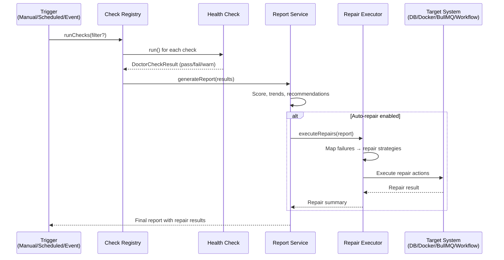

# 20 — Operations

The Operations module provides automated health diagnostics, repair, and recovery for the Nexus Orchestrator. Its centerpiece is the **Doctor** framework — a check-based diagnostic system that examines every subsystem, detects problems, and optionally triggers repairs. The module also includes workflow recovery tools and runtime artifact inspection capabilities.

## Architecture

```mermaid
graph TB
    subgraph Doctor["Doctor Framework"]
        DCRS["DoctorCheckRegistryService<br/>Check registry"]
        DRS["DoctorReportService<br/>Report generation"]
        DHS["DoctorHistoryService<br/>Historical reports"]
        DRES["DoctorRepairExecutorService<br/>Repair execution"]
        DWS["DoctorWorkflowRepairService<br/>Workflow-specific repair"]
        DRDL["DoctorRepairDelegationListener<br/>Event-driven repair dispatch"]
    end

    subgraph Checks["8 Health Checks"]
        WSC["WorkflowStuckState<br/>Detect stalled runs"]
        QLD["QueueLagDeadLetter<br/>Monitor BullMQ queues"]
        SSH["SplitServiceHealth<br/>Check Kanban + services"]
        CRI["ContainerRuntimeIntegrity<br/>Verify Docker state"]
        CSM["ContractSchemaMismatch<br/>Detect schema drift"]
        TPRI["ToolPluginRegistryIntegrity<br/>Validate tool/plugin registrations"]
        GWI["GitWorktreeIntegrity<br/>Check worktree health"]
        AC["ApiConnectivity<br/>Verify inter-service connectivity"]
    end

    subgraph Recovery["Recovery Services"]
        SRRS["SystemRecoveryRepairService<br/>Automated system recovery"]
        WRCS["WorkflowRecoveryCandidatesService<br/>Find recoverable workflows"]
        RAIS["RuntimeArtifactsInspectorService<br/>Inspect execution artifacts"]
    end

    subgraph API["Management API"]
        ODC["OperationsDoctorController<br/>Run checks, view reports"]
    end

    subgraph Deps["Dependencies"]
        DB["Database<br/>Entity repositories"]
        DOCKER["Docker<br/>Container inspection"]
        BULL["BullMQ<br/>Queue inspection"]
        MCP["MCP Module<br/>Server checks"]
        WF["Workflow Module<br/>Run state access"]
    end

    ODC --> DCRS
    ODC --> DRS
    ODC --> DHS
    DCRS --> WSC
    DCRS --> QLD
    DCRS --> SSH
    DCRS --> CRI
    DCRS --> CSM
    DCRS --> TPRI
    DCRS --> GWI
    DCRS --> AC

    WSC --> WF
    QLD --> BULL
    SSH --> DB
    CRI --> DOCKER
    CSM --> DB
    TPRI --> DB
    TPRI --> MCP
    GWI --> DB
    AC --> DB

    DCRS --> DRS
    DRS --> DRES
    DRS --> DWS
    DRS --> SRRS
    DRDL --> DRES
    DRS --> WRCS
    DRS --> RAIS
```



## Doctor Check Framework

The Doctor framework is built around three core concepts: **checks** (what to examine), **reports** (what was found), and **repairs** (how to fix it).

### DoctorCheckRegistryService

The `DoctorCheckRegistryService` maintains the registry of all health checks. Each check implements a standard interface:

```
interface DoctorCheck {
  name: string;
  description: string;
  severity: 'critical' | 'warning' | 'info';
  run(): Promise<DoctorCheckResult>;
}
```

The registry allows:

- **Run all checks** — comprehensive health scan
- **Run specific checks** — targeted diagnostics by check name
- **Filter by severity** — critical-only or warning-and-above scans
- **Scheduled scans** — checks can be triggered via automation hooks or scheduled jobs

### DoctorReportService

The `DoctorReportService` orchestrates check execution and aggregates results into a structured report:

- **Summary** — pass/fail/warn counts, overall health score
- **Per-check details** — individual check results with diagnostics
- **Trends** — comparison with previous reports (via `DoctorHistoryService`)
- **Recommendations** — suggested repairs and their estimated impact

### DoctorHistoryService

Historical reports are stored for trend analysis:

- **Time-series** — health scores over time
- **Regression detection** — flags when a previously-passing check starts failing
- **Repair correlation** — tracks which repairs resolved which issues

### DoctorRepairExecutorService

When checks detect problems that match known repair patterns, the `DoctorRepairExecutorService` can execute repairs. It exposes six named `DoctorRepairActionId` values:

| Action ID                           | Effect                                                                        |
| ----------------------------------- | ----------------------------------------------------------------------------- |
| `requeue_recoverable_workflow_runs` | Calls `workflowEngine.resumeWorkflow()` for up to 25 recoverable PENDING runs |
| `prune_orphaned_runtime_artifacts`  | Removes orphaned/stale Docker containers and mount directories                |
| `refresh_mcp_plugin_catalogs`       | Reloads all MCP servers and reconciles tool catalogs                          |
| `clean_git_worktrees`               | Repairs/cleans corrupted git worktrees                                        |
| `recover_api_fetch_failures`        | Recovers workflow runs stuck in API fetch failure loops                       |
| `clear_stale_polling_markers`       | Currently a stub — always returns "No stale markers found"                    |

All executions are recorded in the `doctor_repair_history` table and retrievable via `GET /api/operations/doctor/history`.

The `DoctorRepairDelegationListener` listens for `workflow.repair-delegation.doctor.requested` events emitted by `WorkflowRepairDispatchService` — this is how the automatic repair pipeline (see [10 — Workflow Repair](10-workflow-repair.md)) invokes Doctor repair actions after classifying a failure.

### Connection to the Workflow Repair Pipeline

The Doctor framework and the `WorkflowRepairModule` are integrated at one point: when `WorkflowRepairDispatchService` resolves a `doctor` execution path (for `runtime_artifact_stale` failures), it emits `workflow.repair-delegation.doctor.requested`. The `DoctorRepairDelegationListener` (in this module) receives that event and calls `DoctorRepairExecutorService.execute()` directly.

**Important:** This integration only fires if `workflow_repair_delegation_enabled` is `true` in `system_settings`. With the default value of `false`, Doctor repair actions are only triggered manually via `POST /api/operations/doctor/repair`.

### DoctorWorkflowRepairService

Specialised repair service for workflow-level issues:

- **Step retry orchestration** — re-enqueues failed steps with modified parameters
- **Workflow continuation** — resumes workflows from the last successful checkpoint
- **Resource reclamation** — cleans up orphaned containers, worktrees, and mounts

## The 8 Health Checks

### 1. WorkflowStuckState

**File:** `checks/workflow-stuck-state.check.ts`

Detects workflow runs that are stuck in non-terminal states beyond a configurable timeout.

| Checked            | Detection Criteria                                                     |
| ------------------ | ---------------------------------------------------------------------- |
| Stalled runs       | `status = 'running'` and `updated_at > threshold`                      |
| Abandoned steps    | Steps in `pending` or `processing` state for too long                  |
| Idle sessions      | Chat sessions with no activity beyond idle timeout                     |
| Orphaned subagents | Subagents whose parent workflow has completed but the subagent did not |

**Severity:** Critical

**Repair options:**

- Timeout and mark the stuck workflow as failed
- Restart from the last successful checkpoint
- Escalate to the repair agent for intelligent diagnosis

### 2. QueueLagDeadLetter

**File:** `checks/queue-lag-dead-letter.check.ts`

Monitors BullMQ queue health — depth, processing rate, and dead letter accumulation.

| Checked           | Detection Criteria                          |
| ----------------- | ------------------------------------------- |
| Queue depth       | Waiting jobs exceed threshold               |
| Processing lag    | Jobs waiting longer than expected           |
| Dead letter queue | Failed jobs in the dead letter queue        |
| Worker health     | Active worker count vs expected             |
| Stalled jobs      | Jobs marked as stalled beyond recovery time |

**Severity:** Warning (depth/lag), Critical (dead workers, excessive dead letters)

**Repair options:**

- Scale workers for backed-up queues
- Replay dead letter jobs with modified parameters
- Restart stalled workers

### 3. SplitServiceHealth

**File:** `checks/split-service-health.check.ts`

Verifies the health of split (separately deployed) services.

| Checked                | Detection Criteria                       |
| ---------------------- | ---------------------------------------- |
| Kanban service         | HTTP health check endpoint response      |
| Honcho (if configured) | Memory backend connectivity              |
| Redis                  | Connection and basic operations          |
| Database               | Connection pool health and query latency |

**Severity:** Critical (core dependencies), Warning (optional services)

**Repair options:**

- Trigger service restart via orchestration
- Failover to fallback backends (e.g., Honcho → Postgres memory)
- Notify operators

### 4. ContainerRuntimeIntegrity

**File:** `checks/container-runtime-integrity.check.ts`

Verifies the integrity of Docker containers used for workflow execution.

| Checked              | Detection Criteria                                |
| -------------------- | ------------------------------------------------- |
| Container state      | Unexpectedly stopped or exited containers         |
| Image availability   | Required images present on the Docker host        |
| Resource usage       | Containers exceeding memory/CPU quotas            |
| Orphaned containers  | Containers without corresponding active workflows |
| Network connectivity | Containers can reach required services            |

**Severity:** Warning (resource overuse), Critical (unable to launch containers)

**Repair options:**

- Stop and remove orphaned containers
- Pull missing images
- Restart failed containers for active workflows

### 5. ContractSchemaMismatch

**File:** `checks/contract-schema-mismatch.check.ts`

Detects schema drift between registered tools and their actual implementations.

| Checked                 | Detection Criteria                                        |
| ----------------------- | --------------------------------------------------------- |
| MCP tool drift          | Tool schema changed since last discovery                  |
| Registered vs actual    | Tool registry schema differs from discovered schema       |
| Parameter compatibility | Required parameters added/removed without registry update |
| Type mismatches         | Field types changed between registrations                 |

**Severity:** Warning

**Repair options:**

- Trigger MCP/ACP re-discovery for affected servers
- Update tool registry entries to match current schemas
- Mark affected workflows for review

### 6. ToolPluginRegistryIntegrity

**File:** `checks/tool-plugin-registry-integrity.check.ts`

Validates the consistency of the tool registry and plugin registrations.

| Checked                | Detection Criteria                                       |
| ---------------------- | -------------------------------------------------------- |
| Duplicate tool names   | Same tool name registered from multiple sources          |
| Stale MCP/ACP entries  | Registered tools whose source server is disabled/deleted |
| Plugin consistency     | Plugin contributions match registered tools              |
| Orphaned registrations | Tool registry entries without a valid source             |
| Source validation      | Each tool's source (internal/MCP/ACP/plugin) is verified |

**Severity:** Warning

**Repair options:**

- Remove stale/orphaned tool registry entries
- Reconcile plugin contributions with registry
- Re-discover tools from active MCP/ACP servers

### 7. GitWorktreeIntegrity

**File:** `checks/git-worktree-integrity.check.ts`

Verifies the health of Git worktrees used for workflow execution.

| Checked                | Detection Criteria                           |
| ---------------------- | -------------------------------------------- |
| Worktree existence     | Registered worktree paths exist on disk      |
| Worktree lock          | No stale `.git/worktrees/*/locked` files     |
| Repository consistency | Worktree's parent repo is accessible         |
| Disk space             | Worktree directories within size limits      |
| Orphaned worktrees     | Worktrees without active workflow references |

**Severity:** Warning

**Repair options:**

- Prune orphaned worktrees
- Remove stale lock files
- Trigger worktree re-creation for active workflows

### 8. ApiConnectivity

**File:** `checks/api-connectivity.check.ts`

Verifies inter-service connectivity from the API's perspective.

| Checked                   | Detection Criteria                    |
| ------------------------- | ------------------------------------- |
| Self-health               | API health endpoint responds          |
| Kanban connectivity       | HTTP to Kanban service succeeds       |
| Redis connectivity        | Redis commands succeed                |
| Database connectivity     | Database queries succeed              |
| LLM provider connectivity | Test API call to configured providers |

**Severity:** Critical

**Repair options:**

- Limited automated repair (most connectivity issues require infrastructure intervention)
- Trigger failover mechanisms where available
- Generate detailed connectivity report for operators

## Repair and Recovery Flows

### DoctorRepairExecutorService

The repair executor maps check failures to repair strategies:



### SystemRecoveryRepairService

`SystemRecoveryRepairService` orchestrates multi-step recovery for systemic issues:

- **Cascading failures** — when multiple checks fail simultaneously, the service identifies root causes and repairs in dependency order
- **Service restart sequences** — coordinates restarting dependent services in the correct order
- **State reconciliation** — repairs inconsistencies between database state and runtime state
- **Rollback support** — can revert repairs if they cause further issues

### WorkflowRecoveryCandidatesService

`WorkflowRecoveryCandidatesService` identifies workflows that are candidates for automatic recovery:

- **Interrupted workflows** — workflows that were running during a service restart
- **Retry-exhausted workflows** — workflows whose step retries were exhausted but may succeed with different parameters
- **Resource-constrained failures** — workflows that failed due to temporary resource limits (memory, disk)
- **Transient errors** — workflows that failed due to network timeouts or temporary service unavailability

The service ranks candidates by:

1. Recovery likelihood (based on failure classification and historical repair success)
2. Business priority (workflow priority score)
3. Resource cost (estimated compute/tokens needed for retry)

### Running Workflow Reconciliation

The workflow run reconciler also handles stale `RUNNING` records whose BullMQ jobs are no longer live. During reconciliation it scans the live BullMQ states once, skips failed-job handling when a matching live job still exists, and sends stranded running runs through the existing workflow failure path so retry and repair policy remain centralized.

The grace period is controlled by `WORKFLOW_STALE_RUN_GRACE_MS`. Increase it for slow or heavily loaded environments where queue visibility can lag; decrease it only when operators need faster recovery from lost workers and have confirmed jobs are not being falsely classified as absent.

### RuntimeArtifactsInspectorService

`RuntimeArtifactsInspectorService` inspects execution artifacts for diagnostics:

- **Container logs** — retrieves Docker container stdout/stderr for failed steps
- **Worktree contents** — inspects Git worktree state during failure
- **Session trees** — examines compressed conversation history
- **Event ledger** — queries related events for context
- **Tool call traces** — reconstructs the tool invocation chain

Artifact inspection is read-only — it does not modify state but provides evidence for human operators or repair algorithms.

## How to Run Doctor Checks

### Via API

```bash
# Run all checks
curl -H "Authorization: Bearer <token>" \
  http://localhost:3010/api/operations/doctor/run

# Run specific checks
curl -H "Authorization: Bearer <token>" \
  http://localhost:3010/api/operations/doctor/run?checks=WorkflowStuckState,QueueLagDeadLetter

# Run critical-only checks
curl -H "Authorization: Bearer <token>" \
  http://localhost:3010/api/operations/doctor/run?severity=critical

# View historical reports
curl -H "Authorization: Bearer <token>" \
  http://localhost:3010/api/operations/doctor/history
```

### Via Automation

Doctor checks can be scheduled via the [Automation](15-automation.md) system:

- Create a scheduled job with a cron expression to run checks periodically
- Create a standing order to run checks when specific conditions are met
- Configure the Workflow Failure Doctor Hook to run checks after workflow failures

### Interpreting Results

Each check returns a result with:

- **Status** — `pass` (healthy), `warn` (potential issue), `fail` (confirmed problem), `error` (check execution failed)
- **Severity** — `critical`, `warning`, `info`
- **Details** — structured diagnostic data specific to the check
- **Recommendation** — suggested action (auto-repair available, manual intervention needed, or monitoring recommended)

The aggregate report provides:

- **Health score** — weighted score (0–100) based on passing/failing checks and their severities
- **Change from previous** — trend indicator (improving, stable, degrading)
- **Repair summary** — which repairs were attempted and their results

## Cross-References

- [Automation](15-automation.md) — scheduling doctor checks and failure hooks
- [Workflow Repair](10-workflow-repair.md) — failure classification and repair dispatch
- [Workflow Engine](06-workflow-engine.md) — workflow state machine and stuck state detection
- [Workflow Step Execution](07-workflow-step-execution.md) — container execution and retry policy
- [MCP and ACP](16-mcp-acp.md) — server health and reconciliation
- [Tool System](14-tool-system.md) — tool registry integrity
- [Chat System](13-chat-system.md) — memory backend health
- [Plugin Kernel](17-plugin-kernel.md) — plugin runtime health
- [Service Communication](04-service-communication.md) — inter-service connectivity
- [Operations Runbooks](../operations/README.md) — detailed diagnostic and recovery procedures
