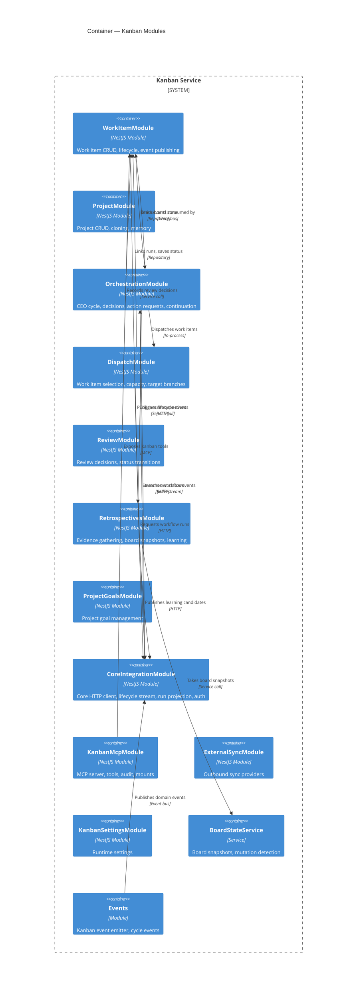

# 21 — Kanban Overview

The Kanban service is a standalone NestJS application at `apps/kanban/src` that owns the project, work-item, orchestration, review, and retrospective domains. It operates with its own TypeORM database instance, separate from the Core API database, and communicates with Core over HTTP using internal service authentication.

## Why Separate from Core?

The Kanban domain is deliberately extracted into a separate service to enforce the **API/Core boundary**: API and Core code must remain Kanban-neutral. They use neutral identifiers (`scopeId`/`contextId`) and never reference Kanban domain concepts (work items, project statuses, orchestration cycles). This separation ensures that Core remains a general-purpose workflow engine while Kanban owns the domain-specific lifecycle logic, state machines, and validation rules.

## Domain Model

The Kanban domain is organized around five primary concepts:

| Concept                  | Description                                                                                                               |
| ------------------------ | ------------------------------------------------------------------------------------------------------------------------- |
| **Projects**             | Top-level work containers with goals, orchestration state, repository settings, and team configuration                    |
| **Work Items**           | Individual units of work with status lifecycle, dependencies, subtasks, execution configuration, and linked workflow runs |
| **Orchestration Cycles** | CEO-driven iteration loops that evaluate board state, dispatch work items, and steer the project                          |
| **Reviews**              | Automated code review triggered when work items enter review status; records structured QA feedback                       |
| **Retrospectives**       | Post-cycle analysis that gathers evidence, takes board snapshots, and produces learning candidates                        |

## Kanban Module Inventory

The Kanban service comprises 17 modules, organized by responsibility:

### Domain Modules

| #   | Module                   | Path              | Responsibility                                                                                                                                                                                                                        |
| --- | ------------------------ | ----------------- | ------------------------------------------------------------------------------------------------------------------------------------------------------------------------------------------------------------------------------------- |
| 1   | **WorkItemModule**       | `work-item/`      | Work item CRUD, status lifecycle, lifecycle event publishing, human feedback resolution                                                                                                                                               |
| 2   | **ProjectModule**        | `project/`        | Project CRUD, managed project cloning, project memory summaries                                                                                                                                                                       |
| 3   | **OrchestrationModule**  | `orchestration/`  | Orchestration lifecycle (start/pause/resume/complete), cycle decision recording, action requests, continuation, wake-up, run reconciliation, imported hydration recovery, probe results, branch blockers, decision logging — 59 files |
| 4   | **DispatchModule**       | `dispatch/`       | Work item dispatch engine: selection, priority ordering, capacity calculation, target branch claims, orphan reconciliation                                                                                                            |
| 5   | **ReviewModule**         | `review/`         | Review decision recording (approve/reject), triggers status transitions                                                                                                                                                               |
| 6   | **RetrospectivesModule** | `retrospectives/` | Retrospective runs (completion-triggered and manual), evidence gathering, board state snapshots, cycle decision metadata                                                                                                              |
| 7   | **ProjectGoalsModule**   | `goals/`          | Project goal CRUD and management                                                                                                                                                                                                      |

### Integration & Infrastructure Modules

| #   | Module                    | Path             | Responsibility                                                                                                                                                      |
| --- | ------------------------- | ---------------- | ------------------------------------------------------------------------------------------------------------------------------------------------------------------- |
| 8   | **CoreIntegrationModule** | `core/`          | Core workflow client, lifecycle stream consumer, run projection, event ledger client, secret retrieval, domain event publishing, auth token provider, Redis pub/sub |
| 9   | **KanbanMcpModule**       | `mcp/`           | MCP server for Kanban tools, tool manifests, audit, run mounts, manifest validation                                                                                 |
| 10  | **ExternalSyncModule**    | `external-sync/` | Outbound sync to external systems via pluggable providers and transport layers                                                                                      |
| 11  | **KanbanSettingsModule**  | `settings/`      | Numeric and string settings (e.g., `work_item_dispatch_max_active_per_project`)                                                                                     |
| 12  | **MigrationModule**       | `migration/`     | Legacy Kanban import CLI                                                                                                                                            |
| 13  | **Seeds**                 | `seeds/`         | Seed contract specs verifying workflow YAML integrity for orchestration cycles and work-item execution                                                              |

### Supporting Modules

| #   | Module              | Path        | Responsibility                                                                |
| --- | ------------------- | ----------- | ----------------------------------------------------------------------------- |
| 14  | **DatabaseModule**  | `database/` | TypeORM entities, repositories, migrations                                    |
| 15  | **Events Module**   | `events/`   | Kanban event emitter, cycle decision events, retrospective events             |
| 16  | **Services Module** | `services/` | Board state service: board snapshots, mutation detection, column distribution |
| 17  | **Common Module**   | `common/`   | Request context, correlation ID middleware, shared utilities                  |

### How the Modules Relate



## API/Kanban Boundary Rules

The boundary between the Core API and the Kanban domain is **lint-enforced** by the `nexus-boundaries/no-core-kanban-residue` rule. The following rules govern all code:

### What Core Must NOT Do

- Core code (`apps/api/src`, `packages/core/src`) must never reference Kanban domain identifiers: `kanban`, `work-item`, `project` in a Kanban sense, Kanban status names, or Kanban lifecycle concepts.
- Core uses **only neutral identifiers**: `scopeId`/`scope_id` for the project scope and `contextId`/`context_id` for the work-item context.
- Core must not teach itself Kanban lifecycle validation — that belongs in the Kanban service.

### What Kanban Owns

- Work-item status flow, lifecycle validation, and event payload shapes
- Project orchestration state machine and cycle decision logic
- Review workflow coordination and QA feedback recording
- Retrospective evidence gathering, board snapshots, and learning candidate proposals
- Kanban MCP tools (`kanban.work_item`, `kanban.work_item_transition_status`, etc.)
- Seed data contracts for Kanban workflows

### Boundary Examples

**Incorrect** (in Core):

```typescript
// Core must never do this
if (workItem.status === "in-progress") {
  /* ... */
}
```

**Correct** (in Core):

```typescript
// Core uses neutral context
const scopeId = event.payload.scopeId;
const contextId = event.payload.contextId;
```

**Correct** (in Kanban):

```typescript
// Kanban owns lifecycle validation
if (!SUPPORTED_WORK_ITEM_STATUSES.has(status)) {
  throw new BadRequestException(`Invalid work item status: ${status}`);
}
```

### Workflow Invocation Pattern

When Core workflows need Kanban behavior, they call Kanban-owned MCP tools rather than embedding Kanban logic:

- Use `kanban.work_item_transition_status` to advance a work item
- Use `kanban.work_item_patch_execution_config` to update execution config
- Use `kanban.complete_orchestration_cycle_decision` to record CEO decisions

The CEO workflow is seeded with these tools via explicit `allow_tools` lists in its YAML definition. Direct dispatch tools (`kanban.dispatch_selected_work_items`) are denied at the workflow permission level.

## Internal Service Authentication

Kanban authenticates to Core using one of two methods (checked in order):

1. **Static API key**: Set `KANBAN_CORE_BEARER_TOKEN` — used directly as a `Bearer` token.
2. **JWT**: Kanban signs a short-lived JWT (default 5-minute TTL) with the scopes:
   - `core.events:write`
   - `core.domain-events:write`
   - `core.workflow-runs:read`
   - `core.workflow-runs:write`
   - `core.secrets:read`

The JWT identifies itself as `service: kanban`, issuer `nexus-kanban`, audience `nexus-core-internal`.

Relevant environment variables:
| Variable | Default | Purpose |
|----------|---------|---------|
| `KANBAN_CORE_BASE_URL` | `http://localhost:3010/api` | Core API base URL |
| `KANBAN_CORE_BEARER_TOKEN` | — | Static bearer token (takes precedence) |
| `KANBAN_CORE_JWT_SECRET` | `JWT_SECRET` | JWT signing secret |
| `KANBAN_CORE_JWT_AUDIENCE` | `nexus-core-internal` | JWT audience claim |
| `KANBAN_CORE_JWT_ISSUER` | `nexus-kanban` | JWT issuer claim |
| `KANBAN_CORE_JWT_TTL` | `5m` | JWT expiration |

Core authenticates Kanban's internal requests via `InternalServiceAuthGuard` on `/api/internal/core/*` routes, checking the JWT scopes or static token.

## Kanban API Endpoints

The Kanban service runs on port **3012** with the global prefix `/api`.

### Project Endpoints

| Method   | Path                       | Description         |
| -------- | -------------------------- | ------------------- |
| `GET`    | `/api/projects`            | List all projects   |
| `POST`   | `/api/projects`            | Create a project    |
| `GET`    | `/api/projects/:projectId` | Get project details |
| `PATCH`  | `/api/projects/:projectId` | Update project      |
| `DELETE` | `/api/projects/:projectId` | Delete project      |

### Work Item Endpoints

| Method   | Path                                                               | Description             |
| -------- | ------------------------------------------------------------------ | ----------------------- |
| `GET`    | `/api/projects/:projectId/work-items`                              | List work items         |
| `POST`   | `/api/projects/:projectId/work-items`                              | Create work item        |
| `GET`    | `/api/projects/:projectId/work-items/:workItemId`                  | Get work item           |
| `PATCH`  | `/api/projects/:projectId/work-items/:workItemId`                  | Update work item        |
| `DELETE` | `/api/projects/:projectId/work-items/:workItemId`                  | Delete work item        |
| `POST`   | `/api/projects/:projectId/work-items/:workItemId/dispatch`         | Dispatch work item      |
| `POST`   | `/api/projects/:projectId/work-items/:workItemId/review`           | Submit review decision  |
| `POST`   | `/api/projects/:projectId/work-items/:workItemId/merge`            | Request merge           |
| `POST`   | `/api/projects/:projectId/work-items/:workItemId/restart`          | Restart execution       |
| `GET`    | `/api/projects/:projectId/work-items/:workItemId/executions`       | List executions         |
| `GET`    | `/api/projects/:projectId/work-items/:workItemId/execution-config` | Get execution config    |
| `PUT`    | `/api/projects/:projectId/work-items/:workItemId/execution-config` | Upsert execution config |

### Global Work Item Endpoints

| Method | Path                                             | Description                         |
| ------ | ------------------------------------------------ | ----------------------------------- |
| `GET`  | `/api/work-items`                                | List all work items across projects |
| `GET`  | `/api/work-items/automation-statuses/:projectId` | Get active automation statuses      |

### Orchestration Endpoints

| Method | Path                                                                        | Description               |
| ------ | --------------------------------------------------------------------------- | ------------------------- |
| `GET`  | `/api/projects/:projectId/orchestration`                                    | Get orchestration state   |
| `POST` | `/api/projects/:projectId/orchestration/start`                              | Start orchestration       |
| `POST` | `/api/projects/:projectId/orchestration/pause`                              | Pause orchestration       |
| `POST` | `/api/projects/:projectId/orchestration/resume`                             | Resume orchestration      |
| `POST` | `/api/projects/:projectId/orchestration/complete`                           | Complete orchestration    |
| `PUT`  | `/api/projects/:projectId/orchestration/mode`                               | Update orchestration mode |
| `POST` | `/api/projects/:projectId/orchestration/decisions`                          | Record a decision         |
| `GET`  | `/api/projects/:projectId/orchestration/diagnostics`                        | Get diagnostics           |
| `GET`  | `/api/projects/:projectId/orchestration/activity`                           | Get activity summary      |
| `POST` | `/api/projects/:projectId/orchestration/action-requests`                    | Request an action         |
| `GET`  | `/api/projects/:projectId/orchestration/action-requests`                    | List action requests      |
| `GET`  | `/api/orchestration/action-requests`                                        | List all action requests  |
| `POST` | `/api/projects/:projectId/orchestration/action-requests/:requestId/approve` | Approve action            |
| `POST` | `/api/projects/:projectId/orchestration/action-requests/:requestId/reject`  | Reject action             |

### Dispatch Endpoints

| Method | Path                                          | Description                  |
| ------ | --------------------------------------------- | ---------------------------- |
| `POST` | `/api/projects/:projectId/dispatch/ready`     | Dispatch ready work items    |
| `POST` | `/api/projects/:projectId/dispatch/selected`  | Dispatch specific work items |
| `POST` | `/api/projects/:projectId/dispatch/reconcile` | Reconcile linked runs        |

### Retrospective Endpoints

| Method | Path                                             | Description                 |
| ------ | ------------------------------------------------ | --------------------------- |
| `POST` | `/api/retrospectives/run`                        | Trigger a retrospective run |
| `GET`  | `/api/retrospectives/runs`                       | List retrospective runs     |
| `GET`  | `/api/retrospectives/projects/:projectId/status` | Get retrospective status    |

### Internal Core Endpoints

| Method | Path                                         | Description                                                   |
| ------ | -------------------------------------------- | ------------------------------------------------------------- |
| `GET`  | `/api/internal/core/lifecycle-stream/health` | Lifecycle stream health (requires `kanban.core-events:read`)  |
| `POST` | `/api/internal/core/lifecycle-stream/replay` | Replay lifecycle stream (requires `kanban.core-events:write`) |

### Goal Endpoints

| Method   | Path                                     | Description         |
| -------- | ---------------------------------------- | ------------------- |
| `GET`    | `/api/projects/:projectId/goals`         | List project goals  |
| `POST`   | `/api/projects/:projectId/goals`         | Create project goal |
| `PUT`    | `/api/projects/:projectId/goals/:goalId` | Update project goal |
| `DELETE` | `/api/projects/:projectId/goals/:goalId` | Delete project goal |

### MCP Endpoints

| Method | Path                              | Description              |
| ------ | --------------------------------- | ------------------------ |
| `GET`  | `/api/kanban-mcp/manifest`        | Get MCP tool manifest    |
| `POST` | `/api/kanban-mcp/tools/:toolName` | Invoke a Kanban MCP tool |

### External Sync Endpoints

| Method | Path                           | Description           |
| ------ | ------------------------------ | --------------------- |
| `GET`  | `/api/external-sync/providers` | List sync providers   |
| `POST` | `/api/external-sync/sync`      | Trigger outbound sync |

## Kanban Contracts Package

The `@nexus/kanban-contracts` package (`packages/kanban-contracts/src/`) provides Zod schemas and TypeScript types shared between the Kanban service and the Web UI. It covers:

| Domain            | Types                                                                                                                                                                                                                 |
| ----------------- | --------------------------------------------------------------------------------------------------------------------------------------------------------------------------------------------------------------------- |
| **Work Items**    | `WorkItemRecord`, `WorkItemStatus`, `WorkItemExecutionConfig`, `WorkItemSubtask`, `CreateWorkItemInput`, `DispatchWorkItemInput`, `MergeWorkItemInput`, `ReviewDecisionInput`                                         |
| **Projects**      | `ProjectRecord`, `CreateProjectInput`, `ProjectSourceType`, `ProjectGoalInput`                                                                                                                                        |
| **Orchestration** | `OrchestrationState`, `OrchestrationMode`, `OrchestrationStatus`, `StartOrchestrationInput`, `ProjectOrchestration`, `ProjectOrchestrationDecisionEntry`, `ProjectOrchestrationActionRequest`, `ProjectStateSnapshot` |
| **Events**        | `KanbanWorkItemEventEnvelopeV1`, `KanbanWorkItemEventPayloadV1`, `KanbanWorkItemEventTypeV1`                                                                                                                          |
| **Review**        | Review input/output types                                                                                                                                                                                             |
| **Goals**         | Project goal types                                                                                                                                                                                                    |
| **Settings**      | Kanban settings types                                                                                                                                                                                                 |
| **Common**        | Shared schemas and utilities                                                                                                                                                                                          |

All types are derived from Zod schemas via `z.infer<typeof Schema>`, ensuring runtime validation and TypeScript type safety are always in sync.

## Kanban vs Core Ownership Summary

| Concern                                        | Owner                                                                             |
| ---------------------------------------------- | --------------------------------------------------------------------------------- |
| Workflow engine, DAG parsing, step execution   | Core                                                                              |
| AI configuration (providers, models, profiles) | Core                                                                              |
| Work item lifecycle and status validation      | Kanban                                                                            |
| Project orchestration cycle logic              | Kanban                                                                            |
| Dispatch selection, capacity, target branches  | Kanban                                                                            |
| Review workflow coordination                   | Kanban                                                                            |
| Retrospective evidence and board snapshots     | Kanban                                                                            |
| Event ledger for audit trails                  | Core (with Kanban contributing entries)                                           |
| Domain event bus                               | Core (with Kanban publishing events)                                              |
| MCP tool definitions for Kanban tools          | Kanban (via `kanban-mcp` package + Kanban MCP module)                             |
| Seed workflow YAML definitions                 | Shared seed directory, with Kanban-specific contracts in `apps/kanban/src/seeds/` |
| Container execution (Docker)                   | Core                                                                              |
| Authentication and IAM                         | Core                                                                              |
