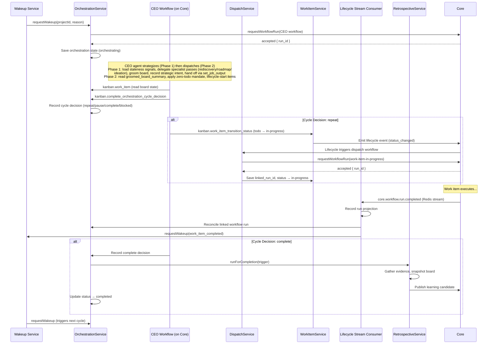

# 23 — Kanban Orchestration Cycle

The project orchestration cycle is the autonomic control loop that drives the Kanban domain. A CEO AI agent evaluates the board state, makes decisions, dispatches work items, monitors progress, reconciles results, and triggers retrospectives — all governed by the `OrchestrationModule` and its supporting services.

## The Complete Loop



## Orchestration Modes

Orchestration runs in one of three modes:

| Mode                 | Behavior                                                                        | Use Case                 |
| -------------------- | ------------------------------------------------------------------------------- | ------------------------ |
| `supervised`         | CEO makes decisions but actions require human approval for high-risk operations | Default for new projects |
| `autonomous`         | CEO makes and executes decisions without human approval gates                   | Trusted, mature projects |
| `notifications_only` | CEO monitors and notifies but does not execute                                  | Read-only observation    |

## Two-Phase CEO Cycle (Strategize → Dispatch)

EPIC-208 Phase 3 split the single CEO decision loop into two sequentially-dependent jobs: **Strategize** and **Dispatch**. The split ensures the strategic beat — re-discovery, roadmap updates, ideation — is structurally unskippable under tactical pressure. Previously a time-pressured or context-limited CEO could reach the dispatch decision without ever evaluating staleness signals. The new structure makes that impossible: the dispatch job cannot start until the strategize job has completed and written its `groomed_board_summary` output.

Both jobs run in the same agent session under the `project_orchestration_cycle_ceo` workflow. The `strategize` job carries an `output_contract` requiring `groomed_board_summary`; the `dispatch` job has `depends_on: [strategize]` and receives the groomed-board context as `{{ inputs.groomed_board_summary }}`.

### Strategize step (Job: `strategize`)

The strategize job is the strategic beat of every cycle. It runs before any work items are started.

**1. Perceive — load strategic context**

The step loads, in order:

- `kanban.project_state` — full board state plus `strategic.staleness` (staleness signals) and `strategic.latestStrategicIntent` (durable recall of last cycle's plan) and `strategic.initiatives`
- `docs/project-context/CHARTER.md` via the `read` tool (`missing_ok: true`) — calibrates grooming and initiative alignment
- `kanban.orchestration_timeline` — deep cycle history, blockers, `dispatch_capacity`, and persistent state for recovery. Returns the most-recent ~20 decisions by default (full total in `diagnostics.decisionCount`); pass `limit`/`offset` to page further back.
- `kanban.orchestration_activity` — lightweight recent-activity feed (`{ totalActionCount, recent[] }`, each item `{ kind, timestamp, summary, status? }`, `limit` default 5/max 50) for routine "what happened recently" checks without loading the full timeline
- `query_memory` — surfaced strategic notes and past escalation history

**2. Delegate — gated specialist passes (all durable-await)**

The CEO evaluates the staleness signals and delegates as warranted. Each delegation durably suspends the step until the child run is terminal, then resumes with results injected. Delegation order is fixed:

| Signal                                                                        | Threshold                               | Tool                             |
| ----------------------------------------------------------------------------- | --------------------------------------- | -------------------------------- |
| `mergesSinceDiscovery >= REDISCOVERY_MERGE_THRESHOLD` (10)                    | Codebase has drifted; re-probe delta    | `delegate_rediscovery`           |
| `starvationForecastCycles <= IDEATION_STARVATION_THRESHOLD_CYCLES` (2)        | Backlog runway thin; generate new items | `delegate_goal_backlog_planning` |
| Horizons stale, no `now`-horizon initiative, or active goal lacks initiatives | Roadmap plan absent or expired          | `delegate_roadmap_planning`      |

Only the conditions that are true this cycle trigger a delegation. Signals are evaluated after every delegation so that a rediscovery result can immediately feed the roadmap-planning decision.

**3. Groom — light board stewardship**

With the strategic context settled, the step performs light grooming. Permitted operations (no lifecycle starts):

- Re-prioritise work items (`kanban.work_item_update`) to align with charter or active initiatives
- Defer blocked or superseded items to `backlog` (`kanban.work_item_transition_status`)
- Split oversized items into sprint-sized deliverables
- Link work items to initiatives via initiative-link tooling

**4. Record strategic intent**

`kanban.record_strategic_intent` is called exactly once per strategize step (even if no grooming occurred). The record captures the board's strategic direction, grooming rationale, priority ordering of initiatives, and any systemic blockers. It becomes the `latestStrategicIntent` visible to the next cycle.

**5. Hand off to dispatch**

`set_job_output` is called once with a `groomed_board_summary` object containing `todo_count`, `backlog_count`, `linkedRunCount`, `dispatchableTodoCount`, `autonomous_mode`, a ranked `promotion_candidates` array, a `strategic_intent` summary, and a `groomed_changes` log. This payload is the sole context bridge to the dispatch job — the dispatch step does not re-read the full board state.

### Dispatch step (Job: `dispatch`)

The dispatch job is the tactical beat. It consumes `groomed_board_summary` from the strategize job output and focuses exclusively on lifecycle decisions.

**What dispatch does:**

1. Reads `{{ inputs.groomed_board_summary }}` — no additional `kanban.project_state` call required for board state
2. Applies the zero-todo backlog promotion mandate: when `autonomous_mode=true`, `todo_count=0`, and unblocked backlog exists, promotion is mandatory (options a–e; bare `repeat` is a protocol violation)
3. Lifecycle-starts dispatchable `todo` items via `kanban.work_item_transition_status` within project WIP-cap
4. Calls `kanban.complete_orchestration_cycle_decision` with `decision`, `reason`, and `idempotency_key`
5. Calls `step_complete`

**Session sharing**

Both steps run in the same agent session. The `set_job_output` call at the end of strategize acts as the structured handoff artifact; the dispatch step receives it through `inputs.groomed_board_summary` injected by the runtime before the job starts.

## Orchestration Statuses

| Status              | Meaning                                          |
| ------------------- | ------------------------------------------------ |
| `idle`              | No active orchestration                          |
| `initializing`      | Starting up, resolving startup routes            |
| `awaiting_approval` | Waiting for human approval on an action request  |
| `bootstrapping`     | Imported project is being bootstrapped           |
| `orchestrating`     | Active orchestration cycle running               |
| `paused`            | Orchestration temporarily suspended              |
| `completed`         | Orchestration finished (terminal)                |
| `failed`            | Orchestration encountered an unrecoverable error |

## Orchestration Startup Routing

When orchestration starts, the startup context determines the initial path:

- **Source context**: Who/what initiated the orchestration (manual, event, scheduled, imported hydration)
- **Readiness context**: Whether the project is ready for a full cycle (specs ready, repository cloned, goals defined)
- **Startup hints**: Preferred workflow ID, route ID, or skip-arbitration flag

The `OrchestrationStateLifecycleService` resolves this context to determine which workflow to launch. For new projects, this often routes through the discovery CEO workflow first. For established projects, it launches directly into the orchestration cycle CEO.

## Dispatch Logic

The dispatch engine selects and launches work items based on a multi-criteria evaluation:

### Selection Criteria (Priority Order)

1. **Status filter**: Only items in `todo` status are dispatchable.
2. **Dependencies satisfied**: All `dependsOn` items must have status `done`.
3. **Target branch availability**: If the work item specifies a `targetBranch` in its execution config, no other item with the same target branch can be currently active.
4. **Agent capacity**: If `maxConcurrentPerAgent` is set, the agent must have available capacity slots.
5. **Project WIP limit**: The total number of active items per project is capped by `work_item_dispatch_max_active_per_project` (a Kanban setting).

### Capacity Calculation

The project dispatch capacity is computed by:

```
availableSlots = maxActivePerProject - activeCount
projectAvailableSlots = max(0, availableSlots)
```

Where `activeCount` counts items with `linked_run_id`/`current_execution_id` set, or whose status is active (`in-progress`, `in-review`, `ready-to-merge`) — see `isProjectDispatchActive`. **Terminal items (`done`) never count**, even if a cancelled or otherwise terminal run stranded their run-link projections; otherwise a stale link would permanently consume a WIP slot. The capacity check gates new dispatches when the project WIP limit is reached.

> **Run-link cleanup.** When a workflow run reaches a terminal state (`COMPLETED`/`FAILED`/`CANCELLED`), the core lifecycle stream consumer eagerly clears the work item's `linked_run_id`/`current_execution_id` (`recordTerminalRunStatus` → `clearRunLinksIfMatches`), releasing the WIP slot immediately. The poll-driven dispatch reconciliation sweep (`clearTerminalLinkedRun`) remains the durable backstop, but it only revisits items the dispatch loop loads — so the eager clear is what frees a run whose item has already moved to a terminal column.

Additionally, `agentAvailableSlots` are calculated per agent when `agentCapacityEnabled` is true, using `idleAgentCount` from the configured agent pool.

### Dispatch Process Walkthrough

1. `DispatchService.dispatchReadyWorkItems()` is called for a project.
2. All work items for the project are fetched, along with their dependency records.
3. Optional: Linked runs are reconciled (terminal runs are cleared, orphaned in-progress items are reset to `todo`).
4. Items are iterated and evaluated against each criterion.
5. For each eligible item, a workflow run is requested from Core via `CoreWorkflowClientService.requestWorkflowRun()`.
6. On acceptance, the item's `linked_run_id` and `current_execution_id` are set, and status is changed to `in-progress`.

> **Implementation note.** Both `DispatchService.dispatchReadyWorkItems` (project-wide ready-mode) and `DispatchService.dispatchSelectedWorkItems` (selection-scoped selected-mode) are thin facades that delegate to a single core function `dispatchWorkItems(deps, options)` in `apps/kanban/src/dispatch/dispatch-work-items.core.ts`. Mode-specific behavior (orphan reconciliation, target-file contention, partial-failure semantics, slot cap, capacity-skip reason, causation-id prefix) is selected by `DispatchCoreOptions` flags, so there is a single dispatch loop with one source of truth for skip-reason strings, idempotency keys, and `causation_id` format. See `docs/plans/2026-06-23-dispatch-loop-unification.md`.

### Target Branch Claims

Work items with `execution_config.targetBranch` set create an exclusive claim on that branch. While one item is active on a branch, no other item can be dispatched for the same branch. This prevents git worktree conflicts. Target branch claims are tracked in-memory during the dispatch loop.

### Orphan Work Item Reconciliation

Items that are `in-progress` but have no `linked_run_id` and no `current_execution_id` are considered orphaned. These are detected and reset to `todo` during the dispatch cycle, allowing them to be re-dispatched. This handles edge cases where the workflow run was lost or the link was never properly established.

## Continuation

The orchestration cycle is designed to span multiple sessions. The CEO workflow runs, makes decisions, triggers dispatches, and then the cycle "completes" — but the project may need to continue orchestrating.

### Continuation Triggers

When a terminal workflow event arrives on the lifecycle stream, the `CoreLifecycleStreamConsumerService` evaluates whether orchestration should continue:

| Terminal Event              | Continuation Trigger  |
| --------------------------- | --------------------- |
| Work item run completed     | `work_item_completed` |
| Non-work-item run completed | `workflow_completed`  |
| Any run failed              | `workflow_failed`     |

### CEO Restart Context

When the CEO workflow restarts (next cycle), it receives the full board state via `kanban.work_item` tool calls. It does not rely on persisted session memory — it re-reads the project state, work items, and any pending decisions. This makes cycles idempotent and crash-resilient.

### Awaiting delegated children (no premature next cycle)

When the CEO strategize step delegates work via its `delegate_*` tools — specifically `delegate_rediscovery`, `delegate_roadmap_planning`, and `delegate_goal_backlog_planning` — the cycle does **not** go terminal the moment the child is launched. Those projected tools route through the durable-await primitive (`await_agent_workflow`), so the CEO run stays `RUNNING` (parked with `wait_reason = 'dependency'`) until every delegated child reaches a terminal state, then resumes with the child results injected and finishes its decision on a settled board. This closes the race/blindness where a fire-and-forget delegation let the **next** cycle start against a half-built board with no knowledge of the in-flight work. See [Durable agent await](08-workflow-runtime.md#durable-agent-await-await_agent_workflow) and [`docs/architecture/durable-agent-await.md`](../architecture/durable-agent-await.md). Fire-and-forget is used only when `ORCHESTRATION_AWAIT_ENABLED=false` or no calling step can be resolved. See [47-strategic-refresh-loop.md](47-strategic-refresh-loop.md) for the full strategic refresh loop and delegation gate conditions.

### Continuation Reconciler

The `OrchestrationContinuationService` and `OrchestrationContinuationReconcilerService` manage the state transitions between cycles:

- Clearing stale linked runs when the CEO workflow terminates
- Detecting when a cycle is stuck (no progress after timeout)
- Triggering repair lane investigations for abnormal patterns

## Wake-Up Service

The `ProjectOrchestrationWakeupService` determines when a new orchestration cycle should be started:

### Wake-Up Sources

| Source                                  | Description                                                                                                                      |
| --------------------------------------- | -------------------------------------------------------------------------------------------------------------------------------- |
| `core_lifecycle_stream`                 | A work item completed or workflow run reached a terminal state                                                                   |
| `orchestration_continuation_reconciler` | Stale reconciler detected stuck orchestration                                                                                    |
| `revision_complete`                     | Spec revision workflow finished                                                                                                  |
| `work_item_merge`                       | A work item's PR was merged; the `work-item-merge-orchestration-wakeup` workflow emits `ProjectOrchestrationCycleRequestedEvent` |
| Manual (API)                            | User explicitly starts orchestration                                                                                             |

The `work-item-merge-orchestration-wakeup` workflow subscribes to `WorkItemMergeCompletedEvent` and emits `ProjectOrchestrationCycleRequestedEvent` for the project. Combined with the existing `max_runs: 1 / on_conflict: skip` concurrency policy on the CEO workflow, rapid merge bursts are coalesced into a single cycle — the CEO never falls behind a merge storm.

### Wake-Up Gates

Before launching a new cycle, the wake-up service checks:

1. **Active cycle guard**: If an orchestration cycle is already running (`hasActiveOrPendingCycle`), the wake-up is suppressed with reason `active_cycle_exists`.
2. **Auto-wake suppression**: Automatic wake-ups are suppressed when the project is in a stopped state — either the CEO previously made a `pause`/`complete`/`blocked` cycle decision, **or** the orchestration lifecycle `status` is `completed` or `paused` (set by the `complete_orchestration` tool or the operator UI). A stopped project stays asleep for **all** automatic sources (lifecycle stream, continuation reconciler, revision-complete) — including the failure of a manually-triggered workflow in its scope — until it is explicitly resumed (`resume`/`start`, which sets `status` back to `orchestrating`). Manual (operator-initiated) wake-ups always bypass this gate.
3. **Coalesce window**: Automatic wake-ups within 60 seconds of the last wake-up are coalesced (deduplicated) to prevent thundering herd.
4. **Stale reconciler cooldown**: Stale reconciler wake-ups have a 5-minute cooldown to avoid tight loops.
5. **Scheduler evaluation**: The intent is evaluated against the control plane scheduler (max 1 active per lane) before launch.

### Wake-Up Intent Lifecycle

Wake-up requests flow through the control plane scheduler:

1. **Intent created**: Scheduler records the intent with conflict keys (scoped to `project_orchestration_cycle_ceo:<projectId>`).
2. **Gates evaluated**: Active cycle check, suppression, coalesce, cooldown.
3. **Scheduler decision**: If the lane has capacity, the intent is `launchable`.
4. **Workflow launched**: The dispatch service emits `ProjectOrchestrationCycleRequestedEvent` which triggers the CEO workflow.
5. **Intent completed or terminalized**: On success, the intent is completed; on failure or suppression, it is terminalized with a reason.

## Cycle Decision Architecture

The CEO agent records structured decisions that steer the orchestration cycle:

### Decision Types

| Decision   | Meaning                                 | Consequence                                               |
| ---------- | --------------------------------------- | --------------------------------------------------------- |
| `repeat`   | Continue orchestration; more work to do | Next wake-up will restart the cycle                       |
| `pause`    | Temporarily stop orchestration          | Auto-wake suppressed; manual resume required              |
| `complete` | Orchestration is finished               | Retrospective triggered; status set to `completed`        |
| `blocked`  | Cannot proceed due to blockers          | Blocked items recorded with reasons; auto-wake suppressed |

### Decision Recording

Decisions are persisted in the orchestration state's `decision_log` array:

- Each decision has a `timestamp`, `correlationId`, `type`, `reasoning`, and `actions`.
- Decisions support idempotency keys to prevent duplicate recording on replay.
- On `complete`, the cycle decision service triggers a retrospective run automatically.

### Decision Log

The decision log is a chronological record of all CEO decisions:

- Filtered to include only `DecisionEntry` records (not metadata-only entries)
- Exposed via diagnostics endpoint for observability
- Used by the retrospective evidence service for cycle analysis

### Clear Cycle Decision

Stale cycle decisions can be cleared (e.g., when a block is resolved or a pause is overridden). This re-enables auto-wake for the project.

## Reconciled Work Item Publishing

When work item runs complete, the `ReconciledWorkItemPublisher` handles post-execution processing:

- **Status updates**: Work items are transitioned to their next status based on the workflow outcome.
- **Metadata enrichment**: Execution results, token spend, and artifact references are written to work item metadata.
- **Dependency resolution**: When a work item reaches `done`, any items that depend on it become unblocked for dispatch.
- **Batch processing**: Multiple completions can be processed together for efficiency.

## Probe Results and Artifact Collection

The `ProbeResultsService` manages the output of codebase investigation probes:

- **Artifact validation**: Probe result JSON is validated against the `probe-result-artifact` schema.
- **Storage**: Validated results are stored and associated with the project.
- **Consumption**: CEO agents and retrospective evidence gatherers read probe results to understand codebase health.

## Retrospective Cycle

When orchestration completes (cycle decision `complete`), a retrospective run is automatically triggered:

### Evidence Gathering

The `KanbanRetrospectiveEvidenceService` collects:

- **Board state snapshots**: Before/after comparisons of work item distribution
- **Cycle decision events**: All decisions made by the CEO during the cycle
- **Work item outcomes**: Completion rates, failure patterns, token spend
- **Probe results**: Codebase investigation findings relevant to the cycle

### Board State Snapshots

The `BoardStateSnapshotService` creates point-in-time snapshots:

- Serializes all work items with their status, priority, scope, and metadata
- Computes column distribution (count by status)
- Detects mutations between snapshots (added/removed/completed items)

### Cycle Decision Metadata

The `CycleDecisionMetadata` structure captures:

- **Cycle number**: Monotonically increasing counter
- **Decision history**: All CEO decisions and their outcomes
- **Action requests**: Human approval requests and their resolutions
- **Duration**: Wall-clock time of the cycle
- **Throughput**: Items completed per cycle

### Learning Candidates

Retrospectives produce learning candidates (`learning.candidate.proposed.v1`) published to Core's domain event bus. These candidates contain:

- **Pattern**: Recurring issue or improvement opportunity
- **Confidence**: 0.0–1.0 score of pattern validity
- **Evidence**: Supporting data from the cycle
- **Recommendation**: Suggested systemic change

Candidates with confidence below 0.6 are filtered out.

### Cooldown

Retrospective runs have a 15-minute cooldown to prevent duplicate analysis. The trigger's idempotency key ensures the same cycle isn't analyzed twice.

## Project Dispatch Capacity

The `ProjectDispatchCapacity` calculation determines how many work items can be active simultaneously:

| Parameter               | Source                                                                          |
| ----------------------- | ------------------------------------------------------------------------------- |
| `maxActive`             | `work_item_dispatch_max_active_per_project` setting                             |
| `activeCount`           | Active work items (linked run or active status); excludes terminal `done` items |
| `availableSlots`        | `maxActive - activeCount`                                                       |
| `projectAvailableSlots` | `max(0, availableSlots)`                                                        |
| `agentCapacityEnabled`  | Agent pool configuration                                                        |
| `configuredAgentCount`  | Total agents in the pool                                                        |
| `idleAgentCount`        | Agents not currently executing a work item                                      |
| `agentAvailableSlots`   | `idleAgentCount` (if agent capacity enabled)                                    |

### Branch Blockers

The `OrchestrationBranchBlockers` logic detects when a target branch conflict is preventing dispatch. The `findTargetBranchBlocker` function identifies which specific work item is holding the claim on a branch, enabling the CEO to make informed decisions about blocking or reprioritization.

## Control-Plane Leases and Lane Capacities

Every orchestration action — whether a CEO cycle request or a single work-item status transition — acquires a short-lived lease in the `kanban_orchestration_leases` table before executing. Leases carry a lane tag, an owner, a conflict-key set, and a TTL; only leases with `expires_at > now()` count as active.

### Lane capacity map

Lane capacities are defined in `apps/kanban/src/orchestration/control-plane/lane-capacity.constants.ts`. The `resolveLaneCapacity` helper in `OrchestrationDecisionExecutorService` returns `LANE_CAPACITY[lane] ?? DEFAULT_LANE_CAPACITY`.

| Lane                   | Capacity | Purpose                                                      |
| ---------------------- | -------- | ------------------------------------------------------------ |
| `discovery`            | 2        | Codebase discovery probes                                    |
| `specification`        | 2        | Spec-refinement passes                                       |
| `work_item_generation` | 2        | Bulk work-item generation                                    |
| `dispatch`             | 4        | Dispatch-candidate evaluation                                |
| `implementation`       | 4        | Active implementation runs                                   |
| `review`               | 2        | Code-review passes                                           |
| `merge`                | 2        | Merge operations                                             |
| `repair`               | 2        | Repair-run investigations                                    |
| `upstream_analysis`    | 2        | Upstream-change re-analysis                                  |
| `strategy`             | **1**    | CEO orchestration cycle (serialises one cycle per project)   |
| `work_item_transition` | **4**    | Single-item mechanical status flips (e.g. QA apply decision) |
| `project_health`       | 2        | Project-health validation                                    |

`DEFAULT_LANE_CAPACITY` is **2** for any lane not listed explicitly.

### `strategy` lane — CEO cycle serialisation

The `strategy` lane has capacity 1. `OrchestrationLeaseService.acquireCycleLease` always places the CEO cycle (`cycle_request` owner, conflict key `project_orchestration_cycle_ceo:<projectId>`) in this lane. Only one cycle may run per project at a time; any concurrent cycle attempt is blocked until the previous one releases or its TTL expires (default TTL: 10 minutes, renewable via heartbeat).

### `work_item_transition` lane — independent of the cycle lease

Single work-item status transitions (e.g. `kanban.work_item_transition_status` called from a QA-review workflow) run in the **`work_item_transition`** lane (capacity 4). Per-item serialisation is enforced by the unique `work_item:<id>` conflict-key index in the leases table, not by lane capacity. Because the cycle lease lives exclusively in the `strategy` lane, a `work_item_transition` lease **never contends with** the CEO cycle lease — each occupies a separate lane.

Incident run `989e9bfc` identified the root cause of this design: before the `work_item_transition` lane was introduced, `kanban.work_item_transition_status` acquired a lease in the `strategy` lane, which the concurrent CEO cycle had saturated (capacity 1). The terminal status transition for a QA-review workflow was blocked for ~8 minutes until the cycle lease expired. The fix routes status transitions through the dedicated `work_item_transition` lane, eliminating that contention entirely.

### Lane-capacity exhaustion error

When `acquireMutationLeases` finds the lane full (active count ≥ capacity), it reads the current holders and returns a structured failure. `OrchestrationDecisionExecutorService.executeDirectMutationDecision` converts this into:

```
lane_capacity_exhausted — lane "<lane>" is full, held by: <ownerKind>:<ownerId> (until <ISO timestamp>)
```

The error names the real holder (owner kind and id from the lease record), not a fabricated `work_item:<id>` conflict key. A TOCTOU guard is applied: if the holders list is empty between the count check and the list fetch (lease expired in the gap), the code falls through and acquires normally rather than raising a false positive.

### Retry telemetry on the API side

When a workflow fails with a contention error, `classifyWorkflowFailure` in `apps/api/src/workflow/workflow-failure-classification.helpers.ts` matches the pattern `/lane_capacity_exhausted|conflicting lease|Mutation blocked|lease capacity/i` and returns:

```
{ reasonCode: 'resource_contention', retryCategory: 'resource_contention' }
```

`workflow.retry_scheduled` events recorded by the audit listener use `outcome: 'in_progress'` and `severity: 'warn'`, making contention-driven retries visible as in-flight work rather than opaque failures.

### Dual-maintenance note

The `OrchestrationLane` TypeScript union (`control-plane.types.ts`) and the `orchestrationLaneSchema` Zod enum (`structured-decision.types.ts`) must be kept in sync. Adding a new lane requires editing **both** files.

## Per-work-item run-link lease

`DispatchService.linkAcceptedRun` (and its batch counterpart
`dispatchSelectedWorkItems.linkAcceptedRun`) participate in the
per-work-item orchestration lease protocol — a `work_item` conflict
key kind in the `dispatch` lane that serialises the lifecycle
projection, the dispatch-cycle funnel, and the user-action funnel on
the same `(project_id, work_item_id)` tuple. The protocol is
documented in
[`ADR-20260623-work-item-run-link-lease`](../architecture/ADR-20260623-work-item-run-link-lease.md).
The race-safety contract, the lease identity, the rollback flag
(`work_item_run_lease_enabled`), and the operator runbook are
cross-referenced from
[kanban-work-item-lifecycle.md](kanban-work-item-lifecycle.md).
