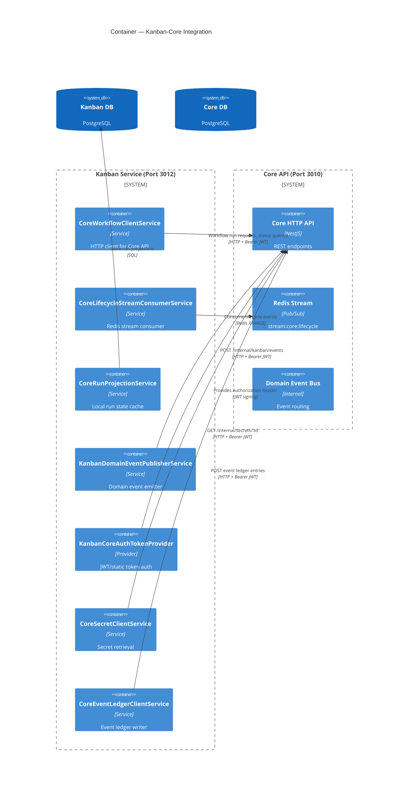
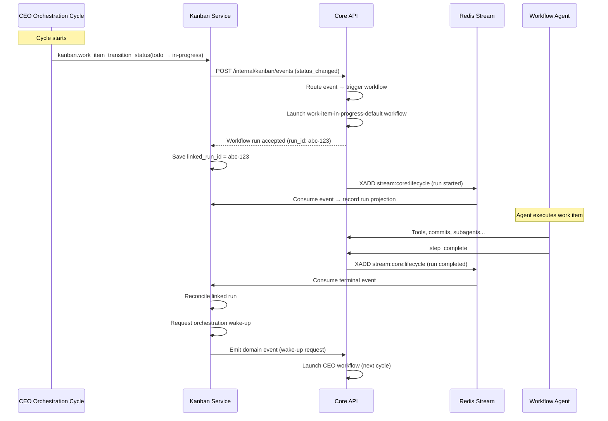

# 24 — Kanban-Core Integration

The Kanban service and the Core API are separate NestJS applications with distinct databases. They communicate over HTTP using internal service authentication and a Redis-backed event stream. This document describes every integration touchpoint.

## Integration Architecture



## CoreWorkflowClientService

The `CoreWorkflowClientService` is the primary integration class. It implements **seven client interfaces**:

| Interface                    | Methods                                           | Core Endpoint              |
| ---------------------------- | ------------------------------------------------- | -------------------------- |
| `WorkflowRunClient`          | `requestWorkflowRun`, `getWorkflowRunStatus`      | Workflow run API           |
| `WorkflowRunControlClient`   | `controlWorkflowRun`, `cancelWorkflowRunsByScope` | Workflow control API       |
| `CoreSecretClient`           | `retrieveSecret`                                  | Internal secrets API       |
| `CoreEventLedgerClient`      | `emitEventLedger`                                 | Event ledger API           |
| `KanbanDomainEventPublisher` | `emitDomainEvent`, `emitDomainEventOrThrow`       | Internal Kanban events API |
| `WorkflowJobOutputClient`    | `setWorkflowJobOutput`                            | Runtime job output API     |
| `WorkflowStepControlClient`  | `stepComplete`                                    | Runtime step control API   |

### How Kanban Launches Workflows

When Kanban needs to launch a workflow on Core (e.g., for a work item dispatch):

```typescript
// DispatchService or WorkItemService calls:
const accepted = await coreClient.requestWorkflowRun({
  workflow_id: "work-item-in-progress-default",
  input: {
    scopeId: projectId,
    contextId: workItemId,
    action: "dispatch",
    // ... additional inputs
  },
  launch_source: "kanban_dispatch",
  context: {
    scopeId: null,
    contextId: projectId,
    contextType: "kanban.project",
    metadata: { work_item_id: workItemId },
  },
  metadata: {
    correlation_id: correlationId,
    causation_id: causationId,
    idempotency_key: `kanban:dispatch:${projectId}:${workItemId}`,
    requested_by: requestedBy,
  },
  external_mcp_mounts: resolveKanbanExternalMcpMounts(),
});
```

Key details:

- `context.scopeId` is set to `null` and `contextId` carries the project ID — consistent with the API/Kanban boundary.
- `context.contextType` is set to `"kanban.project"` so Core knows this is a Kanban-originated run.
- `metadata.work_item_id` is included so Core can trace the run back to a specific work item without importing Kanban types.
- `external_mcp_mounts` injects the Kanban MCP server's tools into the workflow run environment.
- `idempotency_key` prevents duplicate launches for the same dispatch event.

### Workflow Run Status Checking

Kanban queries run statuses to reconcile linked runs and detect terminal states:

```typescript
const status = await coreClient.getWorkflowRunStatus(runId, correlationId);
// status.status: "RUNNING" | "COMPLETED" | "FAILED" | "CANCELLED"
// status.current_step_id: for provision failure detection
```

This is used extensively in `DispatchService.reconcileLinkedRuns()` and by the lifecycle stream consumer.

### Lifecycle Execution

Kanban triggers Core's lifecycle workflow system for ready-to-merge prechecks:

```typescript
const result = await coreClient.executeLifecycleWorkflows({
  scopeId: projectId,
  contextId: workItemId,
  phase: "ready-to-merge",
  hook: "before",
  blockingOnly: true,
});
// result.status: "passed" | "failed" | "skipped"
```

The lifecycle `phase` is the Kanban column slug. Core treats it as an opaque trigger value and only evaluates matching lifecycle workflows. `ready-to-merge` replaces the older `merge` phase name used before lifecycle gates were aligned to the board columns.

If blocking lifecycle workflows fail, the ready-to-merge transition is rejected with details of which workflow and why.

## Core Lifecycle Stream Consumer

The `CoreLifecycleStreamConsumerService` listens to Core's Redis stream (`stream:core:lifecycle`) for workflow run lifecycle events.

### Stream Consumption

Core publishes workflow run events to `stream:core:lifecycle` (Redis stream). Kanban consumes these events via:

1. **Initial replay on startup**: `onModuleInit()` calls `processAvailableEvents()` to catch up from the last persisted cursor.
2. **Polling loop**: A `setInterval` polls every 5 seconds (configurable via `KANBAN_CORE_LIFECYCLE_POLL_INTERVAL_MS`).
3. **Cursor tracking**: The last processed stream ID is persisted in `kanban_core_lifecycle_cursors`.

### Event Processing Pipeline

For each event in the stream:

1. **Parse envelope**: Validate against `CoreWorkflowEventEnvelopeV1Schema`.
2. **Run projection**: If `event_type` starts with `core.workflow.run.`, record the run state in the local `kanban_core_run_projections` table.
3. **Work item linking**: If the event context includes a `work_item_id` (in metadata or context), link the run to the Kanban work item.
4. **Continuation evaluation**: If the run is terminal (`COMPLETED`, `FAILED`, `CANCELLED`):
   - Accrue the run's cumulative token usage onto its work item (`token_spend += usage.total_tokens`). Core attaches the run's `usage` totals to the terminal `core.workflow.run.*` event from `budget_usage_events`; the consumer adds it atomically. Idempotency relies on at-most-once stream delivery and one terminal event per run id.
   - Reconcile the linked orchestration workflow run
   - Classify the terminal event as `completed_work_item`, `failed_work_item`, or `other`
   - Record repair evidence for failed work item runs
   - Request an orchestration wake-up with the appropriate continuation trigger
5. **Dead letter**: Events that fail processing are saved to `kanban_core_lifecycle_dead_letters` for diagnosis.

### Internal Endpoints

| Endpoint                                     | Method | Purpose                                                           |
| -------------------------------------------- | ------ | ----------------------------------------------------------------- |
| `/api/internal/core/lifecycle-stream/health` | `GET`  | Returns stream key, consumer name, last cursor, dead letter count |
| `/api/internal/core/lifecycle-stream/replay` | `POST` | Manually replays from the current cursor                          |

### Terminal Event Handling

```
Terminal workflow event arrives
  → Is it a work item run?
    → Yes: Classify as completed_work_item or failed_work_item
    → No: Classify as other
  → Reconcile orchestration linked run
  → Record repair evidence (for failed work items)
  → Request orchestration wake-up
    → work_item_completed → triggers next dispatch cycle
    → workflow_completed → triggers CEO re-evaluation
    → workflow_failed → triggers repair consideration
```

### Stale Link Detection

If a terminal event's `workItemId` is stale (linked run ID doesn't match) or missing, the consumer:

- Records a stale link in the repair lane
- Stops further processing for that event
- Does NOT trigger a wake-up

## Core Run Projection

The `CoreRunProjectionService` maintains a local copy of Core workflow run states in the Kanban database. This avoids excessive HTTP calls to Core for run status queries.

### Stored Data

| Field             | Source                                         | Purpose                            |
| ----------------- | ---------------------------------------------- | ---------------------------------- |
| `run_id`          | `event.payload.run_id`                         | Primary lookup key                 |
| `workflow_id`     | `event.payload.workflow_id`                    | Which workflow this run belongs to |
| `status`          | `event.payload.status`                         | Current run status                 |
| `project_id`      | `event.payload.context.scopeId` or `contextId` | Owning project                     |
| `work_item_id`    | `event.payload.context.metadata.workItemId`    | Linked work item                   |
| `occurred_at`     | `event.occurred_at`                            | Event timestamp                    |
| `last_event_id`   | `event.event_id`                               | Deduplication key                  |
| `last_event_type` | `event.event_type`                             | Most recent lifecycle event type   |

### Deduplication and Staleness

- **ID deduplication**: If `last_event_id` matches the incoming event, the event is skipped.
- **Timestamp staleness**: If the incoming event's `occurred_at` is older than the stored record, it is rejected as stale.

### Query Methods

| Method                                                | Use Case                                                                          |
| ----------------------------------------------------- | --------------------------------------------------------------------------------- |
| `getProjection(runId)`                                | Look up a single run's current status                                             |
| `listByProject(project_id)`                           | Get all runs for a project                                                        |
| `hasActiveProjectWorkflowRun(project_id, workflowId)` | Check if a specific workflow is already running (used for active cycle detection) |

## Domain Event Publishing

The `KanbanDomainEventPublisherService` sends Kanban domain events to Core's internal event endpoint:

```
POST /api/internal/kanban/events
Authorization: Bearer <kanban-jwt>
{
  "eventName": "kanban.work_item.status_changed.v1",
  "eventId": "kanban:status_changed:<sha256-hash>",
  "payload": { ... }
}
```

### Event Flow

```
Kanban mutation (status change, human feedback resolved)
  → KanbanLifecycleEventPublisher.emitStatusChanged()
  → KanbanEventDeliveryProjection: record as pending
  → CoreWorkflowClientService.emitDomainEventOrThrow()
  → KanbanDomainEventPublisherService.emitDomainEvent()
  → POST /internal/kanban/events → Core domain event bus
  → Core routes event to matching workflow triggers
  → KanbanEventDeliveryProjection: mark as accepted

On failure:
  → KanbanEventDeliveryProjection: mark as failed
  → OrchestrationRepairLane: record delivery failure
  → Throw FailVisibleLifecycleEventDeliveryError
```

### Delivery Guarantees

- **At-least-once delivery**: Events are retried by the caller (e.g., `emitStatusChanged` throws on failure).
- **Deduplication**: Event ID contains a SHA-256 hash of canonical facts; Core uses this for idempotency.
- **Delivery tracking**: Every event is tracked in `kanban_event_delivery_projections` with status `pending` → `accepted` or `failed`.
- **Repair lane**: Failed deliveries are recorded for operator investigation.

### Event Types Published

| Event Name                                     | Published By                    | Trigger                                     |
| ---------------------------------------------- | ------------------------------- | ------------------------------------------- |
| `kanban.work_item.status_changed.v1`           | `KanbanLifecycleEventPublisher` | Any status change                           |
| `kanban.work_item.human_feedback_resolved.v1`  | `KanbanLifecycleEventPublisher` | Human resolves feedback                     |
| `ProjectOrchestrationCycleRequestedEvent`      | `DispatchService`               | Wake-up service requests a new cycle        |
| `ProjectOrchestrationSpecsReadyEvent`          | Spec revision workflow          | Specs are finalized                         |
| `ProjectOrchestrationBootstrapCompletedEvent`  | Work item generation workflow   | Bootstrap finished                          |
| `ProjectOrchestrationRefinementCompletedEvent` | Refinement workflow             | Refinement cycle complete                   |
| `learning.candidate.proposed.v1`               | `KanbanRetrospectiveService`    | Retrospective produces a learning candidate |

## Run-Link Cleanup

When a workflow run reaches a terminal state, Kanban performs run-link cleanup:

### Orchestration Linked Run Reconciliation

```
Terminal event (COMPLETED / FAILED / CANCELLED)
  → OrchestrationService.reconcileLinkedWorkflowRun()
  → If the linked_run_id matches the completed run:
    → Clear linked_run_id from orchestration state
    → Return { cleared: true }
  → If the linked_run_id does NOT match (stale):
    → Record stale link in repair lane
    → Return { cleared: false }
```

### Work Item Linked Run Reconciliation

```
DispatchService.reconcileLinkedRuns()
  → For each work item with linked_run_id:
    → Call Core: getWorkflowRunStatus(runId)
    → If terminal (COMPLETED / FAILED / CANCELLED):
      → Clear linked_run_id and current_execution_id
      → If FAILED with step "provision_worktree":
        → Reset status to "todo" (provision failure recovery)
```

### Orphan Work Item Cleanup

```
DispatchService.reconcileOrphanedItems()
  → For each work item:
    → If status is "in-progress" AND linked_run_id is null AND current_execution_id is null:
      → Reset status to "todo"
      → Record in orphanReconciled list
```

## End-to-End Integration Sequence



## Authentication Between Services

Kanban authenticates to Core using either a static bearer token or a JWT:

### Static Token (Simplest)

```bash
KANBAN_CORE_BEARER_TOKEN="my-secret-token"
```

Set this on the Kanban service. Core's `InternalServiceAuthGuard` validates it against a configured static token.

### JWT (Default)

Kanban signs a JWT with the following claims every time an Authorization header is needed:

```json
{
  "role": "agent",
  "roles": ["Admin", "Developer"],
  "service": "kanban",
  "serviceScopes": [
    "core.events:write",
    "core.domain-events:write",
    "core.workflow-runs:read",
    "core.workflow-runs:write",
    "core.secrets:read"
  ],
  "sub": "kanban-service",
  "aud": "nexus-core-internal",
  "iss": "nexus-kanban",
  "exp": "<now + 5 minutes>"
}
```

The JWT is signed with `KANBAN_CORE_JWT_SECRET` (falls back to `JWT_SECRET`).

### Inbound Authentication (Core → Kanban)

Core authenticates to Kanban's internal endpoints using the same mechanism. Kanban's internal routes (`/api/internal/core/*`) are guarded with scoped permissions:

- `kanban.core-events:read` — for health checks
- `kanban.core-events:write` — for replay operations

## Startup Integration

When the Kanban service starts:

1. **CoreIntegrationModule** is imported, which initializes all Core-facing clients.
2. **CoreLifecycleStreamConsumerService** replays the lifecycle stream from the last cursor.
3. **KanbanRetrospectiveService** registers the `CycleDecisionEventHandler` with the Kanban event emitter.
4. **Seed data validation** runs (in development/test) to verify workflow YAML contracts.

The Kanban service is designed to start independently of Core — if Core is unavailable at startup, the stream consumer will retry on the next poll interval, and HTTP calls will fail gracefully with logged warnings.
