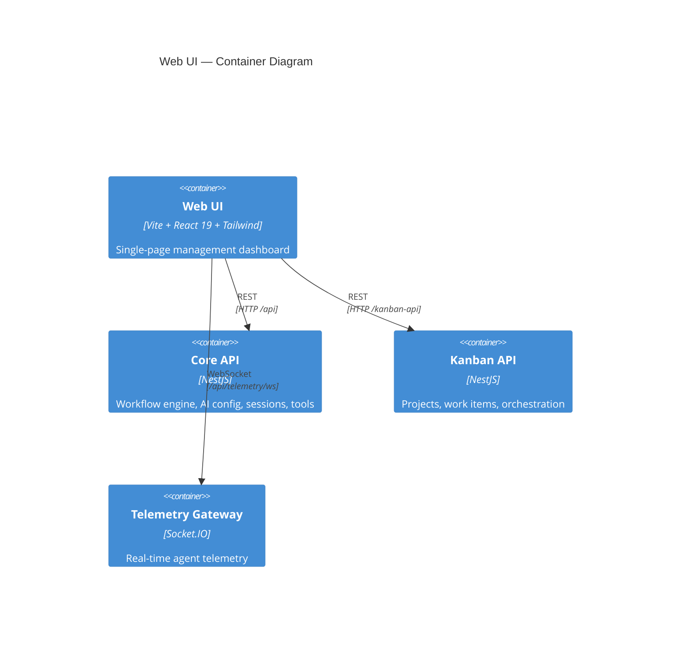

# 26 — Web UI Overview

The Nexus Orchestrator Web UI is a single-page application built with Vite, React 19, TypeScript, and Tailwind CSS. It serves as the primary management interface for configuring AI providers, authoring workflows, monitoring runs, managing Kanban projects, and interacting with active chat sessions.

---

## Architecture



The Web UI communicates with three backend surfaces:

- **Core API** — workflows, agent profiles, AI providers, models, secrets, tools, sessions, events, notifications, auth, users, settings, operations
- **Kanban API** — projects, work items, orchestration lifecycle, kanban settings
- **Telemetry Gateway** — real-time Socket.IO connections for workflow step execution, agent messages, and chat session telemetry

---

## Tech Stack

| Category            | Technology                                     | Version      |
| ------------------- | ---------------------------------------------- | ------------ |
| Build tool          | Vite                                           | 8.x          |
| UI framework        | React                                          | 19.x         |
| Language            | TypeScript                                     | 6.x          |
| CSS                 | Tailwind CSS                                   | 4.x          |
| Routing             | React Router                                   | 7.x          |
| State management    | Zustand                                        | 5.x          |
| Server state        | TanStack React Query                           | 5.x          |
| HTTP client         | Axios                                          | 1.x          |
| Forms               | React Hook Form + Zod                          | 7.x / 4.x    |
| WebSocket           | Socket.IO Client                               | 4.x          |
| DAG visualization   | @xyflow/react (React Flow)                     | 12.x         |
| Code editor         | @monaco-editor/react + Monaco                  | 0.55.x / 4.x |
| Terminal emulator   | @xterm/xterm                                   | 6.x          |
| Charts              | recharts                                       | 3.x          |
| Drag-and-drop       | @hello-pangea/dnd                              | 18.x         |
| UI primitives       | Radix UI (10 components)                       | —            |
| Markdown            | react-markdown + remark-gfm + rehype-highlight | —            |
| Notifications       | sonner                                         | 2.x          |
| Date formatting     | date-fns                                       | 4.x          |
| Icons               | lucide-react                                   | 1.x          |
| YAML parsing        | js-yaml                                        | 4.x          |
| Syntax highlighting | highlight.js                                   | 11.x         |
| Shared types        | @nexus/core, @nexus/kanban-contracts           | —            |
| Testing (unit)      | Vitest + Testing Library                       | 4.x / 16.x   |
| Testing (e2e)       | Playwright                                     | 1.x          |

---

## Page Inventory

### Core Platform

| Page         | Route           | Description                                                       |
| ------------ | --------------- | ----------------------------------------------------------------- |
| Dashboard    | `/`             | Overview of system health, recent workflow runs, project activity |
| Login        | `/login`        | User authentication with JWT                                      |
| Register     | `/register`     | Self-service account creation                                     |
| Unauthorized | `/unauthorized` | 403 access denied page                                            |
| Not Found    | `*`             | 404 fallback for unknown routes                                   |

### AI Configuration

| Page                 | Route                             | Description                                                                      |
| -------------------- | --------------------------------- | -------------------------------------------------------------------------------- |
| Agent Profiles       | `/agents`                         | List, create, edit agent profiles (system prompt, model, tools)                  |
| Agent Profile Editor | `/agents/new`, `/agents/:id/edit` | Form-based editor for agent profiles                                             |
| Agent Skills         | `/agent-skills`                   | Manage agent skill definitions                                                   |
| Providers            | `/providers`                      | Configure LLM providers (OpenAI, Anthropic, etc.) with endpoints and credentials |
| Models               | `/models`                         | Register and manage AI models per provider                                       |
| Secrets              | `/secrets`                        | Encrypted credential storage for provider API keys                               |
| Tools                | `/tools`                          | Tool registry, MCP server configuration, ACP server management                   |
| Settings             | `/settings`                       | System-wide configuration                                                        |
| Setup                | `/setup`                          | Initial system setup wizard (admin only)                                         |
| Users                | `/users`                          | User management with role assignment (admin only)                                |
| Memory Explorer      | `/memory`                         | Browse and inspect agent memory records                                          |

### Workflows

| Page                | Route                        | Description                                                    |
| ------------------- | ---------------------------- | -------------------------------------------------------------- |
| Workflows           | `/workflows`                 | List all workflow definitions with status and triggers         |
| New Workflow        | `/workflows/new`             | Visual workflow editor (DAG + YAML) for creating new workflows |
| Workflow Detail     | `/workflows/:id`             | View workflow definition, run history, and launch controls     |
| Edit Workflow       | `/workflows/:id/edit`        | Edit existing workflow in the visual editor                    |
| Workflow Run Detail | `/workflows/:id/runs/:runId` | Run graph, telemetry log, step-by-step execution view          |

### Projects & Kanban

| Page                 | Route                                                        | Description                                                      |
| -------------------- | ------------------------------------------------------------ | ---------------------------------------------------------------- |
| Projects             | `/projects`                                                  | List all projects with orchestration status                      |
| Create Project       | `/projects/new`                                              | New project creation form                                        |
| Project Workspace    | `/projects/:projectId`                                       | Project overview with kanban board, runs, orchestration controls |
| Kanban Board         | `/projects/:projectId/board`                                 | Drag-and-drop work item board with status columns                |
| Global Work Items    | `/work-items`                                                | Cross-project work item search and filter                        |
| Active Session       | `/projects/:projectId/work-items/:workItemId/active-session` | Embedded terminal and chat for active agent sessions             |
| Active Session (run) | `/projects/:projectId/runs/:runId/active-session`            | Session workspace attached to a workflow run                     |

**Work item discoverability.** The Global Work Items page (`/work-items`) is a
server-driven list built on the shared `DataTable` component: it supports
free-text search, column sorting, filtering by project / status / priority /
scope, and classic limit/offset pagination, defaulting to most-recently-updated
first. Filter, sort, and page state persist in the URL query string so views are
shareable and survive navigation. The Kanban Board (`/projects/:projectId/board`)
keeps its full set for drag-and-drop and WIP counts but adds a client-side
search + priority/scope filter toolbar (also URL-persisted) that narrows which
cards render without affecting the column structure. Both surfaces share the
filter-option definitions in `src/lib/work-items/work-item-filter-options.ts`.

### Sessions & Operations

| Page              | Route                                               | Description                                                     |
| ----------------- | --------------------------------------------------- | --------------------------------------------------------------- |
| Session Inbox     | `/sessions`                                         | Chat session inbox with thread list                             |
| Session Detail    | `/sessions/:sessionId`, `/chat-sessions/:sessionId` | Single chat session view with messages                          |
| Events            | `/events`                                           | Event ledger with filtering by domain, severity, and time range |
| Notifications     | `/notifications`                                    | User notification center                                        |
| Schedules         | `/schedules`                                        | Scheduled job management                                        |
| Operations Doctor | `/operations/doctor`                                | System diagnostics, repair history, and health checks           |

---

## Hook Inventory

### Authentication

| Hook      | Description                                                      |
| --------- | ---------------------------------------------------------------- |
| `useAuth` | User registration, login, logout, token refresh, auth validation |

### Workflows

| Hook                            | Description                                                                               |
| ------------------------------- | ----------------------------------------------------------------------------------------- |
| `useWorkflows`                  | List, get, create, update, delete workflows; launch with context                          |
| `useWorkflowRunGraph`           | Fetch and poll DAG step status for a run (React Flow nodes/edges)                         |
| `useWorkflowRunTelemetry`       | Real-time WebSocket telemetry for workflow run events                                     |
| `useWorkflowSubagentExecutions` | Track subagent spawns, status, and lifecycle within a run                                 |
| `useExecutionSidebarData`       | Aggregated sidebar view: terminal output, workspace diff, directory tree, runtime notices |

### Sessions & Chat

| Hook                      | Description                                                                         |
| ------------------------- | ----------------------------------------------------------------------------------- |
| `useChatSessions`         | List and manage chat sessions, participants, and state                              |
| `useChatSessionTelemetry` | Real-time WebSocket telemetry for chat session messages                             |
| `useSessionsList`         | Session inbox with filters, unread counts, and thread grouping                      |
| `useSessionChat`          | Chat message composition, sending, and telemetry binding for active session threads |
| `useSteeringChat`         | Steering chat for directing agent behavior mid-run                                  |
| `useUnreadThreads`        | Track unread message counts across chat and workflow threads                        |

### Projects & Kanban

| Hook                               | Description                                                 |
| ---------------------------------- | ----------------------------------------------------------- |
| `useProjects`                      | List, create, update, delete projects; dashboard stats      |
| `useProjectOrchestration`          | Orchestration state, mode control, summary, startup routing |
| `useProjectOrchestrationSummaries` | Orchestration cycle summaries for project dashboard         |
| `useProjectGoals`                  | Project goal tracking and completion status                 |
| `useProjectMemory`                 | Learning memory records scoped to a project                 |
| `useNotifications`                 | Fetch, paginate, and mark notifications read                |

### AI Configuration

| Hook               | Description                                                   |
| ------------------ | ------------------------------------------------------------- |
| `useAgentProfiles` | CRUD for agent profiles with model, tools, and skill bindings |
| `useAgentSkills`   | List and manage agent skill definitions                       |
| `useModels`        | Model registry management (CRUD, default model assignment)    |
| `useProviders`     | Provider configuration management                             |
| `useSecrets`       | Secret store management (encrypted credentials)               |

### Tools & Servers

| Hook            | Description                                                   |
| --------------- | ------------------------------------------------------------- |
| `useTools`      | Tool registry: list, enable, disable, configure tools         |
| `useMcpServers` | MCP server management: connect, test, reload                  |
| `useAcpServers` | ACP server management: connect, test, reload, discover agents |

### Operations & Automation

| Hook                    | Description                                       |
| ----------------------- | ------------------------------------------------- |
| `useOperationsDoctor`   | Doctor check results, repair history, diagnostics |
| `useScheduledJobs`      | Scheduled job management and execution history    |
| `useAutomationControls` | Automation policy and trigger management          |

### Memory

| Hook                | Description                                                  |
| ------------------- | ------------------------------------------------------------ |
| `useMemoryExplorer` | Browse, search, and inspect memory records across the system |
| `useLearningMemory` | Project-level learning memory operations                     |

### Utilities

| Hook              | Description                                         |
| ----------------- | --------------------------------------------------- |
| `useDebounce`     | Debounce a value by a configurable delay            |
| `useLocalStorage` | Typed localStorage read/write with reactive updates |
| `useToast`        | Sonner toast notification helpers                   |

---

## Visual Design

The UI follows a dark-premium visual direction:

- **Typography:** Inter for UI text and JetBrains Mono for code, status labels, and data-dense labels.
- **Color system:** HSL-based tokens (`--color-primary`, `--color-success`, `--color-warning`, `--color-error`, `--color-info`) support both light and dark modes.
- **Surfaces:** Cards and sidebars use translucent backgrounds with `backdrop-blur`; the main content area uses a subtle radial gradient.
- **Status:** Use the `StatusBadge` component for any workflow, run, work item, or lifecycle state so status information is rendered consistently across the app.
- **Motion:** Entrance animations are gated behind `prefers-reduced-motion: no-preference`.
- **Responsive layout:** The sidebar collapses to an icon rail on desktop and becomes a slide-out overlay on mobile, controlled by `MobileNavContext`.

---

## State Management

### Zustand (Client State)

The only global Zustand store is the **auth store** (`src/stores/auth.store.ts`):

| Store          | Persisted            | State                                                                          |
| -------------- | -------------------- | ------------------------------------------------------------------------------ |
| `useAuthStore` | Yes (`localStorage`) | `user`, `accessToken`, `refreshToken`, `isAuthenticated`, `isLoading`, `error` |

The auth store uses `zustand/middleware` with `persist` middleware and `createJSONStorage`. Actions include `register`, `login`, `logout`, `logoutAll`, `doRefreshToken`, `validateAuth`, and `clearError`. The access token is additionally written to `localStorage` under `nexus_token` for use by the Axios interceptor.

### TanStack React Query (Server State)

All server data fetching uses `@tanstack/react-query`. Query keys are centralized in `src/lib/queryKeys.ts`, organized by domain:

- `workflows.*` — workflow definitions, runs, graphs, events, launch context
- `projects.*` — project list, detail, branches, files, git activity
- `projectOrchestration.*` — orchestration state, diagnostics, capabilities, war room
- `adminResources.*` — providers, models, secrets, agent profiles, tools
- `sessions.*` — chat sessions, ad-hoc sessions, participants
- `notifications.*` — notification list, unread count
- `workItems.*` — kanban work items, board configuration
- `memory.*` — memory explorer records
- `chat.*` — chat session messages and history
- `operations.*` — doctor checks, repair history
- `schedules.*` — scheduled jobs

Mutations use `useMutation` from React Query, with optimistic updates and query invalidation on success.

---

## API Client Architecture

The API client layer lives at `src/lib/api/` and consists of 24 client files.

### Runtime Service Routing

The Web UI supports a **split-service topology**: the same SPA can route different API calls to different backend services based on the URL path prefix. This is configured via `public/config.json`:

```json
{
  "apiUrl": "/api",
  "coreApiUrl": "/api",
  "kanbanApiUrl": "/kanban-api",
  "chatApiUrl": "/chat-api"
}
```

Route resolution logic (`src/lib/config.ts`) determines the target service:

| Path Prefix                                                                                                                                                                                                                                               | Target Service |
| --------------------------------------------------------------------------------------------------------------------------------------------------------------------------------------------------------------------------------------------------------- | -------------- |
| `/workflows`, `/ai-config`, `/auth`, `/events`, `/models`, `/providers`, `/secrets`, `/tools`, `/users`, `/mcp`, `/acp`, `/notifications`, `/operations`, `/setup`, `/admin`, `/tool-approval-rules`, `/tool-call-approval-requests`, `/workflow-runtime` | Core API       |
| `/projects`, `/work-items`, `/orchestration`, `/kanban-settings`                                                                                                                                                                                          | Kanban API     |
| `/sessions/chat`                                                                                                                                                                                                                                          | Chat API       |

### Axios Client

The `ApiClient` class (`src/lib/api/client.ts`) wraps an Axios instance with:

- JWT interceptor that attaches `Authorization: Bearer <token>` from the auth store
- Automatic token refresh on 401 responses
- Dynamic base URL resolution per request using the runtime config
- Request path prefix routing to the correct backend service

### API Client Modules

| File                                                                                                                              | Domain                                                   |
| --------------------------------------------------------------------------------------------------------------------------------- | -------------------------------------------------------- |
| `client.ts`                                                                                                                       | Core `ApiClient` class, event ledger queries             |
| `client.admin.ts`                                                                                                                 | Admin endpoints (setup, migrations)                      |
| `client.auth.ts`                                                                                                                  | Auth interceptor and token refresh logic                 |
| `client.projects.ts`                                                                                                              | Project CRUD, settings, repository management            |
| `client.projects.automation.ts`                                                                                                   | Project automation controls                              |
| `client.projects.schedules.ts`                                                                                                    | Scheduled job management per project                     |
| `client.projects.memory.ts`                                                                                                       | Project learning memory                                  |
| `client.projects.settings.ts`                                                                                                     | Project-level settings                                   |
| `client.projects.war-room.ts`                                                                                                     | War room session management                              |
| `client.workflow.ts`                                                                                                              | Workflows, runs, graphs, events, MCP/ACP/tools, sessions |
| `auth.ts`                                                                                                                         | Auth endpoints (login, register, refresh, logout, me)    |
| `memory.ts`                                                                                                                       | Memory explorer endpoints                                |
| `users.ts`                                                                                                                        | User management endpoints                                |
| `types.ts`, `client.projects.types.ts`, `client.workflow.types.ts`, `orchestration.types.ts`, `memory.types.ts`, `users.types.ts` | TypeScript type definitions                              |
| `error-message.ts`                                                                                                                | API error message extraction utility                     |
| `chat-session-types.typecheck.ts`                                                                                                 | Type-level validation for chat session types             |

### Vite Dev Proxy

In development, Vite proxies `/api`, `/kanban-api`, and `/chat-api` to the respective backend services. This avoids CORS issues during local development and mirrors the production nginx routing.

---

## Runtime Configuration

The file `public/config.json` is loaded at application startup via `loadRuntimeConfig()`. This pattern enables:

- Different backend URLs per deployment environment without rebuilding the SPA
- Split-service routing where Core, Kanban, and Chat APIs may be on different hosts
- Fallback to single-service mode if `coreApiUrl`, `kanbanApiUrl`, or `chatApiUrl` are not specified

The `ResolvedRuntimeConfig` type provides `apiUrl`, `coreApiUrl`, `kanbanApiUrl`, and `chatApiUrl` — all normalized with trailing slashes removed.

---

## Component Structure

### Layout Components (`src/components/layout/`)

| Component                   | Description                                                           |
| --------------------------- | --------------------------------------------------------------------- |
| `Layout`                    | Root layout with sidebar, header, and content area                    |
| `Sidebar`                   | Collapsible navigation sidebar with grouped route links               |
| `Header`                    | Top bar with scope badge, search, mobile nav toggle, and user menu    |
| `Breadcrumbs`               | Compact auto-generated breadcrumb trail from route                    |
| `CommandPalette`            | Cmd+K command palette for quick navigation                            |
| `KeyboardShortcutsProvider` | Global keyboard shortcut handler                                      |
| `MobileNavContext`          | Mobile navigation open/close state for the responsive sidebar overlay |
| `navigation.config.ts`      | Sidebar navigation tree configuration with role-based filtering       |
| `useNavSidebar`             | Sidebar collapse/expand state persisted in `localStorage`             |

### UI Components (`src/components/ui/`)

20 Shadcn-style components built on Radix UI primitives:

`accordion`, `alert-dialog`, `alert`, `badge`, `button`, `card`, `checkbox`, `dialog`, `empty-state`, `form`, `input`, `label`, `select`, `sheet`, `skeleton`, `status-badge`, `switch`, `table`, `tabs`, `textarea`

### Feature Components

| Directory                     | Purpose                                                                                  |
| ----------------------------- | ---------------------------------------------------------------------------------------- |
| `components/auth/`            | `ProtectedRoute`, role-based access control                                              |
| `components/chat/`            | Chat message display, input, thread components                                           |
| `components/error-boundary/`  | React error boundary with fallback UI                                                    |
| `components/notifications/`   | Notification rendering and interaction                                                   |
| `components/orchestration/`   | Orchestration cycle visualization and controls                                           |
| `components/projects/`        | Project cards, creation forms, settings panels                                           |
| `components/sessions/`        | Session thread list, message rendering, participant views                                |
| `components/workflow/`        | Workflow list cards, run history tables, launch forms                                    |
| `components/workflow-editor/` | Full visual workflow editor (see [27-web-workflow-editor.md](27-web-workflow-editor.md)) |

---

## Key Third-Party Integrations

| Package                                              | Usage                                                                      |
| ---------------------------------------------------- | -------------------------------------------------------------------------- |
| `@xyflow/react`                                      | DAG visualization — renders workflow steps as nodes with dependency edges  |
| `@monaco-editor/react`                               | YAML editor with syntax highlighting and validation                        |
| `@xterm/xterm`                                       | Embedded terminal in active session workspace                              |
| `recharts`                                           | Charts for dashboard metrics, run statistics, and telemetry                |
| `@hello-pangea/dnd`                                  | Drag-and-drop for Kanban board work items between status columns           |
| `@radix-ui/react-*`                                  | 10 accessible UI primitives (dialog, select, tabs, accordion, etc.)        |
| `react-hook-form` + `@hookform/resolvers` + `zod`    | Form state management with schema validation                               |
| `react-markdown` + `remark-gfm` + `rehype-highlight` | Agent message rendering with markdown, GFM tables, and syntax highlighting |
| `socket.io-client`                                   | Real-time telemetry for workflow runs and chat sessions                    |
| `js-yaml`                                            | YAML parsing and validation in the workflow editor                         |
| `date-fns`                                           | Date formatting across the UI                                              |
| `lucide-react`                                       | Icon library                                                               |
| `sonner`                                             | Toast notifications                                                        |
| `cmdk`                                               | Command palette (Cmd+K)                                                    |
| `highlight.js`                                       | Code syntax highlighting in agent messages                                 |
| `zustand`                                            | Global client state (auth store)                                           |
| `@tanstack/react-query`                              | Server state management with caching, refetching, and mutations            |

---

## Where Next

- [27 — Web Workflow Editor](27-web-workflow-editor.md): Visual editor, DAG visualization, execution sidebar
- [28 — PI Runner](28-pi-runner.md): Runtime bridge for execution containers
- [30 — Agent Local](30-agent-local.md): Local MCP service for governed operations
- [13 — Chat System](13-chat-system.md): Chat channels, sessions, and memory backends
- [18 — Telemetry & Observability](18-telemetry-observability.md): WebSocket gateway and event ledger
