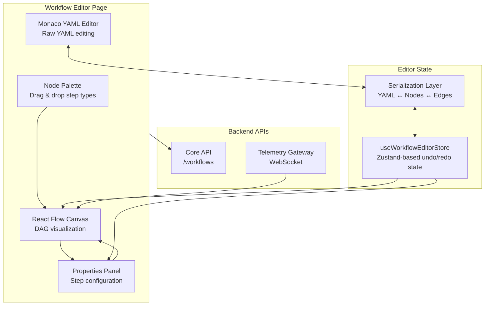

# 27 — Web Workflow Editor

The workflow editor is the visual authoring environment for Nexus Orchestrator workflow definitions. It combines a Monaco-based YAML editor, a React Flow DAG canvas, a node palette, and a properties panel into a unified editing experience. Workflows can be created from scratch or loaded from existing definitions for modification.

---

## Architecture



The editor maintains a bidirectional sync between the visual DAG representation (React Flow nodes and edges) and the YAML workflow definition. Changes in one view are reflected in the other through a shared editor store.

---

## Component Structure

```
src/components/workflow-editor/
├── WorkflowEditorPage.tsx        # Top-level page orchestrating all sub-components
├── WorkflowEditorHeader.tsx      # Toolbar: save, launch, undo, redo, validation status
├── WorkflowEditorCanvas.tsx      # React Flow canvas with job nodes and dependency edges
├── WorkflowEditorNodePalette.tsx # Draggable palette of available step types
├── WorkflowEditorPropertiesPanel.tsx # Right-side panel for editing selected step properties
├── WorkflowEditorToolbar.tsx     # Canvas controls: zoom, layout, export
├── WorkflowEditorYamlPreview.tsx # Monaco editor for raw YAML view
├── ValidationErrorDisplay.tsx    # Inline validation error display
├── nodes/                        # Custom React Flow node components
├── edges/                        # Custom React Flow edge components
├── hooks/
│   └── useWorkflowEditorStore.ts # Core editor state with undo/redo stack
├── properties/                   # Step-specific property editors
└── serialization/                # YAML parsing, validation, and conversion
```

---

## Workflow YAML Editor

### Monaco Editor Integration

The YAML editor uses `@monaco-editor/react` with Monaco's built-in YAML language support. It provides:

- **Syntax highlighting** for YAML keys, values, strings, numbers, and comments
- **Bracket matching** and indentation guides
- **Auto-completion** based on the workflow schema (`@nexus/core` types)
- **Inline validation** — errors in YAML structure are highlighted with red squiggles and gutter markers
- **Real-time sync** — changes in the YAML editor are parsed and applied to the DAG canvas, and vice versa

### Validation

Validation occurs on every change:

1. **YAML parse validation** — detects syntax errors (invalid indentation, unclosed quotes, etc.)
2. **Schema validation** — validates against the workflow definition schema from `@nexus/core`, checking required fields, step type enums, input contracts, and DAG dependency references
3. **Semantic validation** — checks for duplicate step IDs, circular dependencies, missing dependencies, and orphan nodes
4. **Cross-view validation** — errors detected in the DAG canvas (e.g., unconnected mandatory inputs) are surfaced in the YAML editor and vice versa

Validation errors are displayed in the `ValidationErrorDisplay` component with file-and-line references, and the save/launch buttons are disabled when errors exist.

---

## DAG Visualization

### React Flow Canvas

The DAG canvas uses `@xyflow/react` (React Flow 12) to render the workflow as a directed acyclic graph:

- **Nodes** represent workflow steps (jobs), color-coded by job type (agent, special, condition, parallel, etc.)
- **Edges** represent dependencies between steps, rendered as smooth step paths with directional arrows
- **Background grid** with dots pattern
- **MiniMap** in the corner for navigation in large workflows
- **Controls** for zoom in/out, fit view, and lock/unlock

### Node Types

Each node type has its own React component in `nodes/` with distinct visual styling:

| Node Type      | Color  | Description                                                   |
| -------------- | ------ | ------------------------------------------------------------- |
| Agent Step     | Blue   | LLM-powered agent execution                                   |
| Special Step   | Purple | Built-in special operations (e.g., web automation, git clone) |
| Condition Step | Orange | Conditional branching gate                                    |
| Parallel Step  | Green  | Fan-out parallel execution                                    |
| Merge Step     | Teal   | Fan-in synchronization                                        |
| Manual Step    | Yellow | Human-in-the-loop approval gate                               |
| Skeleton       | Gray   | Newly created step, not yet configured                        |

### Interaction Model

- **Drag from palette** — drag a step type from the node palette onto the canvas to create a new node
- **Connect nodes** — drag from a node's output handle to another node's input handle to create a dependency edge
- **Select node** — click a node to open its properties in the properties panel
- **Delete** — select a node/edge and press Delete/Backspace
- **Undo/Redo** — Ctrl+Z / Ctrl+Shift+Z for full undo/redo across all editor operations
- **Auto-layout** — toolbar button to automatically arrange nodes in a top-to-bottom layout

### Custom Edges

Edges are typed as `dependency` edges with custom rendering in `edges/`. They display directionality and highlight on hover. The editor prevents duplicate edges and self-loops.

---

## Properties Panel

The right-side properties panel (`WorkflowEditorPropertiesPanel`) shows context-sensitive configuration for the selected node:

### Step Properties

| Property          | Description                                               |
| ----------------- | --------------------------------------------------------- |
| Step ID           | Unique identifier for the step (auto-generated, editable) |
| Step Name         | Human-readable display name                               |
| Job Type          | Dropdown of available job types                           |
| Agent Profile     | Agent profile to use (for agent steps)                    |
| Model             | AI model override (for agent steps)                       |
| Provider          | AI provider override                                      |
| System Prompt     | Custom system prompt for the step                         |
| Inputs            | Key-value input contract                                  |
| Outputs           | Expected output schema                                    |
| Timeout           | Step execution timeout in milliseconds                    |
| Retry Policy      | Max retries and backoff strategy                          |
| Concurrency Group | Named group for concurrency control                       |

### Step-Specific Editors

The `properties/` directory contains specialized editors for each job type, such as condition expression editors, parallel fan-out configuration, and special step parameter forms.

### Repository Lifecycle Triggers

Lifecycle trigger editing is available only when the editor is opened in repository mode. Repository workflows are stored under `.nexus/workflows/*.workflow.yaml`, so the editor can expose lifecycle fields without allowing global workflow records to accidentally acquire repository-specific merge gates.

When repository mode is active, the trigger type dropdown includes `lifecycle` and the properties panel exposes:

| Field      | Description                                                                   |
| ---------- | ----------------------------------------------------------------------------- |
| `phase`    | Board phase slug that should fire the workflow, such as `ready-to-merge`      |
| `hook`     | Whether the workflow runs `before` or `after` the phase transition            |
| `blocking` | Whether a failed `before` hook blocks the transition until the issue is fixed |

The visual editor preserves these fields through the same YAML serialization path used by the Monaco view. Global workflow editing hides the lifecycle trigger option; existing lifecycle YAML remains editable from repository mode and is not rewritten into a different trigger shape.

---

## Execution Sidebar

When viewing a running workflow, the execution sidebar provides real-time monitoring:

### Data Sources

The sidebar is powered by the `useExecutionSidebarData` hook, which combines:

- **`useWorkflowRun`** — fetches the current run state from the Core API
- **`useWorkflowRunTelemetry`** — subscribes to real-time WebSocket events for the run

### Sidebar Content

| Section         | Data                             | Source                       |
| --------------- | -------------------------------- | ---------------------------- |
| Terminal Output | Agent stdout/stderr chunks       | WebSocket telemetry          |
| Workspace Diff  | File changes made by the agent   | API workspace diff endpoint  |
| Directory Tree  | Current workspace file structure | API workspace tree endpoint  |
| Runtime Notices | Warnings, errors, status changes | Parsed from telemetry events |

---

## Workflow Run Graph

The run graph (`WorkflowRunDetailContent`) visualizes the execution state of a completed or in-progress workflow run.

### Features

- **Step status coloring** — nodes show real-time status: pending (gray), running (blue/animating), completed (green), failed (red), skipped (yellow)
- **Step metadata** — hover to see start time, duration, retry count, agent used, and output summary
- **Event timeline** — correlated with the event ledger API, showing each step's lifecycle events
- **Subagent traces** — sub-agent executions are shown as nested sub-graphs within the parent step
- **Re-run controls** — retry failed steps, re-run from a specific step, or abort a running workflow

### Polling Strategy

Active runs poll the step graph at regular intervals via `useWorkflowRunGraph`. The polling interval is shorter for active runs (2 seconds) and disabled for terminal runs. WebSocket telemetry events trigger immediate refetches.

---

## Subagent Execution View

The `useWorkflowSubagentExecutions` hook provides visibility into subagent lifecycle:

| View             | Description                                                                 |
| ---------------- | --------------------------------------------------------------------------- |
| Subagent List    | All subagents spawned by a workflow step, with status badges                |
| Subagent Detail  | Per-subagent: spawn time, completion time, model used, tool calls, response |
| Subagent Tree    | Hierarchical view when subagents spawn their own sub-subagents              |
| Telemetry Stream | Real-time message and tool execution events for each subagent               |

---

## API Interactions

### Create Workflow

```
POST /api/workflows
Body: YAML workflow definition
Response: Created workflow with id
```

### Update Workflow

```
PUT /api/workflows/:id
Body: Updated YAML workflow definition
Response: Updated workflow with new version
```

### Launch Workflow

```
POST /api/workflows/:id/launch
Body: Launch context (scopeId, contextId, input overrides, launch preset)
Response: Created workflow run with runId
```

### Fetch Run Graph

```
GET /api/workflows/:id/runs/:runId/graph
Response: DAG nodes and edges with step statuses
```

### Telemetry Connection

```
WebSocket /api/telemetry/ws?token=<jwt>
Subscribe: { filters: { workflowRunId: "<runId>" } }
Events: turn_start, message_update, tool_execution_start, tool_execution_end, turn_end, agent_end
```

The editor uses the `client.workflow.ts` API client methods, which include paginated workflow listing, CRUD, launch context querying, run history, event ledger access, and workspace inspection.

---

## Undo/Redo System

The `useWorkflowEditorStore` implements a Zustand-based undo/redo system:

- Every mutation (add node, delete node, move node, add edge, remove edge, update property) records an action and its inverse
- The undo stack has a configurable maximum depth
- Undo/redo operations trigger full re-serialization to YAML
- Batch operations (e.g., drag-and-drop from palette with auto-layout) are coalesced into single undo entries

---

## Where Next

- [26 — Web UI Overview](26-web-overview.md): Full page and hook inventory, state management
- [06 — Workflow Engine](06-workflow-engine.md): Core workflow engine internals
- [07 — Workflow Step Execution](07-workflow-step-execution.md): Container execution and retry policies
- [09 — Workflow Subagents](09-workflow-subagents.md): Subagent provisioning and lifecycle
- [18 — Telemetry & Observability](18-telemetry-observability.md): WebSocket gateway details
