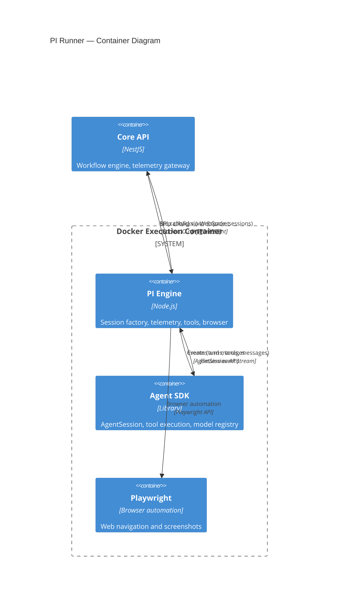
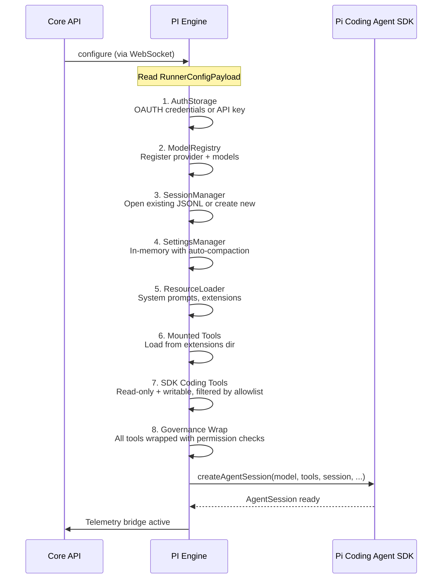
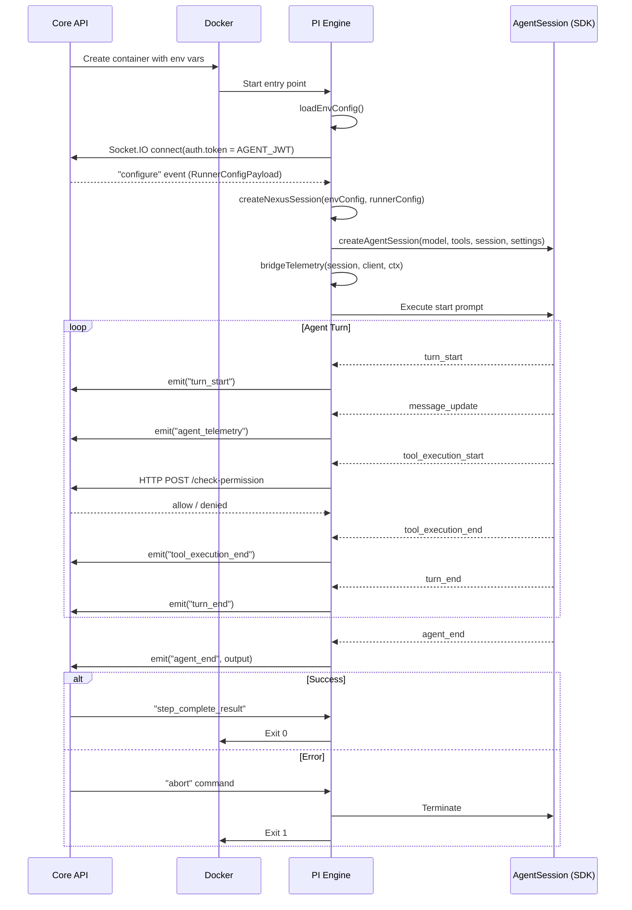

# 28 — PI Runner

> **Scope note:** This document describes the **PI engine** (`@nexus/harness-engine-pi`) — one of the pluggable engines under the harness runtime, not the platform's execution path. For the runtime, SPI, engine selection, and credentials, see [41 — Harness Runtime](41-harness-runtime.md).

The PI engine implements the `HarnessEngine` SPI; its in-container bridge runs the `@earendil-works/pi-coding-agent` SDK. It connects the Nexus API's step execution commands to the AI agent SDK, providing session management, tool bridging, telemetry reporting, and browser automation capabilities.

---

## Architecture

The PI engine sits at the boundary between the orchestration plane (Nexus API) and the execution plane (AI agent SDK inside Docker containers). It translates orchestrator commands into agent operations and streams agent activity back to the API.

---

## How It Works

### Startup Sequence

1. Docker container starts with the PI engine as the entry point
2. The PI engine reads environment variables injected by Docker: `AGENT_JWT`, `STEP_ID`, `WORKFLOW_RUN_ID`, `WEBSOCKET_URL`, `API_BASE_URL`, etc. (PI engine's view of `HarnessRuntimeConfig`)
3. The PI engine connects to the API's telemetry gateway via Socket.IO with JWT authentication
4. The PI engine waits for the `configure` WebSocket event from the API — this delivers the `RunnerConfigPayload` containing model, provider, system prompt, auth credentials, and tool configuration
5. The PI engine creates a fully configured `AgentSession` using the session factory
6. The agent begins execution, with all events bridged back to the API in real time

### Shutdown Sequence

1. The API may send `dehydrate` or `abort` commands via WebSocket
2. On `dehydrate`, the session state is serialized to JSONL for later resumption
3. On `abort`, execution is terminated and partial results are reported
4. The container exits after the session completes or is terminated

---

## Session Factory

The session factory (`src/session/session-factory.ts`) is the core of the PI engine. It assembles a fully configured `AgentSession` from orchestrator configuration.

### Creation Steps

### Model Resolution

The session factory resolves models using a priority chain:

1. **OAuth provider** — uses the provider name from `runnerConfig.provider`
2. **OpenAI-compatible runtime** — if `baseUrl` is set and auth is `api_key`, falls back to `openai` runtime provider
3. **Custom model fallback** — if no model is found via `modelRegistry.find()`, creates an inline custom model with 128K context window and 16K max tokens

### Host Mount Scope

The host mount scope system controls which parts of the host filesystem are accessible to container tools:

- **Scope manifest** — JSON file at `{extensionsDir}/_host_mount_scope.json` defines which directories are readable/writable
- **Write guards** — SDK write/batch tools are restricted to writable paths in the scope manifest
- **Read fallback** — if no tools provide `ls`/`read` capabilities, a fallback read-only directory listing is injected
- **SDK tool allowlist** — `{extensionsDir}/_sdk_tool_allowlist.json` restricts which built-in SDK tools (bash, write, read, ls) are available

---

## Browser Runtime

The browser runtime (`src/browser/`) integrates Playwright for web automation steps.

### Components

| Component               | File                         | Purpose                                                                        |
| ----------------------- | ---------------------------- | ------------------------------------------------------------------------------ |
| Browser Runtime Manager | `browser-runtime.manager.ts` | Manages Playwright browser lifecycle (launch, contexts, pages)                 |
| Browser Handlers        | `browser-handlers.ts`        | Step-specific browser operations (navigate, click, type, screenshot, evaluate) |
| Browser Runtime Types   | `browser-runtime.types.ts`   | TypeScript interfaces for browser session configuration                        |

### Capabilities

- Launch Chromium in headed or headless mode
- Navigate to URLs and wait for page loads
- Execute JavaScript in page context (`page.evaluate`)
- Take full-page and element screenshots
- Interact with page elements (click, type, select)
- Manage multiple browser contexts for isolation
- Capture console logs and network requests

---

## Telemetry Bridge

The telemetry bridge (`src/telemetry/telemetry-bridge.ts`) subscribes to the AgentSession event stream and translates SDK events into the Nexus telemetry protocol.

### Event Mapping

| SDK Event               | Nexus Telemetry Event   | Data                                                                       |
| ----------------------- | ----------------------- | -------------------------------------------------------------------------- |
| `turn_start`            | `turn_start`            | stepId                                                                     |
| `message_update`        | `agent_telemetry`       | type (text_delta, text_end, etc.), delta or content, messageId, responseId |
| `tool_execution_start`  | `tool_execution_start`  | toolCallId, toolName, args, stepId                                         |
| `tool_execution_update` | `tool_execution_update` | toolCallId, toolName, partialResult, stepId                                |
| `tool_execution_end`    | `tool_execution_end`    | toolCallId, toolName, args, result, isError, stepId                        |
| `turn_end`              | `turn_end`              | ok, response, stopReason, errorMessage, usage                              |
| `agent_end`             | `agent_end`             | output (final TurnResult), sessionId, stepId                               |

The bridge also tracks tool call arguments across the start/end lifecycle to ensure complete tool execution records are sent even when the end event has incomplete argument data.

---

## Tool Bridging

### Nexus Bridge Tools

The `createNexusBridgeTools` function (`src/tools/nexus-bridge-tools.ts`) creates tool definitions that bridge agent actions back to the Nexus API:

| Tool                 | Purpose                                         | Communication                                                                                      |
| -------------------- | ----------------------------------------------- | -------------------------------------------------------------------------------------------------- |
| `ask_user_questions` | Prompt the user with questions during execution | WebSocket `command` → API stores question, waits for response → WebSocket `question_response` back |

### Ask User Questions

The `ask-user-questions` tool enables agents to pause execution and request human input:

1. Agent calls `ask_user_questions` with structured questions
2. Tool sends a `prompt` command via WebSocket to the orchestrator
3. The API stores the questions, notifies the Web UI, and waits for the user to respond
4. The API sends a `question_response` command back via WebSocket
5. The tool returns the user's answers to the agent
6. Agent continues execution with the user's input

### Orchestrator Tools

The `src/tools/orchestrator/` directory contains timeout configurations for orchestrator command handlers, ensuring that agents waiting for API responses (e.g., subagent spawn results, war room operations) have appropriate timeout windows.

---

## Gateway — Orchestrator Client

The orchestrator client (`src/gateway/orchestrator-client.ts`) is a WebSocket client that handles all communication with the Nexus API.

### Features

- **Authenticated connection** — Socket.IO with JWT bearer token in `auth.token`
- **Auto-reconnection** — up to 10 attempts with exponential backoff
- **Event emission** — send telemetry events to the API
- **Command handling** — register handlers for orchestrator commands (`abort`, `dehydrate`, `prompt`, etc.)
- **Request-response pattern** — `waitForCommand()` for async request-response flows (subagent results, war room operations, question responses)

### Supported Commands

| Command                              | Direction    | Description                                   |
| ------------------------------------ | ------------ | --------------------------------------------- |
| `configure`                          | API → Runner | Deliver model, auth, and prompt configuration |
| `dehydrate`                          | API → Runner | Serialize session state for checkpointing     |
| `abort`                              | API → Runner | Terminate current execution immediately       |
| `prompt`                             | Runner → API | Request user input (via ask_user_questions)   |
| `question_response`                  | API → Runner | Deliver user responses to pending questions   |
| `step_complete_result`               | API → Runner | Final result of an API-side step operation    |
| `spawn_subagent_async_result`        | API → Runner | Result of subagent provisioning               |
| `wait_for_subagents_result`          | API → Runner | Collective result of subagent group           |
| `check_subagent_status_result`       | API → Runner | Status of a specific subagent                 |
| `open_war_room_result`               | API → Runner | War room session created                      |
| `invite_war_room_participant_result` | API → Runner | Participant invited to war room               |
| `post_war_room_message_result`       | API → Runner | War room message posted                       |
| `update_war_room_blackboard_result`  | API → Runner | Blackboard updated                            |
| `submit_war_room_signoff_result`     | API → Runner | Signoff submitted                             |
| `get_war_room_state_result`          | API → Runner | War room state snapshot                       |
| `close_war_room_result`              | API → Runner | War room closed                               |

---

## Governance Wrap

Every tool — both SDK built-in and mounted custom tools — is wrapped with a governance check layer (`wrapToolWithGovernance` in the PI engine's session factory):

1. Before each tool execution, POST to `/api/workflow-runtime/check-permission` with `tool_name`, `payload`, `workflow_run_id`, `job_id`
2. The API returns `allow`, `denied`, or `approval_required`
3. On `denied`, the tool returns an error result without executing
4. On `allow`, the original tool executes normally
5. On network failure, up to 3 retries with exponential backoff (500ms base)
6. Governance checks can be disabled via `NEXUS_RUNNER_DISABLE_GOVERNANCE_CHECK=true`

---

## External MCP Callback

The external MCP callback (`src/session/external-mcp-callback.ts`) enables agents to call MCP tools hosted on the Nexus API:

1. The API registers MCP server definitions in the database
2. The API writes MCP tool manifests to container volume as part of mounted tools
3. When the agent calls an MCP tool, the callback forwards the request to the API via HTTP
4. The API routes the call to the appropriate MCP server (stdio, HTTP, or SSE transport)
5. The response flows back through the API to the agent

---

## API Callback Pattern

The API callback (`src/session/api-callback.ts`) provides a generic pattern for containers to invoke Core API endpoints:

- Constructs authenticated HTTP requests using the agent's JWT
- Handles URL construction with proper `/api` prefix resolution
- Formats results consistently as `ToolResult` structures for agent consumption
- Used by mounted tools, MCP callbacks, and governance checks

---

## Configuration and Feature Flags

### Environment Variables

| Variable          | Required    | Default                                  | Description                                    |
| ----------------- | ----------- | ---------------------------------------- | ---------------------------------------------- |
| `AGENT_JWT`       | Yes         | —                                        | JWT for authenticated API communication        |
| `STEP_ID`         | Yes         | —                                        | Current step identifier                        |
| `JOB_ID`          | No          | `STEP_ID`                                | Job identifier (for multi-step jobs)           |
| `WORKFLOW_RUN_ID` | Conditional | —                                        | Workflow run identifier (or `CHAT_SESSION_ID`) |
| `CHAT_SESSION_ID` | Conditional | —                                        | Chat session identifier (or `WORKFLOW_RUN_ID`) |
| `WEBSOCKET_URL`   | No          | `http://localhost:3001`                  | API telemetry gateway URL                      |
| `API_BASE_URL`    | No          | `http://localhost:3000`                  | API HTTP base URL                              |
| `SESSION_PATH`    | No          | `/opt/pi-runner/.pi/agent/session.jsonl` | Agent session file path                        |
| `EXTENSIONS_PATH` | No          | `/opt/pi-runner/extensions`              | Mounted tool extensions directory              |
| `WORKSPACE_PATH`  | No          | `/workspace`                             | Agent workspace directory                      |

### Feature Flags

| Flag                                    | Default | Effect                                                           |
| --------------------------------------- | ------- | ---------------------------------------------------------------- |
| `NEXUS_RUNNER_DISABLE_GOVERNANCE_CHECK` | `false` | When `true`, skips all API-side permission checks for tool calls |
| `NEXUS_RUNNER_LOG_ACTIVE_TOOL_NAMES`    | `false` | When `true`, logs all active tool names for debugging            |

---

## Full Execution Sequence

---

## SDK Patches

The in-container bridge runs the published `@earendil-works/pi-coding-agent` SDK.
Some SDK defects are fixed by **vendored patches** rather than waiting for an
upstream release. Patches live in `patches/` at the repo root and are managed with
[`patch-package`](https://github.com/ds300/patch-package).

### How patches are applied

| Context                              | Mechanism                                                                                                                                                                                                                                                                                 |
| ------------------------------------ | ----------------------------------------------------------------------------------------------------------------------------------------------------------------------------------------------------------------------------------------------------------------------------------------- |
| Local / CI `npm install`             | Root `package.json` `"postinstall": "patch-package"` re-applies all patches automatically.                                                                                                                                                                                                |
| `nexus-heavy` / `nexus-light` images | The Dockerfiles install with `--ignore-scripts` (postinstall is skipped), so they `COPY patches` and run `RUN npx patch-package` explicitly after `npm install`. `patch-package` is a **runtime dependency** (not a devDependency) so it is present even in the `--omit=dev` light image. |

Patch filenames are version-pinned (`@earendil-works+pi-coding-agent+0.78.0.patch`).
When the SDK is bumped, `patch-package` fails to apply and surfaces it — that is
intentional, forcing a re-check of whether the fix is still needed. See
[`patches/README.md`](../../patches/README.md) for the refresh procedure.

> **Image rebuild required:** SDK behavior changes only take effect after
> rebuilding `nexus-heavy` / `nexus-light`. The running API spawns step containers
> from the `:latest` tag, so a rebuild is picked up by the next run with no API
> restart.

### Current patch — compaction/retry continuation (`pi#5463`, `pi#5445`)

**Symptom:** a large-context step fails _just as the agent produces its result_,
with `Cannot continue from message role: assistant`. The error string is identical
to a Claude Agent SDK message but is thrown by `@earendil-works/pi-agent-core` — it
is **not** a harness switch (executions stay `harness_id = pi`).

**Root cause:** after the agent's final assistant turn, the SDK runs auto-compaction
(when context approaches the model's configured `contextWindow`) or a rate-limit
retry, then calls `agent.continue()` on a transcript that still ends in that
assistant turn. `continue()` rejects an assistant-role tail and throws. The API
classifies the resulting `agent_error` and fails the step (now non-retryable — see
below).

**Fixes** (both in `dist/core/agent-session.js`, marked `// PATCH earendil-works/pi#####`):

- **[pi#5463](https://github.com/earendil-works/pi/issues/5463):** `_handlePostAgentRun`
  returns `this.agent.hasQueuedMessages()` after compaction instead of an
  unconditional `true`, so it only continues when there is real queued work.
- **[pi#5445](https://github.com/earendil-works/pi/issues/5445):** retry/overflow
  recovery strips **all** consecutive trailing assistant turns, not just one, so a
  retry never resumes from an assistant role.

**Related API-side guards** (defense-in-depth, not part of the SDK patch):

- The failure marker `cannot continue from message role` is classified
  **non-retryable** (`apps/api/src/workflow/workflow-non-retryable-failures.helpers.ts`)
  so a session-integrity error fails fast instead of looping to `maxAttempts`.
- The durable-await resume (`SessionHydrationService.appendSystemResultNode`)
  attaches awaited-result messages **past** any trailing aborted/empty assistant
  turn (`session-tree-branch.helpers.ts`), keeping the active branch resumable.

---

## Where Next

- [41 — Harness Runtime](41-harness-runtime.md): Runtime SPI, engine selection, credential delivery, and pluggable engine registry
- [06 — Workflow Engine](06-workflow-engine.md): How the API orchestrates workflow execution
- [07 — Workflow Step Execution](07-workflow-step-execution.md): Container provisioning and step queue consumer
- [08 — Workflow Runtime](08-workflow-runtime.md): Agent-facing runtime capabilities
- [09 — Workflow Subagents](09-workflow-subagents.md): Subagent lifecycle and communication
- [18 — Telemetry & Observability](18-telemetry-observability.md): Telemetry gateway details
