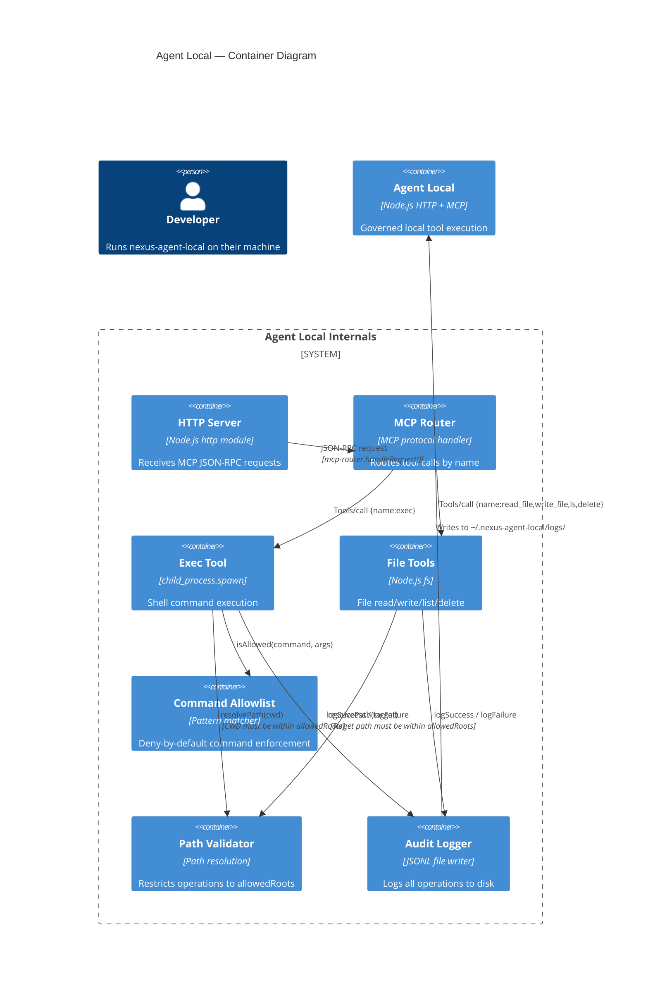
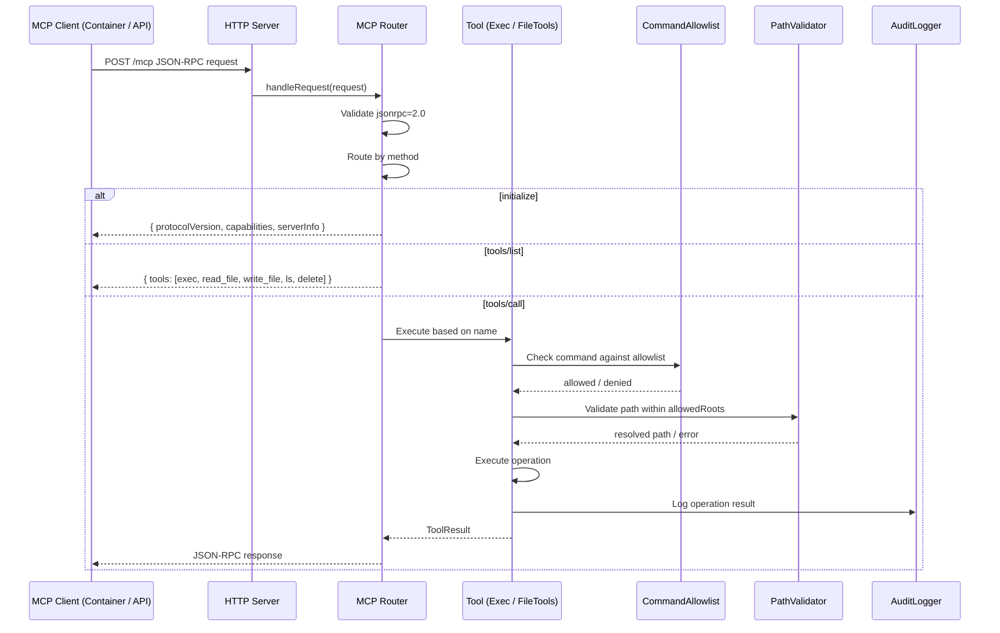

# 30 — Agent Local

Agent Local (`@nexus/agent-local`) is a lightweight local MCP-compatible service that provides governed command execution and file operations on a developer's machine. It acts as a security boundary between AI agents running in Docker containers and the host filesystem, ensuring all operations are explicitly allowed and fully audited.

---

## Architecture



---

## How It Works

### Startup

1. Load configuration from `~/.nexus-agent-local/config.json` (or use defaults)
2. Create instances of `PathValidator`, `AuditLogger`, `ExecTool`, and `FileTools`
3. Create `McpRouter` with injected tools
4. Start an HTTP server listening on the configured `host:port`
5. The server accepts MCP JSON-RPC 2.0 requests at the configured endpoint

### Request Flow



---

## Security Model

### Default-Deny Commands

The exec tool enforces a strict **deny-by-default** policy:

- If `allowPatterns` is empty (default), **all commands are denied**
- Commands must match at least one configured pattern to execute
- If no patterns match, the command returns a denial error: `"Denied by allowlist: <command>"`

### Command Allowlist

The `CommandAllowlist` class converts pattern strings into regular expressions:

| Pattern     | Matched Commands                                      |
| ----------- | ----------------------------------------------------- |
| `npm test`  | Exactly `npm test`                                    |
| `npm run *` | `npm run build`, `npm run test`, `npm run lint`, etc. |
| `git *`     | `git status`, `git diff`, `git commit -m "msg"`, etc. |
| `node *`    | Any command starting with `node`                      |

Patterns use `*` as a wildcard (converted to `.*` in regex). The full command line (`command + " " + args.join(" ")`) is tested against each pattern.

### Path Restrictions

The `PathValidator` enforces that all file operations target directories within the configured `allowedRoots`:

- Paths are resolved to their absolute form (relative paths use the provided CWD)
- The resolved path must match or be inside one of the allowed roots
- Access to paths outside `allowedRoots` throws an error: `"Path is not within allowed roots: <path>"`
- Symlink following uses `path.resolve` (not realpath), deferring to the OS

### No Shell Execution

Commands are executed via `child_process.spawn` with `shell: false`:

- No shell interpolation, piping, or redirection
- Arguments are passed as a string array, not a command string
- This prevents command injection via special characters

---

## Available Tools

### Tool Registry

| Tool              | MCP Name     | Description                                                       |
| ----------------- | ------------ | ----------------------------------------------------------------- |
| Command Execution | `exec`       | Execute a command on the local machine with allowlist enforcement |
| Read File         | `read_file`  | Read a local file (UTF-8 or base64 encoding)                      |
| Write File        | `write_file` | Write content to a local file with optional mode                  |
| List Directory    | `ls`         | List directory contents, optionally recursive                     |
| Delete            | `delete`     | Delete a file or directory, optionally recursive                  |

### `exec` — Command Execution

**Input Schema:**

| Parameter | Type     | Required | Description                                     |
| --------- | -------- | -------- | ----------------------------------------------- |
| `command` | string   | Yes      | Command to execute                              |
| `args`    | string[] | No       | Command arguments                               |
| `cwd`     | string   | No       | Working directory (must be within allowedRoots) |
| `timeout` | number   | No       | Timeout in milliseconds (default: 30000)        |

**Security checks:**

- Command must match at least one allowlist pattern
- CWD must be within allowedRoots
- If CWD is not provided, defaults to `process.cwd()`

**Output:**

- On success (exit code 0): stdout text
- On failure (non-zero exit code): stderr or stdout text, `isError: true`
- Process is killed with SIGTERM on timeout

### `read_file` — Read File

**Input Schema:**

| Parameter  | Type   | Required | Description                          |
| ---------- | ------ | -------- | ------------------------------------ |
| `path`     | string | Yes      | File path to read                    |
| `encoding` | string | No       | `utf8` or `base64` (default: `utf8`) |

**Security checks:**

- Path must be within allowedRoots
- File size is limited by `maxFileBytes` (default: 1 GB)

### `write_file` — Write File

**Input Schema:**

| Parameter | Type   | Required | Description             |
| --------- | ------ | -------- | ----------------------- |
| `path`    | string | Yes      | File path to write      |
| `content` | string | Yes      | File content            |
| `mode`    | number | No       | File mode (permissions) |

**Security checks:**

- Path must be within allowedRoots
- File size is limited by `maxFileBytes`

### `ls` — List Directory

**Input Schema:**

| Parameter    | Type    | Required | Description                                              |
| ------------ | ------- | -------- | -------------------------------------------------------- |
| `path`       | string  | Yes      | Directory path to list                                   |
| `recursive`  | boolean | No       | Recurse into subdirectories (default: false)             |
| `missing_ok` | boolean | No       | Return empty list if path doesn't exist (default: false) |

**Security checks:**

- Path must be within allowedRoots

### `delete` — Delete File or Directory

**Input Schema:**

| Parameter   | Type    | Required | Description                                       |
| ----------- | ------- | -------- | ------------------------------------------------- |
| `path`      | string  | Yes      | Path to delete                                    |
| `recursive` | boolean | No       | Recursive delete for directories (default: false) |

**Security checks:**

- Path must be within allowedRoots

---

## Audit Logging

### What Gets Logged

Every operation (both successful and failed) is recorded as a JSONL entry:

```json
{
  "timestamp": "2026-06-03T10:30:00.000Z",
  "operation": "exec",
  "success": true,
  "details": {
    "command": "npm test",
    "cwd": "/home/user/project",
    "timeoutMs": 30000
  }
}
```

Failed operations include additional context:

```json
{
  "timestamp": "2026-06-03T10:30:05.000Z",
  "operation": "exec",
  "success": false,
  "details": {
    "command": "rm -rf /",
    "reason": "command_not_allowlisted"
  }
}
```

### Log Location

Audit logs are written to `~/.nexus-agent-local/logs/` with daily rotation by filename:

- `audit-2026-06-03.log`
- `audit-2026-06-04.log`
- etc.

### Stdout Mirroring

When `logToStdout` is `true` (default), audit entries are also printed to stdout for real-time monitoring and log aggregation.

---

## CLI Usage

### Start the Service

```bash
nexus-agent-local start
```

Starts the HTTP server on the configured host and port. Runs until terminated with SIGINT or SIGTERM.

### View Current Configuration

```bash
nexus-agent-local config get
```

Outputs the full configuration as formatted JSON.

### Update Configuration

```bash
nexus-agent-local config set port 3034
nexus-agent-local config set allowedRoots "/home/user/projects"
nexus-agent-local config set allowPatterns "npm test,npm run *,git status,git diff,git log,git add,git commit,git push,tsc,node *"
nexus-agent-local config set defaultCommandTimeoutMs 60000
nexus-agent-local config set maxFileBytes 500000000
nexus-agent-local config set logToStdout true
```

**Settable keys:** `host`, `port`, `allowedRoots`, `allowPatterns`, `defaultCommandTimeoutMs`, `maxFileBytes`, `logToStdout`

---

## Configuration

### Config File

**Path:** `~/.nexus-agent-local/config.json`

```json
{
  "host": "127.0.0.1",
  "port": 3033,
  "allowedRoots": ["/home/user"],
  "allowPatterns": ["npm test", "npm run *", "git status", "git diff"],
  "defaultCommandTimeoutMs": 30000,
  "maxFileBytes": 1000000000,
  "logToStdout": true
}
```

### Configuration Options

| Option                    | Type     | Default                 | Description                                        |
| ------------------------- | -------- | ----------------------- | -------------------------------------------------- |
| `host`                    | string   | `127.0.0.1`             | IP address to bind the HTTP server to              |
| `port`                    | number   | `3033`                  | Port to listen on                                  |
| `allowedRoots`            | string[] | `[home directory]`      | Absolute paths where file operations are permitted |
| `allowPatterns`           | string[] | `[]` (empty = deny all) | Glob-style patterns for allowed commands           |
| `defaultCommandTimeoutMs` | number   | `30000`                 | Default timeout for command execution              |
| `maxFileBytes`            | number   | `1000000000` (1 GB)     | Maximum file size for read/write operations        |
| `logToStdout`             | boolean  | `true`                  | Whether to mirror audit logs to stdout             |

### Endpoint

Default MCP endpoint: `http://127.0.0.1:3033/mcp`

The server also serves a root endpoint (`/`) that returns configuration info, available tools, and startup time.

---

## Integration with the Broader System

### Container Usage

Agent Local is used by execution containers to perform local host operations:

- **Workflow agents** — containers can call `exec` to run build commands, tests, or git operations on the host
- **File operations** — agents can read/write files in the host workspace via `read_file` and `write_file`
- **Repository operations** — `ls` and `delete` enable workspace inspection and cleanup

### MCP Protocol

Agent Local implements the MCP 2024-11-05 protocol specification:

- `initialize` — handshake with protocol version and capabilities
- `notifications/initialized` — confirmation of initialization
- `tools/list` — returns the tool registry (5 tools)
- `tools/call` — executes a tool by name with arguments

All communication is via JSON-RPC 2.0 over HTTP POST to the configured endpoint.

---

## Security Considerations and Best Practices

### Principle of Least Privilege

- **Restrict allowedRoots** to only the directories agents genuinely need to access (e.g., `/home/user/projects/nexus-orchestrator`)
- **Use narrow allowPatterns** — prefer specific patterns like `npm test` over broad ones like `npm *`
- **Review allowPatterns** — wildcards like `*` or `bash *` effectively bypass the entire security model

### Network Isolation

- Agent Local binds to `127.0.0.1` by default, preventing remote access
- If binding to `0.0.0.0`, ensure firewall rules restrict access to trusted networks only

### Audit Review

- Regularly review audit logs for unexpected or suspicious operations
- Monitor for repeated deny events, which may indicate misconfigured patterns or attempted exploits

### Pattern Writing

- Patterns match against the full serialized command (`command + " " + args.map(t => t).join(" ")`)
- Spaces are significant — `"git status"` matches `git status` but not `git status --porcelain`
- Use `*` for wildcard matching — `"git *"` matches any git command
- Avoid overly broad patterns that could be exploited (e.g., `sh *`, `bash *`, `python *`)

### File Size Limits

- `maxFileBytes` prevents agents from reading or writing excessively large files
- The default of 1 GB is generous; consider lowering it for tighter resource control

---

## Where Next

- [16 — MCP/ACP](16-mcp-acp.md): MCP runtime, ACP runtime, and transport factory in the API
- [18 — Telemetry & Observability](18-telemetry-observability.md): How agent activity is monitored
- [28 — PI Runner](28-pi-runner.md): Container-side runtime bridge that may call Agent Local
- [19 — Security](19-security.md): JWT auth, IAM, and secret management
