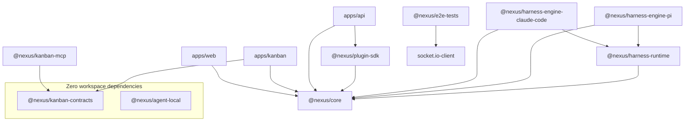

# 31 — Shared Packages

Inventory and reference for every shared library in the Nexus Orchestrator monorepo. Covers package contents, dependency relationships, build order, and conventions for adding new shared types.

---

## Package Inventory

| Package                                | npm Name                            | Description                                                                                                                   |
| -------------------------------------- | ----------------------------------- | ----------------------------------------------------------------------------------------------------------------------------- |
| `packages/core/`                       | `@nexus/core`                       | Shared TypeScript interfaces, Zod schemas, HTTP clients, tool policy engine, error types, and request context. Built first.   |
| `packages/kanban-contracts/`           | `@nexus/kanban-contracts`           | Kanban domain Zod schemas and TypeScript types for work items, projects, orchestration, reviews, goals, events, and settings. |
| `packages/plugin-sdk/`                 | `@nexus/plugin-sdk`                 | Plugin manifest, contribution, and runtime protocol schemas. Defines the contract plugins must implement.                     |
| `packages/e2e-tests/`                  | `@nexus/e2e-tests`                  | Black-box end-to-end tests against live API + WebSocket stack. Kanban lifecycle, review workflow, smoke tests.                |
| `packages/harness-runtime/`            | `@nexus/harness-runtime`            | Engine-agnostic kernel, SPI, conformance suite                                                                                |
| `packages/harness-engine-pi/`          | `@nexus/harness-engine-pi`          | PI engine adapter (`@earendil-works/pi-coding-agent`)                                                                         |
| `packages/harness-engine-claude-code/` | `@nexus/harness-engine-claude-code` | Claude Code engine adapter                                                                                                    |
| `packages/agent-local/`                | `@nexus/agent-local`                | Local MCP-compatible HTTP service for governed file and command execution with security controls.                             |
| `packages/kanban-mcp/`                 | `@nexus/kanban-mcp`                 | Kanban MCP server exposing project/work-item tools via Model Context Protocol.                                                |
| `packages/shared/`                     | `@nexus/shared`                     | Shared utilities (build artifact only).                                                                                       |

> Detailed documentation for runtime packages: see [41-harness-runtime.md](41-harness-runtime.md), [28-pi-runner.md](28-pi-runner.md), and [30-agent-local.md](30-agent-local.md).

---

## Package Dependency Graph



Key observations:

- `@nexus/core` is the root dependency — every app and most packages depend on it.
- `@nexus/kanban-contracts` is standalone (depends only on `zod`); no dependency on core.
- `@nexus/plugin-sdk` depends on `@nexus/core` for base type definitions.
- `@nexus/harness-runtime` depends on `@nexus/core` for shared interfaces and schemas.
- `@nexus/harness-engine-pi` and `@nexus/harness-engine-claude-code` depend on both `@nexus/harness-runtime` (SPI) and `@nexus/core`.
- `@nexus/agent-local` has zero workspace dependencies — fully self-contained.
- `@nexus/e2e-tests` does not depend on workspace packages directly; it operates as a black-box HTTP/WS client.

---

## @nexus/core (packages/core/)

The foundation package. Every other workspace depends on it. Build it first.

### Interfaces (24+ type files in `src/interfaces/`)

| File                                    | Purpose                                                              |
| --------------------------------------- | -------------------------------------------------------------------- |
| `acp.types.ts`                          | Agent Communication Protocol — agent-to-agent communication types    |
| `agent-profile.types.ts`                | Agent profile configuration (model, provider, skills, system prompt) |
| `automation.types.ts`                   | Automation hooks, heartbeats, standing orders                        |
| `chat-session.types.ts`                 | Chat session metadata, messages, participants                        |
| `chat-session-job.types.ts`             | Chat session BullMQ job payloads                                     |
| `execution-context.types.ts`            | Execution context passed to workflow steps and agent runs            |
| `internal-tool.types.ts`                | Internal tool definitions and handler contracts                      |
| `mcp.types.ts`                          | Model Context Protocol — server/client transport types               |
| `mcp-json-rpc.types.ts`                 | MCP JSON-RPC 2.0 message format types                                |
| `password-validation.types.ts`          | Password policy rules and validation results                         |
| `runner-config.types.ts`                | Runner configuration injected into execution containers              |
| `scheduled-job.types.ts`                | Scheduled job definitions and recurrence rules                       |
| `service-clients.types.ts`              | Internal service client contracts (Kanban, Chat)                     |
| `startup-routing.types.ts`              | Startup routing configuration for live vs. E2E tests                 |
| `telegram-settings.types.ts`            | Telegram channel adapter settings                                    |
| `tool-constants.ts`                     | Tool capability constants and identifiers                            |
| `tool-query.types.ts`                   | Tool registry query and filtering types                              |
| `web-automation.types.ts`               | Playwright/web automation session types                              |
| `workflow-legacy.types.ts`              | Legacy workflow definition format types                              |
| `workflow-lifecycle-execution.types.ts` | Workflow lifecycle execution step types                              |
| `workflow-lifecycle-policy.types.ts`    | Workflow lifecycle policy rules and conditions                       |

All interfaces are re-exported via `src/interfaces/index.ts`.

### Zod Schemas (22 subdirectories in `src/schemas/`)

| Directory                | Contents                                                             |
| ------------------------ | -------------------------------------------------------------------- |
| `acp/`                   | ACP server registration and management schemas                       |
| `ai-config/`             | Agent profiles, skills, LLM providers, models, secrets schemas       |
| `auth/`                  | Authentication and authorization schemas                             |
| `automation/`            | Automation configurations and hook schemas                           |
| `capability-governance/` | Tool approval rules and capability governance                        |
| `chat/`                  | Chat session, message, and service contract schemas                  |
| `common/`                | Pagination and shared utility schemas                                |
| `events/`                | Event envelope, event ledger queries, internal domain events         |
| `execution/`             | Execution shared types and step run schemas                          |
| `mcp/`                   | MCP server configuration schemas                                     |
| `memory/`                | Runtime feedback, learning contracts, memory queries                 |
| `operations/`            | Doctor check request/response schemas                                |
| `roles/`                 | Role and permission schemas                                          |
| `settings/`              | System and service settings schemas                                  |
| `setup/`                 | Initial setup wizard schemas                                         |
| `tools/`                 | Tool management, filesystem, browser, todo, nexus-orchestrator tools |
| `users/`                 | User CRUD, memory, and response schemas                              |
| `workflow-run/`          | Workflow run contracts, requests, MCP mounts                         |
| `workflow-runtime/`      | Runtime lifecycle, inputs, callbacks, and formatting schemas         |

Additional top-level schemas: `execution-context.schema.ts`, `startup-routing.schema.ts`.

### HTTP Clients

- **`ChatHttpClient`** — Typed HTTP client for the chat session API (browser-safe).
- **`CoreHttpClient`** — Typed HTTP client for the core API endpoints (browser-safe).

Both clients are exported from `src/clients/` and are available in both Node.js and browser environments.

### Request Context

- **`BaseRequestContextService`** — Abstract base class for propagating correlation IDs and user context through async operations.
- **Correlation ID middleware** — Express/NestJS middleware that assigns and forwards `X-Correlation-ID` headers.

### Tool Policy Engine

- **Parser** (`tool-policy.parser.ts`) — Parses the tool policy DSL into an AST (abstract syntax tree).
- **Compiler** (`tool-policy.compiler.ts`) — Compiles the AST into executable predicate functions for runtime evaluation.

### Error Types

- `error-envelope.types.ts` — Standardized error envelope shape for HTTP responses.
- `agent-error-feedback.types.ts` — Structured error feedback from agent execution runs.

### Entry Points

| Entry Point | File             | Usage                                         |
| ----------- | ---------------- | --------------------------------------------- |
| Main        | `src/index.ts`   | Node.js server-side consumers                 |
| Browser     | `src/browser.ts` | Browser-safe subset (no Node.js dependencies) |

---

## @nexus/kanban-contracts (packages/kanban-contracts/)

Shared Zod schemas and TypeScript types for the Kanban domain. Depends only on `zod` (zero workspace dependencies). Consumed by `apps/kanban`, `apps/api`, and `packages/kanban-mcp`.

### Exported Modules

| Module              | Schema File                                       | Types File                              | Description                                            |
| ------------------- | ------------------------------------------------- | --------------------------------------- | ------------------------------------------------------ |
| Common              | `common.schema.ts`                                | `common.types.ts`                       | Shared pagination, metadata, and utility types         |
| Projects            | `project.schema.ts`                               | `project.types.ts`                      | Project CRUD, status, settings                         |
| Work Items          | `work-item.schema.ts`                             | `work-item.types.ts`                    | Work item creation, updates, status groups             |
| Work Item Status    | —                                                 | `work-item-status.types.ts`             | Status state machine types                             |
| Status Groups       | `work-item.schema.ts` (`WORK_ITEM_STATUS_GROUPS`) | `work-item-status-groups.spec.ts`       | Classification groups (backlog, active, done, blocked) |
| Goals               | `goals.schema.ts`                                 | `goals.types.ts`                        | Project goals and milestones                           |
| Reviews             | `review.schema.ts`                                | `review.types.ts`                       | QA review requests, findings, approvals                |
| Orchestration       | `orchestration.schema.ts`                         | `orchestration.types.ts`                | Orchestration cycle, dispatch, action requests         |
| Events              | `events.schema.ts`                                | `events.types.ts`                       | Kanban domain event payloads                           |
| Settings            | `settings.schema.ts`                              | `settings.types.ts`                     | Kanban service settings                                |
| Repository Settings | —                                                 | `repository-workflow-settings.types.ts` | Repository-linked workflow configuration               |

### Boundary Rule

API/Core code must never use Kanban domain identifiers (work-item, project, kanban). The boundary is lint-enforced by the `nexus-boundaries/no-core-kanban-residue` rule. Use `@nexus/kanban-contracts` only in `apps/kanban`, `packages/kanban-mcp`, and Kanban-specific consumers.

---

## @nexus/plugin-sdk (packages/plugin-sdk/)

Defines the contract that plugins must implement. Depends on `@nexus/core` and `zod`.

### Exported Modules

| Module              | Schema File                         | Types File                         | Description                                                  |
| ------------------- | ----------------------------------- | ---------------------------------- | ------------------------------------------------------------ |
| Plugin Manifest     | `plugin-manifest.schema.ts`         | `plugin-manifest.types.ts`         | Plugin identity, metadata, versioning, declared capabilities |
| Plugin Contribution | `plugin-contribution.schema.ts`     | `plugin-contribution.types.ts`     | What a plugin contributes: tools, hooks, UI components       |
| Runtime Protocol    | `plugin-runtime-protocol.schema.ts` | `plugin-runtime-protocol.types.ts` | Plugin ↔ Kernel communication protocol messages              |
| Special Step Plugin | `special-step-plugin.schema.ts`     | `special-step-plugin.types.ts`     | Plugin-provided special step handler contracts               |

### Key Concepts

- **Manifest**: Declares a plugin's identity (`id`, `name`, `version`), what capabilities it provides, and its runtime requirements.
- **Contribution**: Defines the concrete tools, lifecycle hooks, and UI components the plugin exposes.
- **Runtime Protocol**: Standardized request/response envelopes for kernel-to-plugin communication.
- **Special Step Plugin**: Allows plugins to register custom workflow step handlers with YAML type keys.

---

## @nexus/e2e-tests (packages/e2e-tests/)

Black-box end-to-end tests that run against a live API + WebSocket stack. Does not import workspace source code — operates purely as an HTTP/WebSocket client.

### Test Structure

| Directory                    | Purpose                                                             |
| ---------------------------- | ------------------------------------------------------------------- |
| `kanban-lifecycle/`          | 6-phase Kanban lifecycle E2E                                        |
| `review-workflow/`           | QA review workflow tests                                            |
| `split-service-kanban-core/` | Split-service smoke test (Kanban + Core)                            |
| `workflow-execution/`        | Workflow execution test runner                                      |
| `infra/`                     | Shared infrastructure: API client, auth, config, polling, test gate |

### Kanban Lifecycle Phases

1. **Phase 1 — Create Project**: Creates a Kanban project with goals and initial work items.
2. **Phase 2 — In Progress**: Transitions work items to in-progress status, triggering default workflows.
3. **Phase 3 — In Review**: Moves work items to review, triggering QA review workflows.
4. **Phase 4 — Ready to Merge**: Completes review and transitions to ready-to-merge.
5. **Phase 5 — PM Hydration**: CEO orchestration cycle hydrates project manager context.
6. **Phase 6 — Dispatch Order**: Flat dependency dispatch verifies work item ordering.

### Infrastructure Components

| File            | Purpose                                                                           |
| --------------- | --------------------------------------------------------------------------------- |
| `config.ts`     | Reads `E2E_API_URL`, `E2E_WS_URL`, `JWT_SECRET`, `RUN_E2E_TESTS` from environment |
| `auth.ts`       | JWT token generation and authentication helpers                                   |
| `api-client.ts` | Typed HTTP client for the Core API                                                |
| `polling.ts`    | Retry + polling utilities for async workflow assertions                           |
| `test-gate.ts`  | Gate checks that control whether tests run in a given environment                 |

### Workflow Execution Test Runner

`run-workflow.ts` — Generic workflow execution harness. Reads workflow templates, instantiates runs, monitors telemetry, and validates outcomes. Supports scenarios for different workflow types.

---

## @nexus/harness-runtime (packages/harness-runtime/)

Engine-agnostic kernel, SPI (`HarnessEngine` / `HarnessSession`), and the cross-engine conformance suite (C1–C10). See [41-harness-runtime.md](41-harness-runtime.md).

## @nexus/harness-engine-pi (packages/harness-engine-pi/)

PI engine adapter — implements `HarnessEngine` using `@earendil-works/pi-coding-agent`. Runs inside `nexus-light` / `nexus-heavy` containers. See [28-pi-runner.md](28-pi-runner.md) for PI-specific internals.

## @nexus/harness-engine-claude-code (packages/harness-engine-claude-code/)

Claude Code engine adapter — implements `HarnessEngine` using the Claude Code SDK. Accepts `anthropic` provider only (`compatibleProviderIds: ["anthropic"]`). See [41-harness-runtime.md](41-harness-runtime.md).

---

## @nexus/agent-local (packages/agent-local/)

Local MCP-compatible HTTP service for governed operations on the host machine. Runs on port 3033.

**Key responsibilities:**

- **File System Tools** — Read, write, and list directory operations with path validation.
- **Command Execution** — Shell command execution with allow-list enforcement.
- **Security Layer** — Path validation (no escape from workspace), command allow-list, audit logging.
- **MCP Router** — HTTP server exposing tools via MCP-compatible JSON-RPC endpoints.

> Detailed documentation: [30-agent-local.md](30-agent-local.md)

---

## @nexus/kanban-mcp (packages/kanban-mcp/)

MCP server that exposes Kanban domain operations as MCP tools. Depends on `@nexus/kanban-contracts` for typed schemas. Enables AI agents to interact with Kanban projects and work items through standardized MCP tool calls.

---

## How Packages Are Consumed

### npm Workspaces

All packages are configured as npm workspaces in the root `package.json`. This means:

- `npm install` at the root installs all workspace dependencies.
- Workspace packages can reference each other via their npm package names (e.g., `"@nexus/core": "*"`).
- A single `package-lock.json` at the repo root governs all dependency resolution.

### Path Aliases

TypeScript path aliases are configured in the root `tsconfig.json` and inherited by workspace `tsconfig.json` files. Imports use the package name:

```typescript
import { WorkflowDefinition } from "@nexus/core";
import { CreateWorkItemSchema } from "@nexus/kanban-contracts";
import { PluginManifest } from "@nexus/plugin-sdk";
```

Never use relative paths between packages (e.g., `../../packages/core/src/...`).

---

## Build Order

`@nexus/core` must be built first — everything depends on its compiled output.

```bash
# 1. Core (foundation for everything)
npm run build --workspace=packages/core

# 2. Packages that depend on core
npm run build --workspace=packages/harness-runtime
npm run build --workspace=packages/harness-engine-pi
npm run build --workspace=packages/harness-engine-claude-code
npm run build --workspace=packages/plugin-sdk
npm run build --workspace=packages/kanban-contracts

# 3. Apps (depend on all built packages)
npm run build:api
npm run build:kanban
npm run build:web
```

For iterative development, most dev servers (e.g., `npm run start:api`) use watch mode and rebuild on change.

---

## Adding New Shared Types or Schemas

### Step 1: Determine the owning package

| If the type/schema relates to...                                                    | Add it to...              |
| ----------------------------------------------------------------------------------- | ------------------------- |
| Core workflow engine, AI config, tools, chat, auth, automation, MCP/ACP, operations | `@nexus/core`             |
| Kanban domain (work items, projects, orchestration, reviews, goals)                 | `@nexus/kanban-contracts` |
| Plugin lifecycle, contributions, capability endpoints                               | `@nexus/plugin-sdk`       |

### Step 2: Add the file

For `@nexus/core`:

- Types go in `packages/core/src/interfaces/` (`.types.ts` suffix).
- Schemas go in a new or existing subdirectory under `packages/core/src/schemas/` (`.schema.ts` suffix).
- Export from the directory's `index.ts`, and ensure it's re-exported from the parent `schemas/index.ts` or `interfaces/index.ts`.

For `@nexus/kanban-contracts`:

- Types in `packages/kanban-contracts/src/` (`.types.ts` suffix).
- Schemas in `packages/kanban-contracts/src/` (`.schema.ts` suffix).
- Export from `packages/kanban-contracts/src/index.ts`.

### Step 3: Rebuild

```bash
npm run build --workspace=packages/core
```

### Step 4: Verify no boundary violations

Run lint to ensure Kanban types haven't leaked into API/Core code (or vice versa):

```bash
npm run lint:api
npm run lint:kanban
```
