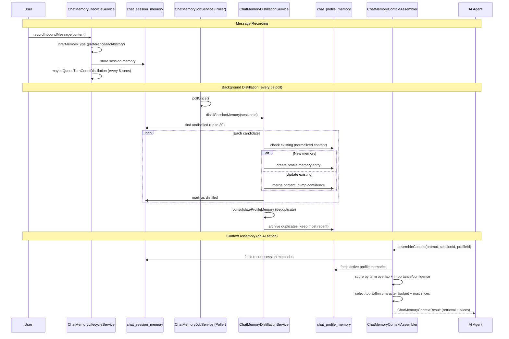
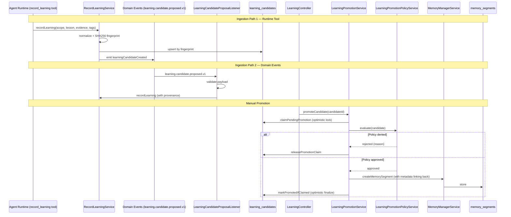
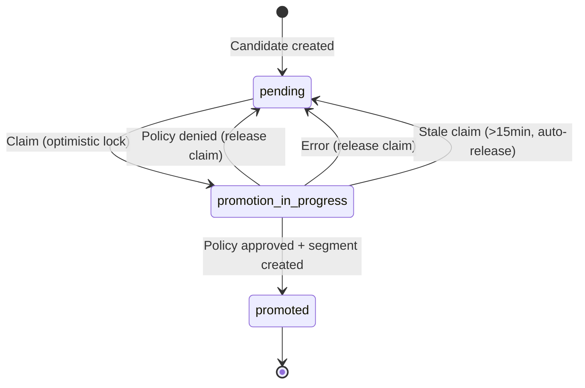
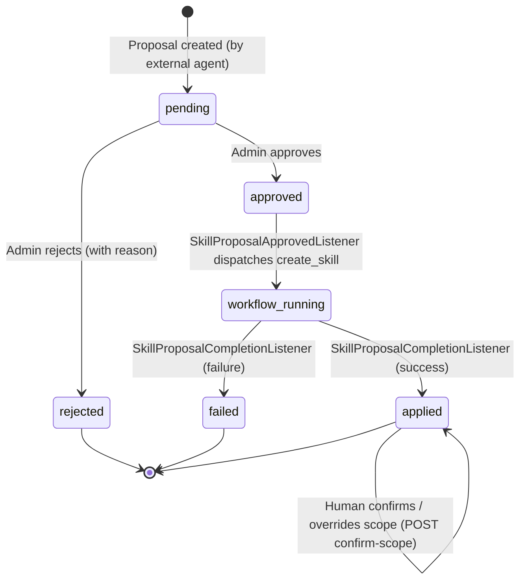

# Memory & Learning Systems

The memory and learning systems form the knowledge backbone of the Nexus Orchestrator — capturing, distilling, and surfacing information across sessions. There are two interconnected subsystems: the **general memory system** (scoped to any entity) and the **chat memory system** (session/profile-specific), plus a **learning pipeline** that promotes observations into durable knowledge.

## Architecture Overview

```mermaid
C4Container
  title Memory & Learning Systems — Component Diagram

  Container_Boundary(memory_module, "Memory Module") {
    Component(controllers, "Controllers", "REST", "System + Chat admin APIs")
    Component(memory_mgr, "MemoryManagerService", "Service", "General memory CRUD (backend-delegated)")
    Component(memory_list, "MemoryListingService", "Service", "Paginated search + filtering")
    Component(backend_factory, "MemoryBackendFactory", "Strategy", "Selects backend by MEMORY_BACKEND env")
    Component(postgres_be, "PostgresMemoryBackend", "Backend", "DEFAULT — pure PostgreSQL storage")
    Component(honcho_be, "HonchoMemoryBackend", "Backend", "Honcho reads + PG writes")
    Component(honcho_fb, "HonchoFallbackBackend", "Backend", "Honcho reads + unconditional PG fallback")
    Component(llm_svc, "LLMService", "Service", "OpenAI summarization for distillation")
    Component(token_ctr, "TokenCounterService", "Service", "tiktoken counting + threshold checks")
    Component(distill_consumer, "DistillationConsumer", "BullMQ Worker", "Session tree JSONL compression")
  }

  Container_Boundary(learning_module, "Learning Module") {
    Component(record_svc, "RecordLearningService", "Service", "Ingest observations → LearningCandidate")
    Component(promote_svc, "LearningPromotionService", "Service", "Candidate → general MemorySegment")
    Component(policy_svc, "LearningPromotionPolicySvc", "Policy", "Eligibility evaluation (confidence, status)")
    Component(proposal_svc, "SkillProposalService", "Service", "Skill improvement proposal lifecycle")
    Component(listener, "LearningCandidateProposalListener", "Listener", "Event-driven candidate creation")
    Component(learn_ctrl, "LearningController", "REST", "Status, sweep, candidate list, promote")
    Component(proposal_ctrl, "SkillProposalsController", "REST", "Preview, approve, reject proposals")
  }

  Container_Boundary(chat_memory_module, "Chat Memory Module") {
    Component(lifecycle, "ChatMemoryLifecycleService", "Service", "Record messages, build context, trigger distillation")
    Component(job_svc, "ChatMemoryJobService", "Poller", "Background job poller (5s interval)")
    Component(distill_svc, "ChatMemoryDistillationService", "Service", "Session→profile promotion + consolidation")
    Component(ctx_asm, "ChatMemoryContextAssembler", "Service", "Prompt-relevant memory retrieval + scoring")
    Component(metrics, "ChatMemoryMetricsService", "Metrics", "In-memory counters for observability")
    Component(events, "ChatMemoryEventPublisher", "Service", "Validated event persistence")
    Component(bootstrap, "ChatMemorySchemaBootstrap", "Service", "Startup schema creation (raw SQL)")
    Component(obs_ctrl, "ChatMemoryObservabilityCtrl", "REST", "Internal metrics, jobs, events")
  }

  SystemDb(mem_db, "memory_segments", "General memory storage")
  SystemDb(chat_db, "chat_session/profile_memory", "Chat-specific memory tables")
  SystemDb(learn_db, "learning_candidates/skill_proposals", "Learning pipeline tables")
  SystemDb(session_db, "pi_session_trees", "Session tree JSONL (distillation source)")
  SystemDb(honcho_ext, "Honcho (External)", "Optional vector-search backend")

  Rel(controllers, memory_mgr, "Uses")
  Rel(memory_mgr, backend_factory, "Delegates to")
  Rel(backend_factory, postgres_be, "postgres mode")
  Rel(backend_factory, honcho_be, "honcho mode")
  Rel(backend_factory, honcho_fb, "dual mode")
  Rel(postgres_be, mem_db, "CRUD")
  Rel(honcho_be, honcho_ext, "Reads")
  Rel(honcho_be, mem_db, "Writes (PG)")
  Rel(honcho_fb, honcho_ext, "Reads")
  Rel(honcho_fb, mem_db, "Writes (PG)")
  Rel(distill_consumer, llm_svc, "Summarize nodes")
  Rel(distill_consumer, token_ctr, "Count tokens")
  Rel(distill_consumer, session_db, "Read/write JSONL")
  Rel(promote_svc, memory_mgr, "Create segments")
  Rel(promote_svc, policy_svc, "Evaluate eligibility")
  Rel(listener, record_svc, "Forward events")
  Rel(lifecycle, distill_svc, "Distill + consolidate")
  Rel(lifecycle, ctx_asm, "Build action context")
  Rel(job_svc, distill_svc, "Process jobs")
  Rel(distill_svc, chat_db, "Session→profile promotion")
  Rel(ctx_asm, chat_db, "Retrieve memories")
```



---

## General Memory System

The general memory system (`MemoryModule`) provides entity-scoped persistent memory with pluggable backends.

### MemoryBackend Interface

All backends implement the `MemoryBackend` interface with these operations:

| Method                                                                       | Purpose                                     |
| ---------------------------------------------------------------------------- | ------------------------------------------- |
| `createMemorySegment(entityType, entityId, content, memoryType?, metadata?)` | Store a memory                              |
| `getMemorySegments(entityType, entityId, filters?)`                          | Retrieve memories for a scoped entity       |
| `getMemorySegmentsByType(entityType, filters?)`                              | Retrieve memories across entities (by type) |
| `updateMemorySegment(id, content)`                                           | Update existing memory (version bumps)      |
| `deleteMemorySegment(id)`                                                    | Remove a memory                             |
| `searchMemory(entityType, entityId, query)`                                  | Full-text search within entity scope        |
| `searchMemoryByType(entityType, query, filters?)`                            | Full-text search across entities            |

### Memory Types

Each memory segment is classified into one of these types:

| Type               | Purpose                                                           |
| ------------------ | ----------------------------------------------------------------- |
| `preference`       | User/agent preferences ("I prefer short responses")               |
| `fact`             | Declarative facts ("The database runs on port 5433")              |
| `history`          | Conversational history and event records                          |
| `strategic_intent` | CEO long-term planning record (EPIC-208, Milestone 1) — see below |

#### Strategic intent (EPIC-208 Milestone 1)

The `strategic_intent` segment type carries the CEO's long-term planning
intent across orchestration cycles. It is a **singleton per
`(entity_type, entity_id)` scope**: a fresh write replaces the previous
segment so the latest CEO intent always wins. The structured payload
(`horizon`, `priority_themes`, `focus_areas`, `constraints`,
`updated_at`, `updated_by`, optional `rationale`) is persisted in
`memory_segments.metadata_json` (jsonb) and validated by the
`strategicIntentBodySchema` Zod schema in
`@nexus/core/schemas/workflow-runtime-inputs.schemas`. Use
`MemoryManagerService.upsertMemorySegment(...)` with
`memory_type='strategic_intent'` to write, and
`MemoryManagerService.getStrategicIntentSegment(...)` to read.

### Backend Strategy (3 Modes)

The `MemoryBackendFactory` selects the active backend at startup based on the `MEMORY_BACKEND` environment variable:

| Mode                   | Env Value  | Reads From                                  | Writes To  | Use Case                                        |
| ---------------------- | ---------- | ------------------------------------------- | ---------- | ----------------------------------------------- |
| **Postgres** (default) | `postgres` | PostgreSQL `memory_segments`                | PostgreSQL | Simple, no external dependencies                |
| **Honcho**             | `honcho`   | Honcho (with conditional PG fallback)       | PostgreSQL | Vector search via Honcho, PG as source of truth |
| **Dual**               | `dual`     | Honcho (with **unconditional** PG fallback) | PostgreSQL | Migration-safe — reads never fail               |

#### PostgresMemoryBackend

The default backend. Pure PostgreSQL storage using `LIKE` queries for search. Suitable for most use cases.

#### HonchoMemoryBackend

Reads from the [Honcho](https://github.com) external memory service for vector-based semantic search, but writes always go to PostgreSQL. Fallback behavior is controlled by:

- `HONCHO_FALLBACK_ON_ERROR` (default `true`) — fall back to PG if Honcho request fails
- `HONCHO_FALLBACK_ON_EMPTY` (default `true`) — fall back to PG if Honcho returns no results

Honcho workspace resolution via `HONCHO_WORKSPACE_STRATEGY`:

- `global` — single workspace (`HONCHO_DEFAULT_WORKSPACE`, default `nexus`)
- `per_project` — workspace per project (resolved at runtime)

#### HonchoFallbackMemoryBackend

The "dual" mode. Wraps `HonchoMemoryBackend` with unconditional PostgreSQL fallback on any error. This is the safest mode for migration — reads always succeed even if Honcho is unreachable.

### Core Services

**MemoryManagerService** — Primary internal API. Delegates all operations to the injected `MemoryBackend`. Emits `memory.recorded` plugin events on creation.

**MemoryListingService** — Higher-level pagination layer. Routes between search and list operations based on whether `entityId` and `query` are provided. Applies post-fetch memory type filtering with offset/limit pagination.

**LLMService** — OpenAI-compatible summarization for memory distillation. Retrieves the summarization model via `AiConfigurationService`, builds provider environment, and sends content with percentage-based summarization prompts. Degrades gracefully (returns original content on failure).

**TokenCounterService** — Token counting using `tiktoken` with fallback to rough word-count estimation. Used by the distillation consumer to measure compression ratios. Checks whether JSONL data exceeds a token threshold (default 80%).

**HonchoClientService** — Low-level HTTP client for the Honcho external memory service. Handles URL templating, auth headers (`HONCHO_API_KEY`), configurable retry count, and request timeout.

**MemorySegmentFeedbackService** — Explicit agent usefulness feedback channel (work item `66ea23d1-59f2-451b-a090-a292fad8f21b`). Persists `useful` / `not_useful` votes on retrieved memory segments via `MemorySegmentFeedbackRepository`, computes the rolling-window `usefulness_ratio = count(useful_votes) / count(total_votes)` over the live `memory_feedback_window_days` SystemSetting (default 30 days), and emits a `memory.feedback.recorded.v1` audit event after every successful row insert. The audit event payload carries `{ segment_id, useful, source, agent_profile }` so downstream dashboards can group feedback by the originating segment's `source` taxonomy.

### Distillation Consumer (BullMQ)

The `DistillationConsumer` (BullMQ `distillation` queue) compresses long-running agent session trees by recursively summarizing older conversation turns via LLM.

**Compression strategy (age-based):**

| Turn Range  | Target Compression    |
| ----------- | --------------------- |
| 0–10 turns  | No compression (100%) |
| 10–20 turns | 70% of original       |
| 20–50 turns | 50% of original       |
| 50+ turns   | 30% of original       |

**Flow:**

1. Load session tree from `PiSessionTreeRepository`
2. Decompress base64/gzipped JSONL
3. For each eligible node (skipping `tool_use` / `tool_result`): summarize via `LLMService` with surrounding context
4. Mark distilled nodes with `distilled: true`
5. Re-compress and save back
6. Return `{ initialTokens, finalTokens, ratio }`

### API Endpoints

| Endpoint                         | Auth      | Description                           |
| -------------------------------- | --------- | ------------------------------------- |
| `GET /memory/system/segments`    | Admin JWT | List system-level memory segments     |
| `GET /memory/chat/segments`      | Admin JWT | List chat memory (session or profile) |
| `GET /memory/chat/observability` | Admin JWT | Job/event counts, recent failures     |

---

## Memory Scopes & Recall Union (Epic C)

Every `memory_segments` row is keyed by the existing `(entity_type, entity_id)`
columns — Epic C did not add a new tagging system or a migration, it widened
what those columns are allowed to mean and taught retrieval to pool across
them. **One memory targets exactly one scope**; there are no tag lists.

### Recognized scopes

| `entity_type` | `entity_id`                  | Meaning                                                                                                              |
| ------------- | ---------------------------- | -------------------------------------------------------------------------------------------------------------------- |
| `global`      | n/a                          | Platform-wide knowledge, visible everywhere                                                                          |
| `project`     | `scopeId`                    | Knowledge tied to one project/scope — also the home for genuinely **multi-workflow** knowledge                       |
| `agent`       | agent profile name           | Knowledge tied to one agent profile (e.g. `implementer-agent`), recalled regardless of project or workflow           |
| `workflow`    | workflow **definition** name | Knowledge tied to one workflow definition (e.g. `work_item_implementation`), recalled regardless of project or agent |

`skill`-scoped recall (`entity_type='skill'`) is a noted future extension —
it is not written or recalled today.

### Recall union

`MemoryRetrievalService.fetchCandidateSegments` pools all four scopes that
apply to the current context: `project(scopeId) + global + agent(agentProfileName) + workflow(workflowName)`.
The `agent`/`workflow` pools are only queried when the caller supplies the
matching identity field, so a context without a resolved profile or workflow
name can never receive (or leak) scoped segments. The merged pool is
re-sorted `created_at DESC` so the legacy recency fallback stays fair across
pools instead of favoring whichever pool was queried first.

Identity is threaded from the step context, not passed by the agent:
`StepSupportService.buildPromotedLearningContext` resolves the current agent
profile name (already on the prompt context) and the workflow definition name
(server-resolved from the run record) and forwards both into
`resolvePromotedLessonsForInjection`, which passes them straight through to
`MemoryRetrievalService.retrieve`. The legacy recency-search fallback
(`searchPromotedLessonsByScope`) performs the same four-scope union — one
query per applicable scope, merged newest-first and capped at the limit —
so recall behaves consistently whether or not hybrid vector retrieval is
active. Downstream ranking (cosine/RRF × recency decay × usefulness ×
pinned boost, then token-budget trim) is unchanged by any of this.

**Subagent prompts now receive the same promoted-learning section as steps**
(FU-8). `SubagentPromptContextService.buildPromotedLearningContext` calls the
exact same `resolvePromotedLessonsForInjection` helper the step path uses —
it is not a parallel implementation. The two paths differ only in _how_ the
recall identity is resolved, not in what they do with it once resolved:

- **Step path**: `StepSupportService.buildPromotedLearningContext` resolves
  the workflow definition name itself (via its own `WorkflowRunRepository` +
  `WorkflowRepository`, unchanged since Epic C), falling back to that lookup
  when no `workflowName` is supplied.
- **Subagent path**: `SubagentPromptContextService` has no run/workflow
  repositories of its own, so `workflowName` is resolved eagerly by the
  subagent ctx-builder (`buildSubagentSystemPrompt` in
  `subagent-orchestrator.container-config.operations.ts`) via
  `resolveWorkflowNameById` — the same helper
  `resolveSubagentProfileAndAssignedSkills` already uses for workflow-scoped
  skill bindings — and threaded through the shared `UniversalPromptContext.workflowName`
  field into `buildUniversalPromptLayers`, which forwards it to whichever
  `PromptContextSupportLike` implementation is in play.

Both implementations ultimately call the shared `buildRecallIdentity` +
`resolvePromotedLessonsForInjection` helpers in
`step-support-promoted-learning.helpers.ts`, so the four-scope union above
applies identically to subagents.

### Write paths

- **`remember` tool** — agents call `remember({ content, scope: 'project' | 'global' | 'agent' | 'workflow', ... })`. The scope id is never supplied by the agent: `project`/`agent`/`workflow` ids are auto-resolved from the run context (`scopeId`, `agentProfileName`, and the server-resolved workflow definition name respectively). If the identity needed for the requested scope can't be resolved (e.g. `workflow` requested outside a workflow run), the write is refused with `{ created: false, reason: 'scope_unresolvable' }` rather than silently mis-scoping the memory.
- **Retrospective analyst** — a finding's `scope_hint: 'workflow_specific'` is routed to `workflow` scope (keyed by the run's workflow definition name) by `RetrospectiveOutputRouter`. A credential-bearing finding is always forced to `project` scope regardless of hint, and `global` is never self-elected by the router — cross-scope `global` routing only happens later, deterministically, in the nightly `LearningRouterService` clusterer.

### Governance

The promotion pipeline treats `workflow` as a first-class routing target, not
a repackaged `project`: `PromotionGovernancePolicyService` applies the same
tier to `workflow` as `project` — auto-promote at/above the 0.5 confidence
promotion floor into `governance_state='provisional'` with the standard
probation window, otherwise requires a proposal. `global` never auto-promotes
at any confidence. Probation evaluation, contradiction detection, and the
feedback-weight tuner are all scope-agnostic — they operate on segments by id
and don't special-case `entity_type`.

---

## Chat Memory System

The chat memory system (`ChatMemoryModule`) is a separate domain from the general memory system. It manages session-level and profile-level memory specifically for chat interactions, with automatic distillation, consolidation, and context assembly.



### Message Recording

**`ChatMemoryLifecycleService`** is the primary entry point:

- **`recordInboundMessage(input)`** — Stores user messages as session memory. Infers memory type:
  - Contains phrases like "I prefer" → `preference`
  - Contains "remember", "always" → `fact`
  - Otherwise → `history`
  - Scores importance (0–100) based on type, length, and keyword matches (e.g., "deadline", "blocked" boost)
  - Queues turn-count based distillation if threshold reached (default: every 6 turns)

- **`recordOutboundMessage(input)`** — Stores assistant responses as `history` type

- **`handleSessionClosed(params)`** — Enqueues an immediate final distillation job

### Distillation & Consolidation

**`ChatMemoryDistillationService`** handles the session→profile promotion pipeline:

1. **Distill session** — Finds undistilled session memories (up to 80). For each:
   - Skips content < 8 chars
   - Checks idempotency via promotion audit (prevents double-promotion)
   - If normalized content already exists in profile memory → **update**: merge content (keep longer), boost confidence by `ceil(importance / 4)`, increment `promotion_count`
   - If new → **create** profile memory entry
   - Marks session memory as distilled
   - Publishes `chat.memory.promoted.v1` or `chat.memory.updated.v1` events

2. **Consolidate profile** — Groups profile memories by `(memory_type, normalized_content)`, archives duplicates (keeps most recent entry), publishes archive events

### Context Assembly (Retrieval)

**`ChatMemoryContextAssemblerService`** retrieves and scores relevant memories for AI prompts:

1. **Extract terms** from the prompt (words ≥ 4 chars)
2. **Fetch candidates** — recent session memories (up to `maxSlices * 4`) and active profile memories (up to `maxSlices * 6`)
3. **Score relevance** — `overlapCount / termCount + importance_score/100 + 0.1` (session) or `confidence_score/100 + 0.2` (profile)
4. **Select** top-scoring candidates within `characterBudget` (tokenBudget \* 4) and `maxSlices`
5. **Touch** accessed profile memories (updates `last_accessed_at`)
6. Returns `ChatMemoryContextResult` with hit counts, consumption stats, and selected slices

### Background Job Poller

**`ChatMemoryJobService`** runs a polling loop (default every 5s, configurable via `CHAT_MEMORY_POLL_INTERVAL_MS`):

1. **Claim** next pending job via `ChatMemoryJobRepository.claimNextPending()`
2. **Execute** — routes to `distillSessionMemory` or `consolidateProfileMemory`
3. On success → mark `completed`, enqueue consolidation follow-up
4. On failure → if attempts < `maxAttempts`, reset to `pending` with retry delay; if exhausted, mark `failed`

Can be disabled via `CHAT_MEMORY_JOBS_DISABLED=true`.

### Configuration

| Variable                                 | Default | Purpose                             |
| ---------------------------------------- | ------- | ----------------------------------- |
| `CHAT_MEMORY_MAX_SESSION_ENTRIES`        | 120     | Max session memory entries retained |
| `CHAT_MEMORY_DISTILLATION_TURN_INTERVAL` | 6       | Turns between distillation triggers |
| `CHAT_MEMORY_CONTEXT_TOKEN_BUDGET`       | 600     | Token budget for context assembly   |
| `CHAT_MEMORY_CONTEXT_MAX_SLICES`         | 6       | Max memory slices returned          |
| `CHAT_MEMORY_POLL_INTERVAL_MS`           | 5000    | Background job poll interval        |
| `CHAT_MEMORY_RETRY_DELAY_MS`             | 15000   | Delay before retrying failed jobs   |
| `CHAT_MEMORY_JOB_MAX_ATTEMPTS`           | 3       | Max retry attempts per job          |
| `CHAT_MEMORY_JOBS_DISABLED`              | false   | Disable background polling          |

### Database Tables (Schema-Bootstrapped)

The chat memory module uses **raw SQL schema bootstrapping** (not TypeORM migrations) via `ChatMemorySchemaBootstrapService`. This runs on module init and creates 5 tables with 10 indexes:

| Table                         | Purpose                                                        |
| ----------------------------- | -------------------------------------------------------------- |
| `chat_session_memory`         | Per-session message memories with type, importance, provenance |
| `chat_profile_memory`         | Aggregated profile-level memories with confidence scores       |
| `chat_memory_promotion_audit` | Idempotent promotion tracking (unique `idempotency_key`)       |
| `chat_memory_jobs`            | Background job queue (with idempotency key)                    |
| `chat_memory_events`          | Event log for memory lifecycle events (Zod-validated envelope) |

---

## Learning Pipeline

The learning pipeline (`LearningModule`, sub-module of `MemoryModule`) ingests observations from runtime tool calls and external events, deduplicates them into `LearningCandidate` records, and provides a promotion pathway into the general memory system.



### Ingestion & Deduplication

**`RecordLearningService`** is the ingestion gateway, called from:

1. The `record_learning` internal tool (agents calling from runtime)
2. The `remember` internal tool (agent in-the-moment capture — see _Agent Capture & Struggle Mining_ below)
3. The `StruggleDetectorService` (automated struggle-then-recovery mining)
4. The `learning.candidate.proposed.v1` domain event (external services like Kanban)

`recordLearning(context, params, options?)` accepts an optional `RecordLearningOptions` (`candidateType`, `sourceTool`, `sourceQualityConfidence`, `humanApprovedAt`, `signalsJsonExtra`); omitting it preserves the legacy `record_learning` behaviour (`candidate_type='runtime_learning'`, `source.tool='record_learning'`). This single seam lets every source share one birth path, scope inference, and dedup.

**Deduplication flow:**

1. Normalize input: `scopeType`, `scopeId`, `tags`, `evidence`, `lesson`
2. Generate SHA256 fingerprint from (`scopeType`, `scopeId`, `lesson`, `evidence`, `tags`)
3. Upsert by fingerprint — creates a new `LearningCandidate`, or **reinforces** an existing one (bumps `last_seen_at` and increments `recurrence_count`) and returns it without inserting a duplicate row
4. Stores provenance in `signals_json`: workflowRunId, jobId, agentProfileName, etc.

### Agent Capture & Struggle Mining (EPIC-212 Phase 0)

Phase 0 reworks what _feeds_ the pipeline (capture + mining + noise control) without new infrastructure or migrations. Every change is reversible via a setting or seed revert.

**`remember` tool — in-the-moment agent capture.** Agents call `remember({ content, memory_type?, scope?, tags?, origin?, confidence? })` to record a durable fact in one call (schema `rememberBodySchema` in `@nexus/core`; capability `REMEMBER_RUNTIME_CAPABILITY`). It writes a fast-tracked `LearningCandidate` (`candidate_type='agent_capture'`, `source.tool='remember'`) — **not** a `memory_segment` directly — so it shares the one birth path, scope inference, and dedup. Scope/IDs are resolved from `InternalToolExecutionContext` (the agent never passes entity IDs); agent captures carry a high `source_quality_confidence` prior (0.9); the candidate `confidence` defaults from the `memory_capture_default_confidence` setting. `origin:'user_request'` stamps `human_approved_at=now()` so the existing promotion path surfaces it near-instantly. Granted to `junior_dev`, `senior_dev`, `architect-agent`, and `research-and-automation-assistant` plus the deny-default workflows they run in (a contract test asserts `remember` survives `jobScoped ∩ profileAllowed`). The agent call is an `api_callback` that POSTs to `POST /api/workflow-runtime/remember`, served by `WorkflowRuntimeLifecycleController` (alongside `query-memory`/`record-learning`); a contract test (`workflow-runtime-capability.contracts.spec.ts`) asserts every lifecycle-owned `api_callback` capability has a matching route so a declared capability can never silently 404.

**Always-on capture directive.** A static `memory-capture-guidance` layer is injected into every normal agent step's system prompt (`step-agent-system-prompt.helpers.ts`), telling agents what/when/when-not to record. It is suppressed for the `memory_learning_sweep` and `project_orchestration_cycle_ceo` singleton workflows via `shouldSuppressMemoryCapture(workflowId)`.

**Templated emitters retired (Phase 2).** The two deterministic, content-free candidate emitters — `WorkflowSuccessLearnerListener` ("completed cleanly in Ns") and the postmortem aggregator's templated candidate ("Recurring … failures (N occurrences)") — were **deleted** in Phase 2 (Task 12), the EPIC end-state; the `WorkflowSuccessLearnerListener.CONFIDENCE_OVERRIDES` static field was removed with the listener. The retrospective analyst now mines both successes and failures into real, evidence-cited root-cause+fix memories, and `StruggleDetectorService` is the standing struggle-on-success miner. What survives is the deterministic failure signal the analyst gate consumes: the failure-postmortem `memory_segments` write (in `WorkflowFailurePostmortemListener`) and the recurrence **count** (now `WorkflowPostmortemLearningAggregatorService.recordPostmortemRecurrence`, which records the threshold-crossing as a gate signal without proposing a candidate). The `learning_templated_emitters_enabled` setting was removed with the emitters.

**`TemplateNoiseClassifier` (belt-and-suspenders).** A pure `classifyTemplateNoise(candidate)` (`apps/api/src/memory/signals/`) returns `{ isTemplate, isLowSignal }`. `list_pending_learning_candidates` excludes `isTemplate` rows from the sweep queue (rows are not deleted — they still count toward recurrence). `isLowSignal` is informational only in Phase 0 and never hides a candidate.

**`StruggleDetectorService` — no-LLM success mining.** On `WORKFLOW_RUN_COMPLETED_EVENT`, it scans the run's `event_ledger` tool-execution rows (`domain='tool'`, `event_name='tool.execution.completed'`, ordered by `occurred_at`) for a struggle-then-recovery pattern (≥2 `failure` outcomes on the same `tool_name` followed by a `success`). For runs with ≥1 such span it writes one real, evidence-backed candidate (`candidate_type='struggle'`, `source.tool='struggle_detector'`, tag `struggle_backed`) carrying the failed commands + the recovering command. It is the standing struggle-on-success miner — always on, since struggle candidates are the desirable, evidence-backed output. The event source was chosen over `pi_session_trees` because the ledger is append-only, normalized, and not distillation-rewritten.

### Retrospective Analyst Loop (EPIC-212 Phase 2)

Phase 2 adds the expensive, cost-bounded half of the loop on top of the Phase-0/1 deterministic primitives: a real LLM **retrospective analyst** reads terminal runs, diagnoses root-cause + fix, and routes the lesson into the **existing** `record_learning → sweep → promote` and `create_skill_proposal → create_skill` pipelines — with deterministic scope inference and tiered governance so a hallucinated finding can never auto-land in the wrong place. It lives in the Kanban-neutral `WorkflowRetrospectiveModule` (`apps/api/src/workflow/workflow-retrospective/`), which _consumes_ `MemorySignalsModule` (struggle/similarity/scoring) and _imports_ `LearningModule` — it owns only the LLM orchestration.

The whole loop is gated by the `retrospective_enabled` master kill-switch (**default `false`**). With it off, the enqueue listener early-returns and the drain no-ops, so only the deterministic Phase-0/1 loop (struggle candidates, clustering, scoring, vector injection) runs; the analyst path is entirely inert. Every analyst-touching stage is fail-soft — a missing/failing analyst never breaks enqueue, the deterministic loop, or workflow completion.

**End-to-end flow:**

1. **Enqueue** — `RetrospectiveEnqueueListener` (`@OnEvent` of the run-completed / run-failed terminal events) drops one durable `retrospective_queue` row per terminal run (idempotent on `workflow_run_id`; skips the analyst / sweep / CEO singleton workflows). Because `event.workflowId` carries the workflow's **UUID**, not its logical key, the skip set is resolved to those workflows' persisted UUIDs (cached, fail-soft) and matched on the UUID — otherwise the analyst would re-analyse its own terminal failures forever. Missing scope still enqueues, flagged in `signals_json`.
2. **Gate (interest score)** — `RetrospectiveGateService.score(row)` runs immediately after enqueue, zero LLM calls, reusing `StruggleDetectorService.detect` + one capped `event_ledger` scan. It writes `interest_score` / `priority` / `signals_json` (with `evidence_event_ids`) back onto the row. It **inverts the historic pathology**: a recovered-struggle-on-success run scores highest, an anchored failure (real `error_code`, repeated failed command, multiple distinct codes) scores high/`bypass`, and a bare `ambiguous_failure` with no anchored code is _floored_ (it was previously treated as highest-confidence). A `bypass` verdict hands the run straight to immediate analysis.
3. **Budget-capped drain (+ bypass)** — `RetrospectiveDrainService` is the cost governor. A BullMQ repeatable job (`retrospective_drain_cron`, default hourly) claims the top-N highest-interest `queued` rows per window (`retrospective_drain_budget_per_window`), skips rows below `retrospective_interest_floor` without any LLM call, and hands the rest to the analysis port. `bypass` rows are analyzed on the spot, bounded by a separate `retrospective_bypass_budget`.
4. **Token-bounded struggle-anchored digest** — `RunTranscriptDigestService` compresses a run's `event_ledger` evidence to a small, high-signal digest under `retrospective_digest_max_tokens`, always preserving the struggle spans + their recovering calls + error codes, redacting secrets/NUL, and tagging every line with its source `event_id`. A corrupt run degrades to a minimal event-ledger-only digest, never throws. The token-budget trim **binary-searches** the drop count (O(log n) tiktoken calls, not one per dropped entry), a falsy `runId` is refused before any ledger query (a missing filter would otherwise become a global last-1000-events scan), and both the entry count (`MAX_TIMELINE_ENTRIES`) and each per-line summary (`MAX_SUMMARY_CHARS`) are hard-capped so a high-volume run or a single oversized tool payload can never wedge the event loop tokenizing the digest.
5. **Light-tier retrospective analyst** — the `run_retrospective` workflow launches a read-only, light-tier `retrospective-analyst` agent (`query_memory` / `set_job_output` / `step_complete` only — it never writes memory itself). It emits evidence-cited `findings[]` (`kind: memory | skill_proposal | none`, with root-cause + fix or a reusable working procedure), returning `none` rather than inventing. `RetrospectiveAnalysisService` normalizes and validates each finding, rejects findings citing no present `event_id`, and dedups against **known** memory via the Phase-1 vector recall before routing. Every finding now reaches an explicit terminal accounting bucket instead of disappearing silently: `rejected_schema`, `rejected_evidence`, `rejected_known_memory`, or `routed`.
6. **Finding lifecycle trace** — each analyst finding emits append-only `event_ledger` lifecycle rows: `retrospective.finding.received`, `retrospective.finding.rejected`, and `retrospective.finding.routed`. Payloads carry the neutral `finding_index`, `terminal_outcome`, `reason_code`, and candidate/proposal identifiers when routing creates them. Operators can inspect the read-only trace through `GET /workflows/runs/:runId/retrospective-trace`; the workflow run detail page surfaces the same data in the **Retrospective learning trace** card.
7. **Output router (re-derived confidence)** — `RetrospectiveOutputRouter` ignores the analyst's `confidence_self` and **re-derives** confidence from the evidence class: struggle-backed ≤ `retrospective_confidence_struggle_cap` (0.7), pure inference ≤ `retrospective_confidence_inference_cap` (0.45, deliberately below the 0.5 promotion floor — so a hallucinated `0.95` can never auto-promote). It routes `memory` findings into `RecordLearningService` as retrospective learning candidates and `skill_proposal` findings into `SkillProposalService`; a credential/secret value never persists.
8. **Deterministic learning router (`routing_target`)** — `LearningRouterService` runs in the nightly clusterer after scoring and writes each candidate's `routing_target` (`project | global | agent_preference | skill_new | skill_patch | drop`). Cross-scope truth (≥ `learning_router_global_min_scopes` distinct scopes) routes `global`; a credential fact routes `project` + pinned and **never** `global`; behavioural always/never on one profile routes `agent_preference`; reusable procedures route `skill_new`/`skill_patch`; templated/low-signal rows `drop`. An LLM is used only to break ties and is fail-soft (never defaults to `global`).
9. **Tiered promotion governance** — `PromotionGovernancePolicyService` (a pure decision service) encodes _who may auto-promote_, keyed on `routing_target` + confidence: a `project` fact auto-promotes as `governance_state='provisional'` with a `governance_probation_days` probation window; `agent_preference` auto-promotes only at ≥ `governance_agent_preference_min_confidence` (0.8); **`global` never auto-promotes** at any confidence; `skill_new`/`skill_patch` are always a proposal; templates/`drop` auto-drop.
10. **Route-aware promotion dispatch** — `LearningPromotionService.promoteCandidate` consumes `routing_target` + the governance decision _before_ creating a segment: it dispatches to the routed scope (`agent_preference` → `entity_type='agent'` `preference`; project/global → `fact`), stamps `governance_state` on the new segment, releases the claim for non-auto `global` (leaving the candidate pending for a human/proposal), and routes skill targets to proposals. Un-routed legacy candidates (`routing_target=null`) fall back to today's `project`-default behaviour, and the existing 0.5 confidence floor still applies in addition to the governance matrix (defence in depth).

The operator review surface (`ProposalPreview`, in `LearningTabProposalPreview.tsx`, surfaced behind a **Preview Patch** toggle inside each proposal row's `renderExpanded` panel — see the Learning Tab DataTable redesign subsection below) renders before/after diffs for skill-patch proposals and memory updates, with the `routing_target` badge, the `provisional` governance state, and the "why this scope" rationale.

#### Phase-2 settings

| Setting                                      | Default     | Purpose                                                                   |
| -------------------------------------------- | ----------- | ------------------------------------------------------------------------- |
| `retrospective_enabled`                      | `false`     | Master kill-switch; off = no enqueue/drain/analysis (Phase-0/1 loop only) |
| `retrospective_interest_floor`               | `0.4`       | Below this gate score, runs are `skipped` (no LLM)                        |
| `retrospective_drain_budget_per_window`      | `5`         | Max runs analyzed per drain tick (cost cap)                               |
| `retrospective_bypass_budget`                | `3`         | Separate cap for immediate high-signal-failure analysis                   |
| `retrospective_drain_cron`                   | `0 * * * *` | Drain schedule (operator-tunable)                                         |
| `retrospective_digest_max_tokens`            | `4000`      | Token cap for the analyst digest (cost lever)                             |
| `retrospective_confidence_struggle_cap`      | `0.7`       | Max re-derived confidence for struggle-backed findings                    |
| `retrospective_confidence_inference_cap`     | `0.45`      | Max re-derived confidence for pure-inference findings (< promotion floor) |
| `learning_router_global_min_scopes`          | `3`         | Distinct-scope count required for a `global` route                        |
| `governance_agent_preference_min_confidence` | `0.8`       | Auto-promote floor for `agent_preference`                                 |
| `governance_probation_days`                  | `14`        | Probation window stamped on `provisional` auto-promotions                 |

The deterministic gate weights/thresholds (the `retrospective_gate_*` keys) are also operator-tunable and seeded in `SYSTEM_SETTING_DEFAULTS`. **Rollback:** set `retrospective_enabled=false` to make the entire analyst path inert; `routing_target=null` candidates fall back to `project`-default promotion and `governance_state=null` segments are treated as legacy/confirmed, so un-setting routing is non-destructive.

### Promotion Pipeline

**`LearningPromotionService`** orchestrates candidate → `MemorySegment` promotion with optimistic concurrency:



**Promotion flow:**

1. Load candidate; if already promoted, return existing
2. **Claim** via `claimPendingPromotion` — sets status to `promotion_in_progress`; also auto-releases stale claims (>15 min)
3. **Evaluate policy** via `LearningPromotionPolicyService`
4. If denied → release claim, throw `ConflictException`
5. Check for existing memory segment (by metadata `source: 'learning_candidate'`) — reuse if found
6. **Create** memory segment via `MemoryManagerService` with metadata linking back to candidate
7. **Finalize** via `markPromotedIfClaimed` — atomically sets `promoted` status + `promoted_memory_segment_id` + `promoted_at`
8. On any error → release claim and rethrow

### Promotion Policy

**`LearningPromotionPolicyService`** is a pure evaluation engine:

| Check                                         | Failure Code       |
| --------------------------------------------- | ------------------ |
| Already promoted?                             | `already_promoted` |
| Status not `pending`/`promotion_in_progress`? | `not_pending`      |
| No durable lesson?                            | `missing_lesson`   |
| Confidence below threshold?                   | `low_confidence`   |

All checks pass → `code: 'approved'`.

### Skill Improvement Proposals (retired)

> **Retired by Epic A.** Everything below this note describes the
> pre-Epic-A skill-proposal-specific pipeline for historical context only —
> `SkillProposalService`, `SkillProposalsController`,
> `SkillProposalApprovedListener`, `SkillProposalCompletionListener`, the
> `skill_improvement_proposals` table, and the `/skills/proposals*` routes
> are all **deleted** (commit `75a843ba7`), not just deprecated. Skill
> proposals now flow through the unified `kind: 'skill_create'` path of the
> **[Improvement Proposal Pipeline](48-improvement-pipeline.md)**, governed
> by `ImprovementGovernancePolicyService` and materialized by
> `SkillCreateApplier` / `SkillCreateCompletionListener`. See that page for
> the current entity, governance modes, applier registry, REST API
> (`improvement/proposals`), and the web **Improvements** queue
> (`/improvements`) that replaced the Learning tab's embedded proposal
> table.

The retired service managed the lifecycle of skill improvement proposals
derived from learning candidates. Proposals contained:

- `target_skill_name` — which skill to improve
- `patch_markdown` — the proposed change in markdown
- `rationale` — why the change is needed
- `diagnostics_json` — warnings, validation results

**Lifecycle (historical):**



- **Approve** — Sets `status = 'approved'`, records `approved_by`/`approved_at`, emits `SKILL_PROPOSAL_APPROVED_EVENT` on `EventEmitter2` (in addition to the observability ledger). Uses optimistic update (only succeeds if status is `pending`).
- **Reject** — Sets `status = 'rejected'`, records `rejected_by`/`rejected_at`/`rejection_reason`, emits `skillProposalRejected` event.
- **Preview** — Returns proposal with extracted warnings from `diagnostics_json`.

### Event-Driven Ingestion

**`LearningCandidateProposalListener`** listens for `learning.candidate.proposed.v1` domain events and forwards them to `RecordLearningService`. This enables external services (e.g., Kanban retrospectives) to submit learning observations.

**Event payload:**

- `scope_type`, `scope_id` — entity scope
- `lesson` — the learned insight
- `evidence[]` — supporting evidence
- `confidence` — confidence score
- `tags[]` — categorization tags
- `source_service`, `orchestration_id`, `retrospective_run_id`, `cycle_decision`, `trigger` — provenance

### API Endpoints

| Endpoint                                   | Method | Auth      | Description                                                            |
| ------------------------------------------ | ------ | --------- | ---------------------------------------------------------------------- |
| `/memory/learning/status`                  | GET    | JWT       | Aggregated counts: pending/promoted candidates, proposals by status    |
| `/memory/learning/run`                     | POST   | JWT       | Trigger manual learning sweep (currently no-op with event logging)     |
| `/memory/learning/candidates`              | GET    | JWT       | Paginated list with status/scope/search/score/date filters (see below) |
| `/memory/learning/promote`                 | POST   | Admin/Dev | Promote a candidate to a memory segment                                |
| `/memory/learning/candidates/:id/reject`   | POST   | Admin/Dev | Reject a candidate (reason required, permanent)                        |
| `/memory/learning/candidates/:id/archive`  | POST   | Admin/Dev | Archive a candidate (reason optional)                                  |
| `/memory/learning/candidates/bulk-reject`  | POST   | Admin/Dev | Bulk reject (transactional, all-or-nothing)                            |
| `/memory/learning/candidates/bulk-archive` | POST   | Admin/Dev | Bulk archive (transactional, all-or-nothing)                           |
| `/memory/learning/candidates/bulk-promote` | POST   | Admin/Dev | Bulk promote (best-effort per-item — **not** transactional)            |

Skill proposals no longer have their own `/skills/proposals*` REST surface
— that controller was deleted with the rest of the retired flow above. They
are reviewed via `improvement/proposals*` (see the
[Improvement Proposal Pipeline](48-improvement-pipeline.md) REST API
table) instead.

### Candidate lifecycle actions: reject vs archive (Learning Tab redesign)

Beyond `promote`, `LearningCandidateDecisionService` (`apps/api/src/memory/learning/learning-candidate-decision.service.ts`) exposes two additional terminal actions on a candidate, each with distinct semantics (see `docs/superpowers/specs/2026-07-01-learning-tab-redesign-design.md`'s Decisions log):

- **`reject`** — "wrong or not useful." Requires a reason. **Permanent**: if `RecordLearningService`'s `reinforceExisting` upsert later sees the same fingerprint recur, it still only bumps `recurrence_count`/`last_seen_at` on the existing row — the rejected status is never reconsidered or auto-resurfaced. Re-surfacing on renewed recurrence is an explicit v1 deferral, not a bug.
- **`archive`** — "valid signal, no longer relevant/stale." Reason optional. Distinct terminal state from `reject`; both are excluded from the default active/actionable list view (see below).

Both actions add 6 new nullable audit columns to `learning_candidates` mirroring `SkillImprovementProposal`'s existing shape: `rejected_at`, `rejected_by`, `rejection_reason`, `archived_at`, `archived_by`, `archive_reason`.

**Bulk variants** — `bulk-reject` and `bulk-archive` (candidates) are **transactional, all-or-nothing**: if any target ID isn't in a valid source status when the transaction runs, the whole batch is rejected and no rows are mutated. `bulk-promote` is the one exception — it stays **best-effort/per-item** (delegating to `LearningPromotionService.bulkPromote`, the same optimistic-claim path as the single-item `promote` endpoint), so a batch can partially succeed and each item's outcome/error is reported individually in the response array. (The retired skill-proposal `bulk-approve`/`bulk-reject` endpoints were also transactional, all-or-nothing; their unified-pipeline successors — `improvement/proposals/bulk-approve`/`bulk-reject` — isolate per-id failures instead, see the [Improvement Proposal Pipeline](48-improvement-pipeline.md).)

### List query parameters (candidates & proposals)

`GET /memory/learning/candidates` (and the equivalent proposals list) accept a `DataTable`-server-mode query shape, replacing the old single-`status` + `offset` shape:

| Parameter                   | Type                                    | Notes                                                                                                                                                                                                |
| --------------------------- | --------------------------------------- | ---------------------------------------------------------------------------------------------------------------------------------------------------------------------------------------------------- |
| `page`                      | number (default `1`)                    | Replaces `offset`; `LearningCandidateRepository.list()` and the proposal equivalent take `page`, not `offset`                                                                                        |
| `limit`                     | number (1–100, default `25`)            | Unchanged                                                                                                                                                                                            |
| `status`                    | comma-separated array                   | e.g. `?status=pending,promoted` — was a single enum value                                                                                                                                            |
| `candidate_type`            | comma-separated array (candidates only) | Filter by candidate type                                                                                                                                                                             |
| `search`                    | string (optional)                       | Free-text search over the searchable columns                                                                                                                                                         |
| `min_score`                 | number (optional, candidates only)      | Score threshold filter                                                                                                                                                                               |
| `created_from`/`created_to` | ISO date string (optional)              | Date-range filter                                                                                                                                                                                    |
| `sortBy`/`sortDir`          | string / `asc`\|`desc` (optional)       | Sort allowlist per repository (candidates: `score`, `created_at`, `updated_at`, `first_seen_at`, `last_seen_at`, `promoted_at`; proposals: `created_at`, `approved_at`, `rejected_at`, `applied_at`) |

The response envelope also changed from `{items, total, limit, offset}` to `{data, meta: {pagination}}` (candidates' suppressed-template count rides along as `meta.suppressedCount`). Internal callers of `LearningCandidateRepository.list()` outside `LearningService` (the candidate clusterer, candidate scorer, feedback-weight tuner, the `remember` near-dup write-guard, and the `list_pending_learning_candidates` runtime tool handler) were migrated to the `page`-based shape alongside this change; none of them do real end-user pagination except the runtime tool handler, which still accepts `limit`/`offset` on its own agent-facing tool contract and translates internally (`page = Math.floor(offset / limit) + 1`).

---

### Approval Dispatch — Listener Chain (retired)

> The listener chain, `scope_confirmation` structure, `confirm-scope`
> endpoint, and Scope Confirmation Card described in this subsection through
> "Scope Confirmation Card (UI)" below are all part of the pre-Epic-A
> skill-proposal flow retired above — kept here for historical context only.
> The current equivalent is `SkillCreateApplier` +
> `SkillCreateCompletionListener` in the
> [Improvement Proposal Pipeline](48-improvement-pipeline.md). A review
> surface for the recommended-_scope_ decision specifically (a newly-created
> skill's visibility) remains unbuilt — no epic currently owns it. FU-10/PD-4
> ships a related but distinct human-facing action: an operator explicitly
> **assigning** an existing skill to an agent profile or workflow/step from
> the web Improvements queue (`skill_assignment`, not scope), see
> [Human-Facing Assign Skill Flow](48-improvement-pipeline.md#human-facing-assign-skill-flow-fu-10pd-4).

When `SkillProposalService.approve()` is called it emits `SKILL_PROPOSAL_APPROVED_EVENT` on the NestJS `EventEmitter2` bus (distinct from the observability ledger). Two listeners react to events in this chain:

**`SkillProposalApprovedListener`** (`@OnEvent(SKILL_PROPOSAL_APPROVED_EVENT)`)

Immediately dispatches a `create_skill` workflow run via `WorkflowEngineService.startWorkflow` with the following state variables:

| Variable             | Source                                                          |
| -------------------- | --------------------------------------------------------------- |
| `target_skill_name`  | Proposal `target_skill_name`                                    |
| `patch_markdown`     | Proposal `patch_markdown` (the full resulting SKILL.md content) |
| `proposal_summary`   | Proposal `rationale`                                            |
| `source_proposal_id` | Proposal `id`                                                   |
| `scope_id`           | Proposal `scope_id`                                             |

**`SkillProposalCompletionListener`** (`@OnEvent(WORKFLOW_RUN_COMPLETED_EVENT)`)

Listens for all workflow-run completion events. A run is identified as a skill-proposal run when `stateVariables.trigger.source_proposal_id` is present. On that condition:

- **Success path** — writes `status = 'applied'`, `applied_at = now()`, and `diagnostics_json.scope_confirmation` onto the originating proposal.
- **Failure path** — writes `status = 'failed'` and `error_message` from the run's failure reason.

Both statuses (`applied`, `failed`) are defined in `SKILL_IMPROVEMENT_PROPOSAL_STATUSES` in `@nexus/core`.

### `diagnostics_json.scope_confirmation` Structure

When a `create_skill` workflow run completes successfully the completion listener writes a `scope_confirmation` object into the proposal's `diagnostics_json` column:

```json
{
  "scope_confirmation": {
    "pending": true,
    "recommended_scope": {
      "projects": ["<scopeId>"],
      "agents": ["skill-author"],
      "workflows": ["create_skill"]
    },
    "scope_rationale": "Explanation from the skill-author agent."
  }
}
```

`pending: true` indicates the human has not yet reviewed the scope recommendation. Once `POST confirm-scope` is called, `pending` is set to `false` and `confirmed_scope` is written alongside.

### `POST /skills/proposals/:id/confirm-scope`

Accepts `{ scope: { projects?, agents?, workflows? } | null }`. Requirements:

- Proposal must be in `applied` status (returns 409 otherwise).
- If `scope` is non-null, the scope block is injected into the `SKILL.md` frontmatter via `js-yaml`. Passing `null` results in global availability (no frontmatter scope block).
- Writes `scope_confirmation.pending = false` and `scope_confirmation.confirmed_scope` back to `diagnostics_json`.

### Scope Confirmation Card (UI)

Proposals in `applied` status render a **Scope Confirmation Card** in the Learning tab. The card shows:

- The skill-author agent's `recommended_scope` and `scope_rationale`.
- Three action buttons: **Confirm** (keeps the recommended scope), **Set Global** (removes scope block), **Override** (opens three text inputs for project IDs, agent names, and workflow IDs).

Confirming any option calls `POST /skills/proposals/:id/confirm-scope` via the `useConfirmSkillImprovementProposalScope` React hook.

### Frontend: Learning Tab DataTable redesign

> **Epic A update**: the proposals list, `ProposalPreview` diff view, and
> Scope Confirmation Card described in this subsection were part of the
> Learning tab's embedded proposal UI and are retired along with the rest
> of the skill-proposal-specific flow above — `LearningTab.tsx` now renders
> `LearningTabProposalsPointerCard.tsx`, a plain link to the
> [Improvements queue](48-improvement-pipeline.md#web-the-improvements-queue)
> (`/improvements`), instead. The candidates list and its `DataTable`
> capabilities below are unaffected and remain current.

The Learning tab's candidates (and, historically, proposals) lists were rebuilt on top of the shared `DataTable` component (`apps/web/src/components/data-table/`), which gained several generically-reusable capabilities as part of this work — not Learning-tab-specific, available to any future `DataTable` consumer:

- **Multiselect and date-range filters**, wired to the server-mode query shape described above (`status`, `candidate_type`, `created_from`/`created_to`).
- **Row selection with bulk actions** — a selection checkbox column plus a bulk-action bar, backing the bulk reject/archive/promote (candidates) endpoints (historically also bulk approve/reject for proposals, now retired).
- **Row expansion** (`renderExpanded`) — an inline expandable panel per row, used by the Learning tab to show the candidate timeline (historically also the proposal timeline, the **Preview Patch** toggle rendering the `ProposalPreview` diff view, and the Scope Confirmation Card — all retired).

Two Learning-tab-specific (not `DataTable`-generic) UX behaviors layer on top:

- **Terminal states hidden by default** — candidates default to `pending,promoted` (only `rejected`/`archived` are hidden, since a promoted candidate is still an actionable outcome worth seeing); the equivalent proposals behavior is retired along with the proposals list.
- **"New since last visit" and "stale" flags are client-side only** — computed from a per-tab `localStorage` timestamp of the last visit, purely presentational (badge/highlight), with no backend tracking, no new column, and no API contract. Clearing browser storage or switching devices simply resets the flags.

The standalone `LearningTabDiffPreview` component (a distinct, older "routing diff" preview, not to be confused with `ProposalPreview`) was retired as dead code once its only caller was removed by this redesign.

---

## Entity & Repository Summary

### General Memory

| Entity          | Table             | Repository                | Key Features                                                              |
| --------------- | ----------------- | ------------------------- | ------------------------------------------------------------------------- |
| `MemorySegment` | `memory_segments` | `MemorySegmentRepository` | UUID PK, indexed by `(entity_type, entity_id)`, versioned, JSONB metadata |

### Learning

| Entity              | Table                 | Repository                    | Key Features                                                                                             |
| ------------------- | --------------------- | ----------------------------- | -------------------------------------------------------------------------------------------------------- |
| `LearningCandidate` | `learning_candidates` | `LearningCandidateRepository` | SHA256 fingerprint (unique), optimistic claim/release/promote methods, stale claim auto-release (>15min) |

`SkillImprovementProposal` / `skill_improvement_proposals` (and its
repository) were retired by Epic A's migration — see
`ImprovementProposal` / `improvement_proposals` in the
[Improvement Proposal Pipeline](48-improvement-pipeline.md#data-model).

### Chat Memory

| Entity                     | Table                         | Key Features                                                                                   |
| -------------------------- | ----------------------------- | ---------------------------------------------------------------------------------------------- |
| `ChatSessionMemory`        | `chat_session_memory`         | `importance_score`, `provenance` (JSONB), `distilled_at`, linked to `chat_profile_memory`      |
| `ChatProfileMemory`        | `chat_profile_memory`         | `confidence_score`, `promotion_count`, `normalized_content`, `last_accessed_at`, `archived_at` |
| `ChatMemoryPromotionAudit` | `chat_memory_promotion_audit` | Unique `idempotency_key`, actions: `promoted`/`updated`/`archived`                             |
| `ChatMemoryJob`            | `chat_memory_jobs`            | Unique `idempotency_key`, status lifecycle, retry with backoff                                 |
| `ChatMemoryEvent`          | `chat_memory_events`          | Zod-validated `envelope` (JSONB), `event_type`, `correlation_id`                               |

---

## Honcho Configuration Reference

| Variable                      | Default                    | Purpose                                       |
| ----------------------------- | -------------------------- | --------------------------------------------- |
| `MEMORY_BACKEND`              | `postgres`                 | Backend mode: `postgres`, `honcho`, or `dual` |
| `HONCHO_BASE_URL`             | `http://honcho-api:8000`   | Honcho API base                               |
| `HONCHO_API_KEY`              | (none)                     | Honcho auth header                            |
| `HONCHO_SEARCH_PATH_TEMPLATE` | `/peers/{peerId}/search`   | Search endpoint template                      |
| `HONCHO_LIST_PATH_TEMPLATE`   | `/peers/{peerId}/messages` | List endpoint template                        |
| `HONCHO_RETRY_COUNT`          | 1                          | Client retry count                            |
| `HONCHO_REQUEST_TIMEOUT_MS`   | 5000                       | Request timeout (ms)                          |
| `HONCHO_FALLBACK_ON_ERROR`    | true                       | Fall back to PG on Honcho errors              |
| `HONCHO_FALLBACK_ON_EMPTY`    | true                       | Fall back to PG on empty Honcho results       |
| `HONCHO_WORKSPACE_STRATEGY`   | global                     | `global` or `per_project`                     |
| `HONCHO_DEFAULT_WORKSPACE`    | nexus                      | Workspace name for `global` strategy          |

---

## Cross-References

- [Chat System](13-chat-system.md) — Chat channels, sessions, and message flow
- [AI Config](12-ai-config.md) — How LLM models are resolved for summarization and distillation
- [Telemetry & Observability](18-telemetry-observability.md) — Event ledger and metrics
- [Kanban Orchestration](23-kanban-orchestration.md) — Retrospective cycle (source of learning events)
- [PI Runner](28-pi-runner.md) — Where `record_learning` tool calls originate
- [Glossary](34-glossary.md) — Memory, distillation, learning candidate definitions
- [Improvement Proposal Pipeline](48-improvement-pipeline.md) — the unified `skill_create`/`skill_assignment`/`workflow_definition_change`/`agent_profile_change`/`code_change` proposal pipeline that replaced the skill-proposal-specific flow retired in this doc
- **See also**: [Memory Token Budget Resolver](memory-token-budget-resolver.md) — model-aware 60/30/10 slice of the resolved `contextWindow` and the `MEMORY_BUDGET_*` env knobs that size the distillation + chat-memory paths

---

## Observability: Memory Metrics & Learning-Loop Convergence

The learning pipeline exposes its self-improvement feedback loop
via the per-process `GET /memory/metrics` REST snapshot and the
prom-client scrape `nexus_learning_loop_convergence_ratio{scope}`.
Both surfaces share the same computation in
`MemoryMetricsService.computeConvergenceSnapshotsAsync` so the
JSON response and the Prometheus scrape always agree.

The snapshot's `learning` block carries five counters operators care
about:

- `promoted_total` — total candidates promoted to memory segments
- `lesson_injected_total` — total injections of promoted lessons
  into downstream agent planning contexts
- `run_outcome_after_lesson_total` — total terminal workflow-run
  outcomes observed after at least one injection during the run
- `last_lesson_injected` / `last_run_outcome_after_lesson` — last-write
  snapshots for the two "use" counters
- `convergence` — per-scope rolling-window ratio
  (`successes_after_lesson / runs_after_lesson` over
  `learning_convergence_window_days` days, default `7`)

The control-plane `MemoryHealthCard` (`apps/web/src/features/control-plane/MemoryHealthCard.tsx`)
renders the convergence block so operators can see "ratio = 0.8
from 8/10 in project-x over the last 7 days" without scraping
Prometheus. The full operator-facing documentation lives in
[`docs/operations/memory-metrics.md`](../operations/memory-metrics.md)
under the "Memory Metrics: `learning.convergence` Block" section.

### The convergence loop is closed by a terminal-outcome observer

The "use → outcome" half of the loop is wired, not aspirational.
`StepSupportService.buildPromotedLearningContext` records every
injected lesson into a per-run set on `MemoryMetricsService`
(`recordLearningLessonInjected(..., { workflowRunId })`). When the
run terminates, `WorkflowRunOutcomeAfterLessonListener`
(`apps/api/src/workflow/workflow-repair/`, registered in
`workflow-repair.module.ts`) subscribes to the terminal
`WORKFLOW_RUN_COMPLETED`/`WORKFLOW_RUN_FAILED` events, drains the
per-run set (`consumeRunLessonInjects`, consume-once so a duplicate
terminal event cannot double-count), and emits exactly one
outcome-after-lesson event per injected lesson. The convergence
ratio numerator is therefore already populated end-to-end — no
separate batch job recomputes it.

**Behaviour-change anchor (EPIC-212 Phase 3).** At inject time the
pure helper `extractLessonAnchor(metadata_json)`
(`apps/api/src/memory/signals/lesson-anchor.helper.ts`) derives an
optional `{ tool?, path? }` anchor from the promoted segment's
metadata (a direct `anchored_tool`/`anchored_path`, a
`drift_reference` of kind `file`, or a `tool`/`path` field on an
`evidence[]` entry; fail-soft to `{}`). When present it travels on
the inject payload as `anchored_tool`/`anchored_path` through the
per-run set to the terminal observer, which later lets a
behaviour-change pass ask "did the run actually exercise the
anchored tool/path after injection?". The capture is strictly
additive — a lesson with no resolvable anchor records exactly as
before.

## Lifecycle, Contradiction & Self-Tuning (EPIC-212 Phase 3)

Phase 3 closes the loop on top of the Phase-0/1/2 primitives: stale
memories self-invalidate, contradicted memories supersede rather than
duplicate, bad auto-promotions self-revert past probation, decay
becomes usefulness-weighted, and the loop's value becomes measurable
on a Learning Health dashboard. **Every behaviour change is
flag-gated and shadow-moded — with the defaults below the
deterministic Phase-0/1/2 loop is byte-for-byte intact.** All
settings are listed in
[`docs/operations/memory-metrics.md`](../operations/memory-metrics.md)
and seeded from `system-settings.defaults.ts`.

### Usefulness-aware decay & eviction value predicate

The nightly `MemoryDecayReaperService` no longer relies solely on the
exempt-by-source allowlist. A pure `decideMemoryRetentionKeep`
predicate (`memory-decay.value-predicate.ts`) keeps a row when it is
`pinned`, when its rolling-window `usefulness >= memory_decay_usefulness_threshold`
(with at least `memory_decay_usefulness_min_samples` votes), or when it
was injected-and-helped — so a **useful-but-unread** lesson is never
archived, and a **never-voted** lesson falls back to the legacy
confidence-decay math exactly as before. The predicate is gated by
`decay_value_predicate_mode`:

- `legacy` (default) — byte-identical to Phase-2.
- `shadow` — applies the legacy DB behaviour but emits
  `memory.decay.shadow.v1` comparing the would-archive set under the
  new predicate against the legacy set (observe-only).
- `enforce` — the predicate short-circuits archival.

`eviction_value_predicate_enabled` (default `false`) applies the same
shared predicate in `MemoryEvictionReaperService` so a high-usefulness
idle row is never evicted. `MEMORY_DECAY_EXEMPT_SOURCES` stays a hard
floor in all modes — the value predicate only ever _adds_ protection.

### Drift-anchored self-invalidation

`LearningPromotionService` now stamps a `metadata_json.drift_reference`
on code-anchored promotions (derived via the shared `extractLessonAnchor`
helper) so the existing `MemoryDriftDetectionService` starts catching
promoted lessons whose anchored file/schema/API drifted. When
`memory_decay_drift_invalidation_enabled` (default `false`) is on, a
`drift_detected_at`-stamped row becomes decay-eligible even inside its
grace window and decays faster by `memory_decay_drift_penalty_multiplier`.
Default-off keeps the prior drift-only-confidence-penalty behaviour.

### MemoryContradictionService — supersede instead of duplicate

`MemoryContradictionService` (`memory/learning/`, registered in
`MemorySignalsModule` to avoid a `LearningModule` cycle) runs on the
auto-promote path. It reuses `EmbeddingSimilarityService.findNearest`
to find an in-scope near-neighbour above
`memory_contradiction_similarity_threshold` (default `0.85`), then a
pure `detectOpposingStance` heuristic classifies it: opposing stance ⇒
`supersede` (new segment gets `supersedes`, the loser gets
`superseded_by` + `archived_at` — archive-only, recoverable), refined
stance ⇒ `version`, ambiguous ⇒ an operator diff event. Gated by
`memory_contradiction_enabled` (default `false`) and shadow-first via
`memory_contradiction_mode` (`shadow` default emits
`memory.contradiction.detected.v1` without mutating; `enforce`
applies). Same-stance hits are dedup, not contradiction.

### Provisional-memory probation evaluator

Past `metadata_json.probation_until`, `MemoryProbationEvaluatorService`
(run in `MemoryMetricsRefreshService`) confirms or reverts provisional
auto-promotions via a pure `decideProbation`: past probation with
`usefulness >= memory_probation_usefulness_threshold` (default `0.5`,
≥ `memory_probation_min_samples` votes) or injected-and-helped ⇒
`confirm` (`governance_state='confirmed'`); past probation but unused,
low-usefulness, contradicted (`superseded_by`), or drifted ⇒ `revert`
(archive-only). The **confirm** path is non-destructive and runs when
`memory_probation_evaluator_enabled` (default `false`) is on; the
**revert** path is additionally gated by
`memory_probation_auto_revert_enabled` (default `false`) and runs
**shadow-first** (emits `memory.probation.shadow.v1` listing
would-revert rows without archiving). Reverts only ever set
`archived_at` — never hard-delete.

### Measurement trio + suppressed-noise

The `learning` snapshot gains four causal-measurement fields,
computed in `MemoryMetricsService` / `MemoryMetricsRefreshService`:

- **behaviour-change** (`learning_behaviour_change_enabled`, default
  `true`, read-only) — did the run actually invoke a lesson's anchored
  tool/path after injection?
- **A/B holdout lift** (`learning_holdout_fraction`, default `0` = off)
  — `convergence(injected arm) − convergence(holdout arm)`; with the
  fraction at 0 no scope is suppressed and lift is reported `null`.
- **cost-per-promoted-memory** — analyst + embedding spend in the
  window ÷ promoted count; fail-soft to `null` with no budget data.
- **suppressed-noise count** — the template-filtered count the Phase-1
  sweep already computes.

### Learning Health web panel

`LearningHealthPanel.tsx` (presentation-only, wired into `LearningTab`)
reuses the existing `useMemoryMetrics` hook / `GET /memory/metrics`
endpoint to roll up convergence, behaviour-change rate, holdout lift
(with an "enable holdout to measure" empty state when `null`),
cost-per-promoted-memory ("no spend data" empty state),
suppressed-noise, and probation confirmed/reverted/held tiles.

### FeedbackWeightTunerService — bounded, versioned, reversible retune

`FeedbackWeightTunerService` (`memory/signals/`, weekly BullMQ
repeatable on `feedback_weight_tuner_cron`, default `0 4 * * 0`) runs a
pure L2-regularised logistic regression over promoted+usefulness
labels to retune the `candidate_scoring_*` weights. Each new weight is
clamped to within `feedback_weight_tuner_max_delta` (default `0.1`) of
the current value, a `signal_weight_history` row (new + previous
weights) is written **before** applying, and a retune applies only with
≥ `feedback_weight_tuner_min_samples` (default `50`) labels — a revert
just re-applies `previous_weights_json`. Gated by
`feedback_weight_tuner_enabled` (default `false`); off leaves the
hand-set Phase-1 weights untouched.

## Skill Durability (EPIC-212 Phase 4)

Phase 4 hardens the agent-authored skill path end-to-end: skills
validate on creation, survive reseeds, reach the agents they are
scoped to, and can have their recommended scope auto-applied. Every
behaviour change is additive and default-off — without `nexus_origin`
frontmatter or explicit flag changes the skill seeder and subagent
mounter behave byte-for-byte as before.

### Runtime skill validation

`SkillValidationService` — previously seeder-only — now gates every
`create_skill` and `update_skill` tool call. The validator checks YAML
frontmatter fields (`name`, `description`, semantic version, tier,
category, tags) and that the four required body sections
(`Overview`/`Prerequisites`/`Instructions`/`Output Format`) are
present (with recognised synonyms).

Validation is **fail-soft**: if the validator itself throws, the skill
is persisted and the error is logged as a warning, so a validator fault
never wedges a run. If validation finds schema errors, the tool returns
an error response containing the violation list rather than persisting
an invalid file. Set `STRICT_SKILL_VALIDATION=true` to also enforce
this gate at seed time.

`SkillValidationModule` (dependency-free — no imports) is imported by
`WorkflowInternalToolsModule` to expose `SkillValidationService` to
both skill tools without circular dependency risk.

### Runtime-origin marker

`stampRuntimeOrigin()` (`ai-config/skills/skill-origin.helper.ts`)
injects a `nexus_origin` YAML frontmatter block into every agent-created
skill at write time:

```yaml
nexus_origin:
  source: agent_factory
  stamped_at: "2026-06-26T00:00:00.000Z"
  source_proposal_id: "..." # optional — set via SkillProposalService
  generated_from_run_id: "..." # optional — set by update_skill
```

`isRuntimeAuthored(markdown)` reads this block and returns `true` for
`source: agent_factory` skills. The stamp is idempotent (re-stamping
replaces the existing block in place) and fail-soft (no parseable
frontmatter returns the input unchanged). Consumers that do not read
`nexus_origin` are unaffected — the block is inert YAML.

### Reseed preservation

`SkillSeedService` calls `isRuntimeAuthored(existingMarkdown)` before
overwriting a skill on the filesystem. If the on-disk skill was
agent-authored **and** `NEXUS_SKILLS_SEED_FORCE_OVERWRITE` is not
`'true'`, the skill is skipped with outcome `preserved` — the seed
summary includes `preserved=N`. This protects confirmed scopes and
agent-customised content from being silently reverted by a routine
reseed.

Set `NEXUS_SKILLS_SEED_FORCE_OVERWRITE=true` to restore the original
overwrite behaviour for a deliberate reset. Skills without the
`nexus_origin` block reseed exactly as before.

### Subagent workflow-scope threading

`prepareSkillMountContext` now forwards `workflowId` and `scopeId`
into `resolveAssignedSkills()`, so the stage-skill policy can filter
skills by the running workflow's scope. Previously only profile-level
assignments were honoured; workflow-scoped skills were silently
dropped. Both fields are optional in `IResolveAssignedSkillsParams` —
no schema change; callers that supply neither are unaffected.

### Recommended-scope auto-apply modes

> **Epic A update**: this listener was ported from the retired
> `SkillProposalCompletionListener` onto
> `SkillCreateCompletionListener` (`apps/api/src/improvement/skill-create-completion.listener.ts`),
> operating on `ImprovementProposal` instead of the deleted
> `SkillImprovementProposal`. The confirmation state now lives at
> `provenance.materialization.scope_confirmation` (the new entity has no
> `diagnostics_json` column) instead of `diagnostics_json.scope_confirmation`.
> The `POST /skills/proposals/:id/confirm-scope` endpoint described below is
> gone with the rest of the retired REST surface and has **no replacement
> yet** — a `manual`/`staged` scope recommendation is recorded but nothing
> currently acts on it via the API/UI; a review surface for that specific
> recommended-scope decision remains unbuilt. FU-10/PD-4 (see
> [Human-Facing Assign Skill Flow](48-improvement-pipeline.md#human-facing-assign-skill-flow-fu-10pd-4)
> in the Improvement Proposal Pipeline guide) adds an operator-facing
> `skill_assignment` action in the Improvements queue — assigning an
> _existing_ skill to a target — which addresses the human-facing gap this
> flow left behind, but is not a literal replacement for scope confirmation
> (a different decision: a skill's own default visibility, set at creation
> time).

After an `author_skill` workflow completes,
`SkillCreateCompletionListener.tryAutoApplyScope()` checks the
`skill_scope_confirmation_mode` system setting (default `manual`) and
routes the analyst-recommended scope accordingly:

| Mode               | Behaviour                                                                                                                                                                      |
| ------------------ | ------------------------------------------------------------------------------------------------------------------------------------------------------------------------------ |
| `manual` (default) | `scope_confirmation.pending:true` saved onto `provenance.materialization`; no automated or manual-confirm follow-up exists in Epic A (see note above)                          |
| `staged`           | Same DB outcome as `manual` in Epic A — reserved for a future automated bulk-confirm pass, not yet implemented                                                                 |
| `auto`             | The recommended scope is applied directly to the skill's frontmatter via `AgentSkillsService`; `scope_confirmation.pending:false, confirmed_scope, auto_applied:true` recorded |

`auto` mode errors are caught and logged (fail-soft) — the proposal keeps
`scope_confirmation.pending:true` rather than failing the listener. The
pure `decideScopeApplication` helper (`skill-scope-auto-apply.decide.ts`,
unchanged from before) is unit-tested independently of the listener. The
setting is registered in `SYSTEM_SETTING_DEFAULTS` via
`SKILL_SCOPE_CONFIRMATION_SYSTEM_SETTING_DEFAULTS`
(`settings/skill-scope-confirmation.settings.constants.ts`) — unchanged by
Epic A.
