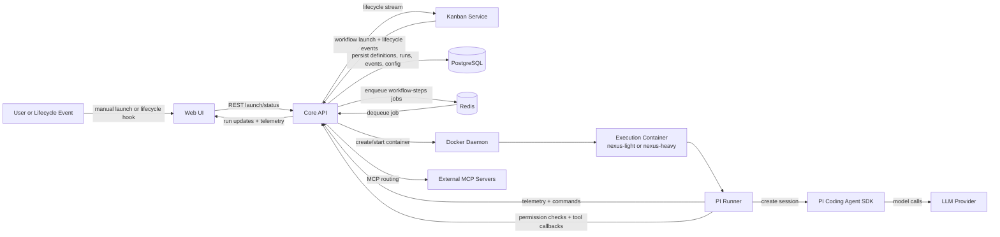
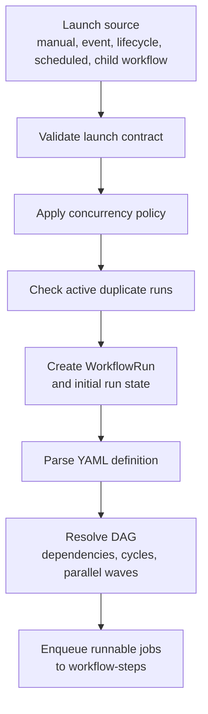
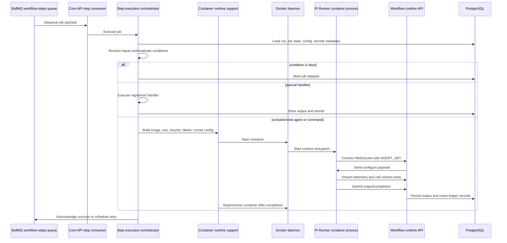
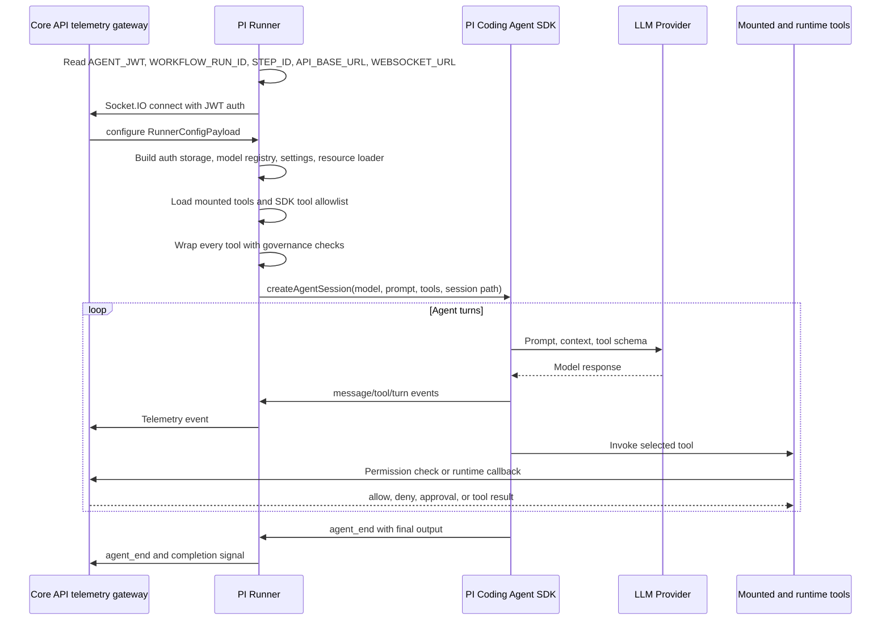
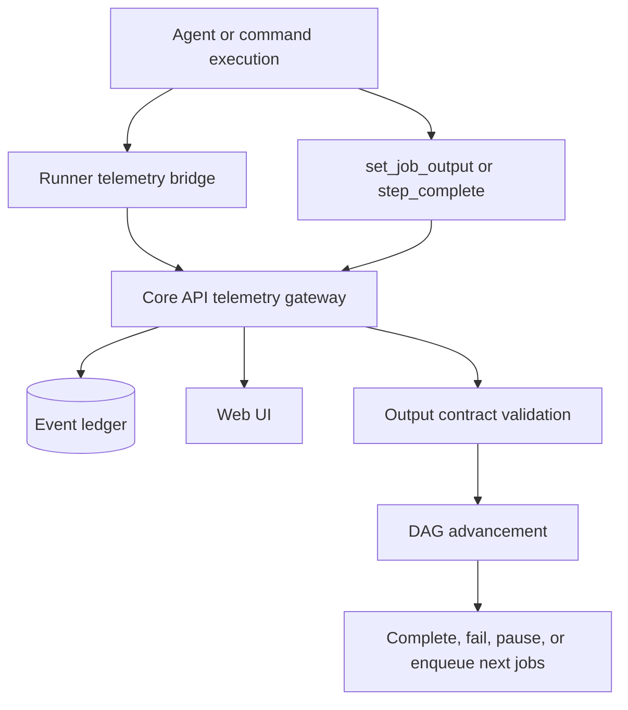
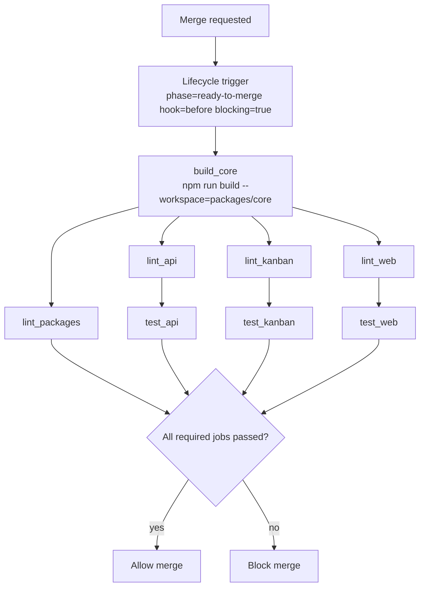

# 39 - Workflows to PI Runner

> **Scope note:** This end-to-end walkthrough uses the **PI engine** as the example execution path. The execution layer is now engine-pluggable — see [41 — Harness Runtime](41-harness-runtime.md) for selection, SPI, and credentials.

This guide explains the end-to-end path from a Nexus workflow definition to the harness engine process inside a Docker execution container. It is intended as a standalone map of how workflow YAML becomes queued work, how queued work becomes a container, how the container talks back to Nexus, and which platform services are involved.

---

## Mental Model

A workflow is the orchestration plan. The API parses it, turns its jobs into a directed acyclic graph, and schedules runnable jobs onto Redis-backed BullMQ queues. Step execution workers dequeue those jobs, decide whether they should run as special API-side operations or containerized agent work, and use Docker to start the right runtime image. For agent work, the container runs the selected harness engine (PI in this example), which creates an AI agent session, exposes allowed tools, streams telemetry, and sends completion output back to the API.

The important split is:

| Layer                             | What it owns                                                                   | Why it exists                                                    |
| --------------------------------- | ------------------------------------------------------------------------------ | ---------------------------------------------------------------- |
| Workflow definition               | Trigger, jobs, dependencies, permissions, output contract                      | Describes desired work declaratively and in version control      |
| Workflow engine                   | Parsing, validation, DAG resolution, run state, launch paths                   | Turns workflow definitions into executable run state             |
| Step execution                    | Queue consumption, retry policy, special handler dispatch, container lifecycle | Isolates execution from orchestration and supports parallel work |
| Workflow runtime API              | Agent-facing tools, output submission, capability execution, artifacts         | Gives containers a governed way to interact with Nexus state     |
| Harness engine (PI / Claude Code) | Agent session, model/provider setup, tool wrapping, telemetry bridge           | Adapts Nexus execution config to the agent SDK inside Docker     |

---

## End-to-End Architecture



The Core API is the control plane. Docker containers and PI Runner are the execution plane. Redis decouples scheduling from execution. PostgreSQL stores durable state. WebSocket and HTTP carry runtime communication between the runner and the API.

---

## Runtime Services Involved

| Service              | Role in workflow execution                                                                                | Communication pattern                         |
| -------------------- | --------------------------------------------------------------------------------------------------------- | --------------------------------------------- |
| Core API             | Parses workflows, launches runs, consumes step jobs, starts containers, validates outputs, records events | REST, WebSocket, SQL, Redis, Docker API       |
| PostgreSQL           | Durable store for workflow definitions, workflow runs, event ledger, secrets, AI config, tool metadata    | SQL from API and Kanban services              |
| Redis                | BullMQ queue backing store and pub-sub/event broadcast transport                                          | Redis protocol from API and Kanban services   |
| Docker daemon        | Starts and stops per-step execution containers using `nexus-light:latest` or `nexus-heavy:latest`         | Docker API from Core API                      |
| PI Runner            | Container-side runtime bridge for agent jobs and direct command execution endpoints                       | Socket.IO and HTTP with Core API              |
| LLM providers        | Execute model inference for agent sessions                                                                | HTTPS from PI coding agent SDK/runtime        |
| Web UI               | Launches workflows and displays live run/step telemetry                                                   | REST and WebSocket with Core API              |
| Kanban Service       | Launches workflows for domain lifecycle work and receives neutral lifecycle stream events                 | REST/internal auth and lifecycle event stream |
| External MCP servers | Provide external tools that agents can invoke through Nexus routing                                       | MCP over HTTP/stdio via API-side runtime      |

---

## Workflow Definition Anatomy

A workflow YAML file declares when it runs, what permissions it has, and which jobs should execute. The selected pre-merge CI workflow is a good minimal example:

```yaml
workflow_id: pre_merge_ci
name: Pre-Merge CI

trigger:
  type: lifecycle
  phase: ready-to-merge
  hook: before
  blocking: true

permissions:
  allow_tools: [bash, read]
  deny_tools: []

jobs:
  - id: build_core
    type: run_command
    tier: light
    inputs:
      command: npm run build --workspace=packages/core
      working_dir: "{{ trigger.payload.workspace }}"

  - id: lint_api
    type: run_command
    tier: light
    depends_on: [build_core]
    inputs:
      command: npm run lint:api
      working_dir: "{{ trigger.payload.workspace }}"
```

Key fields:

| Field         | Meaning                                                                                                      |
| ------------- | ------------------------------------------------------------------------------------------------------------ |
| `workflow_id` | Stable identifier used by launch paths, seed data, repository workflows, and event bindings                  |
| `trigger`     | Describes how the workflow starts: manual, event, scheduled, webhook, or lifecycle                           |
| `permissions` | Declares tool policy for the workflow, such as allowing `bash` and `read` only                               |
| `jobs`        | Defines the executable units in the workflow DAG                                                             |
| `depends_on`  | Declares job dependencies used by the DAG resolver                                                           |
| `type`        | Selects execution behavior, such as agent execution, command execution, event emission, or a special handler |
| `tier`        | Selects runtime class, usually `light` or `heavy`                                                            |
| `inputs`      | Supplies job-specific data, often with Handlebars templates resolved from trigger/run context                |

---

## Jobs, Steps, and Special Handlers

Nexus documentation and code use both jobs and steps. At the workflow YAML level, jobs are the primary DAG nodes. A job may contain nested steps for agent-style work, but many workflows use one executable job per DAG node.

| Concept          | Description                                                                                                  | Execution location                                                  |
| ---------------- | ------------------------------------------------------------------------------------------------------------ | ------------------------------------------------------------------- |
| Job              | DAG node with ID, type, dependencies, inputs, tier, permissions, and retry policy                            | API queue consumer decides execution path                           |
| Agent step       | AI work performed by an agent in a Docker container                                                          | PI Runner inside `nexus-light` or `nexus-heavy`                     |
| Special job/step | Predefined API-side operation such as event emission, webhook, MCP call, git operation, or command execution | Core API handler or PI Runner command endpoint depending on handler |
| Output contract  | Required/optional fields a job must produce before DAG advancement                                           | API validates before marking job complete                           |

Special handlers exist because not every workflow action needs an autonomous agent. A CI command, webhook call, lifecycle event, or child workflow invocation should be deterministic and direct. Agent containers are used when the work benefits from model reasoning, iterative tool use, or a full runtime workspace.

---

## Launch and DAG Resolution



The workflow engine validates trigger input before any work starts. It then persists a workflow run, resolves job dependencies, detects cycles, and identifies the first executable wave. Jobs with no unmet dependencies are queued into BullMQ. Jobs in the same wave can run in parallel up to queue and worker concurrency limits.

Lifecycle workflows, such as pre-merge gates, follow the same engine path as manual or event workflows. Their trigger payload carries the workspace and lifecycle metadata, and a blocking lifecycle hook waits for the workflow outcome before allowing the caller to continue.

---

## Step Execution Pipeline



The step execution layer is responsible for turning a queued job into a concrete execution. It resolves AI configuration, workspace mounts, skill mounts, prompt files, tool allowlists, and runtime environment variables. For containerized jobs, it labels containers with Nexus metadata so cancellation and cleanup can find them later.

---

## PI Runner Runtime Flow

PI Runner starts inside an execution container. Its job is to translate Nexus runner configuration into a PI coding agent SDK session and bridge that session back to the API.



The runner has three important boundaries:

| Boundary        | Responsibility                                                                                                      |
| --------------- | ------------------------------------------------------------------------------------------------------------------- |
| API to runner   | The API sends authenticated configuration and receives telemetry, completion, tool callbacks, and command responses |
| Runner to SDK   | The runner creates and supervises the agent session, tools, auth storage, model registry, and session file          |
| Runner to tools | The runner exposes allowed SDK-native and mounted tools, with governance checks before execution                    |

---

## Communication Channels

| Channel                | Used by                                     | Purpose                                                                     | Why this channel                                                     |
| ---------------------- | ------------------------------------------- | --------------------------------------------------------------------------- | -------------------------------------------------------------------- |
| HTTP REST              | Web UI, Kanban, PI Runner, Core API         | Launch workflows, call runtime endpoints, check permissions, callback tools | Synchronous request/response with auth and validation                |
| WebSocket/Socket.IO    | PI Runner, Web UI, Core API                 | Runner configuration, telemetry streaming, command relay, live UI updates   | Low-latency bidirectional events during long-running work            |
| BullMQ on Redis        | Core API workflow engine and step consumers | Queue executable workflow jobs                                              | Durable async work distribution with retries and concurrency control |
| Redis pub-sub          | API listeners and live status subscribers   | Broadcast workflow lifecycle/status changes                                 | Fast fan-out without blocking workflow progression                   |
| SQL/PostgreSQL         | API and Kanban                              | Persist definitions, runs, event ledger, config, secrets, projections       | Durable source of truth and queryable history                        |
| Docker API             | Core API container runtime                  | Create, stop, label, and clean up execution containers                      | Isolated runtime per workflow job                                    |
| HTTPS to LLM providers | PI coding agent SDK/runtime                 | Model inference                                                             | Provider-native AI execution                                         |
| MCP                    | API and external tool servers               | Tool discovery and invocation                                               | Standardized external tool protocol                                  |

---

## Runner Configuration and Injection

Before a container starts, the API builds the runner execution context. That context is split across environment variables, mounted files, and a WebSocket `configure` payload.

| Configuration source   | Examples                                                                                                                                  | Consumer                                   |
| ---------------------- | ----------------------------------------------------------------------------------------------------------------------------------------- | ------------------------------------------ |
| Environment variables  | `AGENT_JWT`, `STEP_ID`, `JOB_ID`, `WORKFLOW_RUN_ID`, `API_BASE_URL`, `WEBSOCKET_URL`, `SESSION_PATH`, `EXTENSIONS_PATH`, `WORKSPACE_PATH` | PI Runner startup code                     |
| Mounted workspace      | Repository or generated workspace path                                                                                                    | Agent tools and SDK file operations        |
| Mounted extensions     | Tool manifests, mounted tool handlers, `_sdk_tool_allowlist.json`, `_host_mount_scope.json`                                               | PI Runner session factory                  |
| Configure payload      | Provider, model, prompt, auth material, tool config, run context                                                                          | PI Runner WebSocket client/session factory |
| Database-backed config | Agent profiles, model defaults, provider secrets, workflow definitions                                                                    | Core API before container startup          |

AI config resolution follows the platform precedence chain: workflow step override, agent profile, database default model, then environment fallback. The **harness engine** is selected on the same precedence chain (step → agent profile → scoped default → platform → `pi` fallback). Provider credentials are resolved API-side from encrypted secrets and delivered to the engine via the `configure` handshake — not via container environment variables.

---

## Tool Governance and Permissions

Workflows can restrict tools through `permissions.allow_tools` and `permissions.deny_tools`. Agent profiles and capability governance can further shape what an agent may use. The runner enforces the final tool set in two ways.

First, the API writes allowlists and host mount scope manifests into the mounted extensions directory. PI Runner reads these files when constructing SDK-native and mounted tools. This controls which tools exist in the agent session.

Second, PI Runner wraps each exposed tool with a governance check. Before execution, the wrapper calls the API runtime permission endpoint with the tool name, arguments, workflow run ID, and job ID. The API can allow, deny, or require approval. Denied tools do not execute.

For the pre-merge CI example, the workflow declares only `bash` and `read`. That is appropriate because the workflow needs to run repository commands and inspect files, but should not grant broad write/edit capability for a merge gate.

---

## Telemetry, Output, and Completion



Telemetry is observational. It records turns, messages, tool starts, tool updates, tool ends, and final agent events so operators can see what happened. Completion is authoritative. A job advances only after the API receives a valid completion signal and validates the output contract.

The output contract protects downstream jobs from ambiguous agent results. If a job requires fields such as `summary`, `status`, or `decision`, the API validates those fields before marking the job complete. If validation fails, retry policy may re-run the job with a stricter retry prompt.

---

## Failure, Retry, and Repair

Failures can occur at several layers:

| Layer                | Example failure                                                   | Handling                                                |
| -------------------- | ----------------------------------------------------------------- | ------------------------------------------------------- |
| Workflow parsing     | Invalid YAML, unknown job dependency, cyclic DAG                  | Reject launch or fail run before execution              |
| Queue execution      | BullMQ attempt failure, worker crash                              | BullMQ retry/backoff and failed-job handling            |
| Container runtime    | Docker start failure, timeout, non-zero exit                      | Retry if retryable, mark failed if terminal             |
| Runner configuration | Missing provider credential, invalid model config, mount mismatch | Fail fast with diagnostics and event ledger records     |
| Tool execution       | Missing required tool, denied permission, callback failure        | Required-tool retry, governance denial, or step failure |
| Output validation    | Missing required output fields                                    | Retry with retry prompt or fail after max retries       |
| Provider interaction | Rate limit, overload, invalid auth                                | Provider-specific retry/backoff or terminal failure     |

When a job fails, the system classifies whether the failure is retryable. Built-in BullMQ attempts, job-level `max_retries`, provider overload retry, required-tool retry, and output-contract retry all run before a terminal failure. Terminal failures can feed workflow repair and observability paths for diagnosis or autonomous repair.

---

## Pre-Merge CI Walkthrough

The selected `pre_merge_ci` workflow is a lifecycle gate that blocks merge until repository checks pass.



This workflow uses `run_command` jobs rather than full autonomous agent jobs. It still uses the same workflow engine, DAG resolver, run persistence, queueing, and lifecycle status model. Because each job has `tier: light`, the execution layer can select the lighter runtime image and avoid unnecessary heavy browser/agent capabilities. The `depends_on` graph makes `build_core` the prerequisite for all lint jobs, and each unit test job waits only for the corresponding lint job.

Why this design works for a merge gate:

| Design choice                           | Reason                                                                           |
| --------------------------------------- | -------------------------------------------------------------------------------- |
| Lifecycle trigger with `blocking: true` | The caller can treat the workflow result as a merge decision                     |
| `run_command` jobs                      | CI commands are deterministic and do not need model reasoning                    |
| `build_core` first                      | Apps and packages depend on shared core contracts                                |
| Parallel lint jobs                      | Independent checks can run concurrently after core builds                        |
| Tests after lint                        | Avoids spending heavy test time when a workspace already fails basic lint checks |
| Narrow permissions                      | The gate needs command execution and reading, not arbitrary editing              |

---

## Why the Architecture Is Split This Way

Nexus separates orchestration from execution to keep workflow state reliable and runtime work isolated. The API owns definitions, state transitions, policy, persistence, and lifecycle events. Redis queues let the API schedule work asynchronously and retry safely. Docker gives each job a clean execution boundary. PI Runner keeps container-side agent integration out of the API process while preserving API-side governance through callbacks and permission checks.

This split also lets simple deterministic jobs and complex agent jobs share one workflow model. A workflow can run shell commands, emit events, call MCP tools, launch child workflows, and invoke AI agents without changing the launch, DAG, queue, lifecycle, or telemetry model.

---

## Where Next

- [41 — Harness Runtime](41-harness-runtime.md): Runtime SPI, engine selection, credential delivery, and pluggable engine registry
- [03 - Container Architecture](03-container-architecture.md): Full service/container view
- [04 - Service Communication](04-service-communication.md): HTTP, WebSocket, Redis, BullMQ, MCP, and ACP details
- [06 - Workflow Engine](06-workflow-engine.md): YAML parsing, DAG resolution, launch paths, and state machine
- [07 - Workflow Step Execution](07-workflow-step-execution.md): Queue consumer, container execution, retry policy, and special handlers
- [08 - Workflow Runtime](08-workflow-runtime.md): Agent-facing runtime capabilities and output protocol
- [28 - PI Runner](28-pi-runner.md): Runner internals, session factory, telemetry bridge, and tool wrapping
- [38 - Repository Workflows](38-repository-workflows.md): Repository-owned lifecycle workflows and merge gates
