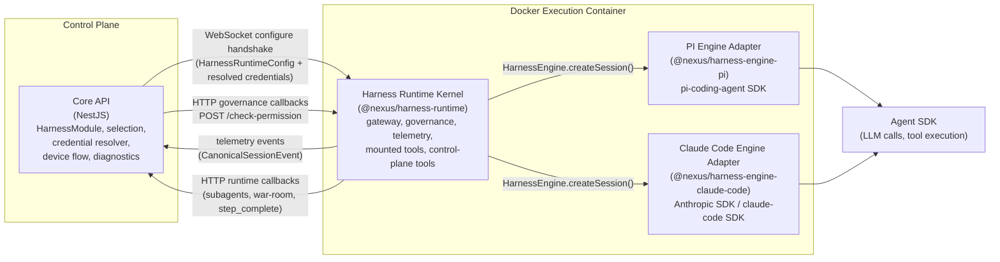

# 41 — Harness Runtime

> The harness runtime is the pluggable execution layer that replaced the previously hardcoded pi-runner. Engines are selected per step and conform to a single SPI (`HarnessEngine`). PI (`@nexus/harness-engine-pi`) and Claude Code (`@nexus/harness-engine-claude-code`) are the two built-in engines. See `28-pi-runner.md` and `39-workflows-to-pi-runner.md` for PI-engine-specific internals.

---

## Overview & Motivation

Before Phase 1 of EPIC-196, `@nexus/pi-runner` was the sole execution mechanism for all agent steps: the API hardcoded PI as the runtime and every container shipped PI internals. Phase 1 introduced `HarnessEngine` as the SPI and split the package into a generic kernel (`@nexus/harness-runtime`) and two engine adapters (`@nexus/harness-engine-pi`, `@nexus/harness-engine-claude-code`). Phase 2 completed credential delivery, OAuth device flow, scoped defaults, and provider compatibility.

The non-negotiable design principle: **mechanisms are generic — a harness declares what it needs and the platform resolves it.** PI and Claude Code are consumers of the same generic machinery; neither is special-cased in core/API code paths. Any future engine gains credential resolution, governance, subagents, and war-room for free by implementing the SPI.

Cross-links: [06-workflow-engine.md](06-workflow-engine.md) (DAG, launch, state machine) · [07-workflow-step-execution.md](07-workflow-step-execution.md) (container lifecycle, retry policy).

---

## C4 Container Diagram



The `configure` WebSocket handshake is the **only** channel for resolved secrets. Docker containers receive non-secret routing configuration via env vars; secrets are never injected as environment variables.

---

## HarnessEngine SPI & HarnessSession

The SPI is defined in `packages/harness-runtime/src/engine/harness-engine.ts`. It is intentionally narrow: the kernel handles governance, telemetry, subagents, war-room, and step completion — an engine only needs to wire its SDK.

```typescript
export interface HarnessEngine {
  readonly id: HarnessId;
  readonly capabilities: HarnessCapabilities;

  /** Validate config + harnessOptions before any container side effects. */
  validate(config: HarnessRuntimeConfig): ValidationResult;

  /** Create a live session. The engine wires governance + tools per its toolModel. */
  createSession(
    config: HarnessRuntimeConfig,
    ctx: HarnessSessionContext,
  ): Promise<HarnessSession>;

  /** One-off command execution (gated by capabilities.executionModes ∋ "command"). */
  executeCommand?(req: CommandExecRequest): Promise<CommandExecResult>;
}

export interface HarnessSession {
  prompt(message: string): Promise<void>;
  abort(): Promise<void>;
  subscribe(onEvent: (event: CanonicalSessionEvent) => void): () => void;
  dispose(): Promise<void>;
}
```

`HarnessSessionContext` carries a **dual tool model**: `governedTools` (pre-wrapped `CanonicalToolDefinition[]` for `execute_wrapped` engines like PI) and `toolCatalog` + `checkPermission` (raw specs + governance hook for `permission_callback` engines like Claude Code). Both paths terminate at the same `POST /api/workflow-runtime/check-permission` endpoint, so governance behavior is identical across engines.

Transport types: `kernel` (the harness-runtime process running inside a Docker container managed by the API) and `external` (a remotely hosted engine reached via HTTP, such as a BYO custom engine endpoint). The transport determines how the validate probe and launch path operate.

Cross-links: [docs/specs/EPIC-196-pluggable-harness/02-runtime-kernel-and-spi.md](../specs/EPIC-196-pluggable-harness/02-runtime-kernel-and-spi.md) (SPI source design) · [31-packages.md](31-packages.md) (package inventory).

---

## Built-in Engines & Registry

| Engine      | npm package                         | `harness_id`  | Tool model            | `compatibleProviderIds` | Supported auth types        |
| ----------- | ----------------------------------- | ------------- | --------------------- | ----------------------- | --------------------------- |
| PI          | `@nexus/harness-engine-pi`          | `pi`          | `execute_wrapped`     | _(none — accepts any)_  | `api_key`, `oauth_authcode` |
| Claude Code | `@nexus/harness-engine-claude-code` | `claude-code` | `permission_callback` | `["anthropic"]`         | `api_key`, `oauth_device`   |

The `HarnessProviderRegistryService` (in `apps/api/src/harness/harness-provider-registry.service.ts`) discovers built-in engines at startup and also loads DB-backed `harness_definition` rows for any custom engines registered via the API. Custom engines use `harness_id` prefixed `custom:*`. All engines — built-in and custom — go through the same selection, credential resolution, and validate machinery.

---

## Selection Precedence

Harness (and the cohesive `(harness, model, provider)` triple) is resolved in this exact order:

1. **Step override** — `steps[].inputs.model` / `provider` / `agent_profile` in the workflow YAML
2. **Agent profile** — the harness setting on the agent profile record in DB
3. **Scoped/project default** — `scoped_ai_default` row resolved by `ScopedAiDefaultResolver` walking the scope hierarchy from the most-specific scope node (e.g., a work-item) up through project → platform (`NULL` scope)
4. **Platform default** — the `scoped_ai_default` row with `scope_node_id = NULL`
5. **Fallback** — `pi` (always available, accepts any provider)

`ScopedAiDefaultResolver` plugs the scope-walk result into the existing precedence slots so the entire `(harness, model, provider)` triple is resolved cohesively — an incompatible combination is caught before reaching the container.

Cross-link: [12-ai-config.md](12-ai-config.md) (combined precedence, `#combined-precedence`).

---

## Harness ↔ Provider Compatibility

Engines declare compatibility via `HarnessCapabilities`:

```typescript
compatibleProviderIds?: string[]; // when set, only these providers are valid
defaultProviderId?: string;       // preferred provider for this harness
```

If the resolved provider is **not** in `compatibleProviderIds`, the selection layer falls back to `defaultProviderId` (or the harness's first compatible provider) and emits a `harness.selection.fallback` diagnostic event. The invariant: **incompatible combinations never reach container runtime**.

- **PI** sets no `compatibleProviderIds` — accepts any configured provider.
- **Claude Code** sets `compatibleProviderIds: ["anthropic"]` — only Anthropic is valid.

---

## Credential Model

A harness declares its credential requirements; operators bind them per scope. The type lives in `@nexus/core`.

### `HarnessCredentialRequirement` fields

| Field         | Type                | Description                                                                                      |
| ------------- | ------------------- | ------------------------------------------------------------------------------------------------ |
| `key`         | `string`            | Stable id within the harness, e.g. `"anthropic"`                                                 |
| `displayName` | `string`            | Human label, e.g. `"Anthropic API Key / OAuth"`                                                  |
| `authTypes`   | `HarnessAuthType[]` | Which auth methods satisfy this requirement                                                      |
| `primary?`    | `boolean`           | When `true`, populates `HarnessRuntimeConfig.model.auth` (default: `true` when sole requirement) |
| `optional?`   | `boolean`           | When `true`, an unbound requirement does not block launch                                        |

```typescript
type HarnessAuthType = "api_key" | "oauth_device" | "oauth_authcode";
```

### `harness_credential_binding` table

| Column                     | Type            | Notes                                       |
| -------------------------- | --------------- | ------------------------------------------- |
| `id`                       | `uuid` PK       |                                             |
| `scope_node_id`            | `uuid` NULL     | `NULL` = platform/global                    |
| `harness_id`               | `text` NOT NULL |                                             |
| `credential_key`           | `text` NOT NULL | Matches `HarnessCredentialRequirement.key`  |
| `auth_type`                | `text` NOT NULL | `api_key \| oauth_device \| oauth_authcode` |
| `secret_id`                | `uuid` NOT NULL | Foreign key → `secret_store(id)`            |
| `created_at`, `updated_at` |                 |                                             |

**UNIQUE** `(scope_node_id, harness_id, credential_key)` — one binding per requirement per scope.

For a selected harness + requirement, `HarnessCredentialResolverService` walks from the most-specific scope node up to ancestors and then platform (`NULL` scope), using the first binding found. A required-but-unbound credential produces a clear launch error before any container starts.

Cross-links: [12a-secret-provider-setup.md](12a-secret-provider-setup.md) (binding UI, device flow) · [19-security.md](19-security.md) (secret store, AES-256-GCM).

---

## Secure Handshake Delivery

Credentials are resolved API-side and delivered exclusively over the **WebSocket `configure` handshake** (`HarnessRuntimeConfig`). The mapping is:

- The `primary` credential → `HarnessRuntimeConfig.model.auth` (the existing `api_key` or `oauth` shape already consumed by engines)
- Non-primary credentials → `harnessOptions.credentials: Record<string, ResolvedCredential>`

**Hard guarantee: resolved secrets are NEVER container environment variables and never appear in `docker inspect` or process listings.** Only non-secret configuration (e.g., `defaultEnv` routing values) flows as container env — a pattern that is unchanged from the original pi-runner.

A required credential that has no binding at any scope level produces a clear, actionable launch error (`harness.launch.credential_unbound`) recorded in the event ledger. The container is never started in this case.

Cross-link: [19-security.md](19-security.md) (delivery guarantee, secret store).

---

## OAuth Device Flow (RFC 8628)

A generic `DeviceFlowService` drives all device-flow interactions, parameterized entirely by the harness/provider-declared `OAuthDeviceConfig`. No harness-specific flow code exists.

```typescript
interface OAuthDeviceConfig {
  deviceAuthorizationUrl: string; // RFC 8628 device authorization endpoint
  tokenUrl: string;
  clientId: string;
  scopes?: string[];
}
```

### Endpoints

| Method | Path                                                                 | Description                                                                                                                    |
| ------ | -------------------------------------------------------------------- | ------------------------------------------------------------------------------------------------------------------------------ |
| `POST` | `/api/harness/:harnessId/credentials/:key/device-flow`               | Start device flow; returns `{ deviceFlowId, userCode, verificationUri, verificationUriComplete?, intervalSeconds, expiresAt }` |
| `GET`  | `/api/harness/:harnessId/credentials/:key/device-flow/:deviceFlowId` | Poll status; returns `{ status: "pending" \| "complete" \| "expired" \| "denied" }`                                            |

Flow: the UI displays `userCode` + `verificationUri`; the user authorizes externally; the server polls `tokenUrl` on `intervalSeconds` honouring `slow_down` / `authorization_pending` responses; on success the server mints a `secret_store` secret and upserts a `harness_credential_binding` with `auth_type = oauth_device`. In-progress flow state is persisted in the `device_flow_session` table.

Claude Code is the first consumer, declaring Anthropic's device and token endpoints. Any future harness gains device flow by declaring `OAuthDeviceConfig` — zero new flow code is required.

Cross-link: [12a-secret-provider-setup.md](12a-secret-provider-setup.md) (device-flow UI modal).

---

## Custom Harness Registration (`custom:*`)

Custom engines are registered by creating a `harness_definition` row via `POST /api/harness`. The `harness_id` must be prefixed `custom:*`. Custom engines go through exactly the same selection-precedence, credential-resolution, compatibility-check, and validate-probe machinery as built-in engines — there is no separate code path.

For the full registration payload schema and operator procedures, see [operator-playbook.md](../specs/EPIC-196-pluggable-harness/operator-playbook.md). This guide intentionally does not duplicate the payload definition.

---

## Conformance Suite (C1–C10)

Every engine — built-in or custom — must pass the shared, harness-parameterized conformance suite before it can be marked shippable.

| #   | Conformance case    | Asserts                                                                                                                           |
| --- | ------------------- | --------------------------------------------------------------------------------------------------------------------------------- |
| C1  | Governance allow    | `check-permission` `allowed` → tool executes; `tool_execution_start/end` emitted                                                  |
| C2  | Governance deny     | `denied` → tool not executed; error surfaced to model; `isError` end event                                                        |
| C3  | Governance approval | `approval_required` resolved-to-allow → tool executes; resolved-to-deny → blocked                                                 |
| C4  | Telemetry vocab     | Exact event names + payload schemas; `turn_end.output.{ok,response,stopReason}` populated                                         |
| C5  | Subagent round-trip | `spawn_subagent_async` → `*_result`; `wait_for_subagents`; `check_subagent_status`                                                |
| C6  | War-room round-trip | open/post/blackboard/signoff/state/close event+result cycle                                                                       |
| C7  | Step completion     | `step_complete` validated by completion guard; remediation prompt on missing fields                                               |
| C8  | Abort / dehydrate   | `abort` stops the turn; `dehydrate` acks `dehydrated`                                                                             |
| C9  | Auth types          | Each declared `supportedAuthTypes` produces a working session (mocked provider)                                                   |
| C10 | Capability honesty  | Declared capabilities match observed behavior (e.g. `supportsBranching` engine branches; non-supporting engine is never asked to) |

Suite location: `packages/harness-runtime/test/conformance/`. CI gate: a harness cannot be merged as built-in or shippable until its conformance run is fully green.

Cross-link: [07-observability-conformance-testing.md](../specs/EPIC-196-pluggable-harness/07-observability-conformance-testing.md) (case detail, PI golden-path regression, telemetry parity assertions).

---

## Harness Contributions

Contributions are an author-facing customization layer — declared in agent profiles, workflow steps, or skill bundles — that let operators attach **hooks** (lifecycle shell commands), **extensions** (MCP servers), and **settings** (env, permissions, outputStyle) to a session without modifying engine internals. Support is harness-capability-gated: the kernel's `applyContributions` helper dispatches only through materializer interfaces the engine implements **and** its `HarnessCapabilities` admit.

| Capability           | PI (`pi`) | Claude Code (`claude-code`) |
| -------------------- | --------- | --------------------------- |
| `supportsHooks`      | `true`    | `true`                      |
| `supportsExtensions` | `true`    | `true`                      |
| `supportsSettings`   | `false`   | `true`                      |

**PI** materializes contributions natively. **Hooks** are emitted as a generated PI extension module (a `.ts` default-export factory written into the session's extensions dir, which the engine already loads via jiti): `pre_tool_use` maps to the `tool_call` event (which **can block** when the command exits non-zero), `post_tool_use` to `tool_result`, and `session_start`/`session_end`/`user_prompt_submit` to `session_start`/`session_shutdown`/`before_agent_start`. **Extensions** (MCP servers) are bridged engine-side because PI has no MCP client: each server is connected with `@modelcontextprotocol/sdk`, its tools enumerated, and each tool registered through PI's existing governed-tool path (`wrapToolWithGovernance` → `ctx.checkPermission`, job ∩ profile), so author tools are gated exactly like Claude Code and cannot widen the surface past the profile ceiling — and bridged clients are disposed on session teardown. **Settings** stay unsupported (`supportsSettings: false`): `env` is already applied at the container level and `outputStyle`/`permissions` have no faithful PI mapping. An empty contribution bundle writes no extension file and bridges no servers, so PI behavior is byte-identical to pre-contribution.

**Claude Code** materializes contributions programmatically in `createSession` (Phase 3): hooks map to SDK callback events, extensions merge into `mcpServers`, and settings apply to `permissions`/`outputStyle`/`env`. Extension-provided MCP tools are still gated by `ctx.checkPermission` (job ∩ profile) — contributions cannot widen the tool surface beyond the profile ceiling. Pure converters in `packages/harness-engine-claude-code/src/contribution-sdk-mappers.ts` map each neutral fragment to its SDK shape:

```jsonc
// Authored (neutral HarnessContributions)        →  SDK query({ options })
{
  "hooks": [
    { "event": "pre_tool_use", "matcher": "Bash", "command": "./audit.sh" },
  ],
  // → options.hooks = { PreToolUse: [{ matcher: "Bash", hooks: [<cb>] }] }
  //   <cb> runs ./audit.sh bounded by timeoutMs (default 30s), output never logged

  "extensions": [
    {
      "name": "fs",
      "transport": "stdio",
      "command": "mcp-fs",
      "args": ["--root", "/w"],
    },
  ],
  // → options.mcpServers.fs = { type: "stdio", command: "mcp-fs", args: ["--root", "/w"] }
  //   merged ALONGSIDE nexus-kernel-tools; its tools still pass canUseTool → checkPermission

  "settings": { "outputStyle": "concise", "env": { "FOO": "bar" } },
  // → options.settings = { outputStyle: "concise" }  and  options.env += { FOO: "bar" }
}
```

An **empty** bundle (`EMPTY_HARNESS_CONTRIBUTIONS`) adds no keys — `query({ options })` is byte-identical to the no-contribution path (locked by a regression test).

Cross-link: [`docs/superpowers/specs/2026-06-23-harness-native-contributions-design.md`](../superpowers/specs/2026-06-23-harness-native-contributions-design.md) (EPIC-210 full design).

### Authoring harness contributions

Contributions can be authored on three surfaces, resolved by precedence
**step → profile → skill → platform** (highest first) at runtime-config assembly
(`buildStepRunnerConfigPayloadCore` for steps, the subagent container-config
operation for subagents). Each authored block is validated against
`HarnessContributionsInputSchema`; an invalid or capability-unsupported block is
**dropped with a `harness_contribution_dropped` ledger diagnostic**, never a hard
failure.

| Surface     | Where authored                                | How                                                        |
| ----------- | --------------------------------------------- | ---------------------------------------------------------- |
| **Profile** | Agent profile `harness_contributions` (jsonb) | Web: Agent → System & Provenance → "Harness Contributions" |
| **Step**    | Workflow step `inputs.harness_contributions`  | YAML: under a step's `inputs`                              |
| **Skill**   | Skill bundle `metadata.contributions`         | Skill metadata                                             |

Hooks and extensions concatenate (de-duplicated by event+matcher+command and by
extension name); settings deep-merge with the higher-precedence source winning
per key. Extensions must be transport-coherent — `transport: "stdio"` requires a
`command`, `transport: "http"` requires a `url` — or the input schema rejects
them.

Worked example — a profile that installs an MCP server and a `SessionStart` hook:

```jsonc
{
  "hooks": [{ "event": "session_start", "command": "./bootstrap.sh" }],
  "extensions": [
    {
      "name": "fs",
      "transport": "stdio",
      "command": "mcp-fs",
      "args": ["--root", "/workspace"],
    },
  ],
  "settings": { "outputStyle": "concise" },
}
```

On a **Claude Code** step this materializes natively (the hook fires at session
start; the MCP server's tools become available, still gated by the profile tool
ceiling). On a **PI** step the hook and the MCP extension also materialize
natively (the hook becomes a generated extension module; the MCP server is
bridged into governed tools); only `settings` is dropped with a diagnostic
(`settings_unsupported`), since PI declares `supportsSettings: false`.

A workflow step override (highest precedence) looks like:

```yaml
- id: my_step
  type: agent
  inputs:
    harness_contributions:
      settings:
        outputStyle: concise
```

> **Author-trust boundary.** A hook `command` is **author-provided shell
> executed inside the container** at the same trust level as authoring the
> profile/step/skill itself — there is no additional sandbox. Each command is
> bounded by `timeoutMs` (default 30s, hard ceiling enforced by the engine) and
> its output is **never logged**. Extension `env`/`headers` may reference
> `secret_store` entries; never inline credentials. Treat contribution authoring
> as a privileged operation.

---

## Authoring your own harness assets (EPIC-211)

EPIC-210's contribution model let you attach hooks, extensions, and settings inline in a profile, step, or skill. EPIC-211 adds **persisted harness assets**: authored code units stored as immutable rows in the `harness_assets` table, referenced by id, and materialized engine-side at session creation. The same EPIC-210 `harness_contribution_dropped` diagnostic guards every step of the pipeline — an empty or unresolvable asset set produces behavior identical to pre-EPIC-211 (no staged files, no tool-set change).

### Where to author

Open the **Web app → Agent Profiles → select a profile → System & Provenance → Harness Asset Editor**. The structured editor supports:

- **Hook scripts** (`hook_script` kind) — pick an event (`pre_tool_use`, `post_tool_use`, `session_start`, `session_end`, `user_prompt_submit`), choose a language (`bash`, `node`, `python`), and write the source inline. Alternatively author a bare `command` string (EPIC-210 back-compat: the command is spliced inline at invocation time rather than staged as a file).
- **`ts-module` extensions** (`extension` kind) — write a TypeScript module that default-exports a PI `ExtensionFactory`. Provide the module source in `moduleSource`.
- **Attach-by-id** — pick any previously persisted asset from the picker and add it to `pluginRefs` or `extensionRefs` on the profile. Persisted assets are reusable across profiles and harnesses.

### Persistence model

When you author a hook script or extension in the editor and click **Save as reusable asset**, the Web app calls:

```
POST /api/harness/assets
{
  "kind": "hook_script" | "extension" | "plugin",
  "name": "my-asset",
  "version": "1.0.0",
  "source": { "kind": "authored" },
  "payload": { /* kind-specific fields */ }
}
```

The API validates the payload against the kind-specific Zod schema (e.g. `HarnessHookAssetSchema`, `HarnessExtensionAssetSchema`), serializes the normalized bundle, computes its **canonical checksum** (`computeAssetChecksum` — SHA-256 over UTF-8 bytes, prefixed `sha256:`), and writes an immutable `harness_assets` row. The returned `id` is then added to `pluginRefs` or `extensionRefs` on the profile.

**New version = new row.** Asset rows are immutable; modifying a script means creating a new asset and updating the reference on the profile. `GET /api/harness/assets?scopeNodeId=<id>` lists all assets in scope.

### How PI stages authored code

At session creation (`PiEngine.createSession`) the PI engine calls `stageContributions`, which:

1. **Hook scripts** — `stageHookScripts(stageDir, hooks)` writes each `script`-bearing hook to a deterministically-named file (`hook-<event>-<n>.<ext>`) under the session's staging directory, sets `0o700` permissions on POSIX, and returns a `Map<StagedHookKey, path>`. The generated PI hook-extension module invokes the file by its absolute path through the appropriate interpreter (`sh`, `node`, or `python3`) — never by string-splicing the source inline, so the invocation is injection-safe. `command`-mode hooks are not staged; they are handled inline by the existing `resolveHookCommand` path.

2. **`ts-module` extensions** — `stageExtensionAssets(extensionsPath, extensions)` writes each extension's `moduleSource` to a deterministically-named `.ts` file (`ext-<sanitized-id>-mod.ts`) under `ctx.extensionsPath`. PI's `DefaultResourceLoader` scans `extensionsPath` for `.ts` files (excluding `index.ts`) via jiti before the session starts, so the authored module is loaded natively alongside any other PI extensions.

3. **Cleanup** — on session `dispose()`, `cleanupStagedExtensions` and `cleanupStagedHooks` best-effort-delete every staged file. Containers are ephemeral so this is belt-and-suspenders hygiene.

**Hydration integrity** — before staging, `hydrateAssetReferences` re-runs `computeAssetChecksum` over each loaded bundle and compares against the stored value. A mismatch drops the asset with `reason: "checksum_mismatch"` and emits `harness_contribution_dropped` — tampered bytes are never staged.

Worked example — an authored `pre_tool_use` bash hook staged by PI:

```jsonc
// harness_contributions on an agent profile (after persisting the asset + adding ref):
{
  "hooks": [
    {
      "event": "pre_tool_use",
      "matcher": "Bash",
      "timeoutMs": 5000,
      "script": {
        "language": "bash",
        "source": "#!/usr/bin/env bash\necho \"tool: $NEXUS_TOOL_NAME\" >> /tmp/audit.log",
      },
    },
  ],
  "extensionRefs": [], // attach persisted extension assets here
}
```

At session creation PI writes the source to `<stageDir>/hook-pre_tool_use-0.sh` (mode `0o700`) and generates a hook-extension `.ts` file that invokes `sh <stageDir>/hook-pre_tool_use-0.sh` with a 5 s timeout on every `tool_call` event. Hook stdout/stderr is never logged.

### Capability gating

| Capability                  | PI (`pi`)                         | Claude Code (`claude-code`) |
| --------------------------- | --------------------------------- | --------------------------- |
| `supportsExtensionPackages` | `true`                            | `false`                     |
| `supportsPlugins`           | `false`                           | `true` _(S1-confirmed)_     |
| `supportedAssetSources`     | `["authored", "git", "registry"]` | `["authored", "git"]`       |

Assets whose kind is unsupported by the selected harness are **dropped with a `harness_contribution_dropped` ledger diagnostic** (reasons `plugins_unsupported` / `extension_packages_unsupported`) — never silently, never fatally. An empty resolved asset set produces byte-identical behavior to pre-EPIC-211.

### Claude Code plugin materialization (S1-confirmed)

Phase 3 spike S1 confirmed that the `@anthropic-ai/claude-agent-sdk` `Options` type exposes a first-class programmatic `plugins` field (`sdk.d.ts:1722–1736`) — no managed-settings file, marketplace network fetch, or `~/.claude` mutation required. The engine stages each plugin into a session-scoped directory and passes `options.plugins` directly into `sdk.query`.

**Staged layout** (under `<agentDir>/plugins/<plugin-name>/`):

```
<plugin-root>/
  .claude-plugin/
    plugin.json          # manifest — name is the only hard-required field
  hooks/
    hooks.json           # auto-loaded; keyed by SDK event name (PreToolUse, SessionStart, …)
  .mcp.json              # present only when the plugin declares MCP servers (may carry secrets)
```

**SDK option** (added alongside existing EPIC-210 options):

```ts
sdk.query({
  options: {
    // …existing EPIC-210 options unchanged…
    plugins: [{ type: "local", path: "/agent/plugins/<plugin-name>" }],
  },
});
```

**Plugin MCP governance.** Plugin-declared MCP servers surface as `mcp__<server>__<tool>` tool names and are gated by the session-wide `canUseTool` callback — the same `buildCanUseTool` → `ctx.checkPermission` path that governs kernel and author-extension tools. Plugin MCP does **not** go through `options.mcpServers`; it is declared in the staged `.mcp.json` and merged by the SDK plugin loader. The engine must **not** set `strictMcpConfig: true` or plugin MCP tools will be silently suppressed.

**Governance invariant.** Every tool regardless of origin (kernel MCP, author/extension MCP, plugin MCP, or plain plugin tool) is gated by `canUseTool` → `ctx.checkPermission`. A plugin cannot widen the tool surface past the job ∩ profile ceiling.

**SPI conformance.** `ClaudeCodeEngine` implements `PluginMaterializer` (`materializePlugins`) in addition to `HookMaterializer`, `ExtensionMaterializer`, and `SettingsMaterializer`. `isPluginMaterializer(new ClaudeCodeEngine()) === true`. The capability (`supportsPlugins: true`) and the SPI are in agreement — verified by the dedicated governance + conformance test suite (`test/claude-code-engine.plugins-governance.test.ts`).

**Disposal.** Each staged plugin directory is removed on session `dispose()` (best-effort via `rm({ recursive: true, force: true })`). Containers are ephemeral; this is belt-and-suspenders hygiene so `.mcp.json` secrets do not linger on a shared volume.

**`strictMcpConfig` / `settingSources` caution.** If `strictMcpConfig: true` is ever set, the SDK explicitly ignores plugin MCP config. `settingSources: []` would isolate filesystem settings but still honor `options.plugins`. Leave both unset (the engine's current state) for the standard plugin path.

### Author-trust boundary and security

Authored scripts and extension modules run inside the existing execution container **at the same trust level as the author of the profile or workflow step** — there is no additional sandbox. Key safety properties enforced by the implementation:

- **No inline logging.** Hook script source, extension `moduleSource`, and staged file contents are **never logged** by the API or harness engine.
- **No secret inlining.** Hook `env`/`headers` fields that need credentials must reference `secret_store` entries by id; the API resolves them server-side before delivery. Never inline credentials in `source`.
- **Injection-safe invocation.** Script-mode hooks are staged as files and invoked by path — not by splicing source into a shell string.
- **Bounded execution.** Each hook invocation is bounded by `timeoutMs` (default 30 s; hard ceiling enforced by the engine). A hook that times out does not kill the session.
- **Stricter isolation for imported/external code** (Phase 4) — importing from external sources (git repos, registries) adds provenance verification; per-phase plans are in `docs/superpowers/specs/2026-06-23-harness-plugins-extensions-design.md`.

Cross-link: [`docs/superpowers/specs/2026-06-23-harness-plugins-extensions-design.md`](../superpowers/specs/2026-06-23-harness-plugins-extensions-design.md) (EPIC-211 full design, phase plans).

---

## Importing harness assets from external sources

EPIC-211 Phase 4 adds the ability to import harness assets from external git repositories rather than authoring them inline. Imported assets follow the same persistence model as authored ones (an immutable `harness_assets` row with a `sha256:` checksum), but their source code is fetched, vetted, and persisted at import time — **there is no live network access at run time**.

### v1 supported sources

| Source kind | Supported types                      | Notes                                                                    |
| ----------- | ------------------------------------ | ------------------------------------------------------------------------ |
| `git`       | CC plugins (Phase 4a)                | Requires `git` on PATH in the `nexus-api` image (see Ops note).          |
| `git`       | PI `ts-module` extensions (Phase 4a) | Single-file extension modules only; multi-file packages are a follow-up. |

Registry (`registry`) and npm package sources are planned for a later phase.

### Import flow (git source)

```
POST /api/harness/assets/import/preview
{
  "source": {
    "kind": "git",
    "repo": "https://github.com/example/my-plugin",
    "ref": "abc123def456",       // pinned commit SHA — mutable refs (branch names) are refused
    "subdir": "plugin"           // optional: path within repo to the plugin root
  },
  "kind": "plugin"               // or "extension"
}
```

The preview endpoint:

1. **Fetches** the repo at the pinned `ref` via `git clone --depth=1` (the `nexus-api` container requires `git` on `PATH` — see [nexus-api image must include `git` on PATH](#operational-requirement-git-on-path)).
2. **Reads** the plugin manifest (`plugin.json`) or extension module.
3. **Vets** size (≤ 1 MB), file type, and denylist (no `.env`, no binary blobs).
4. **Computes** the canonical checksum: `computeAssetChecksum(bundle)` (SHA-256/UTF-8, `sha256:` prefix).
5. Returns a **preview** payload: the parsed manifest or module headers, the pinned ref, and the computed checksum.

To **confirm** the import (after the operator reviews the preview):

```
POST /api/harness/assets/import/confirm
{ "previewId": "<id returned by preview>" }
```

This persists the immutable `harness_assets` row. The returned `id` can then be added to `pluginRefs` or `extensionRefs` on a profile.

### Provenance and checksum guarantees

- Imported assets are **pinned to a commit SHA** at import time. Mutable refs (branch names, tags) are refused — the full 40-character commit SHA must be supplied.
- The `bundle` stored in `harness_assets` is the serialized asset exactly as fetched and vetted. The canonical checksum is computed once at import time and stored in `harness_assets.checksum`.
- At **hydration** (API-side, resolve time): `hydrateAssetReferences` re-runs `computeAssetChecksum(entity.bundle)` and drops on mismatch before the asset reaches the engine.
- At **staging** (engine-side, session creation time): a second re-verify runs immediately before any file is written. A mismatch drops the asset with `reason: "checksum_mismatch"` and emits `harness_contribution_dropped` — no file is ever written for a tampered asset.

These two verify passes are independent defensive layers: the first catches storage corruption or tampered DB rows; the second catches anything that survives hydration.

### Trust model (v1)

Both authored and imported assets run inside the existing execution container **at author trust** — there is no additional sandbox in v1. The difference between authored and imported is provenance tracking, not isolation:

| Property            | Authored                      | Imported (v1)                                |
| ------------------- | ----------------------------- | -------------------------------------------- |
| Origin              | Inline in profile/step/skill  | External git repo                            |
| Pinned ref          | N/A (baked at authoring time) | Commit SHA                                   |
| Isolation           | Author trust (same container) | Author trust (same container)                |
| Hardening follow-up | —                             | Stricter namespace/seccomp isolation planned |

Operators should treat external imports as carrying third-party code at the same trust level as any authored script. Review the source before importing.

### Operational requirement: `git` on PATH

Git-source imports shell out to `git clone`. The `nexus-api` container image **must include `git` on `PATH`** for import endpoints to function. Add it to the Dockerfile:

```dockerfile
RUN apt-get install -y --no-install-recommends git
```

If `git` is absent, the import preview endpoint returns `503 Service Unavailable` with `{ "error": "git_unavailable" }`. Authored-asset endpoints and all engine-side runtime paths are unaffected (they never shell out to `git`).

See also: [`docs/operations/harness-asset-supply-chain.md`](../operations/harness-asset-supply-chain.md) for the full supply-chain runbook.

---

## Validate Probe

`POST /api/harness/:id/validate` returns real reachability and credential status (no longer a stub).

- **`transport: external`** — probes the configured engine's health/identity endpoint and returns the result.
- **`transport: kernel`** — resolves credentials for the requested scope (confirms bindings exist and secrets decrypt) and confirms the `imageRef` is resolvable. Returns `{ reachable: boolean, capabilities?: HarnessCapabilities, credentialStatus: Record<string, "bound" | "unbound"> }`.

This allows operators to validate a harness configuration before any workflow run is launched.

---

## Ports & Images

| Image                | Used for                                                                 |
| -------------------- | ------------------------------------------------------------------------ |
| `nexus-light:latest` | Lightweight steps (emit_event, git, webhooks, run_command)               |
| `nexus-heavy:latest` | AI agent steps with full harness runtime, tool suite, browser automation |

| Service       | Port |
| ------------- | ---- |
| API HTTP      | 3010 |
| API WebSocket | 3011 |

The harness-runtime kernel is the container entry point for `nexus-heavy`. The image is single-engine: a PI-flavored heavy image ships only `@nexus/harness-engine-pi`; a Claude Code image ships only `@nexus/harness-engine-claude-code`. This keeps each image's dependency tree minimal.

Cross-link: [33-port-map.md](33-port-map.md) (full service port table).

---

## Where Next

- [02-runtime-kernel-and-spi.md](../specs/EPIC-196-pluggable-harness/02-runtime-kernel-and-spi.md) — SPI source design
- [12-ai-config.md](12-ai-config.md) — AI config precedence
- [12a-secret-provider-setup.md](12a-secret-provider-setup.md) — credential binding + device flow UI
- [19-security.md](19-security.md) — secret delivery guarantee
- [28-pi-runner.md](28-pi-runner.md) — PI engine internals
- [31-packages.md](31-packages.md) — package inventory
- [34-glossary.md](34-glossary.md) — term definitions
- [operator-playbook.md](../specs/EPIC-196-pluggable-harness/operator-playbook.md) — custom harness registration payload and operator procedures
