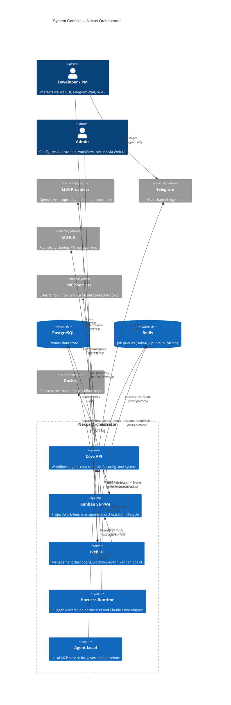

# Nexus Orchestrator — Guide

> **Primary documentation entry point.** Start here for onboarding, architecture, or operational reference. See [Architecture deep-docs](../architecture/) for detailed topic references.

## System Context (C4 Level 1)



## Table of Contents

### Foundation

| #   | Document                                                     | Description                                            |
| --- | ------------------------------------------------------------ | ------------------------------------------------------ |
| 1   | [01-system-overview.md](01-system-overview.md)               | Tech stack, ports, monorepo layout, how to run         |
| —   | [architecture-presentation.md](architecture-presentation.md) | Slide deck: High-level overview of Nexus architecture  |
| 2   | [02-getting-started.md](02-getting-started.md)               | Developer onboarding: build, test, debug, conventions  |
| 3   | [03-container-architecture.md](03-container-architecture.md) | C4 L2 — all services, their roles, and connections     |
| 4   | [04-service-communication.md](04-service-communication.md)   | HTTP, WebSocket, BullMQ, Redis, domain events, MCP/ACP |

### API — Core Engine

| #   | Document                                                                       | Description                                                                                                                                                                               |
| --- | ------------------------------------------------------------------------------ | ----------------------------------------------------------------------------------------------------------------------------------------------------------------------------------------- |
| 5   | [05-api-module-graph.md](05-api-module-graph.md)                               | Full module dependency graph (56 modules)                                                                                                                                                 |
| 6   | [06-workflow-engine.md](06-workflow-engine.md)                                 | DAG, state machine, parser, triggers, launch paths                                                                                                                                        |
| 7   | [07-workflow-step-execution.md](07-workflow-step-execution.md)                 | Step queue consumer, container execution, retry, special steps                                                                                                                            |
| 42  | [42-execution-lifecycle.md](42-execution-lifecycle.md)                         | Execution entity state machine, supervisor reaping, heartbeat service, fire-and-poll dispatch, duplicate-container guard, subagent stability mechanisms                                   |
| 8   | [08-workflow-runtime.md](08-workflow-runtime.md)                               | Agent-facing runtime: tools, capabilities, artifacts                                                                                                                                      |
| 39  | [39-workflows-to-pi-runner.md](39-workflows-to-pi-runner.md)                   | End-to-end standalone reference from workflow YAML to PI Runner (PI engine — superseded by 41 for runtime overview)                                                                       |
| 9   | [09-workflow-subagents.md](09-workflow-subagents.md)                           | Subagent provisioning, lifecycle, mesh delegation                                                                                                                                         |
| —   | [SDD — Durable Agent Await](../specs/SDD-durable-agent-await.md)               | How an agent durably suspends on child workflow runs and resumes in-context without holding a container                                                                                   |
| —   | [SDD — Exact-Point Session Resume](../specs/SDD-exact-point-session-resume.md) | PI-first (behind `SESSION_CHECKPOINT_RESUME_ENABLED`): two-phase mid-turn checkpointing so a reaped/failed step retries from the last durable snapshot instead of restarting from scratch |
| 10  | [10-workflow-repair.md](10-workflow-repair.md)                                 | Failure classification, repair dispatch, continuation                                                                                                                                     |
| 11  | [11-workflow-catalog.md](11-workflow-catalog.md)                               | What workflows exist, what they do, why, YAML structure                                                                                                                                   |
| 12  | [12-ai-config.md](12-ai-config.md)                                             | Provider/model/profile config, 4-tier precedence, API-key & OAuth secrets                                                                                                                 |
| 12a | [12a-secret-provider-setup.md](12a-secret-provider-setup.md)                   | How-to: create secrets, credential JSON formats, link secrets to providers                                                                                                                |

#### Service shutdown freeze/resume

Agents run in independent Docker containers that outlive the API process, so rebuilding the API container mid-run used to leave in-flight agents erroring on their callbacks. A **hybrid freeze + resilience** model fixes this. See [ADR-0028](../adrs/0028-service-shutdown-pause-resume-of-in-flight-agents.md) for the decision record and [42-execution-lifecycle.md](42-execution-lifecycle.md) for the execution machinery it builds on.

**Lifecycle phases** — `ServiceLifecycleStateService` exposes a process-wide phase: `booting` → `running` → `draining`. The execution supervisor and stale-run watchdog stand down whenever the phase is not `running`, and skip any execution with the `frozen` flag set, so a paused-then-resuming agent is never mistaken for a stalled one across the restart window. (The subagent reaper is not gated — subagents are out of freeze scope and its container-lost classification never trips on a paused or running container.)

- **On shutdown** (`ShutdownFreezeCoordinator`, `OnApplicationShutdown`): phase → `draining`, BullMQ step workers paused, then each non-terminal execution of a freezable kind (`workflow_step`, `workflow_chat`, `adhoc_chat`) with a live container is `docker pause`d, marked `frozen`, and audited with an `execution.paused` event.
- **On startup** (`StartupResumeCoordinator`, `OnApplicationBootstrap`): every `frozen` execution is probed and `docker unpause`d (or routed to the rehydrate fallback), the flag is cleared, an `execution.resumed` event is emitted, and the phase flips to `running`. Resume is fully automatic — no operator gate.

**`executions.frozen` flag** — a boolean on the `executions` row (alongside `paused_at` / `pause_reason`), **orthogonal to the execution state machine**: a paused execution stays in `running` state and its workflow run / chat session status is unchanged. Resume is simply clearing the flag. The DB is the source of truth, so the paused set survives the restart.

**Visibility** — the per-restart outcome (frozen found / resumed / failed / last-resume timestamp) is exposed at `GET /api/operations/lifecycle/resume-summary` and rendered in the web management UI Doctor page (`ResumeSummaryPanel`).

**Environment knobs**

| Env var                           | Default  | Description                                                                                                                                                                                                      |
| --------------------------------- | -------- | ---------------------------------------------------------------------------------------------------------------------------------------------------------------------------------------------------------------- |
| `EXECUTION_FREEZE_BUDGET_MS`      | `20000`  | Wall-clock budget for the shutdown freeze sweep; hard-capped at `25000` and **must stay below** the compose `stop_grace_period` (`30s`). Executions not frozen within the budget are left to the resilience net. |
| `NEXUS_API_CALLBACK_MAX_ATTEMPTS` | `6`      | Agent → API tool-call retry attempts (capped exponential backoff). The resilience safety net that covers crash restarts, the un-frozen tail, and kanban-only rebuilds.                                           |
| `WORKFLOW_STALE_RUN_GRACE_MS`     | `300000` | Existing stale-run watchdog grace (see [Operations](20-operations.md)).                                                                                                                                          |

**Known limitations**

- **Subagents are not frozen.** Only `workflow_step`, `workflow_chat`, and `adhoc_chat` are in freeze scope; subagent (mesh) executions are protected only by the resilience retry layer.
- **The rehydrate fallback currently degrades.** When a container is gone (e.g. a full host restart, not just an API rebuild), `SessionRehydratorAdapter` logs and returns `false` rather than re-provisioning a fresh container; `workflow_step` executions are still recovered by the existing stale-run reconciliation, and chat executions require manual/operator recovery. Full re-provision-from-session is future work.

### API — Supporting Services

| #   | Document                                                                                                                 | Description                                                                                                                                                                                                                                                                                                                                                                                                                                                                                                                                                                                                                                                                                                                                                                                                                                                                                                                                                                                                                                                                                                                                                                                                                                                                                                                                                                                    |
| --- | ------------------------------------------------------------------------------------------------------------------------ | ---------------------------------------------------------------------------------------------------------------------------------------------------------------------------------------------------------------------------------------------------------------------------------------------------------------------------------------------------------------------------------------------------------------------------------------------------------------------------------------------------------------------------------------------------------------------------------------------------------------------------------------------------------------------------------------------------------------------------------------------------------------------------------------------------------------------------------------------------------------------------------------------------------------------------------------------------------------------------------------------------------------------------------------------------------------------------------------------------------------------------------------------------------------------------------------------------------------------------------------------------------------------------------------------------------------------------------------------------------------------------------------------- |
| 13  | [13-chat-system.md](13-chat-system.md)                                                                                   | Chat channels, sessions, messages, memory, file attachments                                                                                                                                                                                                                                                                                                                                                                                                                                                                                                                                                                                                                                                                                                                                                                                                                                                                                                                                                                                                                                                                                                                                                                                                                                                                                                                                    |
| 13a | [`memory-management.md` — System Prompt Assembly Seam](../architecture/memory-management.md#system-prompt-assembly-seam) | Pluggable system prompt contributor seam: gather → merge base layers → chain transforms                                                                                                                                                                                                                                                                                                                                                                                                                                                                                                                                                                                                                                                                                                                                                                                                                                                                                                                                                                                                                                                                                                                                                                                                                                                                                                        |
| 14  | [14-tool-system.md](14-tool-system.md)                                                                                   | Capability infra → registry → runtime → sandbox → policy                                                                                                                                                                                                                                                                                                                                                                                                                                                                                                                                                                                                                                                                                                                                                                                                                                                                                                                                                                                                                                                                                                                                                                                                                                                                                                                                       |
| 15  | [15-automation.md](15-automation.md)                                                                                     | Scheduled jobs, heartbeats, standing orders, hooks                                                                                                                                                                                                                                                                                                                                                                                                                                                                                                                                                                                                                                                                                                                                                                                                                                                                                                                                                                                                                                                                                                                                                                                                                                                                                                                                             |
| 16  | [16-mcp-acp.md](16-mcp-acp.md)                                                                                           | MCP runtime, ACP runtime, transport factory                                                                                                                                                                                                                                                                                                                                                                                                                                                                                                                                                                                                                                                                                                                                                                                                                                                                                                                                                                                                                                                                                                                                                                                                                                                                                                                                                    |
| 17  | [17-plugin-kernel.md](17-plugin-kernel.md)                                                                               | Plugin lifecycle, contributions, capability endpoints                                                                                                                                                                                                                                                                                                                                                                                                                                                                                                                                                                                                                                                                                                                                                                                                                                                                                                                                                                                                                                                                                                                                                                                                                                                                                                                                          |
| 18  | [18-telemetry-observability.md](18-telemetry-observability.md)                                                           | WS gateway, event ledger, authz audit, cost tracking, metrics                                                                                                                                                                                                                                                                                                                                                                                                                                                                                                                                                                                                                                                                                                                                                                                                                                                                                                                                                                                                                                                                                                                                                                                                                                                                                                                                  |
| 19  | [19-security.md](19-security.md)                                                                                         | JWT auth, scoped permissions, audit, secrets, YAML validation                                                                                                                                                                                                                                                                                                                                                                                                                                                                                                                                                                                                                                                                                                                                                                                                                                                                                                                                                                                                                                                                                                                                                                                                                                                                                                                                  |
| —   | [multi-tenant-scopes.md](multi-tenant-scopes.md)                                                                         | Multi-tenant scopes Phase 0 (`is_tenant_root` boundary flag, parent→child typing matrix, `role_assignments` as single authorization authority, admin-access integrity check, subtree isolation), Phase 1 (granular auto-generated roles, `org_admin`→`tenant_admin` rename, direct/inherited membership resolution, `GET /scopes/:scopeNodeId/members`, `ScopeMembersPanel`), Phase 2 (`Invitation` lifecycle, hashed single-use tokens, subtree-bound issue/accept/revoke, link-only delivery via `InviteDialog`/`/accept-invite`), Phase 3 (opt-in email delivery: `PUBLIC_APP_URL`/`SMTP_*` config, `EmailConfigService`/`EmailSenderService`/`INVITATION_MAILER` port, best-effort send that never blocks invitation creation), Phase 4 (org-hierarchy management UI: `scopes:create` gated at `body.parentId`, subtree-bound archive/move/restore/`PATCH /scopes/:scopeId`, `isTenantRoot` restricted to `org`/`platform`, `GET /scopes/:scopeId/allowed-child-types`, `OrgHierarchyManager` at `/scopes/:id/manage`), and Phase 5 (app-wide scope framing: `AppPlane`/`resolvePlane`, URL-driven scope with localStorage back-compat, persistent header `ScopeSwitcher` replacing `ScopeBanner`, two-plane nav filtering via `filterNavGroupsByRole`, `useEffectivePermissions`, backend default-deny `ScopeAccessService.restrictToAccessibleScopes` applied to primary list endpoints) |
| 20  | [20-operations.md](20-operations.md)                                                                                     | Doctor checks, repair, stale-run recovery, diagnostics                                                                                                                                                                                                                                                                                                                                                                                                                                                                                                                                                                                                                                                                                                                                                                                                                                                                                                                                                                                                                                                                                                                                                                                                                                                                                                                                         |
| 43  | [43-repair-diagnostics-operator-guide.md](43-repair-diagnostics-operator-guide.md)                                       | Operator guide: diagnosing stuck/failed runs, Doctor checks, manual repair, config reference                                                                                                                                                                                                                                                                                                                                                                                                                                                                                                                                                                                                                                                                                                                                                                                                                                                                                                                                                                                                                                                                                                                                                                                                                                                                                                   |
| 35  | [35-memory-learning.md](35-memory-learning.md)                                                                           | Memory backends, chat memory lifecycle, learning pipeline, distillation                                                                                                                                                                                                                                                                                                                                                                                                                                                                                                                                                                                                                                                                                                                                                                                                                                                                                                                                                                                                                                                                                                                                                                                                                                                                                                                        |
| 36  | [36-tool-policy.md](36-tool-policy.md)                                                                                   | Unified tool policy model, argument-aware rules, spawn gating                                                                                                                                                                                                                                                                                                                                                                                                                                                                                                                                                                                                                                                                                                                                                                                                                                                                                                                                                                                                                                                                                                                                                                                                                                                                                                                                  |
| 37  | [37-cost-governance.md](37-cost-governance.md)                                                                           | Budget policies, cost estimation, spend tracking, decision engine                                                                                                                                                                                                                                                                                                                                                                                                                                                                                                                                                                                                                                                                                                                                                                                                                                                                                                                                                                                                                                                                                                                                                                                                                                                                                                                              |
| 48  | [48-improvement-pipeline.md](48-improvement-pipeline.md)                                                                 | Improvement proposal pipeline: kinds/statuses, governance modes, applier registry, skill assignment (`workflow_skill_bindings`), REST API, Improvements web queue                                                                                                                                                                                                                                                                                                                                                                                                                                                                                                                                                                                                                                                                                                                                                                                                                                                                                                                                                                                                                                                                                                                                                                                                                              |

### Memory platform

The memory platform layer covers operator-facing reference docs for the
model-aware token-budget math that the memory subsystem applies to every
chat session and distillation pass. Together with [35 — Memory & Learning
Systems](35-memory-learning.md) these entries close the loop between
runtime behavior and operator tunables.

- [memory-token-budget-resolver.md](memory-token-budget-resolver.md) — Memory token budget resolver — model-aware 60/30/10 slice and `MEMORY_BUDGET_*` env knobs

### Kanban Domain

| #   | Document                                                       | Description                                                                                                       |
| --- | -------------------------------------------------------------- | ----------------------------------------------------------------------------------------------------------------- |
| 21  | [21-kanban-overview.md](21-kanban-overview.md)                 | Kanban domain model, how it integrates with Core                                                                  |
| 22  | [22-kanban-lifecycle.md](22-kanban-lifecycle.md)               | Work item status flow, blocked state                                                                              |
| —   | [kanban-work-item-lifecycle.md](kanban-work-item-lifecycle.md) | Race-safety cross-reference for `requestWorkItemRun` link path (per-work-item orchestration lease, rollback flag) |
| 23  | [23-kanban-orchestration.md](23-kanban-orchestration.md)       | Project orchestration cycle, dispatch, reconciliation                                                             |
| 24  | [24-kanban-core-integration.md](24-kanban-core-integration.md) | Core workflow client, lifecycle stream, run projection                                                            |
| 25  | [25-kanban-workflows.md](25-kanban-workflows.md)               | Kanban workflows, triggers, rationale                                                                             |

#### Initiative Planning Layer (EPIC-208 Phase 1)

Initiatives sit between goals and work items as the **planning altitude** — they answer _what_ to build and _when_, while goals capture _why_ and work items capture _how_.

**Data model**

| Table                             | Purpose                                                        |
| --------------------------------- | -------------------------------------------------------------- |
| `kanban_initiatives`              | Strategic initiatives with `horizon`, `priority`, and `status` |
| `kanban_initiative_goals`         | Many-to-many join: links initiatives to project goals          |
| `kanban_work_items.initiative_id` | Nullable FK linking a work item down to an initiative          |

**Horizon values:** `now` | `next` | `later` (planning time-bucket)

**Status values:** `proposed` | `active` | `paused` | `done` | `dropped`

**Priority:** integer, lower value = higher priority. Stamped with `last_reviewed_at` when changed via `initiative_set_priority`.

**MCP tools**

| Tool                               | Purpose                                             |
| ---------------------------------- | --------------------------------------------------- |
| `kanban.initiative_create`         | Create a new initiative                             |
| `kanban.initiative_update`         | Update title, description, horizon, or priority     |
| `kanban.initiative_update_status`  | Transition status                                   |
| `kanban.initiative_set_priority`   | Re-prioritise (grooming); stamps `last_reviewed_at` |
| `kanban.initiative_link_goal`      | Link or unlink a goal to an initiative              |
| `kanban.initiative_link_work_item` | Assign or clear a work item's initiative            |

Initiatives are surfaced in `kanban.project_state` under the `strategic.initiatives` array.

See [EPIC-208](../epics/EPIC-208-ceo-driven-strategic-refresh-loop.md) and the design spec at `docs/superpowers/specs/2026-06-12-strategic-refresh-loop-design.md`.

#### Staleness signals & strategic intent (EPIC-208 Phase 2)

Phase 2 adds two things to `kanban.project_state`: a `strategic.staleness` object that tells the CEO _how stale_ its world-model is, and a `strategic.latestStrategicIntent` record that lets it _recall_ what it last planned.

**Staleness signals (`strategic.staleness`)**

All fields are computed by `ProjectStrategicStateService` at read time from the orchestration record and work-item rows. None require a separate write — they update automatically as the project evolves.

| Field                      | Type             | Source                                                                                                                                                                                                                                                       |
| -------------------------- | ---------------- | ------------------------------------------------------------------------------------------------------------------------------------------------------------------------------------------------------------------------------------------------------------ |
| `lastDiscoveryAt`          | `string \| null` | ISO-8601 timestamp stored in `kanban_orchestrations.metadata["last_discovery_at"]`; written by `kanban.record_discovery_completed`. Null until the first discovery cycle completes.                                                                          |
| `mergesSinceDiscovery`     | `number`         | Count of work items whose `status` is `ready-to-merge` or `done` and whose `updated_at` is after `lastDiscoveryAt`. When `lastDiscoveryAt` is null, counts all completed items.                                                                              |
| `commitsSinceDiscovery`    | `number \| null` | Always `null` in Phase 2 — placeholder for a future Git-integration phase that will count commits since the last discovery stamp.                                                                                                                            |
| `lastCharterUpdateAt`      | `string \| null` | ISO-8601 timestamp from `kanban_orchestrations.metadata["last_charter_update_at"]`. Updated by the charter-capture workflow when the CEO persists structured project knowledge. Retained as strategic-state telemetry; not gated by the orchestration cycle. |
| `lastInitiativeReviewAt`   | `string \| null` | Maximum `last_reviewed_at` across all initiatives on the project. Stamped whenever `kanban.initiative_set_priority` is called.                                                                                                                               |
| `lastWorkItemCreatedAt`    | `string \| null` | Maximum `created_at` across all work items on the project.                                                                                                                                                                                                   |
| `backlogDepth`             | `number`         | Count of work items with `status = "backlog"`.                                                                                                                                                                                                               |
| `recentBurnRatePerCycle`   | `number`         | Completed items per orchestration cycle, averaged over a sliding window of the last 10 decision-log entries. Zero if the project has no orchestration history.                                                                                               |
| `starvationForecastCycles` | `number \| null` | `backlogDepth / recentBurnRatePerCycle`. Null when `recentBurnRatePerCycle` is zero (cannot project). Gives the CEO an early signal that the backlog will be exhausted within _N_ cycles.                                                                    |

**Staleness thresholds (constants)**

Two constants exported from `packages/kanban-contracts/src/strategic.schema.ts` define the decision boundaries that later phases consume when the CEO decides whether to trigger re-discovery or backlog-generation:

| Constant                               | Value | Meaning                                                                                                                                                            |
| -------------------------------------- | ----- | ------------------------------------------------------------------------------------------------------------------------------------------------------------------ |
| `REDISCOVERY_MERGE_THRESHOLD`          | `10`  | When `mergesSinceDiscovery >= 10`, the codebase has drifted enough since the last investigation that a fresh discovery cycle should be considered.                 |
| `IDEATION_STARVATION_THRESHOLD_CYCLES` | `2`   | When `starvationForecastCycles <= 2`, the backlog is thin enough that the CEO should trigger a new backlog-generation or ideation pass before the board goes idle. |

**Strategic-intent continuity (`strategic.latestStrategicIntent`)**

The CEO records a structured intent snapshot at the end of each orchestration cycle by calling `kanban.record_strategic_intent`. The record is appended to the `decision_log` timeline (type `"strategic_intent"`) and the most recent entry is surfaced as `latestStrategicIntent` in `kanban.project_state`.

This gives the next CEO cycle durable recall of what was previously planned, without relying on in-context memory:

```json
{
  "kind": "strategic_intent",
  "focus_initiative_id": "init-abc123",
  "rationale": "Initiative is 80% complete; finishing it unblocks the next horizon.",
  "planned_next_steps": ["Review open PRs", "Promote two backlog items"],
  "staleness_actions": [],
  "created_at": "2026-06-13T01:00:00.000Z"
}
```

**MCP tools (Phase 2)**

| Tool                                | Purpose                                                                                                                                                                                    |
| ----------------------------------- | ------------------------------------------------------------------------------------------------------------------------------------------------------------------------------------------ |
| `kanban.record_strategic_intent`    | Append a structured intent record to the orchestration timeline. Pass `focus_initiative_id` (nullable), `rationale`, `planned_next_steps`, and `staleness_actions`.                        |
| `kanban.record_discovery_completed` | Stamp `last_discovery_at` on the orchestration record to signal that a codebase investigation cycle has finished. Accepts an optional `completed_at` ISO-8601 timestamp (defaults to now). |

Both tools infer `project_id` from the workflow runtime context — the CEO agent does not pass `project_id` explicitly when running inside a scoped workflow.

#### Two-Phase CEO Cycle & Merge Heartbeat (EPIC-208 Phase 3)

**Two-phase CEO cycle**

The CEO orchestration workflow (`project_orchestration_cycle_ceo`) was restructured from a single-step loop into two sequentially-dependent jobs that run within the same workflow instance:

- **Job 1 — `strategize`** (new step): Loads all strategic context, runs gated delegations, performs light board grooming, records strategic intent, and hands off a `groomed_board_summary` to dispatch via `set_job_output`.
- **Job 2 — `dispatch`** (previously the sole step): Receives the groomed board summary from Job 1 via `{{ inputs.groomed_board_summary }}`; its only concern is tactical — zero-todo promotion, lifecycle-start, stale-execution restart, and recording the final cycle decision.

**Strategize responsibilities (Job 1 — `strategize.md`)**

- Load staleness signals (`mergesSinceDiscovery`, `starvationForecastCycles`, `lastCharterUpdateAt`), charter, initiatives, and latest strategic intent from `kanban.project_state` and `kanban.orchestration_timeline` (deep history/blockers/capacity/recovery — defaults to the most-recent ~20 decisions, full count in `diagnostics.decisionCount`, `limit`/`offset` to page deeper), or `kanban.orchestration_activity` for a lightweight recent-activity feed.
- Re-think board priorities against the active `now`-horizon initiative; delegate specialist passes (rediscovery, roadmap planning, ideation) only when staleness thresholds are crossed — each delegation durably awaits its child.
- Perform light board grooming: re-prioritise, defer, split, and link work items to initiatives. No lifecycle-start in this step.
- Record strategic intent via `kanban.record_strategic_intent` — mandatory every cycle.
- Call `set_job_output` with the `groomed_board_summary` object (counts, promotion candidates, strategic intent summary) then `step_complete` to hand off.

**Dispatch responsibilities (Job 2 — `dispatch.md`)**

- Reads the groomed board exclusively from `{{ inputs.groomed_board_summary }}` — no full board re-read required.
- Enforces the zero-todo backlog promotion mandate: when `autonomous_mode=true`, `todo_count=0`, and unblocked backlog exists, promotion is mandatory (options a–e; bare repeat is a protocol violation).
- Lifecycle-starts dispatchable todo items, restarts stale executions, and persists the final cycle decision via `kanban.complete_orchestration_cycle_decision`.

**Why the split matters**: With a single-step design the strategic beat (re-discovery, roadmap planning, ideation) could be skipped or deferred by an agent that jumped straight to dispatch. The two-job structure makes the strategize pass structurally unskippable — dispatch cannot begin until `jobs.strategize` has completed and produced its `output_contract`.

**Merge heartbeat**

`work-item-merge-orchestration-wakeup.workflow.yaml` subscribes to `WorkItemMergeCompletedEvent` and emits `ProjectOrchestrationCycleRequestedEvent` (via `kanban.orchestration_request_wakeup`) immediately on each merge completion. Combined with the CEO cycle's `concurrency: max_runs: 1 / on_conflict: skip`, bursts of near-simultaneous merge events are coalesced into a single cycle. The net effect: the CEO always gets a fresh orchestration cycle promptly after any merge — without the risk of a backlog of overlapping cycle runs.

**Seed artifacts introduced in Phase 3**

| Artifact                                             | Purpose                                                                                                                  |
| ---------------------------------------------------- | ------------------------------------------------------------------------------------------------------------------------ |
| `strategize.md` prompt                               | New Job 1 of the CEO cycle: perceive strategic context → delegate → groom → record intent → handoff via `set_job_output` |
| `dispatch.md` prompt                                 | Slimmed Job 2 (formerly `decide.md`): tactical promotion + lifecycle-start; reads groomed board from job output          |
| `work-item-merge-orchestration-wakeup.workflow.yaml` | Merge heartbeat: `WorkItemMergeCompletedEvent` → `ProjectOrchestrationCycleRequestedEvent`                               |

#### Delta-Aware Re-Discovery Refresh (EPIC-208 Phase 4)

**Problem**: `project_codebase_deep_investigation` previously operated in all-or-nothing `full` mode — re-running after a batch of merges was expensive because it re-probed every codebase scope regardless of what had changed.

**Solution**: A `mode` input (`full` | `refresh`) was added to the workflow. In `refresh` mode, the Investigation Coordinator delta-probes only the scopes that have changed since `lastDiscoveryAt` — scopes with no new commits or merges since the last stamp are skipped. On completion, `lastDiscoveryAt` is re-stamped via `kanban.record_discovery_completed`, resetting the `mergesSinceDiscovery` counter.

**Trigger gate**: During the strategize step, if `strategic.staleness.mergesSinceDiscovery >= REDISCOVERY_MERGE_THRESHOLD (10)`, the CEO calls `delegate_rediscovery` and durably awaits it before proceeding to groom or delegate further. The refreshed capability map is injected back into the strategize context, so initiative alignment and ideation decisions that follow are based on the current codebase state.

**`delegate_rediscovery`** is a projected delegation tool registered in `project-orchestration-cycle-ceo.delegations.json`. It hard-codes `mode: refresh` in its `fixed_trigger_data`, so the strategize step never needs to pass the mode explicitly. The tool durably awaits the child workflow; the strategize step resumes only once the refresh is terminal.

**Seed artifacts introduced in Phase 4**

| Artifact                                     | Purpose                                                                                                                            |
| -------------------------------------------- | ---------------------------------------------------------------------------------------------------------------------------------- |
| `delegate_rediscovery` delegation tool       | Durable delegation → `project_codebase_deep_investigation` with `mode: refresh` fixed; triggered when `mergesSinceDiscovery >= 10` |
| `kanban.record_discovery_completed` MCP tool | (Phase 2, relevant here) Stamps `lastDiscoveryAt` on the orchestration record when refresh completes, resetting the merge counter  |

#### Roadmap Planning & Initiative-Aware Ideation (EPIC-208 Phase 5)

**Roadmap planning**

`project-roadmap-planning.workflow.yaml` is a focused, SRP-scoped workflow that keeps the initiative layer aligned with project goals. A strategist agent reads the project charter, active goals, capability map, and existing initiatives, then proposes or updates initiatives — setting horizons, adjusting priorities, linking initiatives to goals, and stamping `last_reviewed_at`. It deliberately does **not** create work items; that responsibility belongs exclusively to ideation.

The CEO's strategize step calls `delegate_roadmap_planning` (durably awaited) when any of the following holds:

- No initiative has a recent `lastReviewedAt` (horizons are stale)
- Any active goal has no covering initiative
- There is no `now`-horizon active initiative

The `project_roadmap_planning` workflow uses `concurrency: max_runs: 1 / on_conflict: skip` per project scope, so back-to-back triggers coalesce safely.

**Initiative-aware ideation**

The `project_goal_backlog_planning` workflow was extended to scope ideation to the active `now`-horizon initiative. Created work items have their `initiative_id` set to the active initiative, and deduplication runs against the fresh capability map produced by Phase 4 re-discovery (when available). This ensures the backlog stays coherent with what has already been built.

Gate: the strategize step calls `delegate_goal_backlog_planning` (durably awaited) when `strategic.staleness.starvationForecastCycles <= IDEATION_STARVATION_THRESHOLD_CYCLES (2)` — i.e. when the burn-rate model forecasts the board will be exhausted within two cycles. This may be triggered on consecutive cycles until the starvation signal recovers.

**Seed artifacts introduced in Phase 5**

| Artifact                                    | Purpose                                                                                                                         |
| ------------------------------------------- | ------------------------------------------------------------------------------------------------------------------------------- |
| `delegate_roadmap_planning` delegation tool | Durable delegation → `project_roadmap_planning`; triggered when initiative horizons are stale or goals lack initiative coverage |
| `project-roadmap-planning.workflow.yaml`    | New roadmap-planning workflow: charter + goals + capability map → initiative proposals/updates; no work-item creation           |
| `plan-roadmap.md` strategist prompt         | Strategist prompt for the `plan_roadmap` job: reads strategic state, proposes initiative mutations, stamps `last_reviewed_at`   |

#### Completed EPIC-208 strategic-refresh loop

The full loop is:

```
staleness detected (Phase 2)
  → CEO strategizes (Phase 3)
      → rediscovery          (Phase 4) — when mergesSinceDiscovery >= REDISCOVERY_MERGE_THRESHOLD (10)
      → roadmap planning     (Phase 5) — when initiative horizons stale
      → ideation / grooming  (Phase 5) — when starvationForecastCycles <= IDEATION_STARVATION_THRESHOLD_CYCLES (2)
  → groom & prioritise initiatives (Phase 5)
  → dispatch work items (Phase 3)
```

Each branch is an independently gated, durably-awaited delegation. The CEO evaluates all signals on every cycle and may trigger multiple branches in sequence; each completes before the next is considered.

For a full operational deep-dive on the strategic refresh loop including worked examples and implementation details, see [47-strategic-refresh-loop.md](47-strategic-refresh-loop.md).

#### Configurable Orchestration Policy & Per-Phase Autonomy (Phase 2–3)

**Problem solved**: The CEO was entirely autonomous by design, but enterprises need fine-grained control — different phases of the cycle should enforce different autonomy levels (e.g., `strategize` always runs fully autonomous, but `dispatch` should require approval for certain actions). The solution is a **scoped variable store** with a **curated orchestration policy** and phase-aware enforcement.

**Architecture**

- **Variable store** (`/variables`): Generic key–value API store, kanban-neutral; validates key format and value type. Lives in API (`apps/api/src/variables/`).
- **Orchestration policy registry**: 44 curated keys (e.g., `autonomy.strategize`, `autonomy.ideation`) with safe defaults. Lives in `packages/kanban-contracts/src/orchestration-policy.schema.ts`.
- **Per-phase autonomy**: Kanban reads `autonomy.*` variables at runtime via a tool parameter; the CEO's `strategize` and `dispatch` jobs enforce the resolved policy (e.g., `autonomy.strategize: true` permits the strategize job to run fully autonomous).
- **Mode mirror**: A derived `mode` variable (read-only, API-computed) that snapshots the effective preset at workflow start, enabling display of policy without re-reading variables mid-cycle.
- **Backfill on boot**: Kanban `OrchestrationPolicyBackfillService` writes missing project-scoped keys from global defaults on startup, ensuring every project inherits the baseline.
- **Audit history** (Phase 3): `scoped_variable_audit` table logs all writes with `before` / `after` values and ISO-8601 timestamps; `GET /variables/audit` surfaces the audit trail.
- **Effective-config inspector** (Phase 3): Web UI inspector shows the merged (global + project-scoped) configuration and audit history for each key.

**Key data structures**

| Structure             | Purpose                                                               |
| --------------------- | --------------------------------------------------------------------- |
| `ResolvedPolicyEntry` | Resolved `autonomy.*` value: `key`, `value`, `source` (global/scoped) |
| `ScopedVariableAudit` | Audit row: `key`, `before_value`, `after_value`, `changed_at`         |

**Boundary note**: The API `/variables` store cannot import `kanban-contracts` (to stay Kanban-neutral). Registry validation for well-known keys happens server-side in `OrchestrationPolicyService` (Kanban), which gates the curated writes. The generic API endpoint validates only key-format and value-type.

**Workflow changes**

- CEO `strategize` and `dispatch` jobs now read `autonomy.strategize` and `autonomy.dispatch` via a merged input variable that includes resolved policy values.
- Per-phase decisions (e.g., "skip this promotion") now respect the resolved autonomy policy.

**MCP tools introduced**

- `kanban.orchestration_get_policy` — read the effective (merged global + project) policy for a project.
- `kanban.orchestration_set_policy_entry` — write a project-scoped policy entry; validates against the registry.

**See also**: Detailed spec and implementation coverage in [SDD – Configurable Orchestration Variables](../specs/SDD-configurable-orchestration-variables.md).

#### Retrospective module — facet seams ADR

The retrospectives module (`apps/kanban/src/retrospectives/`) is split into three focused services — the **Runner** (`kanban-retrospective.service.ts`, which orchestrates completion / manual-replay / failure-threshold runs), the **Evidence Collector** (`kanban-retrospective-evidence.service.ts`, which builds the `KanbanRetrospectiveEvidence` discriminated union from cycle-decision events and orchestration metadata), and the **Failure-Threshold Trigger** (`kanban-retrospective-failure-threshold.service.ts`, which counts consecutive failures and fires the runner via `runForFailureThreshold`). The two services that exceed the 500-LOC kanban lint cap share three duplicated primitives (`EmitterLike` + try/catch/emit/warn guard, `formatErrorMessage`, and a metadata-narrowing helper) and a cross-module leak from `complete-orchestration-cycle-decision.tool.ts:emitLearningCandidateProposed`; the M2–M4 follow-up milestones consolidate those primitives into a shared helpers file. See [ADR-20260703-retrospective-module-facet-seams](../architecture/decisions/ADR-20260703-retrospective-module-facet-seams.md) (authoritative record, plan-path stub at [ADR-retrospective-module-facet-seams](../architecture/decisions/ADR-retrospective-module-facet-seams.md)).

### Web UI

| #   | Document                                               | Description                                                                      |
| --- | ------------------------------------------------------ | -------------------------------------------------------------------------------- |
| 26  | [26-web-overview.md](26-web-overview.md)               | React + Vite + Tailwind, pages, hooks, stores                                    |
| 27  | [27-web-workflow-editor.md](27-web-workflow-editor.md) | YAML editor, DAG visualization, repository lifecycle triggers, execution sidebar |

### Project Onboarding & Charter

| #   | Document                                                 | Description                                                                                                                   |
| --- | -------------------------------------------------------- | ----------------------------------------------------------------------------------------------------------------------------- |
| 40  | [40-project-onboarding.md](40-project-onboarding.md)     | Conversational onboarding workflow, project charter, capture tool suite                                                       |
| 41  | [41-harness-runtime.md](41-harness-runtime.md)           | Pluggable harness runtime: SPI, engines, selection, credentials, device flow                                                  |
| —   | [multi-language-runtimes.md](multi-language-runtimes.md) | Multi-language toolchain resolution: 5-layer precedence, composite image build/tag/GC, cache-volume registry, Kanban boundary |

### External Services & Runtimes

| #   | Document                               | Description                                                                                           |
| --- | -------------------------------------- | ----------------------------------------------------------------------------------------------------- |
| 28  | [28-pi-runner.md](28-pi-runner.md)     | Runtime bridge, session factory, telemetry bridge (PI engine — superseded by 41 for runtime overview) |
| 30  | [30-agent-local.md](30-agent-local.md) | Local MCP service, governed execution, security                                                       |

### Repository Governance

| #   | Document                                                             | Description                                                   |
| --- | -------------------------------------------------------------------- | ------------------------------------------------------------- |
| 38  | [38-repository-workflows.md](38-repository-workflows.md)             | Repository-managed workflows, lifecycle gates, merge blocking |
| 42  | [42-gitops-repository-bindings.md](42-gitops-repository-bindings.md) | Scope-bound GitOps repository bindings and seed migration     |

### Shared Packages & Reference

| #   | Document                           | Description                                          |
| --- | ---------------------------------- | ---------------------------------------------------- |
| 31  | [31-packages.md](31-packages.md)   | @nexus/core, kanban-contracts, plugin-sdk, e2e-tests |
| 32  | [32-seed-data.md](32-seed-data.md) | Seed workflows, agent profiles, skills, models       |
| 33  | [33-port-map.md](33-port-map.md)   | Ports, endpoints, environment variables              |
| 34  | [34-glossary.md](34-glossary.md)   | Domain terms, ubiquitous language                    |

### Testing & Quality

| #   | Document                                               | Description                                                                                 |
| --- | ------------------------------------------------------ | ------------------------------------------------------------------------------------------- |
| 44  | [44-fake-llm-server.md](44-fake-llm-server.md)         | Fake LLM server: dual-protocol scripted responses, scenario builder, request recording      |
| 45  | [45-stack-harness.md](45-stack-harness.md)             | Stack harness: testcontainers lifecycle, provider seeding, driver helpers, networking spike |
| 46  | [46-e2e-scenario-suites.md](46-e2e-scenario-suites.md) | Scenario suites: global setup, control server, 4 deterministic e2e specs, debug guide       |

---

## Quick Links

- [Architecture deep-docs](../architecture/README.md) — Detailed topic references
- [Operations runbooks](../operations/README.md) — Diagnostic and recovery procedures
- [Specs](../specs/) — PRDs and SDDs
- [Epics](../epics/) — Feature epics with implementation history
- [ADR records](../adrs/) — Architecture Decision Records
- [API README](../../apps/api/README.md) — API-specific details
- [Kanban README](../../apps/kanban/README.md) — Kanban-specific details
